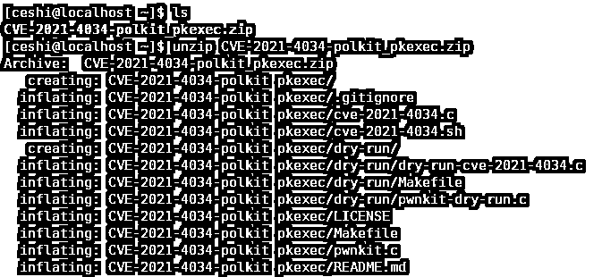
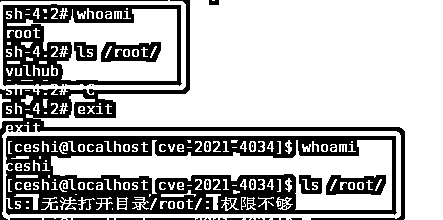

# Linux Polkit Pkexec 本地权限提升漏洞（CVE-2021-4034） - 追得上的梦想 - 博客园

> 原文：[`www.cnblogs.com/KHZ521/p/15866406.html`](https://www.cnblogs.com/KHZ521/p/15866406.html)

### 0x01 前言

polkit （原名 PolicyKit）的 pkexec 中存在本地特权提升漏洞，该 SUID-root 程序默认安装在每个主要的 Linux 发行版上。该漏洞允许任何非特权用户通过在 Linux 默认配置中利用此漏洞来获得易受攻击主机的完全 root 权限。

漏洞利用难度低，最早引入问题的 commit 来自 2009 年，影响版本范围远超去年的 sudo 漏洞。

### 0x02 POC

```
https://github.com/berdav/CVE-2021-4034 
```

### 0x03 漏洞复现

1.创建一个低权限用户
创建低权限用户 ceshi

```
adduser ceshi 
```


为 test 用户设置一个密码

```
passwd ceshi 
```


使用新创建的 ceshi 用户进行 ssh 连接


2.下载 POC，将 POC 解压缩并进入解压缩后的文件夹中

```
https://github.com/berdav/CVE-2021-4034 
```


3.使用 make 命令编译为可执行文件

```
make 
```


4.可通过 root 权限执行任意命令


### 0x04 参考连接

[`blog.csdn.net/qq_32261191/article/details/122711926`](https://blog.csdn.net/qq_32261191/article/details/122711926)
[`www.adminxe.com/3216.html`](https://www.adminxe.com/3216.html)