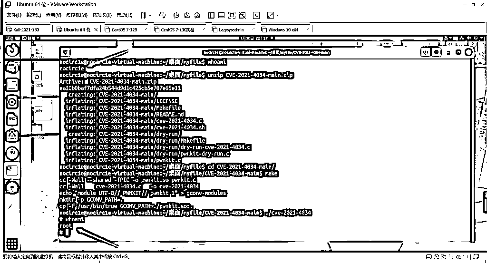

# Linux Polkit 本地权限提升漏洞(CVE-2021-4034) - NoCirc1e - 博客园

> 原文：[`www.cnblogs.com/NoCirc1e/p/16287117.html`](https://www.cnblogs.com/NoCirc1e/p/16287117.html)

## 描述

近日，国外安全团队发布安全公告称，在 polkit 的 pkexec 程序中发现了一个本地权限提升漏洞。pkexec 应用程序是一个 setuid 工具，旨在允许非特权用户根据预定义的策略以特权用户身份运行命令。

由于当前版本的 pkexec 无法正确处理调用参数计数，并最终会尝试将环境变量作为命令执行。攻击者可以通过控制环境变量，从而诱导 pkexec 执行任意代码。利用成功后，可导致非特权用户获得管理员权限。

## 漏洞信息

*   漏洞名称：Linux Polkit 权限提升漏洞
*   CVE 编号：CVE-2021-4034
*   威胁等级：高危
*   漏洞类型：权限提升漏洞
*   利用难度：简单

目前漏洞 POC 已被泄露，攻击者利用该漏洞可导致恶意用户权限提升等危害。

## 影响版本

由于为系统预装工具，目前主流 Linux 版本均受影响。

## 解决方案

安全版本

Debian 系列

```
Debain stretch policykit-1  0.105-18+deb9u2
Debain buster policykit-1 0.105-25+deb10u1
Debain bookworm, bullseye policykit-1 0.105-31.1
```

CentOS 系列

```
CentOS 6：polkit-0.96-11.el6_10.2
CentOS 7：polkit-0.112-26.el7_9.1
CentOS 8.0：polkit-0.115-13.el8_5.1
CentOS 8.2：polkit-0.115-11.el8_2.2
CentOS 8.4：polkit-0.115-11.el8_4.2
```

Ubuntu 系列

```
Ubuntu 20.04 LTS：policykit-1 - 0.105-26ubuntu1.2
Ubuntu 18.04 LTS：policykit-1 - 0.105-20ubuntu0.18.04.6
Ubuntu 16.04 ESM：policykit-1 - 0.105-14.1ubuntu0.5+esm1
Ubuntu 14.04 ESM：policykit-1 - 0.105-4ubuntu3.14.04.6+esm1 
```

官方修复方案

CentOS 系发行版用户可采用如下命令升级到安全版本或更高版本：

```
yum clean all && yum makecache
yum update polkit -y
```

验证修复，通过以下命令可查看 Polkit 是否为安全版本：

```
rpm -qa polkit
```

Ubuntu 系发行版用户可采用如下命令升级至安全版本或更高版本：

```
apt-get update
apt-get install policykit-1
```

验证修复，通过以下命令可查看 Polkit 是否为安全版本：

```
dpkg -l policykit-1
```

目前厂商已发布升级补丁修复漏洞，受影响用户时刻灌注官方信息。官方链接如下：

*   [`ubuntu.com/security/CVE-2021-4034`](https://ubuntu.com/security/CVE-2021-4034)
*   [`access.redhat.com/security/cve/CVE-2021-4034`](https://access.redhat.com/security/cve/CVE-2021-4034)
*   [`security-tracker.debian.org/tracker/CVE-2021-4034`](https://security-tracker.debian.org/tracker/CVE-2021-4034)

披露链接：

*   [`www.qualys.com/2022/01/25/cve-2021-4034/pwnkit.txt`](https://www.qualys.com/2022/01/25/cve-2021-4034/pwnkit.txt)

## 漏洞复现

一、下载 CVE-2021-4034 漏洞利用 POC

[`github.com/berdav/CVE-2021-4034`](https://github.com/berdav/CVE-2021-4034)

二、将下载好的 POC 放到本地虚拟机 Ubuntu 中，进行解压，进入到 CVE-2021-4034-main 目录，使用 make 命令，运行 CVE-2021-4034 即可提权成功，获取到 root 权限。



## 安全建议

*   若服务无开放公网必要，须在安全区域边界封堵访问端口。
*   合理配置安全组，避免不必要的端口及服务对外开放。