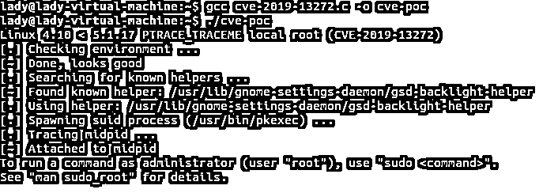

# Linux 内核提权漏洞（CVE-2019-13272） - ctrl_TT 豆 - 博客园

> 原文：[`www.cnblogs.com/-chenxs/p/11771512.html`](https://www.cnblogs.com/-chenxs/p/11771512.html)

### 漏洞描述

kernel / ptrace.c 中的 ptrace_link 错误地处理了想要创建 ptrace 关系的进程的凭据记录，这允许本地用户通过利用父子的某些方案来获取 root 访问权限 进程关系，父进程删除权限并调用 execve（可能允许攻击者控制）。 一个影响因素是对象寿命问题（也可能导致恐慌）。 另一个影响因素是将 ptrace 关系标记为特权，这可以通过（例如）Polkit 的 pkexec 帮助程序与 PTRACE_TRACEME 进行利用。获取 root 权限。

影响版本：Linux Kernel < 5.1.17

但是经过实验来说，对 ubuntu 影响更大，debian 和 centos 高一点的就提不了权。

### 漏洞复现

测试版本 Ubuntu18.04.1

1、漏洞 exp 下载，防在 Home 目录下

下载地址：[`github.com/bcoles/kernel-exploits/tree/master/CVE-2019-13272`](https://github.com/bcoles/kernel-exploits/tree/master/CVE-2019-13272)

在 unbuntu 下面 git clone 以下就可以了


 2、对下载好的漏洞 exp 进行编译,运行编译好的文件

```
gcc cve-2019-13272.c -o cve-poc
./cve-poc
```



 3、成功获取 root 权限

