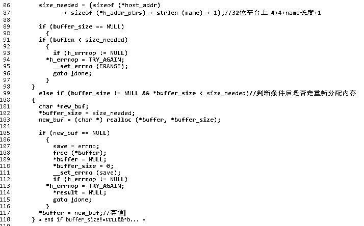
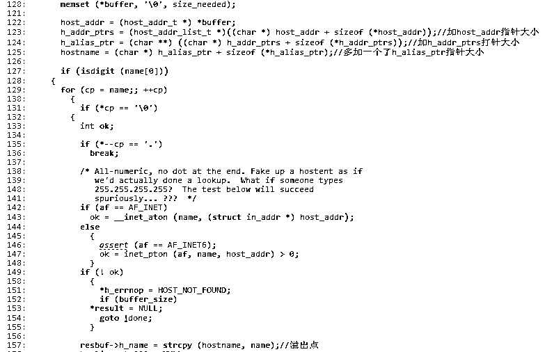
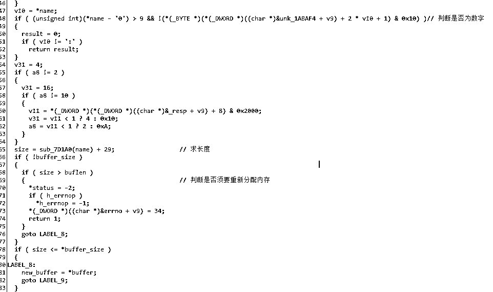

# Linux 漏洞分析入门笔记-CVE-2015-0235 - 我是小三 - 博客园

> 原文：[`www.cnblogs.com/2014asm/p/10219743.html`](https://www.cnblogs.com/2014asm/p/10219743.html)

Ubuntu 12.04 32 位

ida 7.0

## 0x00:漏洞描述

1.glibc 的 __nss_hostname_digits_dots 存在缓冲区溢出漏洞，导致使用 gethostbyname 系列函数的某些软件存在代码执行或者信息泄露的安全风险。

通过 gethostbyname()函数或 gethostbyname2()函数，将可能产生一个堆上的缓冲区溢出。经由 gethostbyname_r()或 gethostbyname2_r()，则会触发调用者提供的缓冲区溢出, 漏洞产生时至多 sizeof(char* )个字节可被覆盖(因为 char*指针的大小，即 32 位系统上为 4 个字节，64 位系统为 8 个字节)。

## 0x01:漏洞分析

1.先静态分析 glibc 源码中的 __nss_hostname_digits_dots 函数流程，如图 1 所示。

　　　　　　　　　　图 1

图 1 代码大致流程就是在 __nss_hostname_digits_dots 中，计算了 size_needed，当 size_needed > buff_size 时，会调用 realloc 重新申请 size_needed 的空间。

　　　　　　　　　　图 2

图 2 代码流程在计算 size_need 时，少加了一个 sizeof(*h_alias_ptr),少算了 4 个字节，所以当 name 全为数字或者.号时，会将 name 拷贝到 buff 的 hostname，造成一个指针大小字节的堆溢出。

所以要触发成功需要满足的条件为,size_need 足够大，让其调用 realloc 重新分配。name 全为数字或者.号。

2.选择一个受漏洞影响的程序 clockdiff 来调试分析，在 IDA 中对 __nss_hostname_digits_dots 下好断点，如图 3 所示：

　　　　　　　　　　图 3

F9 运行，第一次断下无用不是处理我们自己输入的参数，直接跳过。第二次断下，发现 gethostbyname 的参数为我们输入的参数。Gethostbyname 中调用 __nss_hostname_digits_dots,其中缓冲区的大小默认为 0x400。在调用 realloc 处下断点，此时 buffer_size= 0x41B，刚好是输入参数的长度，因为 size_need 大于 buffer_size 所以须要重新分配空间。

　　　　　　　　　　图 4

通过上面的判断与计算空间大小后执行到 stcpy 处(溢出点)，通过前面空间的计算，加上字符串结尾的空字节，刚好溢出了一个指针字节。

## 0x02:总结

1.产生漏洞的条件是当 gethostbyname()函灵敏被调用时且满足下面两个条件。

a.size_need 足够大，让其调用 realloc 重新分配。

b.name 全为数字或者.号