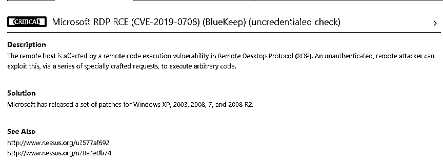
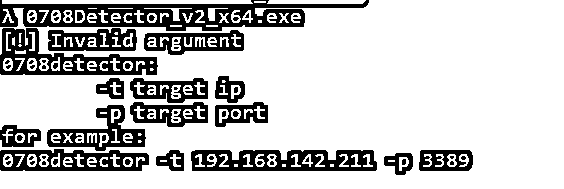
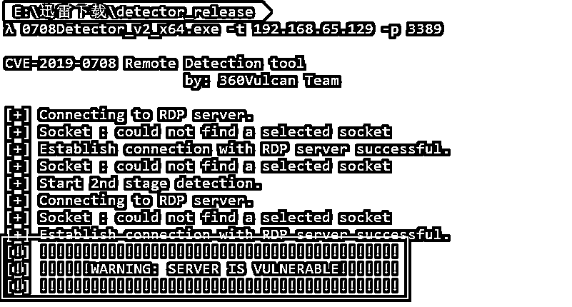
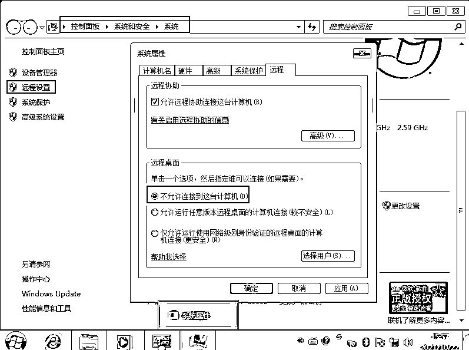
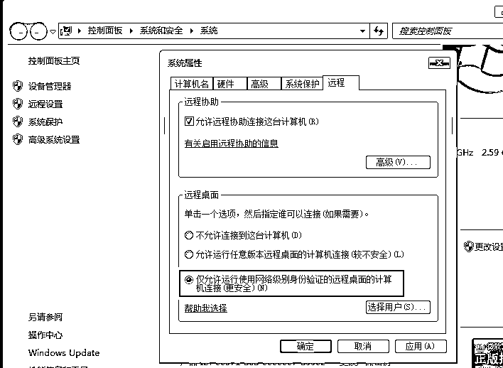

# Microsoft RDP RCE (CVE-2019-0708) (BlueKeep) (uncredentialed check) - 一曲天地远 - 博客园

> 原文：[`www.cnblogs.com/zhangyibao/p/15439039.html`](https://www.cnblogs.com/zhangyibao/p/15439039.html)

## 1\. 漏洞报告

## 2\. 漏洞介绍

       2019 年 5 月 14 日微软官方发布紧急安全补丁，修复了 Windows 远程桌面服务的远程代码执行高危漏洞 CVE-2019-0708（CNVD-2019-14264、CNNVD-201905-434），该漏洞影响了某些旧版本的 Windows 系统。由于该漏洞无需身份验证且无需用户交互，所以这个漏洞可以通过网络蠕虫的方式被利用，利用此漏洞的恶意软件可以从被感染的计算机传播到网络中其他易受攻击的计算机，传播方式与 2017 年 WannaCry 恶意软件的传播方式类似。
       受此漏洞影响的操作系统如下：

> *   Windows 7
> *   Windows Server 2008
> *   Windows Server 2008 R2
> *   Windows 2003
> *   Windows XP

## 3\. 漏洞危害

       当未经身份验证的攻击者使用 RDP 连接到目标系统并发送特制请求时，远程桌面服务中存在远程执行代码漏洞。此漏洞是预身份验证，不需要用户交互。成功利用此漏洞的攻击者可以在目标系统上执行任意代码。

## 4\. 漏洞检测

> 360 应急响应中心发布一个 CVE-2019-0708 漏洞无损检测工具,地址为：
> [`free.360totalsecurity.com/CVE-2019-0708/detector_release.zip`](https://free.360totalsecurity.com/CVE-2019-0708/detector_release.zip)
> 使用方法如下图：

> 检测方法如下图，发现 192.168.65.129 的 33389 端口存在 CVE-2019-0708 漏洞

## 5\. 漏洞修复

> 1.Microsoft 强烈建议您尽快安装此漏洞的更新。windows 7 和 windows 2008 操作系统的下载地址为：
> [`msrc.microsoft.com/update-guide/en-US/vulnerability/CVE-2019-0708`](https://msrc.microsoft.com/update-guide/en-US/vulnerability/CVE-2019-0708)
> windows XP 和 windows 2003 操作系统的下载地址为：
> [`support.microsoft.com/en-us/topic/customer-guidance-for-cve-2019-0708-remote-desktop-services-remote-code-execution-vulnerability-may-14-2019-0624e35b-5f5d-6da7-632c-27066a79262e`](https://support.microsoft.com/en-us/topic/customer-guidance-for-cve-2019-0708-remote-desktop-services-remote-code-execution-vulnerability-may-14-2019-0624e35b-5f5d-6da7-632c-27066a79262e)

> 2.请禁用远程桌面服务。如果您的系统不再需要这些服务，请考虑禁用它们作为安全最佳实践。禁用未使用和不需要的服务有助于减少您面临安全漏洞的风险。

> 3.在运行受支持版本的 Windows 7、Windows Server 2008 和 Windows Server 2008 R2 的系统上启用网络级别身份验证 (NLA)。启用 NLA 后，攻击者首先需要使用目标系统上的有效帐户对远程桌面服务进行身份验证，然后攻击者才能利用该漏洞。

