# Nftables 栈溢出漏洞(CVE-2022-1015)复现 - 合天网安实验室 - 博客园

> 原文：[`www.cnblogs.com/hetianlab/p/17526279.html`](https://www.cnblogs.com/hetianlab/p/17526279.html)

背景介绍

### Nftables

Nftables 是一个基于内核的包过滤框架，用于 Linux 操作系统中的网络安全和防火墙功能。nftables 的设计目标是提供一种更简单、更灵活和更高效的方式来管理网络数据包的流量。

### **钩子点（Hook Point）**

钩子点的作用是拦截数据包，然后对数据包进行修改，比较，丢弃和放行等操作。

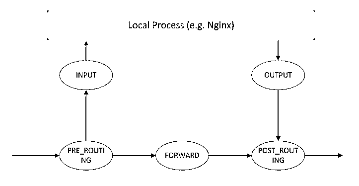

```
// include/uapi/linux/netfilter_ipv4.h
​
#define NF_IP_PRE_ROUTING    0 /* After promisc drops, checksum checks. */
#define NF_IP_LOCAL_IN       1 /* If the packet is destined for this box. */
#define NF_IP_FORWARD        2 /* If the packet is destined for another interface. */
#define NF_IP_LOCAL_OUT      3 /* Packets coming from a local process. */
#define NF_IP_POST_ROUTING   4 /* Packets about to hit the wire. */
#define NF_IP_NUMHOOKS       5
```

### Nftables 的架构

Nftables 由四部分组成

*   table（表）：用于指定网络协议的类型，如 ip，ip6，arp 等

*   chains（链）：用于指定流量的类型，如流入的流量或者是流出的流量并可以指定网络接口，如本地回环接口或者以太网接口等。

*   rules（规则）：规则是用于过滤数据包所依据的规则，例如检查协议、来源、目的地、端口等规则。

*   express（表达式）：表达式则是具体的操作。

使用非常形象的图描述，如下

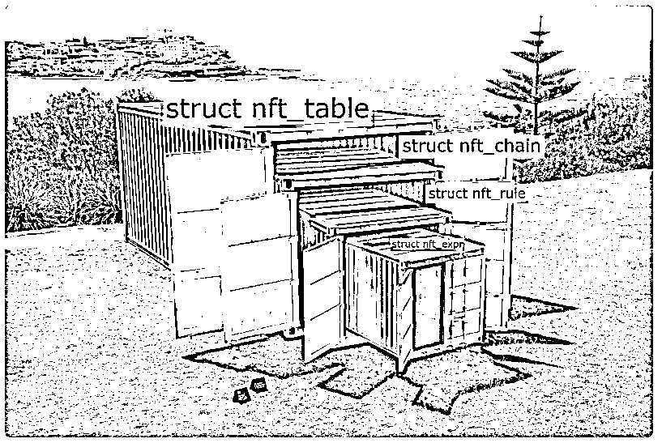

### 表达式（express）

表达式是对一个数据包具体的操作，这里大致介绍后续需要用到的表达式。

**nft_payload**

nft_payload 用于将数据包的值拷贝到寄存器中

```
struct nft_payload {
    enum nft_payload_bases  base:8;
    u8          offset;
    u8          len;
    u8          dreg;
};
```

*   base：数据包类型

*   offset：数据包起始位置的偏移

*   len：拷贝的长度

*   dreg：目的寄存器

其中 base 的类型由 enum nft_payload_bases 指定

```
/* include/uapi/linux/netfilter/nf_tables.h */
/**
 * enum nft_payload_bases - nf_tables payload expression offset bases
 *
 * @NFT_PAYLOAD_LL_HEADER: link layer header
 * @NFT_PAYLOAD_NETWORK_HEADER: network header
 * @NFT_PAYLOAD_TRANSPORT_HEADER: transport header
 * @NFT_PAYLOAD_INNER_HEADER: inner header / payload
 */
enum nft_payload_bases {
    NFT_PAYLOAD_LL_HEADER, //链路层
    NFT_PAYLOAD_NETWORK_HEADER, //网络层
    NFT_PAYLOAD_TRANSPORT_HEADER, //传输层
    NFT_PAYLOAD_INNER_HEADER, //数据包内部
};
```

下面这个例子则是将传输层的包偏移 16 个字节的位置，取出两个字节的内容存放到目的寄存器中，该寄存器的编号为 2

```
base = NFT_PAYLOAD_TRANSPORT_HEADER
offset = 16 -> the checksum is 16 bytes away from the start of the TCP header
len = 2 -> the checksum is 2 bytes
dreg = NFT_REG32_02 (the small registers start frrom NFT_REG32_00)
```

**nft_payload_set**

nft_payload_set 则是与 nft_payload 相反，该表达式是将指定寄存器的值存放到数据包里面

```
/* include/net/netfilter/nf_tables_core.h */
struct nft_payload_set {
    enum nft_payload_bases  base:8;
    u8          offset;
    u8          len;
    u8          sreg;
    u8          csum_type;
    u8          csum_offset;
    u8          csum_flags;
};
```

与 nft_payload 不同的是多了校验和的可选选项

【----帮助网安学习，以下所有学习资料免费领！加 vx：yj009991，备注 “博客园” 获取！】

　① 网安学习成长路径思维导图
　② 60+网安经典常用工具包
　③ 100+SRC 漏洞分析报告
　④ 150+网安攻防实战技术电子书
　⑤ 最权威 CISSP 认证考试指南+题库
　⑥ 超 1800 页 CTF 实战技巧手册
　⑦ 最新网安大厂面试题合集（含答案）
　⑧ APP 客户端安全检测指南（安卓+IOS）

**nft_cmp_expr**

nft_cmp_expr 表达式则是用于比较，通常用于判断数据包的端口号是否是需要符合要求。

```
struct nft_cmp_expr {
    struct nft_data     data;
    u8          sreg;
    u8          len;
    enum nft_cmp_ops    op:8;
};
```

*   data：用于设置比较的常量值

*   sreg：源寄存器，可以认为是数据包取出的内容

*   len：比较的长度

*   op：比较的操作，具体操作类型如下所示

```
<!-- -->
```

```
/**
 * enum nft_cmp_ops - nf_tables relational operator
 *
 * @NFT_CMP_EQ: equal
 * @NFT_CMP_NEQ: not equal
 * @NFT_CMP_LT: less than
 * @NFT_CMP_LTE: less than or equal to
 * @NFT_CMP_GT: greater than
 * @NFT_CMP_GTE: greater than or equal to
 */
enum nft_cmp_ops {
    NFT_CMP_EQ,
    NFT_CMP_NEQ,
    NFT_CMP_LT,
    NFT_CMP_LTE,
    NFT_CMP_GT,
    NFT_CMP_GTE,
};
```

**nft_bitwise**

nft_bitwise 用于对数据包进行比特级别的操作。例如移位，掩码设置等。

```
struct nft_bitwise {
    u8          sreg;
    u8          dreg;
    enum nft_bitwise_ops    op:8;
    u8          len;
    struct nft_data     mask;
    struct nft_data     xor;
    struct nft_data     data;
};
```

*   sreg：源寄存器

*   dreg：目的寄存器，用于存放最后的结果

*   op：指定具体的比特操作，具体操作如下

```
<!-- -->
```

```
/**
 * enum nft_bitwise_ops - nf_tables bitwise operations
 *
 * @NFT_BITWISE_BOOL: mask-and-xor operation used to implement NOT, AND, OR and
 *                    XOR boolean operations
 * @NFT_BITWISE_LSHIFT: left-shift operation
 * @NFT_BITWISE_RSHIFT: right-shift operation
 */
enum nft_bitwise_ops {
    NFT_BITWISE_BOOL,
    NFT_BITWISE_LSHIFT,
    NFT_BITWISE_RSHIFT,
};
```

*   mask：当 op 被指定为 NFT_BITWISE_BOOL 时，sreg 的值会与 mask 中指定的值进行掩码设置操作。并将结果存放到 dreg 中

*   xor：当 op 被指定为 NFT_BITWISE_BOOL 时，sreg 的值会与 xor 中指定的值进行掩码设置操作。并将结果存放到 dreg 中

*   data：当 op 被指定为 NFT_BITWISE_LSHIFT 或 NFT_BITWISE_RSHIFT 时，data 需要被指定移位的数值。

### 寄存器（register）

在 Nftables 中是以寄存器作为存储区，用于存放一段连续的内存，现在 Nftables 版本每个寄存器的值存放 4 字节数据，而旧版的 Nftables 的每个寄存器是存放 16 个字节的数据，为了保持兼容性，4 字节的寄存与 16 字节的寄存器都被保留。寄存器的枚举值如下所示

```
enum nft_registers {
    NFT_REG_VERDICT, //判定寄存器
    NFT_REG_1,
    NFT_REG_2,
    NFT_REG_3,
    NFT_REG_4,
    __NFT_REG_MAX,
​
    NFT_REG32_00    = 8,
    NFT_REG32_01,
    NFT_REG32_02,
    ...
    NFT_REG32_13,
    NFT_REG32_14,
    NFT_REG32_15,
};
```

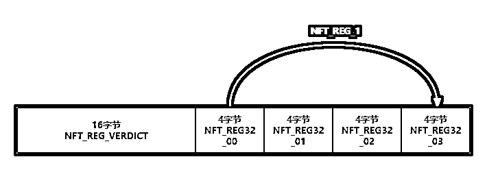

其中 NFT_REG_VERDICT 被称之为判断寄存器，这个寄存器比较特殊，是用于判定每个数据包需要怎么处理。判定的类型如下

*   NFT_CONTINUE：允许数据包通过防火墙

*   NFT_BREAK：跳过剩余的规则表达式

*   NF_DROP：直接丢弃数据包

*   NF_ACCEPT：接收数据包

*   NFT_GOTO：跳转到其他链执行

*   NFT_JUMP：跳转到其他链执行，若其他链将该数据包判定为 NFT_CONTINUE 则返回当前链

### libmnl 与 libnftnl

由于 Nftables 处于内核，需要从用户层向内核发送消息去设置需要拦截数据包的属性，人工构造成本较大，因此使用现成的库 libmnl 与 libnftnl

### 环境搭建

**环境版本**

*   ubuntu 20.04

*   qemu-system-x86_64 4.2.1

*   Linux-5.17 源码

设置编译选项

```
cd /home/pwn/CVE/CVE-2022-1015/CVE-2022-1015/linux-5.17
sudo gedit .config
#将下列选项设置为 y
CONFIG_NF_TABLES=y
CONFIG_NETFILTER_NETLINK=y
CONFIG_USER_NS=y
CONFIG_E1000=y
CONFIG_E1000E=y
make -j32 bzImage #编译
​
#安装依赖库
sudo apt-get install libmnl-dev 
sudo apt-get install libnftnl-dev
```

### 漏洞验证

若运行 exp 显示超过边界则代表没有漏洞

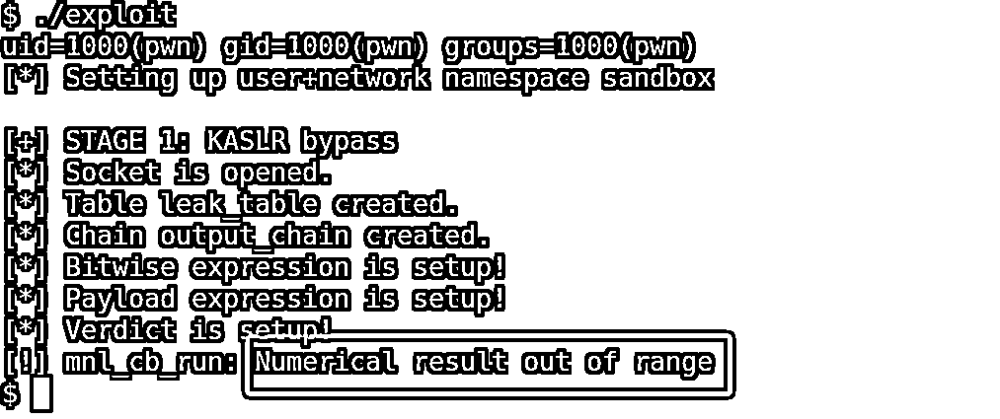

若 exp 正常运行则代表漏洞

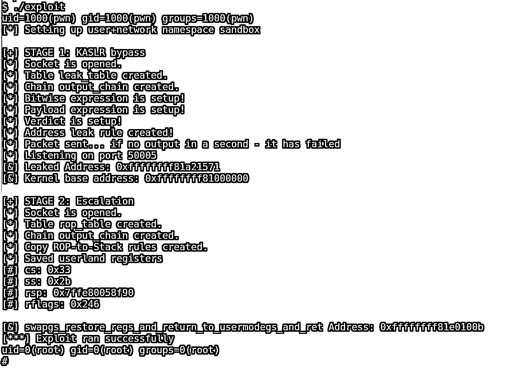

### 漏洞分析

**源码分析**

**nft_parse_register_load**

nft_cmp_expr：op=NFT_CMP_EQ sreg=8data=IPPROTO_TCP。该表达式是一个比较的表达式，用于比较下标为 8 的寄存器中的数据是否为 TCP 的协议。那么如何将下表为 8 的寄存器转化为内核中寄存器的内存位置，则需要以来下面列举的函数。

nft_parse_register_load 函数就是将用户设定的寄存器的下标转化为内核寄存器的下标，然后存储在源寄存器中。

```
File: net\netfilter\nf_tables_api.c
9325: int nft_parse_register_load(const struct nlattr *attr, u8 *sreg, u32 len)
9326: {
9327:   u32 reg;
9328:   int err;
9329: 
9330:   reg = nft_parse_register(attr); //用于提取数据包中的寄存器的下标，并转化为 Nftables 中寄存器的下标
9331:   err = nft_validate_register_load(reg, len); //用于检验寄存器下表的合法性，漏洞点
9332:   if (err < 0)
9333:       return err;
9334: 
9335:   *sreg = reg; //然后将寄存器的下标值存储在源寄存器中
9336:   return 0;
9337: }
```

**nft_parse_register**

nft_parse_register 函数用于将用户设置的寄存器下标转化为内核中寄存器的下标。

```
File: net\netfilter\nf_tables_api.c
9278: static unsigned int nft_parse_register(const struct nlattr *attr)
9279: {
9280:   unsigned int reg;
9281: 
9282:   reg = ntohl(nla_get_be32(attr)); //提取数据包的寄存器下标，比如上述例子为 8
9283:   switch (reg) {
        //0 - 4 是 16 字节寄存器
9284:   case NFT_REG_VERDICT...NFT_REG_4: 
9285:       return reg * NFT_REG_SIZE / NFT_REG32_SIZE;  //reg * 4
9286:   default:
        //由于 4 字节寄存器起始下标为 8，因此要减去起始下标
9287:       return reg + NFT_REG_SIZE / NFT_REG32_SIZE - NFT_REG32_00; // reg  - 4
9288:   }
9289: }
```

**nft_validate_register_load**

nft_validate_register_load 函数则是用于校验下标是否有问题，但是这个检验存在整型溢出的问题。reg 是枚举值，而枚举通常会被编译为 int 类型。len 代表数据包的长度。

*   正常情况下：reg = 100，那么套入校验则为 100 * 4 + 0x10 = 0x1a0 >0x50，那么会检验出寄存器下标存在问题

*   漏洞情况：reg =0xffffffff（int 情况下的最大值），那么逃入检验则为 0xffffffff * 4 +0x10 =0x40000000c，由于 int 最大值为 0xffffffff，那么最高 4 个比特会被舍弃，那么最后得到的值为 0x0000000c，此时 0xc< 0x50，就可以绕过检验。那么绕过检验后就会执行* sreg =reg，此时 reg = 0xffffffff，就会导致*sreg = 0xff

```
<!-- -->
```

```
File: net\netfilter\nf_tables_api.c
9313: static int nft_validate_register_load(enum nft_registers reg, unsigned int len)
9314: {
9315:   if (reg < NFT_REG_1 * NFT_REG_SIZE / NFT_REG32_SIZE) // reg < 4 则报错
9316:       return -EINVAL;
9317:   if (len == 0) //长度为 0 则报错
9318:       return -EINVAL;
9319:   if (reg * NFT_REG32_SIZE + len > sizeof_field(struct nft_regs, data)) //reg * 4 + len > 0x50 则报错，存在整型溢出漏洞
9320:       return -ERANGE;
9321: 
9322:   return 0;
9323: }
```

**nft_do_chain**

每一个被拦截的数据包都需要经过链上的表达式进行处理，而链处理的函数则为 nft_do_chains，这个函数会提取出相应的表达式，最后调用 expr_call_ops_eval 函数进行处理。

```
File: net\netfilter\nf_tables_core.c
197: unsigned int
198: nft_do_chain(struct nft_pktinfo *pkt, void *priv)
199: {
        ...
224:    for (; rule < last_rule; rule = nft_rule_next(rule)) {
225:        nft_rule_dp_for_each_expr(expr, last, rule) {
226:            if (expr->ops == &nft_cmp_fast_ops)
227:                nft_cmp_fast_eval(expr, &regs);
228:            else if (expr->ops == &nft_bitwise_fast_ops)
229:                nft_bitwise_fast_eval(expr, &regs);
230:            else if (expr->ops != &nft_payload_fast_ops ||
231:                 !nft_payload_fast_eval(expr, &regs, pkt))
232:                expr_call_ops_eval(expr, &regs, pkt);
233: 
234:            if (regs.verdict.code != NFT_CONTINUE)
235:                break;
236:        }
        ...
```

**expr_call_ops_eval**

expr_call_ops_eval 函数则是根据不同的表达式选择不同的处理函数，例如若该数据包需要经过 nft_payload 的表达式处理，则会调用 nft_payload_eval。

```
File: net\netfilter\nf_tables_core.c
161: static void expr_call_ops_eval(const struct nft_expr *expr,
162:                   struct nft_regs *regs,
163:                   struct nft_pktinfo *pkt)
164: {
165: #ifdef CONFIG_RETPOLINE
166:    unsigned long e = (unsigned long)expr->ops->eval;
167: #define X(e, fun) \
168:    do { if ((e) == (unsigned long)(fun)) \
169:        return fun(expr, regs, pkt); } while (0)
170: 
171:    X(e, nft_payload_eval);
172:    X(e, nft_cmp_eval);
173:    X(e, nft_counter_eval);
174:    X(e, nft_meta_get_eval);
175:    X(e, nft_lookup_eval);
176:    X(e, nft_range_eval);
177:    X(e, nft_immediate_eval);
178:    X(e, nft_byteorder_eval);
179:    X(e, nft_dynset_eval);
180:    X(e, nft_rt_get_eval);
181:    X(e, nft_bitwise_eval);
182: #undef  X
183: #endif /* CONFIG_RETPOLINE */
184:    expr->ops->eval(expr, regs, pkt);
185: }
```

**nft_payload_eval**

这里可以看到 regs 存放在栈上面，dest 这个变量值是通过&regs->data[priv->dreg]取出来的，而 priv->dreg 则是通过上述的 nft_parse_register_load 函数进行提取的，那么这里就存在一个非常明显的数组越界的漏洞。

```
File: net\netfilter\nft_payload.c
121: void nft_payload_eval(const struct nft_expr *expr,
122:              struct nft_regs *regs,
123:              const struct nft_pktinfo *pkt)
124: {
125:    const struct nft_payload *priv = nft_expr_priv(expr);
126:    const struct sk_buff *skb = pkt->skb;
127:    u32 *dest = &regs->data[priv->dreg];
        ...
165:    if (skb_copy_bits(skb, offset, dest, priv->len) < 0) //拷贝数据
166:        goto err;
167:    return;
168: err:
169:    regs->verdict.code = NFT_BREAK;
170: }
```

因此整型溢出结合越界就能够使我们访问到内核栈上的其他数据，如下图所示。

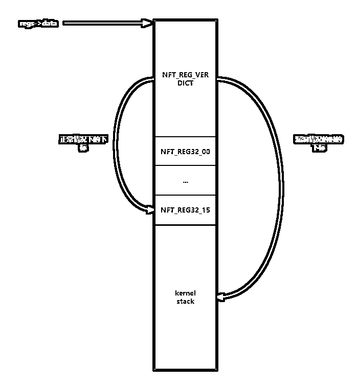

### 漏洞利用

**漏洞利用分析**

现在我们拥有了访问内核栈上其它地址的能力了，想要做到任意代码执行则需要考虑下列几种情况

*   由于返回地址存在在栈上，需要判断数组越界是否能够到达返回地址的位置

*   如何通过数组越界改写返回地址

*   由于需要进行任意代码执行，那么需要用到内核函数，则需要得到内核的程序基地址才能够根据函数偏移地址计算出函数的实际地址

由于表达式都会对寄存器空间进行操作，因此可以使用表达式对内存空间进行读写操作。

nft_bitwise 表达式可以控制源寄存器和目的寄存器，那么采用 nft_bitwise 可以将源寄存器的内容放置到目的寄存器中，因此可以利用 nft_bitwise 进行越界读，此时需要分析该数组越界读的边界的大小是多少。这里需要注意的是由于 len 是 sreg 与 dreg 共同拥有的，为了 dreg 不越界，这里的长度最大值只能为 0x40 而不能为 0xff，因为拥有 16 个寄存器，每个寄存器的值为 4 个字节，因此 16* 4 = 64 = 0x40

*   上界：(0xffffffff * 4) + 0x40 = 0x40000003c = 0x3c < 0x50 ， 0xff* 4 = 0x3fc；由于可以拷贝 0x40 个字节的长度，因此 0x3fc + 0x40 =0x43c。

*   下界：(0xfffffff0 * 4 ) + 0x40 = 0x400000000 = 0x0 < 0x50, 0xf0 *4 = 0x3c0

**内核地址泄露**

接着查看 regs 偏移 0x3c0 处的地址信息，结果发现在该片区域存在一个明显的内核地址，因此若能将这个地址进行泄露，我们就能获取内核的基地址。


**返回地址覆盖**

由于需要构建的 payload 比较长，而我们如果利用 nft_wise 最多只能写入 0x43c -0x3c0 =0x7c 的长度，是远远不够的，因此对返回地址进行覆盖时不能使用 nft_bitwise，而得改用 nft_payload。nft_payload 需要 dreg 的下标以及修改的长度 len，由于我们只需要考虑一个寄存器的值，因此该寄存器的长度最大可以达到 0xff。因此我们可以在地址更低的位置去搜索有无可以覆盖的返回地址。

可以发现在 0x360 的地址处也有一个内核的代码段地址

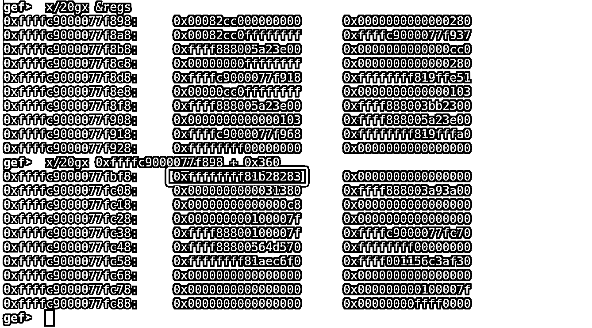

并且可以发现该函数主要是处理 udp 包的发送

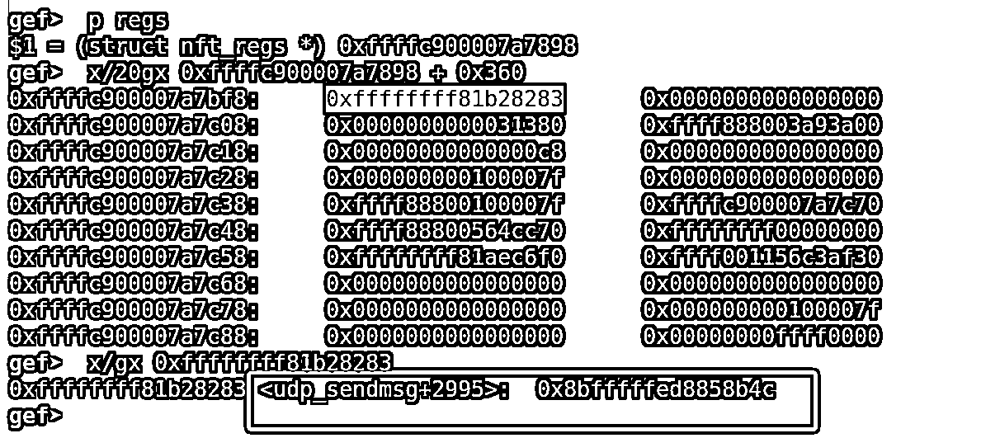

为了检验该地址是否能够修改程序的执行流程，可以使用一个方法，将该地址的值修改为非法值并观察内核是否会崩溃，这里将地址的内容修改为 0x1122334455667788，接着运行程序。

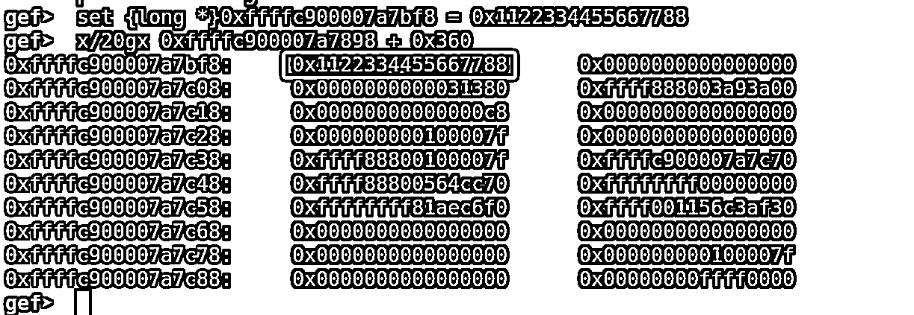

可以看到内核报错的信息显示 RIP 的地址为刚刚我们修改的地址，因此该地址可以作为被劫持程序执行流程的地址。

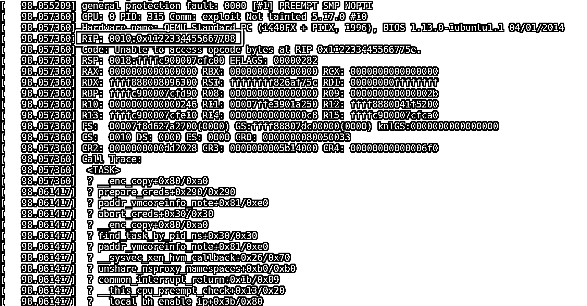

**exp 分析**

现在我们已经具有了两个利用条件

*   泄露内核的程序基地址

*   找到可以劫持程序执行流程的地址值

**地址泄露**

利用 nft_bitwise 泄露地址，这里注意的是在使用 nft_bitwise 泄露地址时，需要将 data 值设置为 0，这样就不会进行移位而导致我们的内核地址被修改存储，最后将泄露的地址值放置在 NFT_REG32_05 下标的寄存器中


接着使用 nft_set_payload 将 udp 数据包的值修改为 NFT_REG32_05 寄存器的值，最后取出 udp 数据包的值，获取内核程序地址值


**返回地址覆盖**

利用 nft_payload 完成返回地址的覆盖

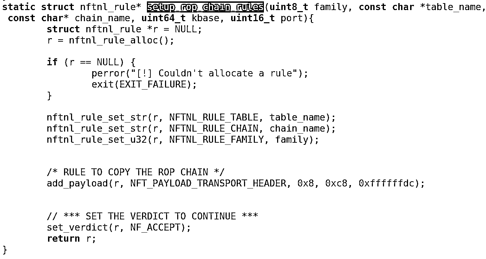

在数据包中将 payload 填充进去，这里需要说明一下如何在内核中拿到 shell 权限

*   首先需要在内核中拿到 root 权限，需要调用 commit_creds(prepare_kernel_cred(0))的内核函数获取新的凭证结构，而该结构的 uid = 0 ，gid =0 即为 root 权限

*   其次需要切换命名空间，由于在普通用户下是无法直接调用 Nftables 的，因为需要管理员的权限，因此在普通用户下需要新开辟一个命名空间，使得该空间与正常的空间隔离，此时才能够正常执行 Nftales。那么如果逃逸这段命名空间则需要进行命名空间的切换，则依赖于 switch_task_namespace 函数，可以将命名空间切换为 root 的命名空间

*   最后则是实现从内核态切换到用户态，由于我们是在内核空间拿到权限，而我们需要在用户态执行，因此需要完成状态的转换，该状态转换依赖于 swapgs_restore_regs 函数

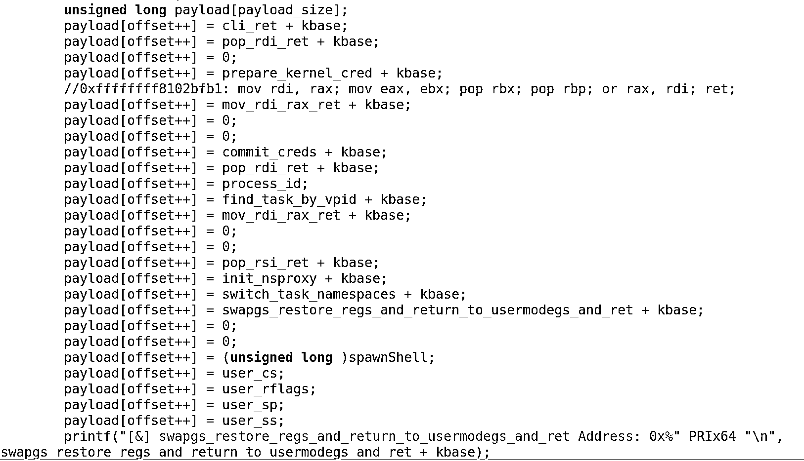

### 漏洞修复

补丁则是新增一条判断条件，属于 4 字节寄存器的下标单独处理，而不在 16 字节寄存器以及 4 字节寄存器的范围内的下标都进行报错处理


## 总结

Nftables 栈溢出漏洞**攻击流程**

*   首先利用 nft_bitwise 进行内核基地址的泄露。

*   其次是利用 nft_payload 改写返回地址，并将提权代码注入进去。

*   最后等到代码被触发。

Nftables 栈溢出漏洞**利用的限制**

*   不同的内核版本的内核栈布局几乎不同，因此不同版本之间的利用手法相差较大，因此漏洞的利用十分依赖于内核版本，针对不同的版本需要做出针对性的漏洞利用的 exp 编写。差别存在于内核栈中存在的内核代码段地址的偏移不同，例如有些内核代码段地址偏移距离 regs 太大，导致无法利用漏洞进行泄露或者改写。

**更多网安技能的在线实操练习，[请点击这里>>](https://www.hetianlab.com/)**