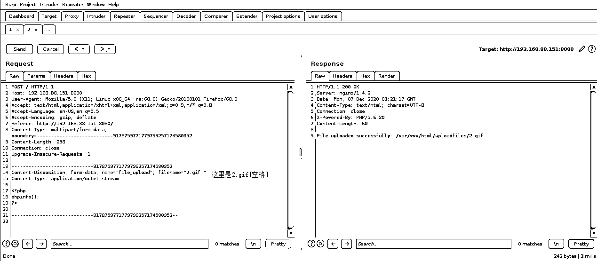
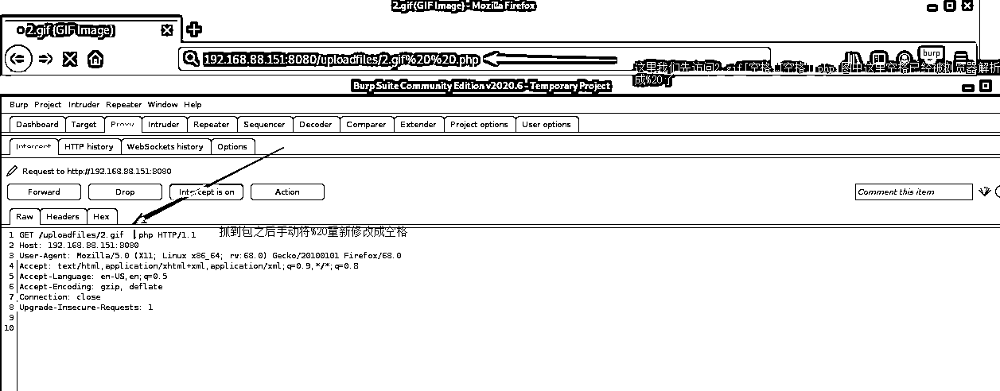
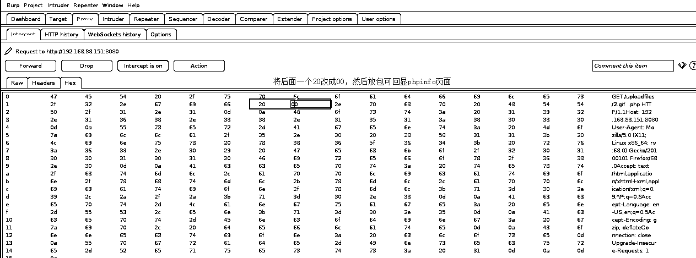
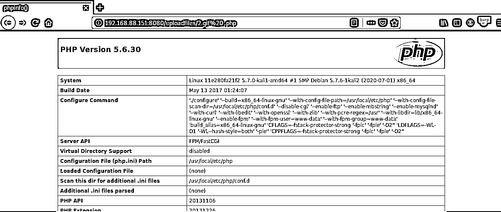

# Nginx 文件名逻辑漏洞(CVE-2013-4547) - Hel10 - 博客园

> 原文：[`www.cnblogs.com/HelloCTF/p/14096314.html`](https://www.cnblogs.com/HelloCTF/p/14096314.html)

### 影响版本

Nginx 0.8.41 ~ 1.4.3 / 1.5.0 ~ 1.5.7

### 漏洞成因

这个漏洞其实和代码执行没有太大关系，其主要原因是错误地解析了请求的 URI，错误地获取到用户请求的文件名，导致出现权限绕过、代码执行的连带影响。
举个例子，比如，Nginx 匹配到.php 结尾的请求，就发送给 fastcgi 进行解析，常见的写法如下：

```
location ~ \.php$ {
    include        fastcgi_params;

    fastcgi_pass   127.0.0.1:9000;
    fastcgi_index  index.php;
    fastcgi_param  SCRIPT_FILENAME  /var/www/html$fastcgi_script_name;
    fastcgi_param  DOCUMENT_ROOT /var/www/html;
} 
```

正常情况下（关闭 pathinfo 的情况下），只有.php 后缀的文件才会被发送给 fastcgi 解析。
而存在 CVE-2013-4547 的情况下，我们请求 1.gif[0x20][0x00].php，这个 URI 可以匹配上正则.php$，可以进入这个 Location 块；但进入后，Nginx 却错误地认为请求的文件是 1.gif[0x20]，就设置其为 SCRIPT_FILENAME 的值发送给 fastcgi。
fastcgi 根据 SCRIPT_FILENAME 的值进行解析，经过精心构造的文件名可以造成了解析漏洞。

### 漏洞复现



可以看到上传 2.gif[空格]文件可以成功。并且给我们返回了路径。访问返回的路径，我们直接访问/uploadfiles/2.gif[空格][空格].php(因为我访问/uploadfiles/2.gif[空格]没有抓到包)，然后抓包，因为浏览器解析 url 的原因，图中在抓包之后空格被解析成了%20，将包中的%20 手动修改成[空格]。


修改完之后别急着放包，我们还需要修改 Hex。


成功回显了 phpinfo 页面
