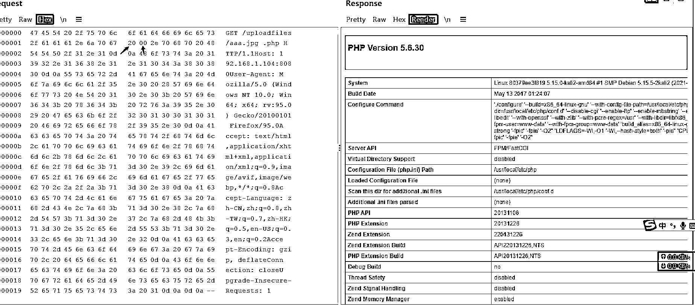

# Nginx 文件名逻辑漏洞（CVE-2013-4547） - oldliutou - 博客园

> 原文：[`www.cnblogs.com/oldliutou/p/15759793.html`](https://www.cnblogs.com/oldliutou/p/15759793.html)

# 漏洞描述

> `这一漏洞的原理是非法字符空格和截止符（\0）会导致 Nginx 解析 URI 时的有限状态机混乱，此漏洞可导致目录跨越及代码执行，其影响版本为：nginx 0.8.41 – 1.5.6`

# 漏洞复现

**这个环境是黑名单验证，我们无法上传 php 后缀的文件，需要利用 CVE-2013-4547。我们上传一个“aaa.jpg ”，注意后面的空格：**

**访问 [http://your-ip:8080/uploadfiles/aaa.jpg[0x20][0x00].php](http://your-ip:8080/uploadfiles/aaa.jpg%5B0x20%5D%5B0x00%5D.php)
即可发现 php 已被解析：**

**访问 URL：[`xxx:8080/aaa.jpg...php`](http://xxx:8080/aaa.jpg...php)
在 burp 的 hex 页面中将第一个点.改成 20，第二个改为 00**

