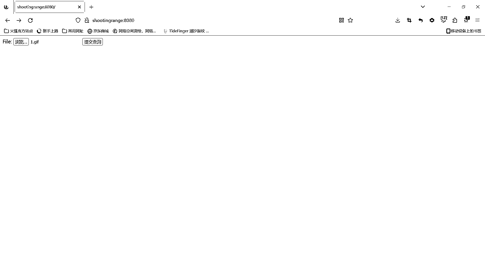
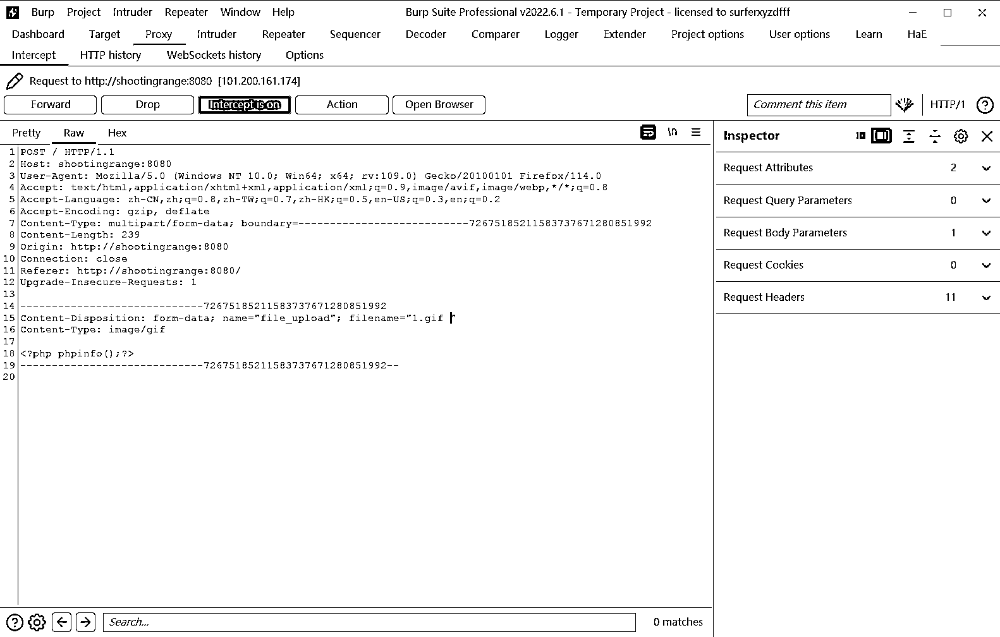
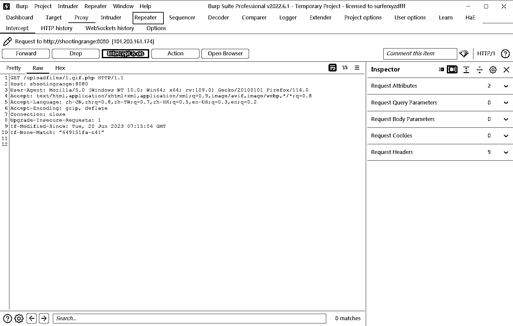
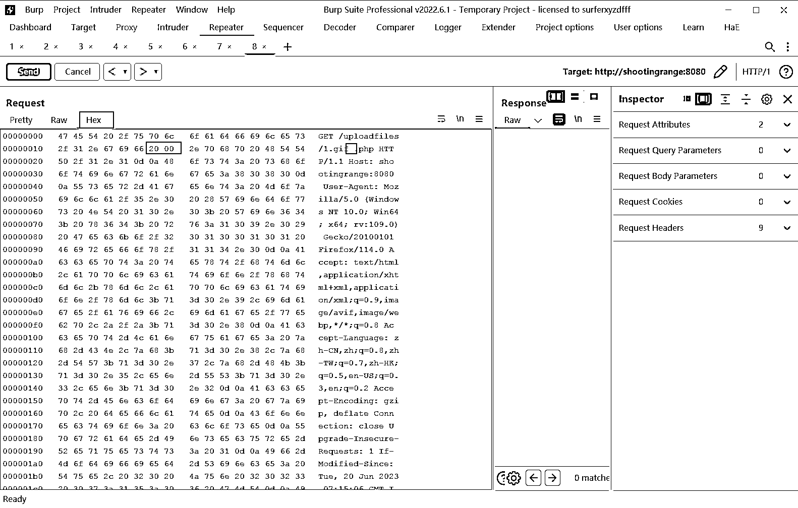
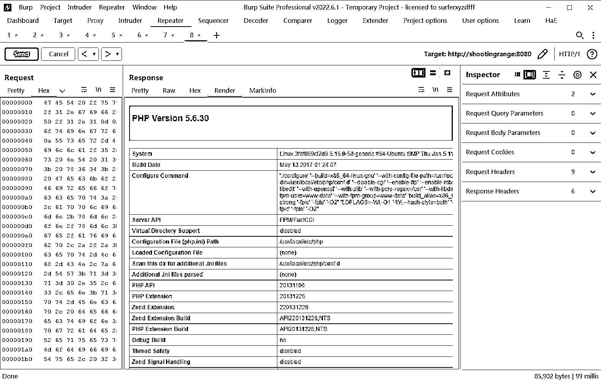

# Nginx 文件名逻辑漏洞（CVE-2013-4547）(Vulhub) - 了了青山见 - 博客园

> 原文：[`www.cnblogs.com/Pengj/p/17626735.html`](https://www.cnblogs.com/Pengj/p/17626735.html)

# Nginx 文件名逻辑漏洞（CVE-2013-4547）(Vulhub)

## 漏洞简介

在 Nginx 0.8.41 ~ 1.4.3 / 1.5.0 ~ 1.5.7 版本中存在错误解析用户请求的 url 信息，从而导致文件代码执行，权限绕过等问题。

## 适用环境

Nginx 0.8.41 ~ 1.4.3 / 1.5.0 ~ 1.5.7 版本

## 漏洞成因

漏洞成因大概为 Nginx 本身并不能解析 PHP 代码，只能通过加载 PHP 模块来进行解析代码。通过正则表达式来匹配以.php 结尾的请求路径交给 PHP 模块去解析，但是 Nginx 在加载文件名时遇到‘\0’便会停止读取‘\0’后面的内容，于是通过以上思路，我们在进行文件上传的时候，文件名应该设置为 1.gif,在进行访问时，访问文件应为 1.gif'\0'.php,通过正则表达式匹配.php 后缀将请求路径交给 PHP 模块，PHP 模块在读取文件名时遇到\0 便不会读取后面的.php，从而解析文件为 1.gif,但是在实际过程中，Nginx 在读取文件名碰到'\0'便会出现报错并停止执行，当我们在'\0'前面加入空格后，Nginx 便会跳过报错处理，这样便可以成功利用'\0'进行截断，因此我们的请求路径应该为 1.gif[0x20][0x00].php,Nginx 在读取文件名为 1.gif[0x20],因此我们在上传文件时应该上传文件名 1.gif[0x20]
具体解释可查看参考文章

*   '\0'为字符串结束标志，十六进制表示为 0x00
*   空格字符，十六进制表示为 0x20

## 环境搭建

环境路径

```
/vulhub/nginx/CVE-2013-4547 
```

启动命令

```
docker-compose up -d 
```

查看环境配置

```
docker-compose up -d 
```

访问界面


## 漏洞复现

构建上传文件内容

```
<?php phpinfo();?> 
```

对上传文件进行抓包，在文件名后面添加空格

成功上传

抓取访问 1.gif.php 文件的数据包,发送至 repeater 模块

在访问路径 gif 后通过十六进制视角右键点击添加字节添加空格和'\0'的十六进制数

发送数据包查看回显内容，1.gif[0x20]中的代码已被执行，将 phpinfo()代码换成后门代码即可连接后门。


## 漏洞总结

利用该漏洞需要满足

1.  Nginx 版本满足 0.8.41 ~ 1.4.3 / 1.5.0 ~ 1.5.7 版本
2.  文件上传点
3.  可以上传带空格文件名的文件
4.  服务器没有做文件重命名

## 修复建议

1.  升级最新版 Nginx
2.  过滤空格
3.  文件重命名
4.  取消文件目录执行权限
5.  云存储

## 参考文献

[1][Nginx 文件名逻辑漏洞（CVE-2013-4547）](https://vulhub.org/#/environments/nginx/CVE-2013-4547/)
[2][Nginx 文件名逻辑漏洞（CVE-2013-4547）漏洞复现](https://www.cnblogs.com/masses0x1/p/15780872.html)
[3][Nginx 服务漏洞详解](https://zhuanlan.zhihu.com/p/136801555)

以上内容仅作学习，如有瑕疵或错误，欢迎指正，感谢阅读。