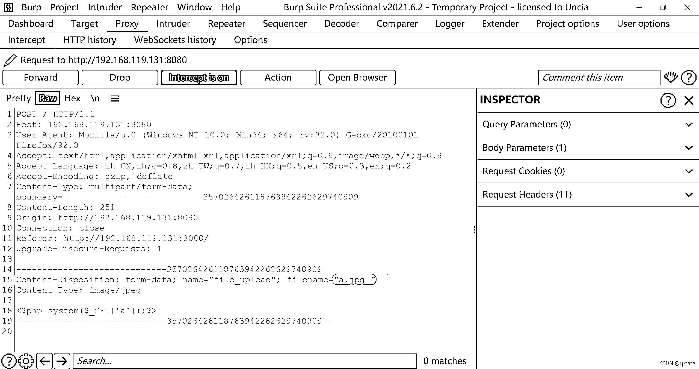
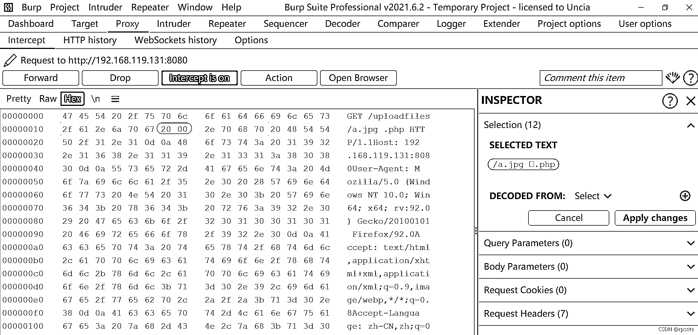
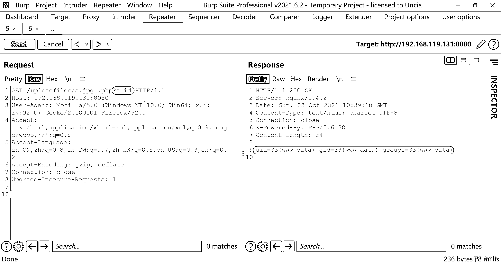

# Nginx 文件名逻辑漏洞（CVE-2013-4547）漏洞复现 - rpsate - 博客园

> 原文：[`www.cnblogs.com/masses0x1/p/15780872.html`](https://www.cnblogs.com/masses0x1/p/15780872.html)

## 前言

影响版本：Nginx 0.8.41 到 1.4.3 / 1.5.0 到 1.5.7。

利用条件：php-fpm.conf 中的 security.limit_extensions 为空。

建议在学习该漏洞前先学习 nginx 的原理：[`zhuanlan.zhihu.com/p/136801555`](https://zhuanlan.zhihu.com/p/136801555)。

> security.limit_extensions 设置了就只能解析指定后缀的文件，为空可以解析所有后缀文件。

## 漏洞原理

首先来看 nginx 解析 php 文件的配置信息：

```
location ~ \.php$ {
    include        fastcgi_params;

    fastcgi_pass   127.0.0.1:9000;
    fastcgi_index  index.php;
    fastcgi_param  SCRIPT_FILENAME  /var/www/html$fastcgi_script_name;
    fastcgi_param  DOCUMENT_ROOT /var/www/html;
} 
```

该配置文件大概意思就是匹配以`.php`结尾的文件，然后把这个文件当成 php 来执行。众所周知正则匹配遇到`\0`是不会停止匹配的，但是 nginx 遇到`\0`就会停止。

现在有一个文件名为`a.jpg\0.php`，该文件可以通过上面的正则匹配，并且交给 php 来解析，而且 nginx 将该文件交给 php 解析时遇到`\0`会停止读取文件名，所以真正去解析的文件名为`a.jpg`。按这个逻辑我们只要上传一个名为 a.jpg 的木马到服务器，然后访问 a.jpg\0.php 即可成功执行木马。但是实践中失败了，原因是 nginx 读取文件名中包含`\0`就会抛出一个错误并停止执行。

###### 当我们在`\0`前加上空格时， nginx 会跳过检测文件名中是否含有`\0`，这样就可以成功的利用 00 截断。

为什么在`\0`前加上空格就会跳过 nginx 对 00 截断的检测呢？这个需要审计 nginx 的代码，感兴趣的可以参考：[`blog.csdn.net/Blood_Pupil/article/details/88565176`](https://blog.csdn.net/Blood_Pupil/article/details/88565176)。

> \0 为字符串结束标志，十六进制为 0x00
> 
> 空格十六进制为 0x00

## 漏洞复现

首先将一句话木马写入 a.jpg 中。

```
<?php system($_GET['a']);?> 
```

然后上传该文件，同时使用 burpsuite 截断数据。


在文件名末尾加上空格，如下图所示。然后点击`Forward`提交。

> linux 系统需要这一步，而 windows 系统可以省略。因为在 windows 中文件名不可以包含空格，而 linux 的文件名中可以包含空格。在访问`a.jpg[20][00].jpg`时，在 windows 系统中会识别为 `a.jpg`，在 linux 系统中会识别为 `a.jpg[20]`。



然后可以在浏览器中看到上传文件的地址。


然后访问 `http://192.168.119.131:8080/uploadfiles/a.jpg.php`，同时用 burpsuite 抓取数据。


然后进入 16 进制编辑视图，在 `.jpg`与 `.php`中间添加 `20`和`00`，这是空格和 `/0`的十六进制。



然后右击鼠标，点击 `Send to Repeater`发送到重放模块，然后点击导航栏上的`Repeater`，在这里可以多次发送数据包。

在文件名的后面添加上参数即可执行任意命令，如下图所示。



## 参考文献

[1] [`zhuanlan.zhihu.com/p/136801555`](https://zhuanlan.zhihu.com/p/136801555)，Nginx 服务漏洞详解

[2] [`blog.csdn.net/Blood_Pupil/article/details/88565176`](https://blog.csdn.net/Blood_Pupil/article/details/88565176)，漏洞复现之 CVE-2013-4547