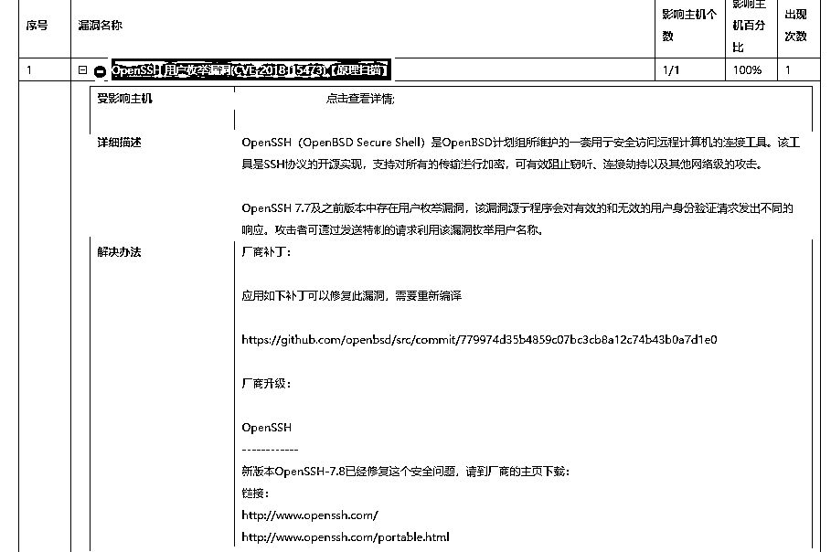

# OpenSSH 用户枚举漏洞(CVE-2018-15473) 漏洞处理 - RoyFans - 博客园

> 原文：[`www.cnblogs.com/royfans/p/16195791.html`](https://www.cnblogs.com/royfans/p/16195791.html)

### 1\. 漏洞描述



```
查看版本
```


预处理防止升级过程中连接中断

```
#安装 telnet 服务
yum -y install telnet-server
#启动 telnet 服务
systemctl start telnet.socket
#开启防火墙 23 端口
firewall-cmd --permanent --add-port=23/tcp --zone=public
firewall-cmd --reload
#windows 打开 cmd 窗口,telnet 即可登陆服务器
telnet [服务器 ip]
#默认情况下，linux 不允许 root 用户以 telnet 方式登录 linux 主机，移除 securetty 文件
mv /etc/securetty{,.bak}
之后就可以用 root 登录

由于 telnet 是明文传输，不安全，所以升级完成后，必须停止该服务

```

服务器创建文件，复制下面脚本（openssl-1.1.1g.tar.gz，openssh-8.3p1.tar.gz 两个安装包本地下载，有墙国内可能访问不到），

服务器执行如下脚本即可升级完成（暂时仅支持 centos7）

```

#!/bin/bash

rpm -e openssh --nodeps && rpm -e openssh-clients --nodeps && rpm -e openssh-server --nodeps
yum install -y pam* zlib*
mv /etc/ssh /etc/ssh_bak

#mkdir ./sshupdate
#cd ./sshupdate
#wget https://www.openssl.org/source/openssl-1.1.1g.tar.gz --no-check-certificate
tar -xzvf openssl-1.1.1g.tar.gz
cd openssl-1.1.1g
./config --prefix=/usr/ --openssldir=/usr/ shared
make && make install
#完成后看下 openssl 版本
openssl version

#wget https://cdn.openbsd.org/pub/OpenBSD/OpenSSH/portable/openssh-8.3p1.tar.gz --no-check-certificate
tar -xzvf openssh-8.3p1.tar.gz
cd openssh-8.3p1
./configure --with-zlib --with-ssl-dir --with-pam --bindir=/usr/bin --sbindir=/usr/sbin --sysconfdir=/etc/ssh
make && make install
cp contrib/redhat/sshd.init /etc/init.d/sshd
#完成后看下 ssh 版本
ssh -V

nohup service sshd restart
nohup systemctl restart sshd
chkconfig --add sshd

```

　升级完成后查看版本


```
4\. 配置服务器可以 root 登录
```

```

		vim /etc/ssh/sshd_config
		PermitRootLogin  yes

		PubkeyAuthentication  yes
		PasswordAuthentication  yes

		重启 sshd

		systemctl restart sshd

```

 再次扫描漏洞已修复