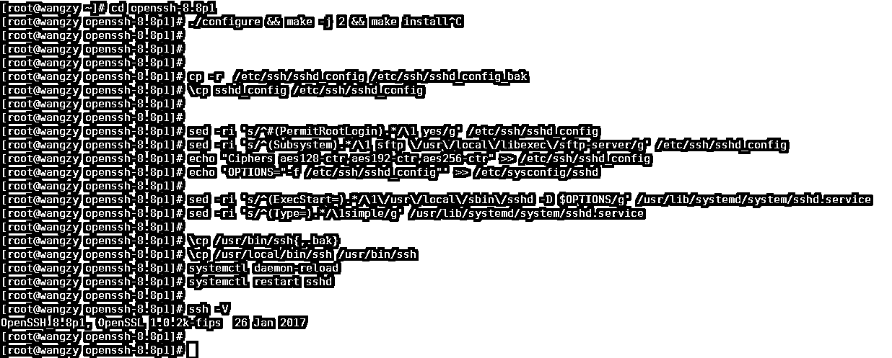

# OpenSSH 安全漏洞 （CVE-2021-41617）漏洞修复 - wangzy-Zj - 博客园

> 原文：[`www.cnblogs.com/wangzy-Zj/p/16719300.html`](https://www.cnblogs.com/wangzy-Zj/p/16719300.html)

事件说明：

OpenSSH（OpenBSD Secure Shell）是 Openbsd 计划组的一套用于安全访问远程计算机的连接工具。该工具是 SSH 协议的开源实现，支持对所有的传输进行加密，可有效阻止窃听、连接劫持以及其他网络级的攻击。OpenSSH 存在安全漏洞。该漏洞源于允许权限提升，因为补充组未按预期初始化。

服务器环境：**ECS 服务器**

**注意！！！**

**升级之前另外开启一个窗口，保持窗口不关闭，防止升级出错时恢复服务。**

```
tail -300f /var/log/messages
```

1、查看当前版本

```
ssh -V
```

  

  2、安装依赖

```
yum install -y gcc openssl-devel zlib-devel wget
```

3、解压包并编译

```
# 下载
wget https://cdn.openbsd.org/pub/OpenBSD/OpenSSH/portable/openssh-8.8p1.tar.gz
或者登入：https://cdn.openbsd.org/pub/OpenBSD/OpenSSH/portable 手动下载

# 进入解压目录并编译
cd openssh-8.8p1/
./configure && make -j 2 && make install
```


  4、备份并替换原文件

```
# 注：执行目录为 openssh-8.8p1 目录下
cp -r  /etc/ssh/sshd_config /etc/ssh/sshd_config_bak
```

```
\cp sshd_config /etc/ssh/sshd_config
```


###cp contrib/redhat/sshd.init /etc/init.d/sshd

5、修改配置文件

```
配置一：
sed -ri 's/^#(PermitRootLogin).*/\1 yes/g' /etc/ssh/sshd_config

配置二：
##注意“/usr/local/libexec/sftp-server”的地址需根据实际环境来，一般为“/usr/local/libexec/sftp-server”
##也有的为“/usr/local/libexec/openssh/sftp-server”
sed -ri 's/^(Subsystem).*/\1 sftp \/usr\/local\/libexec\/sftp-server/g' /etc/ssh/sshd_config 
echo "Ciphers aes128-ctr,aes192-ctr,aes256-ctr" >> /etc/ssh/sshd_config 
echo 'OPTIONS="-f /etc/ssh/sshd_config"' >> /etc/sysconfig/sshd

配置三：
###以下命令物理机执行，ECS 服务器不存在 sshd.service 配置文件 ，可跳过
sed -ri 's/^(ExecStart=).*/\1\/usr\/local\/sbin\/sshd -D $OPTIONS/g' /usr/lib/systemd/system/sshd.service 
sed -ri 's/^(Type=).*/\1simple/g' /usr/lib/systemd/system/sshd.service
```

6、重新加载

```
\cp /usr/bin/ssh{,.bak}
\cp /usr/local/bin/ssh /usr/bin/ssh
systemctl daemon-reload
systemctl restart sshd
```

**7、再次查看**

 **[root@wangzy openssh-8.8p1]# ssh -V
OpenSSH_8.8p1, OpenSSL 1.0.2k-fips 26 Jan 2017


 8、重新开启一个登入页面，查看是否登入正常

**附加：**

操作截图如下



说明:

参照文档：https://www.it610.com/article/1566375377641738240.htm**