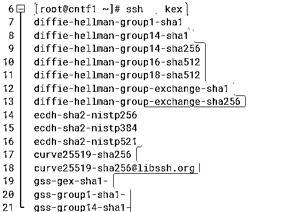
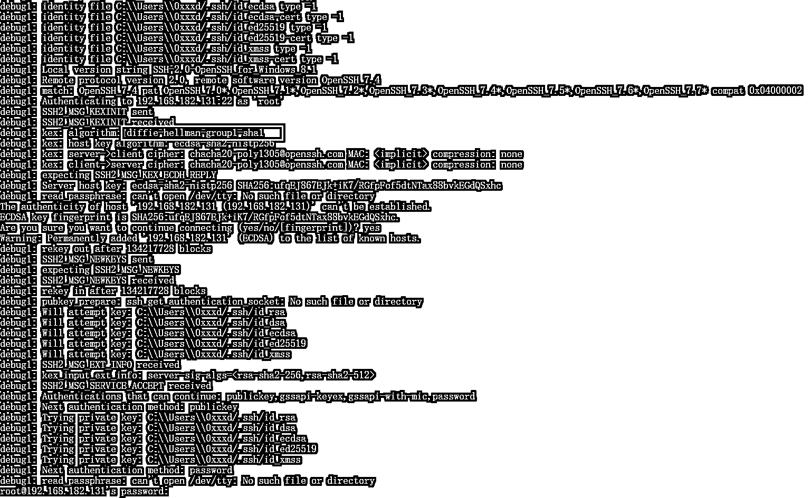

# Openssh 算法协议上的漏洞修复-Diffie-Hellman Key Agreement Protocol 资源管理错误漏洞(CVE-2002-20001) - 皇帽讲绿帽带法技巧 - 博客园

> 原文：[`www.cnblogs.com/autopwn/p/16363160.html`](https://www.cnblogs.com/autopwn/p/16363160.html)

`由于低版本的 OpenSSH 使用了过时不安全的加密算法协议，通常 OpenSSH 在版本迭代更新时会弃用这些不安全的加密算法。 如果我们仍要继续使用旧版本的 OpenSSH，可以根据实际情况，考虑屏蔽掉不安全的加密算法，以降低安全风险`

##### 查看 Kexalgorithms-此举操作是确认客户端支持的 kexalgorithms

```
[root@cntf1 ~]# ssh -Q kex
diffie-hellman-group1-sha1
diffie-hellman-group14-sha1
diffie-hellman-group14-sha256
diffie-hellman-group16-sha512
diffie-hellman-group18-sha512
diffie-hellman-group-exchange-sha1
diffie-hellman-group-exchange-sha256
ecdh-sha2-nistp256
ecdh-sha2-nistp384
ecdh-sha2-nistp521
curve25519-sha256
curve25519-sha256@libssh.org
gss-gex-sha1-
gss-group1-sha1-
gss-group14-sha1- 
```



##### 查看服务端支持的 kexalgorithms

```
[root@cntf1 ~]# sshd -T | grep -w kexalgorithms
kexalgorithms curve25519-sha256,curve25519-sha256@libssh.org,ecdh-sha2-nistp256,ecdh-sha2-nistp384,ecdh-sha2-nistp521,diffie-hellman-group-exchange-sha256,diffie-hellman-group16-sha512,diffie-hellman-group18-sha512,diffie-hellman-group-exchange-sha1,diffie-hellman-group14-sha256,diffie-hellman-group14-sha1,diffie-hellman-group1-sha1 
```


#### 修复方法

*   通过修改 sshd_config 配置文件，屏蔽掉不安全的 KexAlgorithjms，其中具体的 sshd_config 配置参数可以从 man 文档中查看

    *   通过 man 文档查看当前 openssh 版本支持的算法列表和参数用法。
    *   指定可用的 KEX(Key Exchange)算法，多个算法之间使用英文模式下的逗号。
    *   如果指定的列表以’ + '字符开头，则指定的算法将被追加到默认集，而不是替换原有默认的。
    *   如果指定的列表以’ - '字符开头，则指定的算法(包括通配符)将从默认集中删除，而不是替换。较新的 openssh 版本支持。
    *   如果指定的列表以’ ^ '字符开头，则指定的算法将被放在默认集的开头，同样是较新的 openssh 版本支持。
*   具体修复方法，这里是直接去掉了所有 Diffie-Hellman 算法

```
man sshd_config |grep -A 40 -w KexAlgorithms
echo "KexAlgorithms curve25519-sha256,curve25519-sha256@libssh.org,ecdh-sha2-nistp256,ecdh-sha2-nistp384,ecdh-sha2-nistp521" >> /etc/ssh/sshd_config
systemctl restart sshd
sshd -T | grep -w kexalgorithms 
```


```
 curve25519-sha256
                   curve25519-sha256@libssh.org
                   diffie-hellman-group1-sha1
                   diffie-hellman-group14-sha1
                   diffie-hellman-group-exchange-sha1
                   diffie-hellman-group-exchange-sha256
                   ecdh-sha2-nistp256
                   ecdh-sha2-nistp384
                   ecdh-sha2-nistp521 
```

##### 未禁用 diffie-hellman 算法之前，可用正常使用 ssh 连接登录

```
C:\Users\0xxxd>ssh -v -oKexAlgorithms=diffie-hellman-group1-sha1 root@192.168.182.131
OpenSSH_for_Windows_8.1p1, LibreSSL 3.0.2
debug1: Reading configuration data C:\\Users\\0xxxd/.ssh/config
debug1: Reading configuration data __PROGRAMDATA__\\ssh/ssh_config
debug1: Connecting to 192.168.182.131 [192.168.182.131] port 22.
debug1: Connection established.
debug1: identity file C:\\Users\\0xxxd/.ssh/id_rsa type -1
debug1: identity file C:\\Users\\0xxxd/.ssh/id_rsa-cert type -1
debug1: identity file C:\\Users\\0xxxd/.ssh/id_dsa type -1
debug1: identity file C:\\Users\\0xxxd/.ssh/id_dsa-cert type -1
debug1: identity file C:\\Users\\0xxxd/.ssh/id_ecdsa type -1
debug1: identity file C:\\Users\\0xxxd/.ssh/id_ecdsa-cert type -1
debug1: identity file C:\\Users\\0xxxd/.ssh/id_ed25519 type -1
debug1: identity file C:\\Users\\0xxxd/.ssh/id_ed25519-cert type -1
debug1: identity file C:\\Users\\0xxxd/.ssh/id_xmss type -1
debug1: identity file C:\\Users\\0xxxd/.ssh/id_xmss-cert type -1
debug1: Local version string SSH-2.0-OpenSSH_for_Windows_8.1
debug1: Remote protocol version 2.0, remote software version OpenSSH_7.4
debug1: match: OpenSSH_7.4 pat OpenSSH_7.0*,OpenSSH_7.1*,OpenSSH_7.2*,OpenSSH_7.3*,OpenSSH_7.4*,OpenSSH_7.5*,OpenSSH_7.6*,OpenSSH_7.7* compat 0x04000002
debug1: Authenticating to 192.168.182.131:22 as 'root'
debug1: SSH2_MSG_KEXINIT sent
debug1: SSH2_MSG_KEXINIT received
debug1: kex: algorithm: diffie-hellman-group1-sha1
debug1: kex: host key algorithm: ecdsa-sha2-nistp256
debug1: kex: server->client cipher: chacha20-poly1305@openssh.com MAC: <implicit> compression: none
debug1: kex: client->server cipher: chacha20-poly1305@openssh.com MAC: <implicit> compression: none
debug1: expecting SSH2_MSG_KEX_ECDH_REPLY
debug1: Server host key: ecdsa-sha2-nistp256 SHA256:ufqEJ867EJk+iK7/RGfpFof5dtNTax88bvkEGdQSxhc
debug1: read_passphrase: can't open /dev/tty: No such file or directory
The authenticity of host '192.168.182.131 (192.168.182.131)' can't be established.
ECDSA key fingerprint is SHA256:ufqEJ867EJk+iK7/RGfpFof5dtNTax88bvkEGdQSxhc.
Are you sure you want to continue connecting (yes/no/[fingerprint])? yes
Warning: Permanently added '192.168.182.131' (ECDSA) to the list of known hosts.
debug1: rekey out after 134217728 blocks
debug1: SSH2_MSG_NEWKEYS sent
debug1: expecting SSH2_MSG_NEWKEYS
debug1: SSH2_MSG_NEWKEYS received
debug1: rekey in after 134217728 blocks
debug1: pubkey_prepare: ssh_get_authentication_socket: No such file or directory
debug1: Will attempt key: C:\\Users\\0xxxd/.ssh/id_rsa
debug1: Will attempt key: C:\\Users\\0xxxd/.ssh/id_dsa
debug1: Will attempt key: C:\\Users\\0xxxd/.ssh/id_ecdsa
debug1: Will attempt key: C:\\Users\\0xxxd/.ssh/id_ed25519
debug1: Will attempt key: C:\\Users\\0xxxd/.ssh/id_xmss
debug1: SSH2_MSG_EXT_INFO received
debug1: kex_input_ext_info: server-sig-algs=<rsa-sha2-256,rsa-sha2-512>
debug1: SSH2_MSG_SERVICE_ACCEPT received
debug1: Authentications that can continue: publickey,gssapi-keyex,gssapi-with-mic,password
debug1: Next authentication method: publickey
debug1: Trying private key: C:\\Users\\0xxxd/.ssh/id_rsa
debug1: Trying private key: C:\\Users\\0xxxd/.ssh/id_dsa
debug1: Trying private key: C:\\Users\\0xxxd/.ssh/id_ecdsa
debug1: Trying private key: C:\\Users\\0xxxd/.ssh/id_ed25519
debug1: Trying private key: C:\\Users\\0xxxd/.ssh/id_xmss
debug1: Next authentication method: password
debug1: read_passphrase: can't open /dev/tty: No such file or directory
root@192.168.182.131's password:
debug1: Authentication succeeded (password).
Authenticated to 192.168.182.131 ([192.168.182.131]:22).
debug1: channel 0: new [client-session]
debug1: Requesting no-more-sessions@openssh.com
debug1: Entering interactive session.
debug1: pledge: network
debug1: ENABLE_VIRTUAL_TERMINAL_INPUT is supported. Reading the VTSequence from console
debug1: ENABLE_VIRTUAL_TERMINAL_PROCESSING is supported. Console supports the ansi parsing
debug1: client_input_global_request: rtype hostkeys-00@openssh.com want_reply 0
Last login: Fri Jun 10 18:09:28 2022 from 192.168.182.1 
```



##### 禁用了 diffie-hellman 算法之后，带上被禁用的密钥算法登录，显示不能正常使用 ssh 登录

```
C:\Users\0xxxd>ssh -v -oKexAlgorithms=diffie-hellman-group1-sha1 root@192.168.182.131
OpenSSH_for_Windows_8.1p1, LibreSSL 3.0.2
debug1: Reading configuration data C:\\Users\\0xxxd/.ssh/config
debug1: Reading configuration data __PROGRAMDATA__\\ssh/ssh_config
debug1: Connecting to 192.168.182.131 [192.168.182.131] port 22.
debug1: Connection established.
debug1: identity file C:\\Users\\0xxxd/.ssh/id_rsa type -1
debug1: identity file C:\\Users\\0xxxd/.ssh/id_rsa-cert type -1
debug1: identity file C:\\Users\\0xxxd/.ssh/id_dsa type -1
debug1: identity file C:\\Users\\0xxxd/.ssh/id_dsa-cert type -1
debug1: identity file C:\\Users\\0xxxd/.ssh/id_ecdsa type -1
debug1: identity file C:\\Users\\0xxxd/.ssh/id_ecdsa-cert type -1
debug1: identity file C:\\Users\\0xxxd/.ssh/id_ed25519 type -1
debug1: identity file C:\\Users\\0xxxd/.ssh/id_ed25519-cert type -1
debug1: identity file C:\\Users\\0xxxd/.ssh/id_xmss type -1
debug1: identity file C:\\Users\\0xxxd/.ssh/id_xmss-cert type -1
debug1: Local version string SSH-2.0-OpenSSH_for_Windows_8.1
debug1: Remote protocol version 2.0, remote software version OpenSSH_7.4
debug1: match: OpenSSH_7.4 pat OpenSSH_7.0*,OpenSSH_7.1*,OpenSSH_7.2*,OpenSSH_7.3*,OpenSSH_7.4*,OpenSSH_7.5*,OpenSSH_7.6*,OpenSSH_7.7* compat 0x04000002
debug1: Authenticating to 192.168.182.131:22 as 'root'
debug1: SSH2_MSG_KEXINIT sent
debug1: SSH2_MSG_KEXINIT received
debug1: kex: algorithm: (no match)
Unable to negotiate with 192.168.182.131 port 22: no matching key exchange method found. Their offer: curve25519-sha256,curve25519-sha256@libssh.org,ecdh-sha2-nistp256,ecdh-sha2-nistp384,ecdh-sha2-nistp521 
```


**上述使用了禁用的加密算法进行 ssh 登录发现显示没有匹配到算法，然后无法正常登录**

##### 下面是直接正常 ssh 登录，不带任何加密算法，发现是可用正常使用 ssh 登录

```
C:\Users\0xxxd>ssh -v root@192.168.182.131
OpenSSH_for_Windows_8.1p1, LibreSSL 3.0.2
debug1: Reading configuration data C:\\Users\\0xxxd/.ssh/config
debug1: Reading configuration data __PROGRAMDATA__\\ssh/ssh_config
debug1: Connecting to 192.168.182.131 [192.168.182.131] port 22.
debug1: Connection established.
debug1: identity file C:\\Users\\0xxxd/.ssh/id_rsa type -1
debug1: identity file C:\\Users\\0xxxd/.ssh/id_rsa-cert type -1
debug1: identity file C:\\Users\\0xxxd/.ssh/id_dsa type -1
debug1: identity file C:\\Users\\0xxxd/.ssh/id_dsa-cert type -1
debug1: identity file C:\\Users\\0xxxd/.ssh/id_ecdsa type -1
debug1: identity file C:\\Users\\0xxxd/.ssh/id_ecdsa-cert type -1
debug1: identity file C:\\Users\\0xxxd/.ssh/id_ed25519 type -1
debug1: identity file C:\\Users\\0xxxd/.ssh/id_ed25519-cert type -1
debug1: identity file C:\\Users\\0xxxd/.ssh/id_xmss type -1
debug1: identity file C:\\Users\\0xxxd/.ssh/id_xmss-cert type -1
debug1: Local version string SSH-2.0-OpenSSH_for_Windows_8.1
debug1: Remote protocol version 2.0, remote software version OpenSSH_7.4
debug1: match: OpenSSH_7.4 pat OpenSSH_7.0*,OpenSSH_7.1*,OpenSSH_7.2*,OpenSSH_7.3*,OpenSSH_7.4*,OpenSSH_7.5*,OpenSSH_7.6*,OpenSSH_7.7* compat 0x04000002
debug1: Authenticating to 192.168.182.131:22 as 'root'
debug1: SSH2_MSG_KEXINIT sent
debug1: SSH2_MSG_KEXINIT received
debug1: kex: algorithm: curve25519-sha256
debug1: kex: host key algorithm: ecdsa-sha2-nistp256
debug1: kex: server->client cipher: chacha20-poly1305@openssh.com MAC: <implicit> compression: none
debug1: kex: client->server cipher: chacha20-poly1305@openssh.com MAC: <implicit> compression: none
debug1: expecting SSH2_MSG_KEX_ECDH_REPLY
debug1: Server host key: ecdsa-sha2-nistp256 SHA256:ufqEJ867EJk+iK7/RGfpFof5dtNTax88bvkEGdQSxhc
debug1: Host '192.168.182.131' is known and matches the ECDSA host key.
debug1: Found key in C:\\Users\\0xxxd/.ssh/known_hosts:9
debug1: rekey out after 134217728 blocks
debug1: SSH2_MSG_NEWKEYS sent
debug1: expecting SSH2_MSG_NEWKEYS
debug1: SSH2_MSG_NEWKEYS received
debug1: rekey in after 134217728 blocks
debug1: pubkey_prepare: ssh_get_authentication_socket: No such file or directory
debug1: Will attempt key: C:\\Users\\0xxxd/.ssh/id_rsa
debug1: Will attempt key: C:\\Users\\0xxxd/.ssh/id_dsa
debug1: Will attempt key: C:\\Users\\0xxxd/.ssh/id_ecdsa
debug1: Will attempt key: C:\\Users\\0xxxd/.ssh/id_ed25519
debug1: Will attempt key: C:\\Users\\0xxxd/.ssh/id_xmss
debug1: SSH2_MSG_EXT_INFO received
debug1: kex_input_ext_info: server-sig-algs=<rsa-sha2-256,rsa-sha2-512>
debug1: SSH2_MSG_SERVICE_ACCEPT received
debug1: Authentications that can continue: publickey,gssapi-keyex,gssapi-with-mic,password
debug1: Next authentication method: publickey
debug1: Trying private key: C:\\Users\\0xxxd/.ssh/id_rsa
debug1: Trying private key: C:\\Users\\0xxxd/.ssh/id_dsa
debug1: Trying private key: C:\\Users\\0xxxd/.ssh/id_ecdsa
debug1: Trying private key: C:\\Users\\0xxxd/.ssh/id_ed25519
debug1: Trying private key: C:\\Users\\0xxxd/.ssh/id_xmss
debug1: Next authentication method: password
debug1: read_passphrase: can't open /dev/tty: No such file or directory
root@192.168.182.131's password:
debug1: Authentication succeeded (password).
Authenticated to 192.168.182.131 ([192.168.182.131]:22).
debug1: channel 0: new [client-session]
debug1: Requesting no-more-sessions@openssh.com
debug1: Entering interactive session.
debug1: pledge: network
debug1: ENABLE_VIRTUAL_TERMINAL_INPUT is supported. Reading the VTSequence from console
debug1: ENABLE_VIRTUAL_TERMINAL_PROCESSING is supported. Console supports the ansi parsing
debug1: client_input_global_request: rtype hostkeys-00@openssh.com want_reply 0
Last login: Fri Jun 10 18:18:17 2022 from 192.168.182.1 
```


#### 参考

[`blog.csdn.net/zhongxj183/article/details/124928794`](https://blog.csdn.net/zhongxj183/article/details/124928794)
[`mirrors.aliyun.com/pub/OpenBSD/OpenSSH/portable/`](https://mirrors.aliyun.com/pub/OpenBSD/OpenSSH/portable/)
[`www.openssh.com/security.html`](https://www.openssh.com/security.html)
[`blog.csdn.net/weixin_43767602/article/details/124793901`](https://blog.csdn.net/weixin_43767602/article/details/124793901)
[`github.com/Balasys/dheater`](https://github.com/Balasys/dheater)