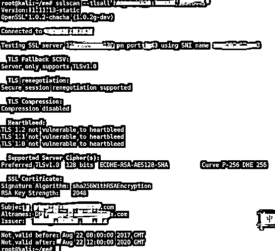
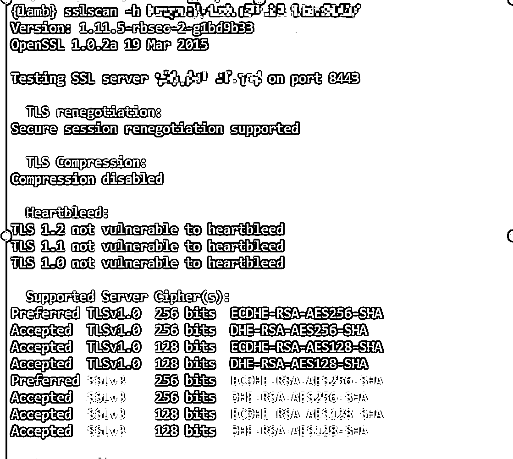

# SSL 3.0 POODLE 攻击信息泄露漏洞 _CVE-2014-3566 - foe0 - 博客园

> 原文：[`www.cnblogs.com/foe0/p/11913102.html`](https://www.cnblogs.com/foe0/p/11913102.html)

### 0x01 SSL3.0 简介

我们知道最开始 HTTP 协议传输数据的时候，数据是不加密的，不安全的，网景公司针对此，推出了 SSL(secure socket layer)安全套接层。SSL3.0 时，IETF 对其标准化，将其更名为 TLS1.0(transport layer security)，安全传输层协议。

简单介绍这么多，详细了解 SSL 可以参考以下几个链接，写的很详细。

[`blog.csdn.net/enweitech/article/details/81781405`](https://blog.csdn.net/enweitech/article/details/81781405)

### 0x02 SSL 3.0 POODLE 攻击漏洞原理

影响时间:2014 年 10 月

POODLE---英翻为贵宾犬，故此漏洞又被称为贵宾犬漏洞，Padding Oracle On Downgranded Legacy Encryption。

[`blog.csdn.net/zhaihaifei/article/details/47277975`](https://blog.csdn.net/zhaihaifei/article/details/47277975)

此漏洞可以被攻击者用来窃取采用了 SSLv3 加密通信过程中的内容。目前调查情况，该漏洞来自于 SSLv3 本身使用的算法 RC4 的缺陷，不是实现问题，该漏洞无法修复，只能将 SSLv3 当作不安全协议禁用，强制使用 TLS。

Windows 从 Windows XP 开始，在操作系统层面提供了 SSL 和 TLS 支持。使用 Windows 本身安全服务的软件可以支持 TLS，对于浏览器，运行在 Windows XP 或者更新系统上所有主流浏览器均支持 TLS 协议。

Mac OS X 系统经测试至少从 10.6（Snow Leopard）版本开始，Safari 支持 TLS 协议。

iOS 系统至少从 5.0 版本开始支持 TLS 1.2 协议，即 iPhone 4S 以及更新版本的 iPhone 均支持 TLS 协议。

Android 系统也在系统层面上支持 TLS 协议，并从第一个版本开始就支持 TLS，在开发手册中也警告了使用 SSL 协议的危险性。

从这些基本情况分析，禁用 SSLv3 对于主流系统和浏览器通过 HTTPS 访问客户网站的方式影响不大，但是如果有客户端强制通过 SSLv3 而没有实现 TLS 方式的加密传输，将可能有较大的影响，具体影响需要看客户对 HTTPS 的使用场景。

### 0x03 验证方式

这里是直接使用 kali 中的 sslscan 工具。

sslscan –tlsall url

###  0x04 和 heartbleed 的区别

爆发时间是 2014 年 4 月，比 poodle 漏洞要早出现。

心脏滴血漏洞是在实现 TLS 和 DTLS 心跳处理逻辑中，存在的编码缺陷。

OpenSSL 的心跳处理逻辑没有检测心跳包中的长度字段是否和后续的数据字段相符合。

攻击者可以利用这一点，构造异常的数据包，来获取心跳数据所在的内存区域的后续数据。

这些数据中可能包含了证书私钥，用户名，用户密码，用户邮箱等敏感信息。该漏洞允许攻击者从内存中读取多达 64KB 的数据。

OpenSSL 是一个支持 SSL 认证的开源软件库包。

**参考链接：**

[`www.jianshu.com/p/ccadb1d67c88`](https://www.jianshu.com/p/ccadb1d67c88)

 [`www.freebuf.com/news/53959.html`](https://www.freebuf.com/news/53959.html)

 [`github.com/mpgn/poodle-PoC`](https://github.com/mpgn/poodle-PoC)

[`blog.csdn.net/yaofeiNO1/article/details/54428021`](https://blog.csdn.net/yaofeiNO1/article/details/54428021)

[`blog.csdn.net/salonzhou/article/details/41748387`](https://blog.csdn.net/salonzhou/article/details/41748387)