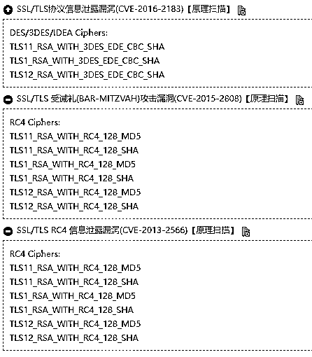
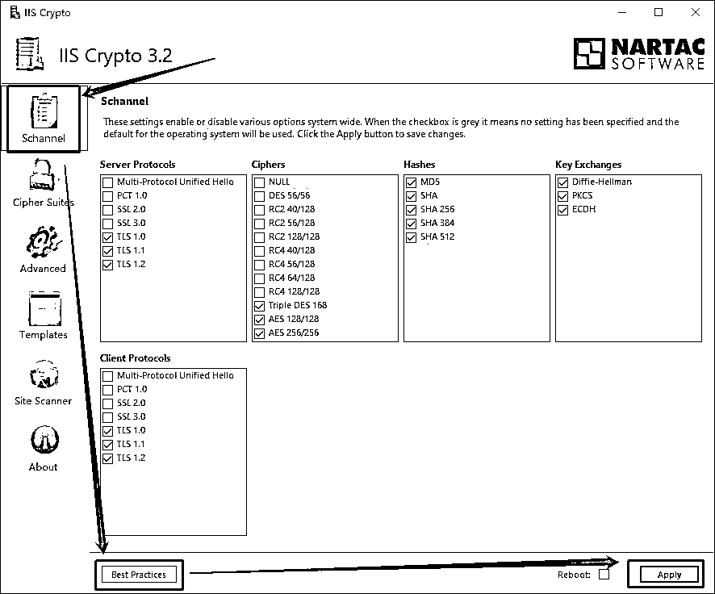
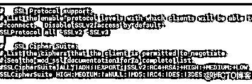

# SSL/TLS 协议信息泄露漏洞(CVE-2016-2183) 漏洞处理 - 天际使徒 - 博客园

> 原文：[`www.cnblogs.com/Horizon-asd/p/17221234.html`](https://www.cnblogs.com/Horizon-asd/p/17221234.html)


**其主要原因**就是设备使用了不安全的加密协议和加密套件，解决的方法就是把不安全的加密和协议禁用掉就可以了。
**解决办法：**
**1.1.Windows 和 WinServer** 都可以通过软件“IIS Crypto GUI”来设置加密协议和所支持的加密套件，下载地址：点击直接下载 IIS Crypto GUIhttps://www.nartac.com/Products/IISCrypto/Download
使用工具
直接点击 Best Practices 使用推荐设置，然后点击 Apply 应用，然后重启设备生效。如下图：

**1.2.Windows 和 WinServer** 还可以通过手动修改注册表的方式进行配置。
第一步：按下' Win + R'，进入"运行"，键入" gpedit.msc"，打开"本地组策略编辑器"。
第二步：打开计算机配置->管理模板->网络->SSL 配置设置。
第三步：在"SSL 密码套件顺序"选项上，右键"编辑"->在"SSL 密码套件顺序"选在"已启用（E）" 。
第四步：在"SSL 密码套件"下修改 SSL 密码套件算法，仅保留 TLS 1.2 SHA256 和 SHA384 密码套件、TLS 1.2
ECC GCM 密码套件（可先复制该选项原始数值并备份到记事本作回退备用，然后删除原有内容替换为：

```
TLS_ECDHE_ECDSA_WITH_AES_128_GCM_SHA256_P256,TLS_ECDHE_ECDSA_WITH_AES_128_GCM_SHA256_P384,TLS_ECDHE_ECDSA_WITH_AES_128_GCM_SHA256_P521,TLS_ECDHE_ECDSA,WITH_AES_256_GCM_SHA384_P384,TLS_ECDHE_ECDSA_WITH_AES_256_GCM_SHA384_P521,TLS_RSA_WITH_AES_128_CBC_SHA256,TLS_RSA_WITH_AES_256_CBC_SHA256,TLS_ECDHE_RSA_WITH_AES_128_CBC_SHA256_P256,TLS_ECDHE_RSA_WITH_AES_128_CBC_SHA256_P384,TLS_ECDHE_RSA_WITH_AES_128_CBC_SHA256_P521,TLS_ECDHE_RSA_WITH_AES_256_CBC_SHA384_P256,TLS_ECDHE_RSA_WITH_AES_256_CBC_SHA384_P384,TLS_ECDHE_RSA_WITH_AES_256_CBC_SHA384_P521,TLS_ECDHE_ECDSA_WITH_AES_128_CBC_SHA256_P256,TLS_ECDHE_ECDSA_WITH_AES_128_CBC_SHA256_P384,TLS_ECDHE_ECDSA_WITH_AES_128_CBC_SHA256_P521,TLS_ECDHE_ECDSA_WITH_AES_256_CBC_SHA384_P384,TLS_ECDHE_ECDSA_WITH_AES_256_CBC_SHA384_P521,TLS_DHE_DSS_WITH_AES_128_CBC_SHA256,TLS_DHE_DSS_WITH_AES_256_CBC_SHA256,TLS_RSA_WITH_NULL_SHA,TLS_RSA_WITH_AES_128_CBC_SHA,TLS_DHE_DSS_WITH_AES_128_CBC_SHA 
```

点击"应用"、"确定"，并重启系统实现修复。
第五步：最后重启服务器。
回退方法：在"SSL 密码套件"下修改 SSL 密码套件算法，在内容里面输入之前作为回退备用的记事本内数值，
若当时没有备份可参考输入以下内容：

```
（“TLS_RSA_WITH_AES_128_CBC_SHA256,TLS_RSA_WITH_AES_128_CBC_SHA,TLS_RSA_WITH_AES_256_CBC_SHA256,TLS_RSA_WITH_AES_256_CBC_SHA,TLS_RSA_WITH_RC4_128_SHA,TLS_RSA_WITH_3DES_EDE_CBC_SHA,TLS_ECDHE_RSA_WITH_AES_128_CBC_SHA256_P256,TLS_ECDHE_RSA_WITH_AES_128_CBC_SHA256_P384,TLS_ECDHE_RSA_WITH_AES_128_CBC_SHA_P256,TLS_ECDHE_RSA_WITH_AES_128_CBC_SHA_P384,TLS_ECDHE_RSA_WITH_AES_256_CBC_SHA_P256,TLS_ECDHE_RSA_WITH_AES_256_CBC_SHA_P384,TLS_ECDHE_ECDSA_WITH_AES_128_GCM_SHA256_P256,TLS_ECDHE_ECDSA_WITH_AES_128_CBC_SHA256_P256,TLS_ECDHE_ECDSA_WITH_AES_256_GCM_SHA384_P384,TLS_ECDHE_ECDSA_WITH_AES_256_CBC_SHA384_P384,TLS_ECDHE_ECDSA_WITH_AES_128_CBC_SHA_P256,TLS_ECDHE_ECDSA_WITH_AES_128_CBC_SHA_P384,TLS_ECDHE_ECDSA_WITH_AES_256_CBC_SHA_P256,TLS_ECDHE_ECDSA_WITH_AES_256_CBC_SHA_P384,TLS_DHE_DSS_WITH_AES_128_CBC_SHA256,TLS_DHE_DSS_WITH_AES_128_CBC_SHA,TLS_DHE_DSS_WITH_AES_256_CBC_SHA256,TLS_DHE_DSS_WITH_AES_256_CBC_SHA,TLS_DHE_DSS_WITH_3DES_EDE_CBC_SHA,TLS_RSA_WITH_RC4_128_MD5,SSL_CK_RC4_128_WITH_MD5,SSL_CK_DES_192_EDE3_CBC_WITH_MD5,TLS_RSA_WITH_NULL_SHA256,TLS_RSA_WITH_NULL_SHA”）->点击"应用"、"确定"，即可。 
```

**2.linux 系统**

```
yum install -y nmap
nmap -sV -p 443 --script ssl-enum-ciphers 172.16.128.31 #172.16.128.31 是被扫描主机 ip 
```

**（1）nginx 若有：**
编辑 nginx.conf 文件，修改 ssl_ciphers 后面的参数，如下↓

```
server {
listen 443 ssl;
server_name www.cookie.com;
ssl_certificate cert/2022_www.cookie.com.pem;
ssl_certificate_key cert/2022_www.cookie.com.key;
ssl_session_timeout 5m;
ssl_ciphers ECDHE-RSA-AES128-GCM-SHA256:ECDHE:ECDH:AES:HIGH:!NULL:!aNULL:!MD5:!ADH:!RC4;
ssl_ciphers HIGH:!ADH:!MD5;
ssl_protocols TLSv1 TLSv1.1 TLSv1.2;
ssl_prefer_server_ciphers on; 
```

**（2）apache 若有：**
编辑 apache 配置文件,添加如下配置
vim /etc/httpd/conf.d/ssl.conf

```
SSLCipherSuite HIGH:MEDIUM:!aNULL:!MD5:!RC4:!DES:!3DES 
```


重启 apache 服务器
service httpd restart

**（3）Tomcat 若有：**
1）进入 tomcat 配置文件
xx/tomcat/conf/server.xml
2）找到 ciphers ，将包含的 DES 去掉，例如：

```
ciphers="TLS_RSA_WITH_AES_128_CBC_SHA,TLS_DHE_RSA_WITH_AES_128_CBC_SHA,TLS_DHE_DSS_WITH_AES_128_CBC_SHA,TLS_ECDHE_ECDSA_WITH_AES_128_CBC_SHA256,TLS_ECDHE_RSA_WITH_AES_128_CBC_SHA256" 
```

3）重启 Tomcat
(1) 进入 Tomcat BIN 目录

```
cd /usr/local/src/tomcat-8080/bin 
```

注意：/usr/local/src/tomcat-8080/ 表示 tomcat 的安装目录
(2) 使用 Tomcat 关闭命令

```
./shutdown.sh 
```

(3) 查看 Tomcat 是否以关闭

```
ps -ef|grep java 
```

如果显示以下相似信息，说明 Tomcat 还没有关闭

(4) 如果你想直接直接杀死 Tomcat 进程（进程号： 31801），可以使用 kill 命令

```
Kill -9 31801 
```

(5) 然后继续查看 Tomcat 是否关闭

```
ps -ef|grep java 
```

(6) 最后，启动 Tomcat

```
./startup.sh 
```

参考：
[`segmentfault.com/a/1190000042222840?utm_source=sf-similar-article`](https://segmentfault.com/a/1190000042222840?utm_source=sf-similar-article)
[`blog.51cto.com/royfans/5612702`](https://blog.51cto.com/royfans/5612702)