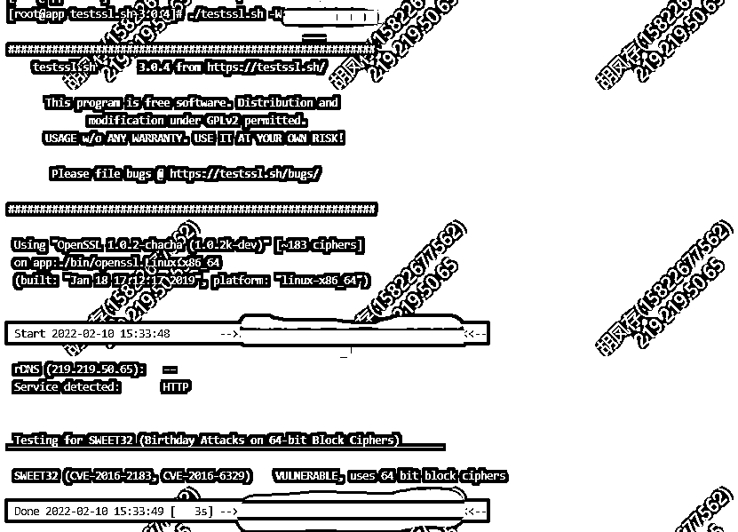
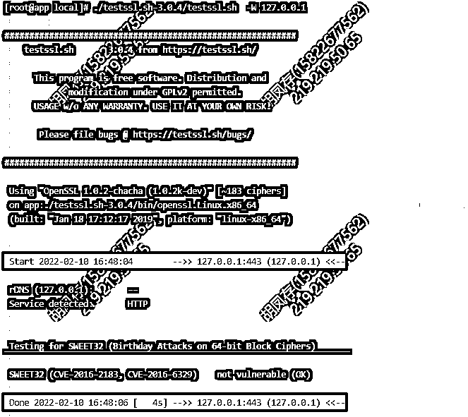
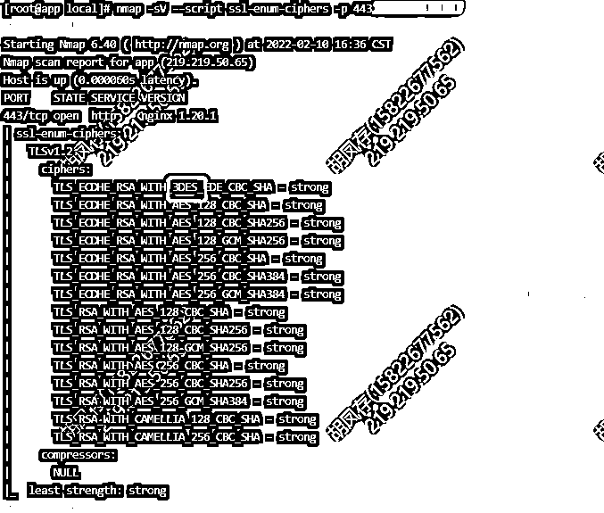
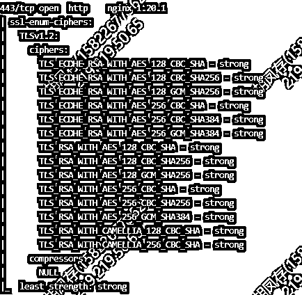

# SSL/TLS 协议信息泄露漏洞(CVE-2016-2183) 避免使用 DES 算法 漏洞排查 - 老街巷口熟睡的猫 - 博客园

> 原文：[`www.cnblogs.com/supermwb/p/15879942.html`](https://www.cnblogs.com/supermwb/p/15879942.html)

1    检测漏洞

下载检测工具

https://github.com/drwetter/testssl.sh

解压后进入目录

./testssl.sh -W  IP

如下图

 修复后

2  排查有问题的地方， ssl 、ssh、nginx、tomcat 等等软件。

2.1  检查 ssl 支持的加密算法有没有 des 算法

openssl ciphers -v

2.2 检查 nginx

对 nginx 进行加固，我这里 nginx 本身版本并没问题，是编译的时候 ssl 版本低

cd ../nginx-1.20.1/

./configure --prefix=/usr/local/nginx/ --with-http_ssl_module --with-http_stub_status_module --with-openssl=/usr/local/openssl-1.1.1l

make && make install 重启后再次检查

 这里记一个坑，nginx 改了好几次都能测到这个漏洞。 后来在后面加了!3DES 好了。服了。

 检查 ssh

对 ssh 进行加固

vim /etc/ssh/sshd_config   在末尾添加

 vim /etc/ssh/ssh_config   找到下面这行，一般是注释着呢， 取消注释并删除  des 算法。

 重启 ssh（重启前记得先通过 telnet 建立连接哦）

 Ciphers aes128-ctr,aes192-ctr,aes256-ctr,aes128-cbc

想用 nmap  检测？ 

yum install nmap

nmap -sV --script ssl-enum-ciphers -p   ip 或域名

这里记一下域名与 ip 的坑，有一次遇到检测 ip 没问题，检测域名就有问题，最后想起来有一次去客户那里开会，客户在外面又加了一层其他厂商的软件，来防止数据被爬走，所以联系了那个厂商修复此漏洞后再次扫描才没问题。

 修复后

