# SSL/TLS 协议信息泄露漏洞(CVE-2016-2183)修复方法 - .NetCat - 博客园

> 原文：[`www.cnblogs.com/netCat/p/16454973.html`](https://www.cnblogs.com/netCat/p/16454973.html)

| 详细描述 | TLS 是安全传输层协议，用于在两个通信应用程序之间提供保密性和数据完整性。 
TLS, SSH, IPSec 协商及其他产品中使用的 IDEA、DES 及 Triple DES 密码或者 3DES 及 Triple 3DES 存在大约四十亿块的生日界，这可使远程攻击者通过 Sweet32 攻击，获取纯文本数据。

<*来源：Karthik Bhargavan
Gaetan Leurent

链接：https://www.openssl.org/news/secadv/20160922.txt
*> |
| 解决办法 | 建议：避免使用 IDEA、DES 和 3DES 算法 
1、OpenSSL Security Advisory [22 Sep 2016]
链接：https://www.openssl.org/news/secadv/20160922.txt
请在下列网页下载最新版本：
https://www.openssl.org/source/
2、对于 nginx、apache、lighttpd 等服务器禁止使用 DES 加密算法
主要是修改 conf 文件
3、Windows 系统可以参考如下链接：
https://social.technet.microsoft.com/Forums/en-US/31b3ba6f-d0e6-417a-b6f1-d0103f054f8d/ssl-medium-strength-cipher-suites-supported-sweet32cve20162183?forum=ws2016

https://docs.microsoft.com/zh-cn/troubleshoot/windows-server/windows-security/restrict-cryptographic-algorithms-protocols-schannel |

## 前言：

关于[SSL](https://so.csdn.net/so/search?q=SSL&spm=1001.2101.3001.7020)/TLS 协议信息泄露漏洞(CVE-2016-2183)的处理方法，网上教程一大堆。
我以 windows 操作系统 为例，浅谈一下我对这个漏洞修复的理解。

## 一、win7 操作系统

1、打开控制面板 打开网络和 Internet

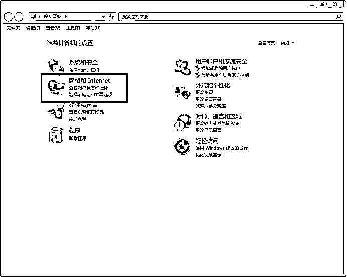

2、打开 Internet 选项

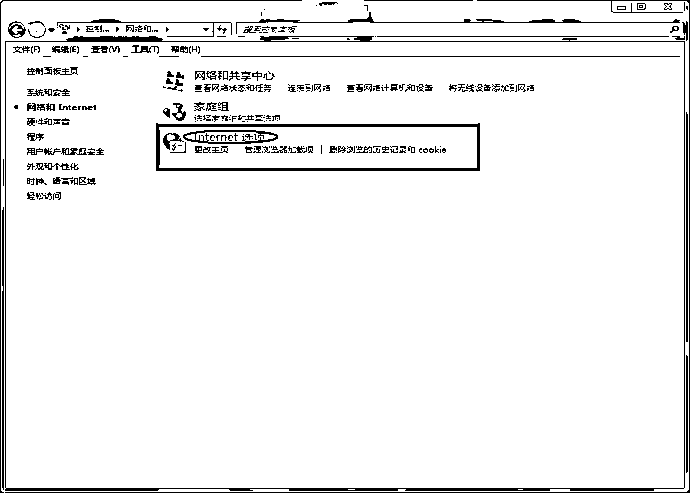

3、选择高级

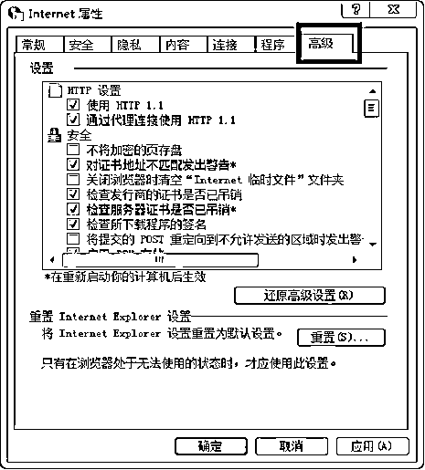

4、下滑选项 找到 TLS 只勾选 使用 TLS 1.2

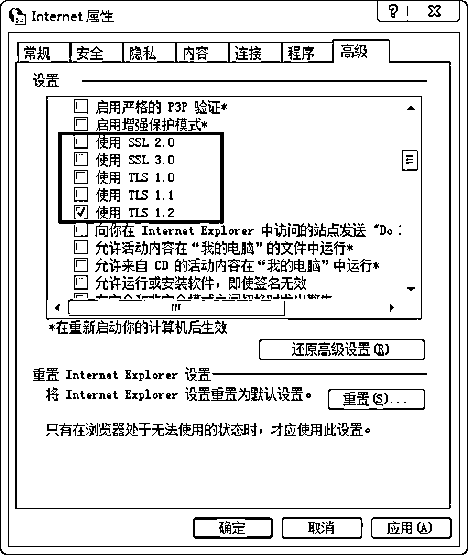

5、win+R 输入 gpedit.msc 打开组策略编辑器

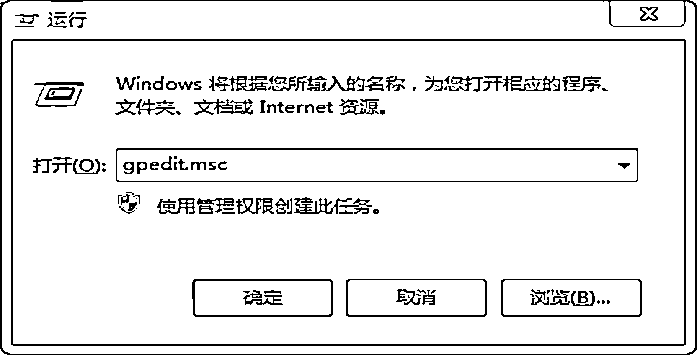

6、依次选择 计算机配置 管理模板 网络 SSL 配置设置 并双击打开

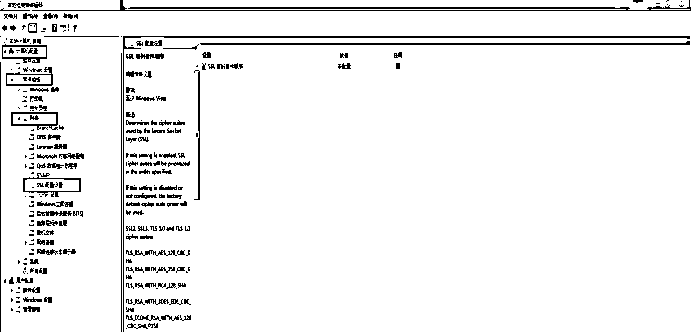

7、点击已启用

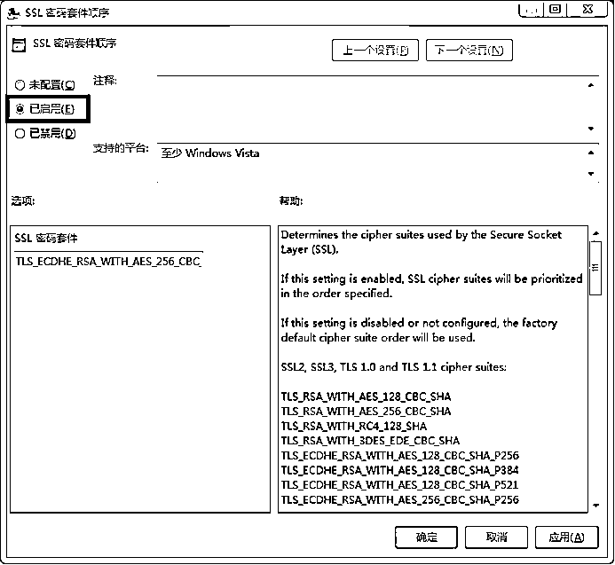

8、将原有字符删除后 将 下列字符替换到 SSL 密码套件的输入框中

```
TLS_ECDHE_ECDSA_WITH_AES_128_GCM_SHA256_P256,TLS_ECDHE_ECDSA_WITH_AES_128_GCM_SHA256_P384,TLS_ECDHE_ECDSA_WITH_AES_128_GCM_SHA256_P521,TLS_ECDHE_ECDSA,WITH_AES_256_GCM_SHA384_P384,TLS_ECDHE_ECDSA_WITH_AES_256_GCM_SHA384_P521,TLS_RSA_WITH_AES_128_CBC_SHA256,TLS_RSA_WITH_AES_256_CBC_SHA256,TLS_ECDHE_RSA_WITH_AES_128_CBC_SHA256_P256,TLS_ECDHE_RSA_WITH_AES_128_CBC_SHA256_P384,TLS_ECDHE_RSA_WITH_AES_128_CBC_SHA256_P521,TLS_ECDHE_RSA_WITH_AES_256_CBC_SHA384_P256,TLS_ECDHE_RSA_WITH_AES_256_CBC_SHA384_P384,TLS_ECDHE_RSA_WITH_AES_256_CBC_SHA384_P521,TLS_ECDHE_ECDSA_WITH_AES_128_CBC_SHA256_P256,TLS_ECDHE_ECDSA_WITH_AES_128_CBC_SHA256_P384,TLS_ECDHE_ECDSA_WITH_AES_128_CBC_SHA256_P521,TLS_ECDHE_ECDSA_WITH_AES_256_CBC_SHA384_P384,TLS_ECDHE_ECDSA_WITH_AES_256_CBC_SHA384_P521,TLS_DHE_DSS_WITH_AES_128_CBC_SHA256,TLS_DHE_DSS_WITH_AES_256_CBC_SHA256,TLS_RSA_WITH_NULL_SHA,TLS_RSA_WITH_AES_128_CBC_SHA,TLS_DHE_DSS_WITH_AES_128_CBC_SHA
```

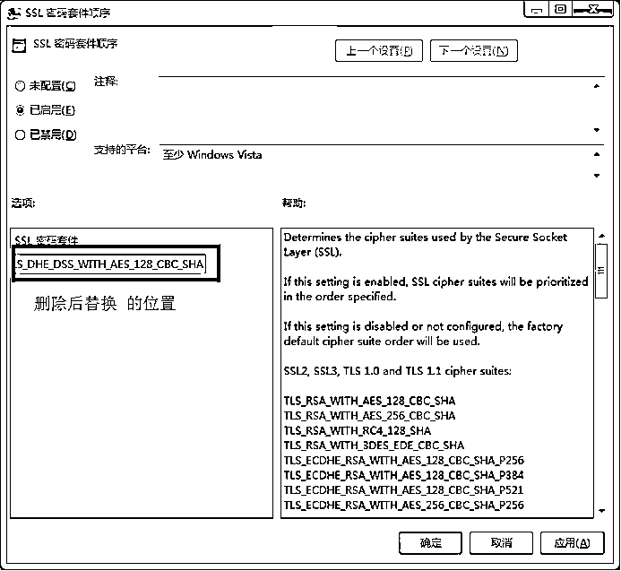

 9、替换后点击 应用 确定


 10、重启计算机 修复成功

二、win10 操作系统
1、打开控制面板，找到 internet 选项。

2、选择 internet 属性，找到高级。取消勾选 TLS 1.0、1.1、1.3
保留 TLS1.2。 修改完成后，先应用，后确认。

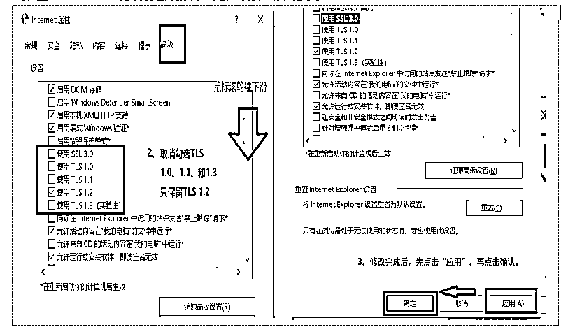

3、接着按住键盘上的 win + r 键，输入 gpedit.msc 。

4、如下图，找到 SSL 密码套件顺序，选择已启用。

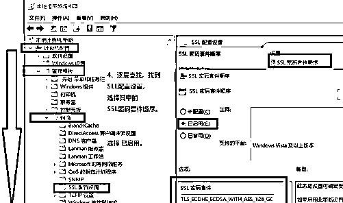

6、替换 SSL 密码套件中的代码，代码在下面：

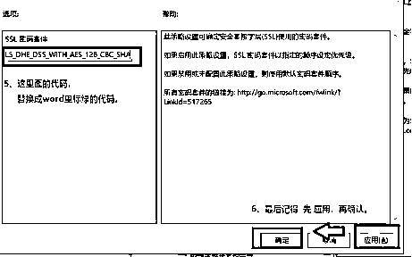

此处是替换代码：

```
TLS_ECDHE_ECDSA_WITH_AES_128_GCM_SHA256_P256,TLS_ECDHE_ECDSA_WITH_AES_128_GCM_SHA256_P384,TLS_ECDHE_ECDSA_WITH_AES_128_GCM_SHA256_P521,TLS_ECDHE_ECDSA,WITH_AES_256_GCM_SHA384_P384,TLS_ECDHE_ECDSA_WITH_AES_256_GCM_SHA384_P521,TLS_RSA_WITH_AES_128_CBC_SHA256,TLS_RSA_WITH_AES_256_CBC_SHA256,TLS_ECDHE_RSA_WITH_AES_128_CBC_SHA256_P256,TLS_ECDHE_RSA_WITH_AES_128_CBC_SHA256_P384,TLS_ECDHE_RSA_WITH_AES_128_CBC_SHA256_P521,TLS_ECDHE_RSA_WITH_AES_256_CBC_SHA384_P256,TLS_ECDHE_RSA_WITH_AES_256_CBC_SHA384_P384,TLS_ECDHE_RSA_WITH_AES_256_CBC_SHA384_P521,TLS_ECDHE_ECDSA_WITH_AES_128_CBC_SHA256_P256,TLS_ECDHE_ECDSA_WITH_AES_128_CBC_SHA256_P384,TLS_ECDHE_ECDSA_WITH_AES_128_CBC_SHA256_P521,TLS_ECDHE_ECDSA_WITH_AES_256_CBC_SHA384_P384,TLS_ECDHE_ECDSA_WITH_AES_256_CBC_SHA384_P521,TLS_DHE_DSS_WITH_AES_128_CBC_SHA256,TLS_DHE_DSS_WITH_AES_256_CBC_SHA256,TLS_RSA_WITH_NULL_SHA,TLS_RSA_WITH_AES_128_CBC_SHA,TLS_DHE_DSS_WITH_AES_128_CBC_SHA
```

7、重启电脑，完成漏洞修复

————————————————
版权声明：本文为 CSDN 博主「晓梦林」的原创文章，遵循 CC 4.0 BY-SA 版权协议，转载请附上原文出处链接及本声明。
原文链接：https://blog.csdn.net/qq_25953411/article/details/123923731