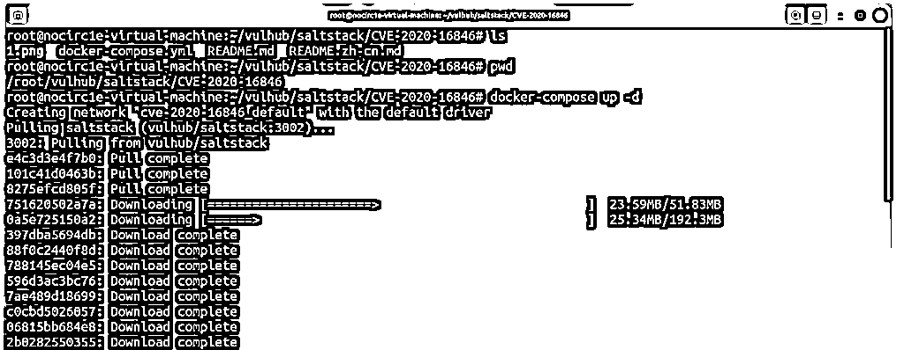
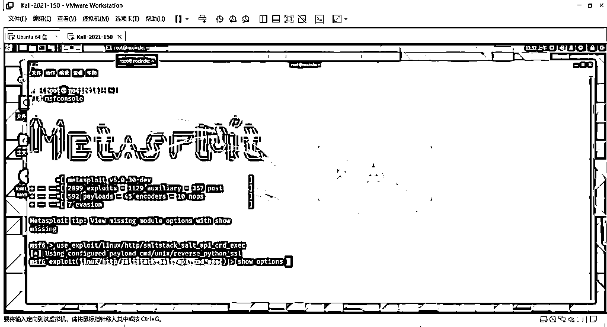

# SaltStack 命令注入漏洞（CVE-2020-16846） - NoCirc1e - 博客园

> 原文：[`www.cnblogs.com/NoCirc1e/p/16283220.html`](https://www.cnblogs.com/NoCirc1e/p/16283220.html)

SaltStack 是基于 Python 开发的一套 C/S 架构配置管理工具。2020 年 11 月 SaltStack 官方披露了 CVE-2020-16846 和 CVE-2020-25592 两个漏洞，其中 CVE-2020-25592 允许任意用户调用 SSH 模块，CVE-2020-16846 允许用户执行任意命令。组合这两个漏洞，将可以使未授权的攻击者通过 Salt API 执行任意命令。

参考链接：

*   [`mp.weixin.qq.com/s/R8qw_lWizGyeJS0jOcYXag`](https://mp.weixin.qq.com/s/R8qw_lWizGyeJS0jOcYXag)

## 漏洞环境

执行如下命令启动一个 SaltStack Master 服务：

```
docker-compose up -d
```



环境启动后，将会在本地监听如下端口：

*   4505/4506 这是 SaltStack Master 与 minions 通信的端口
*   8000 这是 Salt 的 API 端口，**需要通过 https 访问**
*   2222 这是容器内部的 SSH 服务器监听的端口

## 漏洞复现

使用 msf 中的 exp 进行漏洞利用，启动 msf，选择攻击模块，配置信息，使用 run 或 exploit 执行，执行后拿到 shell

```
msfconsole
use exploit/linux/http/saltstack_salt_api_cmd_exec
show options
```

