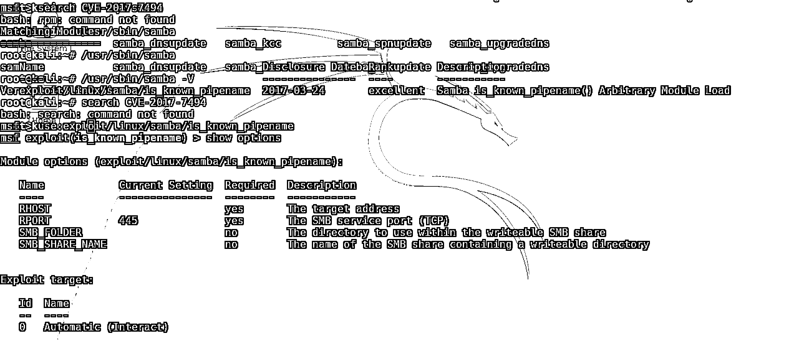
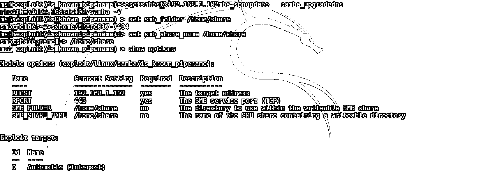
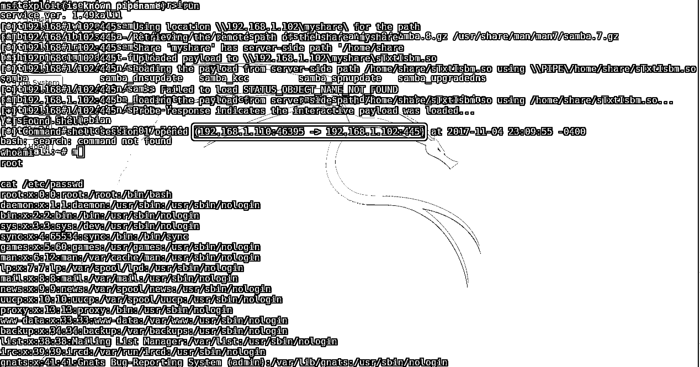
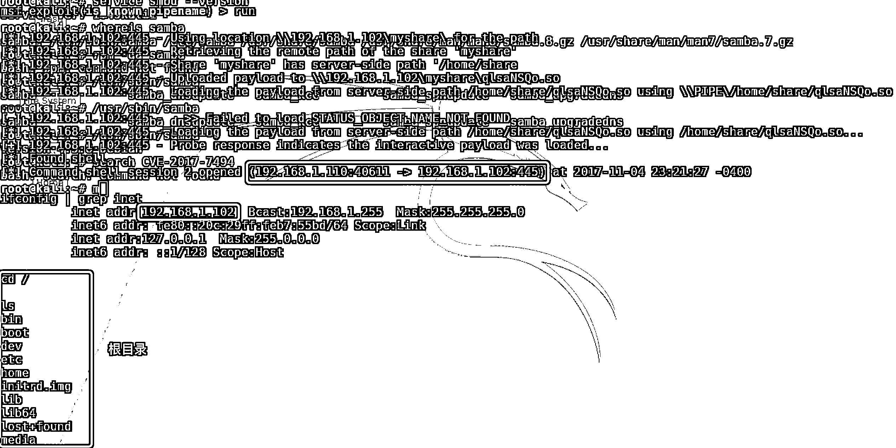

# Samba 远程代码执行漏洞(CVE-2017-7494)复现 - starnight_cyber - 博客园

> 原文：[`www.cnblogs.com/Hi-blog/p/7782356.html`](https://www.cnblogs.com/Hi-blog/p/7782356.html)

* * *

　　简要记录一下 Samba 远程代码执行漏洞(CVE-2017-7494)环境搭建和利用的过程，献给那些想自己动手搭建环境的朋友。(虽然已过多时)

　　快捷通道：[Docker ~ Samba 远程代码执行漏洞(CVE-2017-7494)](https://github.com/starnightcyber/VulApps/tree/master/s/samba/1)

　　演      示：[服务器版“永恒之蓝”高危预警 （Samba 远程命令执行漏洞 CVE-2017-7494） 攻击演示](http://www.cnblogs.com/backlion/p/6905127.html)

* * *

## 漏洞描述

### 影响版本

　　Samba 3.5.0 到 4.6.4/4.5.10/4.4.14 的中间版本。

　　这句话应该这么来理解，该漏洞影响 Samba 3.5.0 之后的所有版本，在 4.6.4/4.5.10/4.4.14 修复了这个漏洞。

### 利用条件

*   服务器打开了文件/打印机共享端口 445
*   共享文件拥有访问以及写入权限
*   攻击者知道共享的目录路径

## 环境搭建

### 简要介绍

　　靶机环境：[ubuntu-14.04.1-server-amd64 ](http://old-releases.ubuntu.com/releases/14.04.1/)   （安装系统时记的勾选 samba 哦）

　　攻击机:kali2.0

　　关于虚拟机的创建就不过多介绍了，可以参考其他资料，查看下 samba 的版本：

```
/usr/sbin/samba -V
```

 

　　该版本是属于上述范围，存在远程代码执行漏洞。 

### 配置

　　首先，我们创建一个共享目录，并且赋予写权限，为了简便直接赋予全部权限：

```
mkdir /home/share chmod 777 /home/share
```

　　然后修改配置文件/etc/samba/smb.conf， 可在配置文件最后添加如下内容：

```
[myshare]
comment=smb share test
browseable=yes #可读
writeable=yes #可写
path=/home/share  #设置目录（上一步创建的共享目录）
public = yes #允许匿名登录
```


　　ubuntu 下可以用如下命令来运行和停止服务：

```
/etc/init.d/smbd start  #开启 /etc/init.d/smbd stop   #关闭 /etc/init.d/smbd restart #重启
或：
service smbd start
service smbd stop
service smbd restart
```

## 测试演示

### 匿名

　　在 kali2.0 中运行 metasploit，可以直接搜索该漏洞编号或脚本名称，就能找到相应的漏洞利用脚本的路径，如下：

```
search CVE-2017-7494 search is_known_pipename
```



　　靶机：192.168.1.102， 我们设置如下：






### 非匿名 

　　在需要用户名密码的情况下，我们需要修改一下配置文件：

```
[myshare]
comment=smb share test
browseable=yes #可读
writeable=yes #可写
path=/home/share  #设置目录（上一步创建的共享目录）
public = no #不允许匿名登录
```

　　在 [global] 设置选项中添加配置：

```
security = user
```


　　我们需要添加一下用户以备登陆之需：  

```
useradd user
smbpasswd -a user
service smbd restart
```


　　我们需要在 kali 上设置 samba 用户名和密码，其他的跟上面的一样。




## 修复

　　简单来说就是升级版本，升级到如上所说的 4.6.4/4.5.10/4.4.14。

## References

　　[CVE-2017-7494 ](https://www.samba.org/samba/security/CVE-2017-7494.html)

　　[Samba 远程代码执行漏洞(CVE-2017-7494)](https://github.com/starnightcyber/VulApps/tree/master/s/samba/1)

　　[Samba 远程代码执行漏洞(CVE-2017-7494)](https://thief.one/2017/05/25/2/)