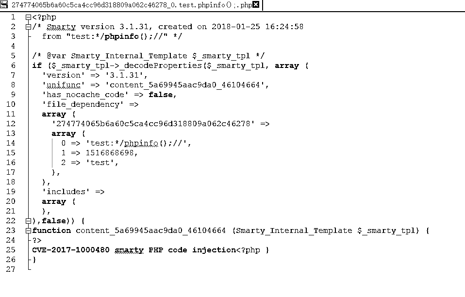
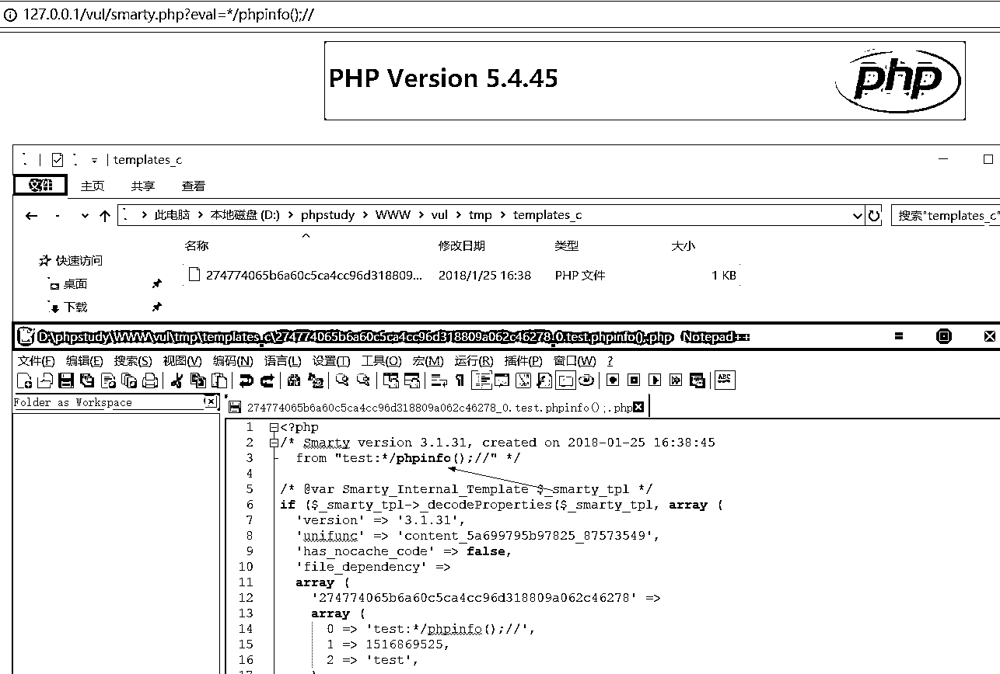

# Smarty <= 3.1.32 Remote Code execution(CVE-2017-1000480) - magic_zero - 博客园

> 原文：[`www.cnblogs.com/magic-zero/p/8351974.html`](https://www.cnblogs.com/magic-zero/p/8351974.html)

**Smarty 介绍**

smarty 是一个 php 模板引擎，其项目地址：[`github.com/smarty-php/smarty`](https://github.com/smarty-php/smarty%E3%80%82)

**测试环境搭建**

下载：https://github.com/smarty-php/smarty/releases (本案例测试为 smarty-3.1.31)

   解压以后放在 web 任意路径中，然后创建一个文件进行漏洞测试。测试文件内容为：

```
<?php define('SMARTY_ROOT_DIR', str_replace('\\', '/', __DIR__)); define('SMARTY_COMPILE_DIR', SMARTY_ROOT_DIR.'/tmp/templates_c'); define('SMARTY_CACHE_DIR', SMARTY_ROOT_DIR.'/tmp/cache'); include_once(SMARTY_ROOT_DIR . '/smarty-3.1.31/libs/Smarty.class.php'); class testSmarty extends Smarty_Resource_Custom
{ protected function fetch($name, &$source, &$mtime)
    { $template = "CVE-2017-1000480 smarty PHP code injection"; $source = $template; $mtime = time();
    }
} $smarty = new Smarty(); $smarty->setCacheDir(SMARTY_CACHE_DIR); $smarty->setCompileDir(SMARTY_COMPILE_DIR); $smarty->registerResource('test', new testSmarty); $smarty->display('test:'.$_GET['eval']); ?>
```

漏洞的触发函数是这里的 display, 也就是渲染页面以后输出结果的这个函数。

**漏洞原理分析**

我们来跟进 smarty 对象的成员方法 display, 位置为 smarty-3.1.31\libs\sysplugins\smarty_internal_templatebase.php

```
public function display($template = null, $cache_id = null, $compile_id = null, $parent = null)
    { // display template
        $this->_execute($template, $cache_id, $compile_id, $parent, 1);
    }
```

我们传给 display 的参数就是这里的局部变量$template, 然后这里直接调用了 _execute()，跟进

```
private function _execute($template, $cache_id, $compile_id, $parent, $function)
    { $smarty = $this->_getSmartyObj(); $saveVars = true; if ($template === null) { if (!$this->_isTplObj()) { throw new SmartyException($function . '():Missing \'$template\' parameter');
            } else { $template = $this;
            }
        } elseif (is_object($template)) { /* @var Smarty_Internal_Template $template */
            if (!isset($template->_objType) || !$template->_isTplObj()) { throw new SmartyException($function . '():Template object expected');
            }
        } else { // get template object
            $saveVars = false;
            // 这里调用函数创建了一个模板 $template = $smarty->createTemplate($template, $cache_id, $compile_id, $parent ? $parent : $this, false); if ($this->_objType == 1) { // set caching in template object
                $template->caching = $this->caching;
            }
        } // fetch template content
        $level = ob_get_level(); try { $_smarty_old_error_level =
                isset($smarty->error_reporting) ? error_reporting($smarty->error_reporting) : null; if ($this->_objType == 2) { /* @var Smarty_Internal_Template $this */
                $template->tplFunctions = $this->tplFunctions; $template->inheritance = $this->inheritance;
            } /* @var Smarty_Internal_Template $parent */
            if (isset($parent->_objType) && ($parent->_objType == 2) && !empty($parent->tplFunctions)) { $template->tplFunctions = array_merge($parent->tplFunctions, $template->tplFunctions);
            } if ($function == 2) { if ($template->caching) { // return cache status of template
                    if (!isset($template->cached)) { $template->loadCached();
                    } $result = $template->cached->isCached($template);
                    Smarty_Internal_Template::$isCacheTplObj[ $template->_getTemplateId() ] = $template;
                } else { return false;
                }
            } else { if ($saveVars) { $savedTplVars = $template->tpl_vars; $savedConfigVars = $template->config_vars;
                } ob_start(); $template->_mergeVars(); if (!empty(Smarty::$global_tpl_vars)) { $template->tpl_vars = array_merge(Smarty::$global_tpl_vars, $template->tpl_vars);
                } $result = $template->render(false, $function); // 省略无关代码...
```

我们需要关心的是，我们的可控变量是如何被带入执行的：

在代码中我们可以看到调用 createTemplate()创建了模板。有兴趣可以跟进去看看。我在这里直接输出得到$template 被覆盖之后的值，是一个 Smarty_Internal_Template 对象。我就不贴出来了，太长了。

然后我们继续跟进这个 render 的渲染处理函数， 位置  smarty-3.1.31\libs\sysplugins\smarty_internal_template.php

```
public function render($no_output_filter = true, $display = null)
    { if ($this->smarty->debugging) { if (!isset($this->smarty->_debug)) { $this->smarty->_debug = new Smarty_Internal_Debug();
            } $this->smarty->_debug->start_template($this, $display);
        } // checks if template exists
        if (!$this->source->exists) { throw new SmartyException("Unable to load template '{$this->source->type}:{$this->source->name}'" . ($this->_isSubTpl() ? " in '{$this->parent->template_resource}'" : ''));
        } // disable caching for evaluated code
        if ($this->source->handler->recompiled) { $this->caching = false;
        } // read from cache or render
        $isCacheTpl =
            $this->caching == Smarty::CACHING_LIFETIME_CURRENT || $this->caching == Smarty::CACHING_LIFETIME_SAVED; if ($isCacheTpl) { if (!isset($this->cached) || $this->cached->cache_id !== $this->cache_id ||
                $this->cached->compile_id !== $this->compile_id
            ) { $this->loadCached(true);
            } $this->cached->render($this, $no_output_filter);
        } else { if (!isset($this->compiled) || $this->compiled->compile_id !== $this->compile_id) { $this->loadCompiled(true);
            } $this->compiled->render($this);
        } // 省略无关代码...
```

这里因为我们之前没有进行过模板缓存文件的生成，$isCacheTpl 的值为 false，我们然后我们继续跟进 render(), 位置  smarty-3.1.31\libs\sysplugins\smarty_template_compiled.php

```
    public function render(Smarty_Internal_Template $_template)
    { // checks if template exists
        if (!$_template->source->exists) { $type = $_template->source->isConfig ? 'config' : 'template'; throw new SmartyException("Unable to load {$type} '{$_template->source->type}:{$_template->source->name}'");
        } if ($_template->smarty->debugging) { if (!isset($_template->smarty->_debug)) { $_template->smarty->_debug = new Smarty_Internal_Debug();
            } $_template->smarty->_debug->start_render($_template);
        } if (!$this->processed) { $this->process($_template);
        } if (isset($_template->cached)) { $_template->cached->file_dependency =
                array_merge($_template->cached->file_dependency, $this->file_dependency);
        } if ($_template->source->handler->uncompiled) { $_template->source->handler->renderUncompiled($_template->source, $_template);
        } else { $this->getRenderedTemplateCode($_template);
        } if ($_template->caching && $this->has_nocache_code) { $_template->cached->hashes[ $this->nocache_hash ] = true;
        } if ($_template->smarty->debugging) { $_template->smarty->_debug->end_render($_template);
        }
    }
```

然后可以看到 $this->process($_template)调用了 process()函数, 跟进。

```
public function process(Smarty_Internal_Template $_smarty_tpl)
    { $source = &$_smarty_tpl->source; $smarty = &$_smarty_tpl->smarty; if ($source->handler->recompiled) { $source->handler->process($_smarty_tpl);
        } elseif (!$source->handler->uncompiled) { if (!$this->exists || $smarty->force_compile || ($smarty->compile_check && $source->getTimeStamp() > $this->getTimeStamp())
            ) { $this->compileTemplateSource($_smarty_tpl); $compileCheck = $smarty->compile_check; $smarty->compile_check = false; $this->loadCompiledTemplate($_smarty_tpl); $smarty->compile_check = $compileCheck;
            } else { $_smarty_tpl->mustCompile = true;
                @include($this->filepath); if ($_smarty_tpl->mustCompile) { $this->compileTemplateSource($_smarty_tpl); $compileCheck = $smarty->compile_check; $smarty->compile_check = false; $this->loadCompiledTemplate($_smarty_tpl); $smarty->compile_check = $compileCheck;
                }
            } $_smarty_tpl->_subTemplateRegister(); $this->processed = true;
        }
    }
```

然后进入了这个流程， $this->compileTemplateSource($_smarty_tpl) 继续跟进。 

```
    public function compileTemplateSource(Smarty_Internal_Template $_template)
    { $this->file_dependency = array(); $this->includes = array(); $this->nocache_hash = null; $this->unifunc = null; // compile locking
        $saved_timestamp = $_template->source->handler->recompiled ? false : $this->getTimeStamp(); if ($saved_timestamp) { touch($this->filepath);
        } // compile locking
        try { // call compiler
            $_template->loadCompiler(); $this->write($_template, $_template->compiler->compileTemplate($_template));
        } catch (Exception $e) { // restore old timestamp in case of error
            if ($saved_timestamp) { touch($this->filepath, $saved_timestamp);
            } unset($_template->compiler); throw $e;
        } // release compiler object to free memory
        unset($_template->compiler);
    }
```

然后进入到 $this->write($_template, $_template->compiler->compileTemplate($_template)) 我们来看一下 write()是怎么实现的：

```
    public function write(Smarty_Internal_Template $_template, $code)
    { if (!$_template->source->handler->recompiled) { if ($_template->smarty->ext->_writeFile->writeFile($this->filepath, $code, $_template->smarty) === true) { $this->timestamp = $this->exists = is_file($this->filepath); if ($this->exists) { $this->timestamp = filemtime($this->filepath); return true;
                }
            } return false;
        } return true;
    }
```

我们来关注一下这里，$_template->smarty->ext->_writeFile->writeFile($this->filepath, $code, $_template->smarty) === true 这里调用了 writeFile 函数，然后我们跟进， 位置在 smarty-3.1.31\libs\sysplugins\smarty_internal_runtime_writefile.php

```
    public function writeFile($_filepath, $_contents, Smarty $smarty)
    { $_error_reporting = error_reporting(); error_reporting($_error_reporting & ~E_NOTICE & ~E_WARNING); $_file_perms = property_exists($smarty, '_file_perms') ? $smarty->_file_perms : 0644; $_dir_perms = property_exists($smarty, '_dir_perms') ? (isset($smarty->_dir_perms) ? $smarty->_dir_perms : 0777) : 0771; if ($_file_perms !== null) { $old_umask = umask(0);
        } $_dirpath = dirname($_filepath); // if subdirs, create dir structure
        if ($_dirpath !== '.' && !file_exists($_dirpath)) { mkdir($_dirpath, $_dir_perms, true);
        } // write to tmp file, then move to overt file lock race condition
        $_tmp_file = $_dirpath . $smarty->ds . str_replace(array('.', ','), '_', uniqid('wrt', true)); // var_dump($_tmp_file);
        // var_dump($_contents);
        // exit();
        if (!file_put_contents($_tmp_file, $_contents)) { error_reporting($_error_reporting); throw new SmartyException("unable to write file {$_tmp_file}");
        }
```

这里执行了 file_put_contents($_tmp_file, $_contents), 生成文件。此时我们将要执行的代码已经写入了， 写入的路径由我们最初定义的 SMARTY_COMPILE_DIR 常量来进行决定，这里我们看到值为测试文件同一个目录下的/tmp/templates_c。写入的内容如下所示：

到此，其实我们已经实现了代码执行，我们只需要访问这个文件就好了，但是文件的名字太长了，实在难受。就算你经过计算然后去爆破，如果更改这里缓存文件的位置不在 web 目录。还怎么办？我们看到在 process 函数中，在对文件模板文件编译结束之后调用了这个：$this->loadCompiledTemplate($_smarty_tpl)。我们来跟进：

```
private function loadCompiledTemplate(Smarty_Internal_Template $_smarty_tpl)
    { // var_dump($this->filepath);exit();
        if (function_exists('opcache_invalidate') && strlen(ini_get("opcache.restrict_api")) < 1) {
            opcache_invalidate($this->filepath, true);
        } elseif (function_exists('apc_compile_file')) {
            apc_compile_file($this->filepath);
        } // 最终在这里代码执行
        if (defined('HHVM_VERSION')) { eval("?>" . file_get_contents($this->filepath));
        } else { include($this->filepath);
        }
    }
```

在这里无论是否定义 HHVM_VERSION 这个常量，写入缓存文件中的代码都会被执行，eval("?>" . file_get_contents($this->filepath))相当于一个远程文件包含，而这里调用了 include，然后我么之前写入缓存的代码就被包含执行了。



利用的代码不言而喻了。