# Spring Cloud Function SpEL 表达式命令注入（CVE-2022-22963）漏洞复现及分析 - twosmi1e - 博客园

> 原文：[`www.cnblogs.com/twosmi1e/p/16138406.html`](https://www.cnblogs.com/twosmi1e/p/16138406.html)

## 漏洞概述

SpringCloud 是一套分布式系统的解决方案，常见的还有阿里巴巴的 Dubbo，Fass（Function As A Service ）的底层实现就是函数式编程，在视频转码、音视频转换、数据仓库 ETL 等与状态相关度低的领域运用的比较多。开发者无需关注服务器环境运维等问题上，专注于自身业务逻辑实现即可。

SpringCloud Function 就是 Spring 提供的分布式函数式编程组件。

## 漏洞复现

使用了 github 上已有的环境 https://github.com/cckuailong/spring-cloud-function-SpEL-RCE
clone 到本地后需要修改版本到 java17
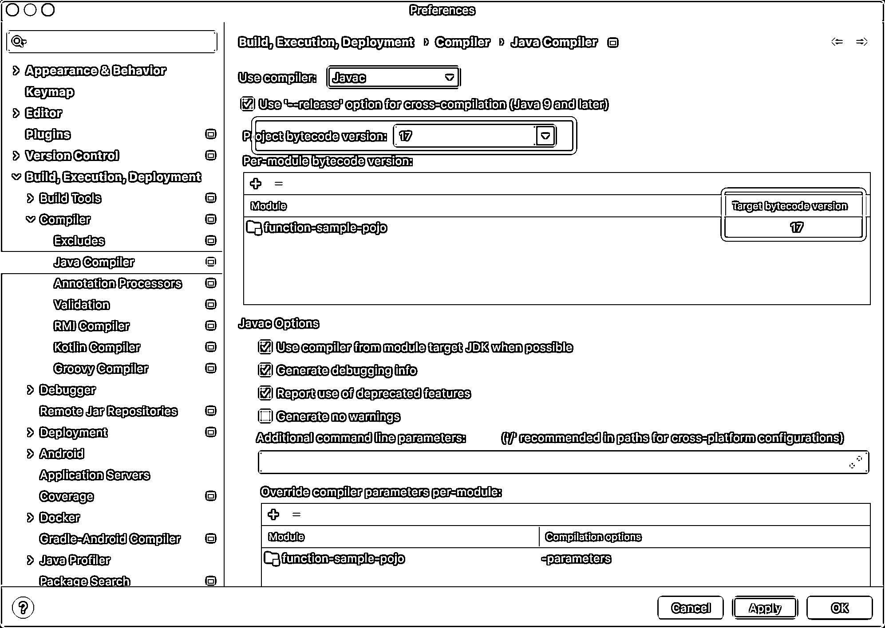

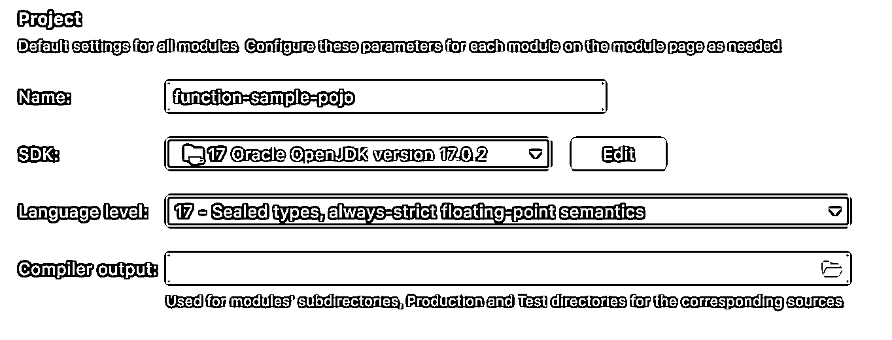

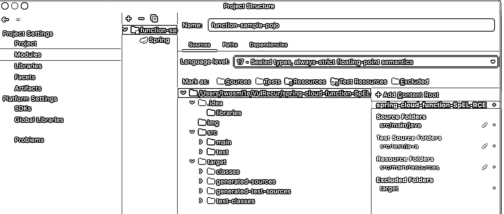
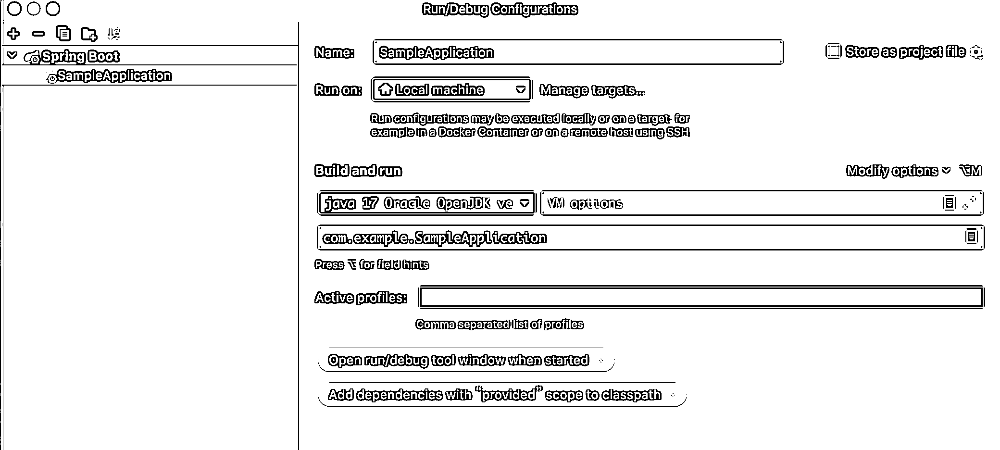

修改后 build 项目，访问 8080 端口
spring.cloud.function.routing-expression 头中包含的 SpEL 表达式将会被执行
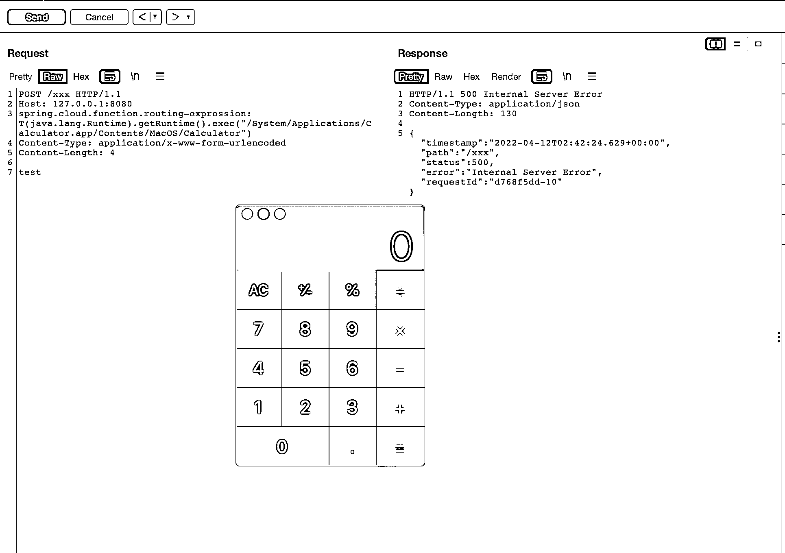

## 漏洞分析

通过 diff 可以发现开发者使用了 SimpleEvaluationContext 进行 SPEL 解析，而在此前版本中使用 StandardEvaluationContext。
[`github.com/spring-cloud/spring-cloud-function/commit/0e89ee27b2e76138c16bcba6f4bca906c4f3744f`](https://github.com/spring-cloud/spring-cloud-function/commit/0e89ee27b2e76138c16bcba6f4bca906c4f3744f)
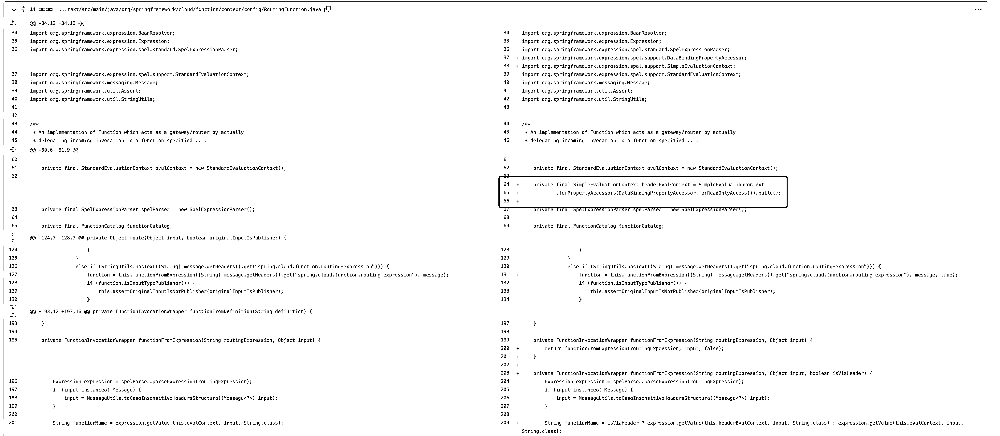

### SpEL 表达式

[`itmyhome.com/spring/expressions.html`](http://itmyhome.com/spring/expressions.html)
Spring 表达式语言（简称 SpEl）是一个支持查询和操作运行时对象导航图功能的强大的表达式语言. 它的语法类似于传统 EL，但提供额外的功能，最出色的就是函数调用和简单字符串的模板函数。

SpEL 可以字符串之间进行嵌套也可以单独使用，嵌套时使用`#{}`(实现 ParserContext 接口)。

### functionRouter

如果设置为 functionRouter 则默认路由绑定的具体函数交由用户进行控制，在 Spring Cloud Function Web 里面，可以通过设置 http 头的方式来控制，使用`spring.cloud.function.definition` 和`spring.cloud.function.routing-expression` 都可以，区别是后者允许使用 Spring 表达式语言（SpEL）。

比如我用`spring.cloud.function.definition`或者用路由去访问响应具体函数效果是一样的


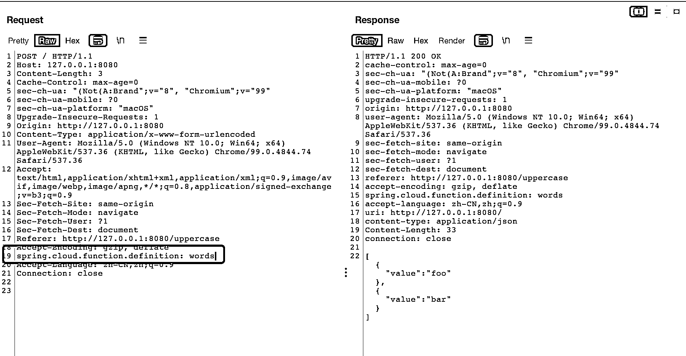

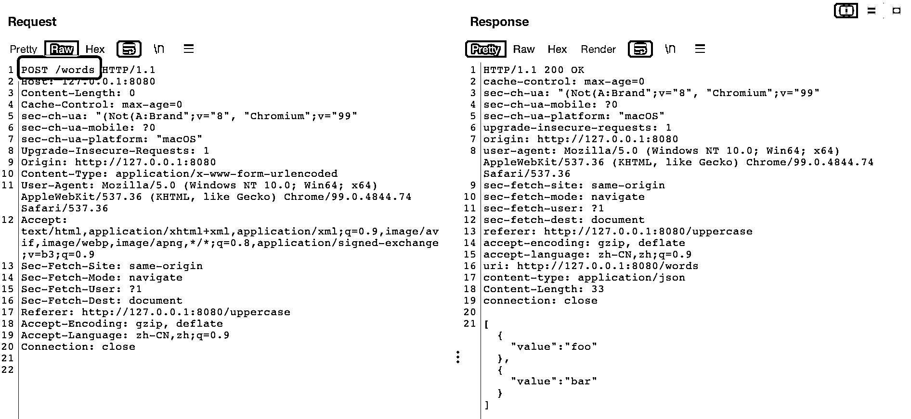

### 流程分析

SpringCloud Function 之所以能自动将函数建立 http 端点，是因为在包 mvc.FunctionController 中使用/** 监听了 get/post 类型的所有端点。
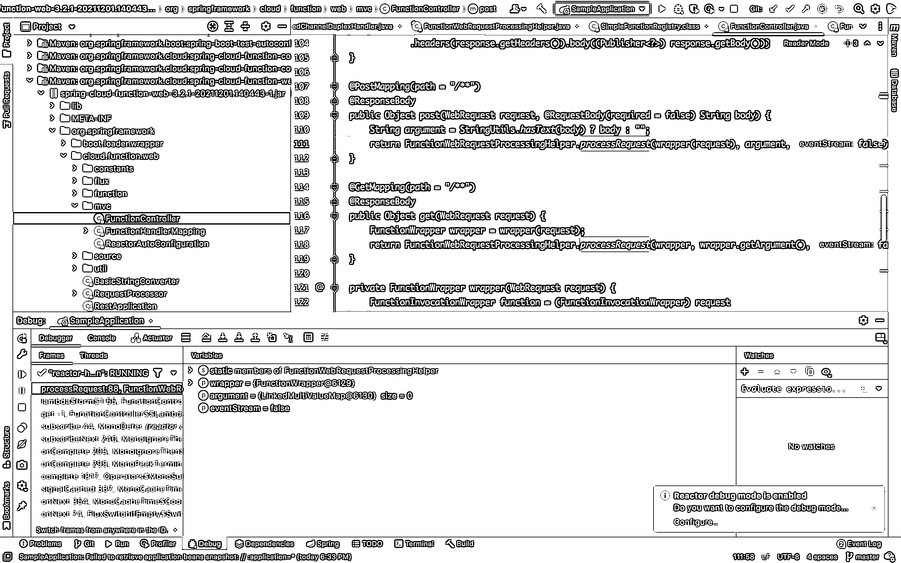

当一个请求进入时，程序首先基于 Springboot 的自动配置，将配置文件注入到 functionProperties，随后将以“WebRequestConstants.handler”为 key，function 为值添加到 request 数组里面。
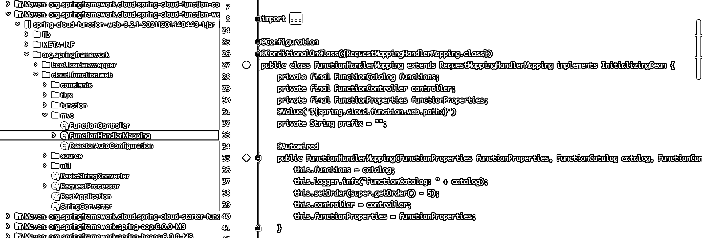

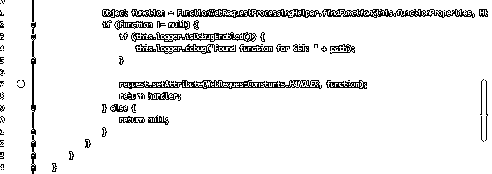

然后进入 FunctionController，Controller 首先会将请求使用 wrapper 进行包装，wrapper 就是将 request 转成 FunctionInvocationWrapper 格式。
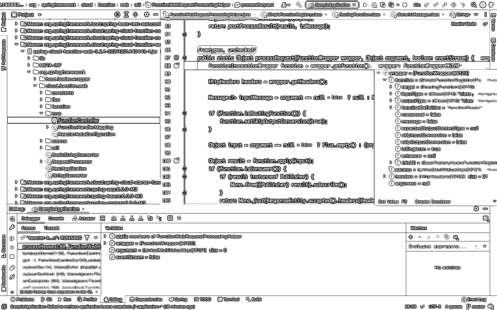

其中 functionDefiniton=”functionRouter”，经过判断是否是`RoutingFunction`，然后执行`function.apply`

```
if (function.isRoutingFunction()) {
	function.setSkipOutputConversion(true);
} 
```

然后在 apply 里会进入 doapply，输入为 input 包含 header 里的所有信息


在 route 方法里获取`spring.cloud.function.definition`和`spring.cloud.function.routing-expression`的值判断是否为空，然后进入 else if 分支，将值传给`functionFromExpression`
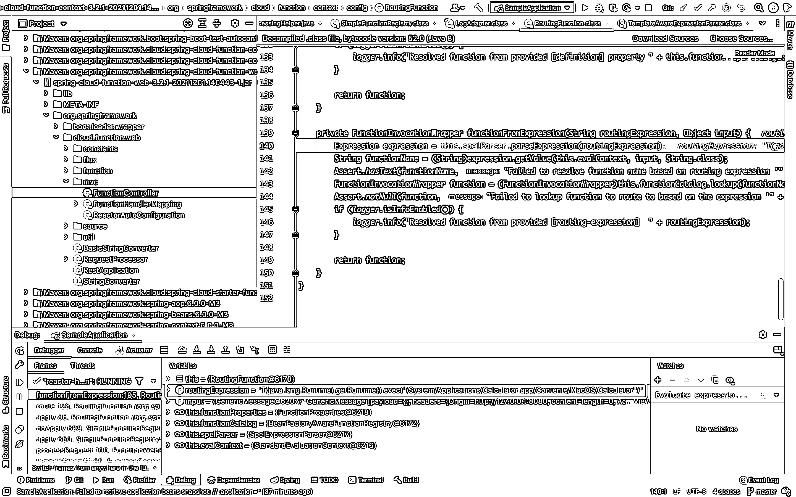

然后这里会使用标准的`StandardEvaluationContext`对 header 的值进行 SpEL 表达式解析
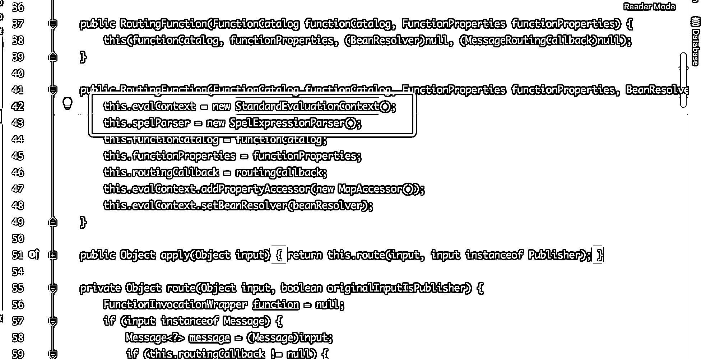


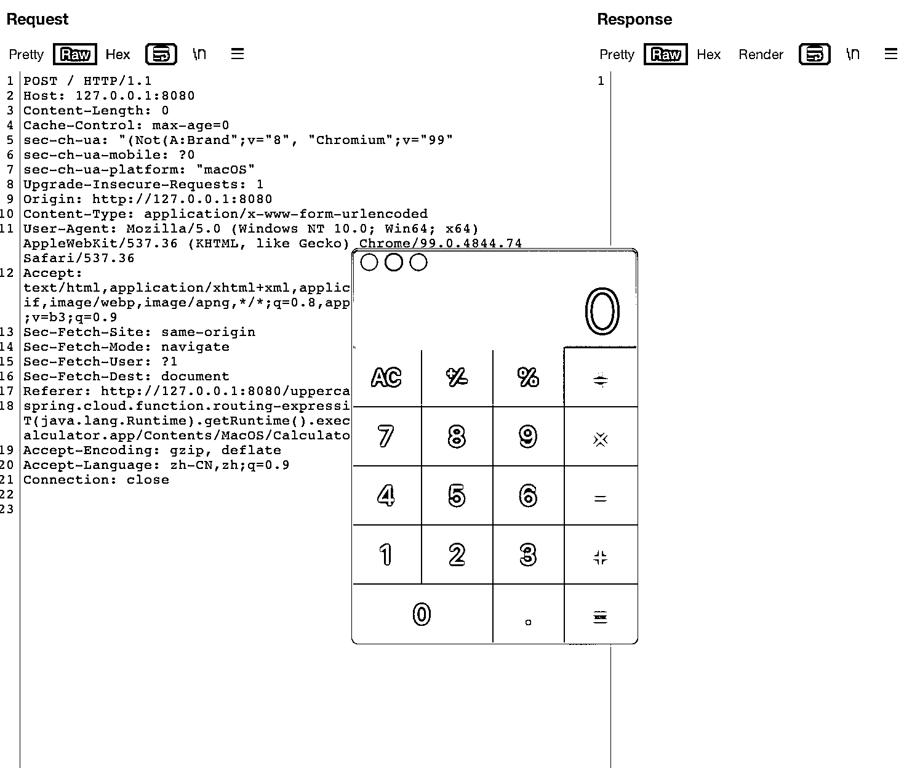

### 补丁分析

commit：[`github.com/spring-cloud/spring-cloud-function/commit/0e89ee27b2e76138c16bcba6f4bca906c4f3744f`](https://github.com/spring-cloud/spring-cloud-function/commit/0e89ee27b2e76138c16bcba6f4bca906c4f3744f)
将`StandardEvaluationContext`替换为了`SimpleEvaluationContext`

SpEL 提供的两个 EvaluationContext ，区别如下：

*   SimpleEvaluationContext - 针对不需要 SpEL 语言语法的全部范围并且应该受到有意限制的表达式类别，公开 SpEL 语言特性和配置选项的子集。
*   StandardEvaluationContext - 公开全套 SpEL 语言功能和配置选项。您可以使用它来指定默认的根对象并配置每个可用的评估相关策略。
    SimpleEvaluationContext 旨在仅支持 SpEL 语言语法的一个子集。它不包括 Java 类型引用、构造函数 和 bean 引用。所以说指定正确 EvaluationContext ，是防止 SpEl 表达式注入漏洞产生的首选。方法如下：

```
String expression = request.getParameter("message");
ExpressionParser parser = new SpelExpressionParser();
Expression exp = parser.parseExpression(expression);
StandardEvaluationContext context = SimpleEvaluationContext.forReadOnlyDataBinding().withRootObject().build();
String message = exp.getValue(context, String.class);
exp.setValue(context, "Hello"); 
```

## 利用工具

[`github.com/chaosec2021/Spring-cloud-function-SpEL-RCE`](https://github.com/chaosec2021/Spring-cloud-function-SpEL-RCE)
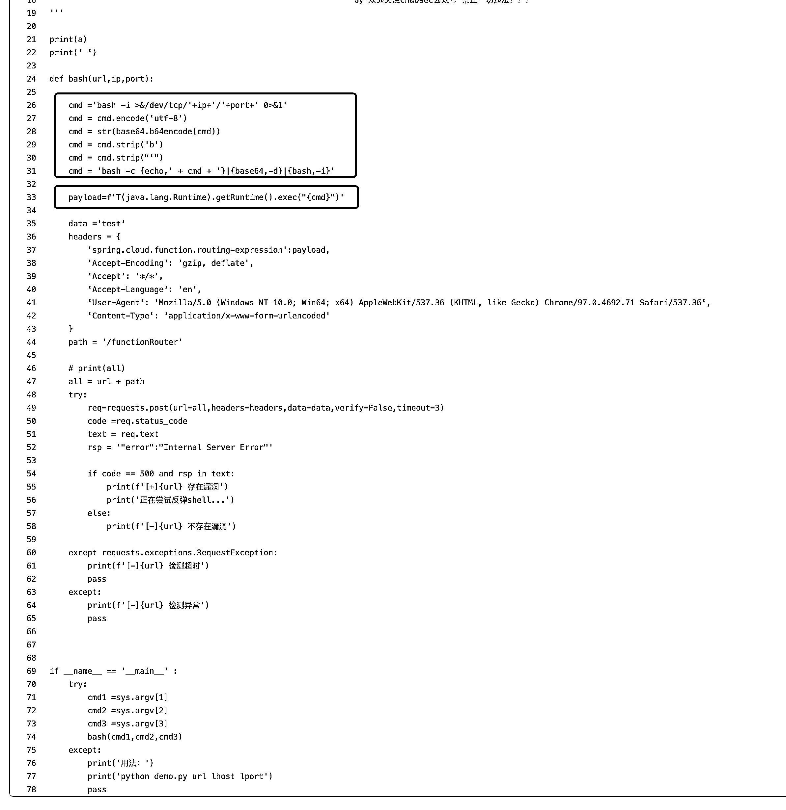

看了下代码用 java.lang.Runtime).getRuntime().exec()执行 bash 反弹 shell
也可以用 processbuilder 来执行命令，例如
`new ProcessBuilder('/System/Applications/Calculator.app/Contents/MacOS/Calculator').start()`

## 参考

[`www.jianshu.com/p/04bc9f482b43`](https://www.jianshu.com/p/04bc9f482b43)
[`mp.weixin.qq.com/s/AVvyKjRz_XooIB0s1S8njA`](https://mp.weixin.qq.com/s/AVvyKjRz_XooIB0s1S8njA)
[`github.com/vulhub/vulhub/blob/master/spring/CVE-2022-22963/README.zh-cn.md`](https://github.com/vulhub/vulhub/blob/master/spring/CVE-2022-22963/README.zh-cn.md)
[`www.cnblogs.com/9eek/archive/2022/04/07/16113603.html`](https://www.cnblogs.com/9eek/archive/2022/04/07/16113603.html)
[`blog.51cto.com/u_9652359/5187423`](https://blog.51cto.com/u_9652359/5187423)