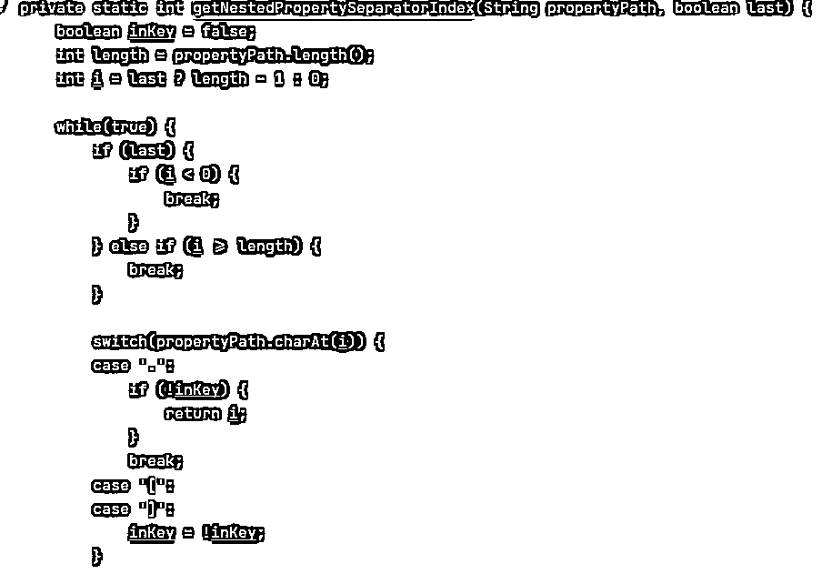
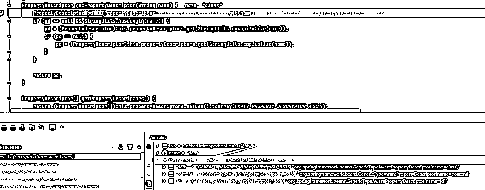

# Spring Core rce 漏洞分析(CVE-2022-22965) - Highness_DragonFly - 博客园

> 原文：[`www.cnblogs.com/HighnessDragonfly/p/16148381.html`](https://www.cnblogs.com/HighnessDragonfly/p/16148381.html)

# 漏洞描述：

Springmvc 框架参数绑定功能，绑定了请求里的参数造成变量注入，攻击者可以实现任意文件写入，漏洞点 spring-beans 包中。

#### 漏洞编号：

CVE-2022-22965

#### 影响范围：

JDK>=9

spring < 5.3.18 or spring < 5.2.20

tomcat

# 前置知识：

## ClassLoader:

Class 文件是编译好的，可以在 jvm 虚拟机中直接运行的字节码文件，ClassLoader 类加载器负责把 class 类根据需求，动态地加载到 jvm 虚拟机中运行。

### 与反射的区别：

Java 中两种加载 class 到 jvm 中的方式，都是通过类的全名来加载类。其加载过程分为以下三个步骤：

1.  装载：（loading）找到 class 对应的[字节码](https://so.csdn.net/so/search?q=%E5%AD%97%E8%8A%82%E7%A0%81&spm=1001.2101.3001.7020)文件。
2.  连接：（linking）将对应的字节码文件读入到 JVM 中。
3.  初始化：（initializing）对 class 做相应的初始化动作。

*   **Class.forName("className");**
    调用方式为：Class.forName(className, true, [ClassLoader](https://so.csdn.net/so/search?q=ClassLoader&spm=1001.2101.3001.7020).getCallerClassLoader())

className：需要加载的类的名称。

true：是否对 class 进行初始化（需要 initialize）

classLoader：对应的类加载器

*   **ClassLoader.laodClass("className");**
    调用方式为：ClassLoader.loadClass(name, false)

name：需要加载的类的名称

false：这个类加载以后是否需要去连接

两种方式的区别是 forName()得到的 class 是已经初始化完成的，loadClass()得到的 class 是还没有连接的。

## BeanWrapper：

BeanWrapper 是 Spring 的 JavaBeans 结构的中央结果可以，相当于一个用于分析和操作标准 JavaBean 结构的代理。拥有获取和设置属性值和属性描述符的功能。这里 Spring 的 JavaBean 的属性注入特性，也是导致漏洞的根本原因。

## PropertyDescriptor:

属性描述器，BeanWrapper 通过他可以获取 JavaBean 某个单独的属性。主要方法：

1.  getPropertyType()，获得属性的 Class 对象；

2.  getReadMethod()，获得用于读取属性值的方法；

3.  getWriteMethod()，获得用于写入属性值的方法；

```
public static void setProperty(UserInfo userInfo, String userName) throws Exception {  
        // 获取 bean 的某个属性的描述符  
        PropertyDescriptor propDesc = new PropertyDescriptor(userName, UserInfo.class);  
        // 获得用于写入属性值的方法  
        Method methodSetUserName = propDesc.getWriteMethod();  
        // 以 Key:Value 格式写入属性值  
        methodSetUserName.invoke(userInfo, "zhangsan");  
        System.out.println("set userName:" + userInfo.getUserName());  
    } 
```

## CachedIntrospectionResults：

专门用于缓存 JavaBean 的 PropertyDescriptor 描述信息的类。

# 环境配置：

pom.xml

```
<?xml version="1.0" encoding="UTF-8"?>
<project  
       xsi:schemaLocation="http://maven.apache.org/POM/4.0.0 https://maven.apache.org/xsd/maven-4.0.0.xsd">
   <modelVersion>4.0.0</modelVersion>
   <parent>
      <groupId>org.springframework.boot</groupId>
      <artifactId>spring-boot-starter-parent</artifactId>
      <version>2.6.3</version>
      <relativePath/> <!-- lookup parent from repository -->
   </parent>
   <packaging>war</packaging>
   <groupId>com.example</groupId>
   <artifactId>spring4shell-vulnerable-application</artifactId>
   <version>0.0.1-SNAPSHOT</version>
   <name>Spring4Shell Vulnerable Application</name>
   <description>Demo project for Spring Boot</description>
   <properties>
      <java.version>11</java.version>
   </properties>
   <dependencies>
      <dependency>
         <groupId>org.springframework.boot</groupId>
         <artifactId>spring-boot-starter-thymeleaf</artifactId>
         <version>2.6.3</version>
      </dependency>
      <dependency>
         <groupId>org.springframework.boot</groupId>
         <artifactId>spring-boot-starter-web</artifactId>
         <version>2.6.3</version>
      </dependency>
      <dependency>
         <groupId>org.springframework.boot</groupId>
         <artifactId>spring-boot-starter-test</artifactId>
         <version>2.6.3</version>
         <scope>test</scope>
      </dependency>
      <dependency>
         <groupId>org.springframework.boot</groupId>
         <artifactId>spring-boot-starter-tomcat</artifactId>
         <version>2.6.3</version>
         <scope>provided</scope>
      </dependency>
   </dependencies>
   <build>
      <finalName>helloworld</finalName>
      <plugins>
         <plugin>
            <groupId>org.springframework.boot</groupId>
            <artifactId>spring-boot-maven-plugin</artifactId>
            <version>2.6.3</version>
         </plugin>
      </plugins>
   </build>
</project> 
```

# 漏洞分析：

漏洞的利用，简而言之就是在你前端提交参数 key=value 给服务端，由服务端的 controller 来解析。

## Payload 分析：

目前已知的漏洞利用条件要求必须使用 tomcat，利用 tomcat 的日志写入模块，我们可以在 tomcat 的配置文件 server.xml 中看到该模块的配置参数信息，和 Payload 一致：


核心利用点就在于调用 AccessLogValve 来修改 tomcat 的日志文件，从而实现任意文件写入，详细调用链分析如下。

## 漏洞调试：

spring 以 kv 格式传入一个参数，会被绑定到其目标对象上去，而这个对象是动态获取的，我们在获取对象的地方打断点：

org.springframework.beans.BeanWrapperImpl#getCachedIntrospectionResults

这个方法会先判断缓存中是否存在目标对象，不存在则新建一个，然后返回这个目标对象，我们看一下目标对象是如何获取到的：


这里的 forclass 返回当前包装的类，读取 Class 的内容，读取的时候先从缓存里读，有的话直接返回，没有就新建一个 cache 加入缓存里。


看返回的 cachedIntrospectionResults 的值，返回一个属性描述器 pd，pd 能修改和读取目标对象的值。


断点下在 org.springframework.beans.BeanWrapperImpl#getLocalPropertyHandler


用和.进行分割，分割出的第一个属性为 class，保存在 nestedProperty 中，后续属性保存在 nestedPath 中。



这里使用了 get 方法对比 class 属性是否存在于 org.springframework.beans.CachedIntrospectionResults 的这个属性描述器中，如存在则获取对应实例，进行后续的参数注入操作。




接下来，我们再发一个 payload 追踪一下属性描述器 propertyDescriptors 的值的获取途径：

在 getCachedIntrospectionResults 中会判断是否有 nestedProperty 缓存，如果没有就新建一个，如果有就获取其信息。


org.springframework.beans.CachedIntrospectionResults 中使用 put 操作查询本地的类名，这里虽然对属性描述器查询的值做了检查，不过是只限制了 class 类的 classLoader 属性，而使用 module 调用 classLoader 属性就绕过了这里的检查。


而在获取缓存的时候，会使用 java.lang.Object.getClass()，从而获取到 class，进而就能利用反射执行所有注入的数据了。

结合这个 payload 就是：

*   调用 HelloWorld 的 getClass() 拿到 Class 对象
*   通过 class 对象调用 getModule()
*   通过 Module 调用 getClassLoader()
*   通过 ClassLoader 拿 resources
*   context 是 Tomcat 的 StandardContext
*   parent 拿到的是 StandardEngine
*   pipeline 拿到的是 StandardPipeline
*   first 拿到的是 AccessLogValve
    目前公开的利用链也就是 pipeline 下的 AccessLogValue 的利用，这个类用来设置日志存储参数，包括路径、后缀，修改参数即可达到写入任意文件的目的。

# 补丁分析：

## CVE-2010-1622 绕过：

这个漏洞本质上是 2010 年 Spring 对象绑定漏洞（CVE-2010-1622）补丁的一种绕过，之前漏洞的修复方式是：禁止 class 对象直接获取 classLoader 方法，这种补丁当时是没有什么问题的，这也是本漏洞仅出现在 jdk9 以上版本的原因。


因为在 jdk9 引入的 moudle 机制中，其中 module.classloader 绕过了之前的补丁，这里直接通过 class.module 的 classLoader 加载了 key:value 格式的请求类，从而产生了后续的漏洞利用。


## 补丁修复：

我们分析一下 spring5.3.18 版本的修复手法，我们通过 diff spring-beans/src/main/java/org/springframework/beans/CachedIntrospectionResults.java 可以看到：


这里进一步限制了 class 对象获取 classLoader，调用 class.Class 方法时，只允许调用名称为 Name 结尾的方法（比如 setName、getName）。且加入了对其调用的属性的返回值的判断，不能为 classLoader 或者 classLoader 的子类。