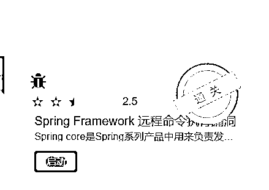

# Spring Framework 远程命令执行漏洞复现(CVE-2022-22965) - the 苍穹 - 博客园

> 原文：[`www.cnblogs.com/thespace/p/16105067.html`](https://www.cnblogs.com/thespace/p/16105067.html)

# Spring Framework 远程命令执行漏洞复现(CVE-2022-22965)

**漏洞描述：**

　　Spring core 是 Spring 系列产品中用来负责发现、创建并处理 bean 之间的关系的一个工具包，是一个包含 Spring 框架基本的核心工具包，Spring 其他组件都要使用到这个包。

　　未经身份验证的攻击者可以使用此漏洞进行远程任意代码执行。 该漏洞广泛存在于 Spring 框架以及衍生的框架中，JDK 9.0 及以上版本会受到影响。使用旧 JDK 版本的产品不受影响。

**漏洞环境搭建:**

**1.自行搭建环境：**

使用 docker 搭建 SpringCore RCE 测试环境，这里使用 vulfocus 提供的，大概几百 M。

　　docker pull vulfocus/spring-core-rce-2022-03-29:latest　　

　　

 　　这里已经安装过了

　　

　　-i 为指定镜像 id

　　docker run -p 8888:8080 -i82b  在 8888 端口上开启 spring，环境中要基于 tomcat，这里 tomcat 是 Spring 自带的中间件。

　　打开浏览器 输入指定地址 看到 ok 即环境搭建成功。

　　

**2.在线靶场环境：**

　　http://vulfocus.io/

　　注册进去好，找到对应的漏洞靶场进行启动

　　

 **漏洞环境搭建:**

　　**1.漏洞检测:**

使用 github 开源 exp 工具检测  https://github.com/craig/SpringCore0day

**　　　　**

　　　　可以看到漏洞存在

********　　　　********

 　　　　而且为 root 权限

**　　　　**