# SpringCloud Function SpEL 注入漏洞分析（CVE-2022-22963） - 9eek - 博客园

> 原文：[`www.cnblogs.com/9eek/p/16113603.html`](https://www.cnblogs.com/9eek/p/16113603.html)

## SpringCloud Function 介绍

SpringCloud 是一套分布式系统的解决方案，常见的还有阿里巴巴的 Dubbo，Fass（Function As A Service ）的底层实现就是函数式编程，在视频转码、音视频转换、数据仓库 ETL 等与状态相关度低的领域运用的比较多。开发者无需关注服务器环境运维等问题上，专注于自身业务逻辑实现即可。

SpringCloud Function 就是 Spring 提供的分布式函数式编程组件。

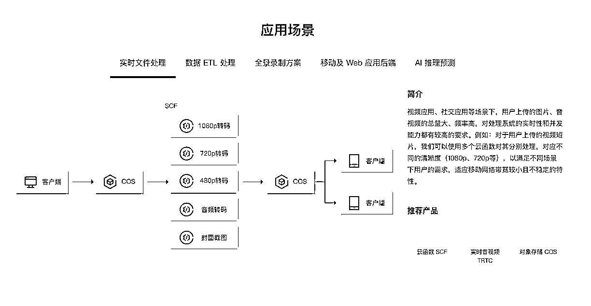

## 漏洞环境搭建

通过 idea 新建一个 Spring 项目，pom 中引入`spring-boot-starter-web`、`spring-cloud-function-web`，如下：

```
<?xml version="1.0" encoding="UTF-8"?>
<project  
         xsi:schemaLocation="http://maven.apache.org/POM/4.0.0 https://maven.apache.org/xsd/maven-4.0.0.xsd">
    <modelVersion>4.0.0</modelVersion>
    <parent>
        <groupId>org.springframework.boot</groupId>
        <artifactId>spring-boot-starter-parent</artifactId>
        <version>2.6.5</version>
        <relativePath/> <!-- lookup parent from repository -->
    </parent>
    <groupId>com.example</groupId>
    <artifactId>SpringCloudDemo</artifactId>
    <version>0.0.1-SNAPSHOT</version>
    <name>SpringCloudDemo</name>
    <description>SpringCloudDemo</description>
    <properties>
        <java.version>1.8</java.version>
        <spring-cloud.version>2021.0.1</spring-cloud.version>
    </properties>
    <dependencies>
        <dependency>
            <groupId>org.springframework.boot</groupId>
            <artifactId>spring-boot-starter-web</artifactId>
        </dependency>
        <dependency>
            <groupId>org.springframework.cloud</groupId>
            <artifactId>spring-cloud-function-web</artifactId>
            <version>3.2.2</version>
        </dependency>

        <dependency>
            <groupId>org.springframework.boot</groupId>
            <artifactId>spring-boot-starter-test</artifactId>
            <scope>test</scope>
        </dependency>
    </dependencies>
    <dependencyManagement>
        <dependencies>
            <dependency>
                <groupId>org.springframework.cloud</groupId>
                <artifactId>spring-cloud-dependencies</artifactId>
                <version>${spring-cloud.version}</version>
                <type>pom</type>
                <scope>import</scope>
            </dependency>
        </dependencies>
    </dependencyManagement>
</project> 
```


其中`spring-cloud-function-web`的依赖如上图，核心实现为`spring-cloud-function-core`包。

先在 main 函数中新建两个方法（`uppercase`将字符串变为大写，`reverse`字符串反转）：

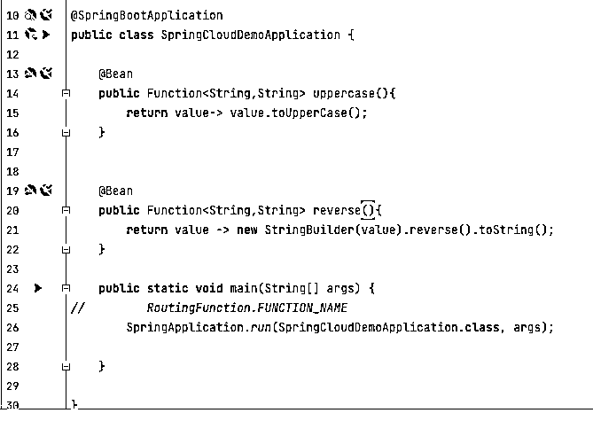

当在 pom 中引入`spring-cloud-function-web`后，函数会自动添加为 HTTP 端点。

然后漏洞关键是在`application.properties` 或者 yaml 配置文件中新增一行:

```
spring.cloud.function.definition=functionRouter 
```

这里的属性`spring.cloud.function.definition` 表示声明式函数组合，这个功能允许在提供属性时使用`|`（管道）`,`或`;`（过滤）分隔符以声明的方式提供组合指令。例如

```
--spring.cloud.function.definition=uppercase|reverse 
```

举例：

当配置该属性为 uppercase 时，访问根路径提交的参数会自动被 uppercase 函数接受转化为大写：


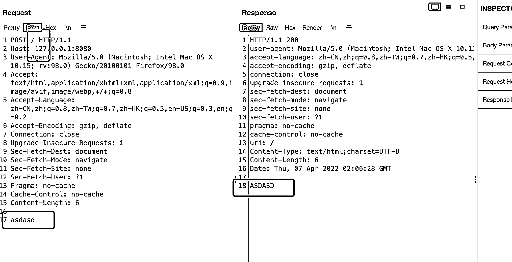

反之若配置为 reverse 则默认路径函数功能为反转字符串：


通俗来讲这个属性就是一个默认路由， 可以手动指定相关函数，也可以使用`functionRouter` ，指定的方式可以是**配置文件、环境变量或者启动参数等**。

### functionRouter

如果设置为 functionRouter 则默认路由绑定的具体函数**交由用户进行控制**，在 Spring Cloud Function Web 里面，可以通过设置 http 头的方式来控制，使用`spring.cloud.function.definition` 和`spring.cloud.function.routing-expression` 都可以，**区别是后者允许使用 Spring 表达式语言（SpEL）**。

举例：


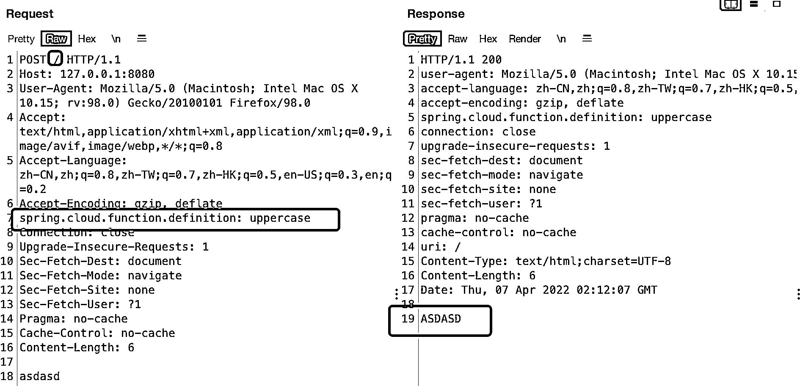

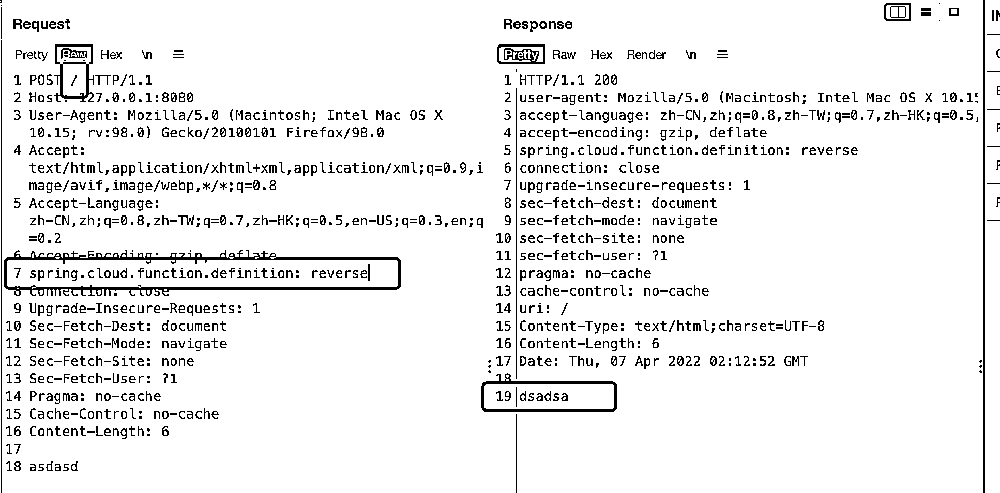

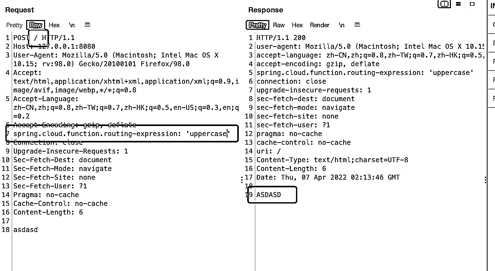

因为`spring.cloud.function.routing-expression` 允许使用 SpEL 表达式，所以就可能存在**SpEL 注入**。

### SpEL 注入

这里简单介绍下 SpEL，Spring Expression Language 是 Spring 提供的具有方法调用和基本的字符串模版功能的套件。类似 OGNL、MVEL、JBoss EL。

SpEL 可以字符串之间进行嵌套也可以单独使用，嵌套时使用`#{}`(实现`ParserContext`接口)。

举例：

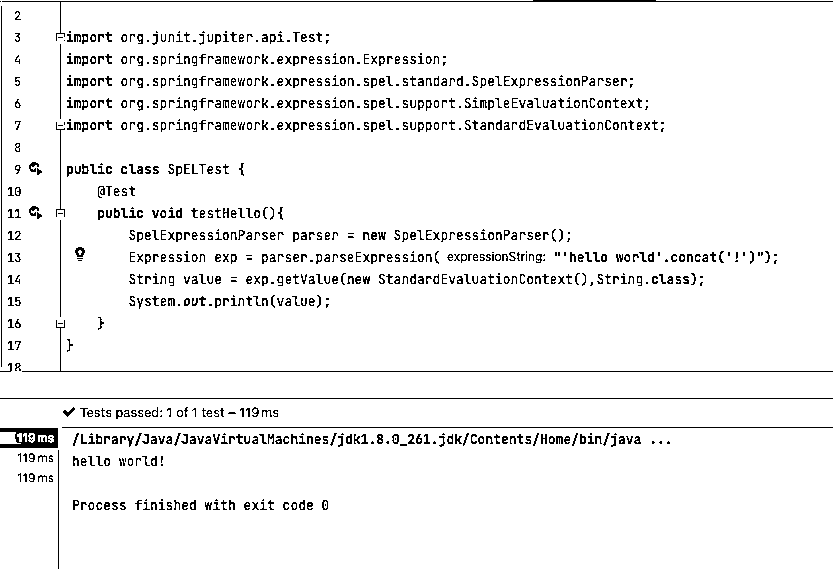

但因为 Spel 支持方法调用，所以如果使用的是 StandardEvaluationContext 进行解析（默认），则可能会被滥用，如使用`new ProcessBuilder('/System/Applications/Calculator.app/Contents/MacOS/Calculator').start()`可触发命令执行：

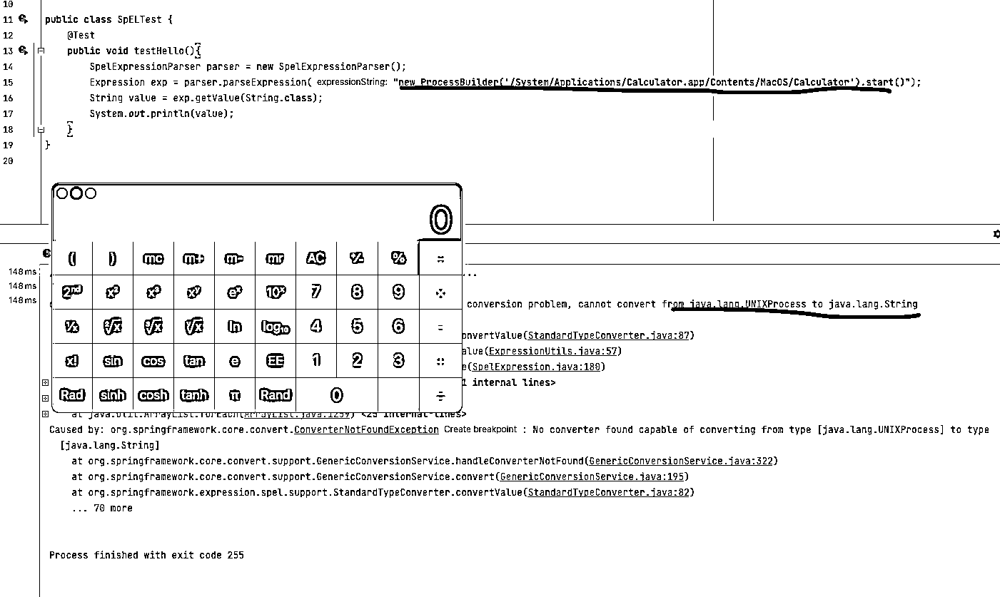

## 漏洞复现

既然 SpringCloud Function 中的 functionRouter 支持 SpEL 那是不是存在 SpEL 注入呢，我们在 HTTP 头中插入上面调起计算器的 SpEL 表达式

Payload: `spring.cloud.function.routing-expression: new ProcessBuilder('/System/Applications/Calculator.app/Contents/MacOS/Calculator').start()`

非常简单粗暴，漏洞复现成功：

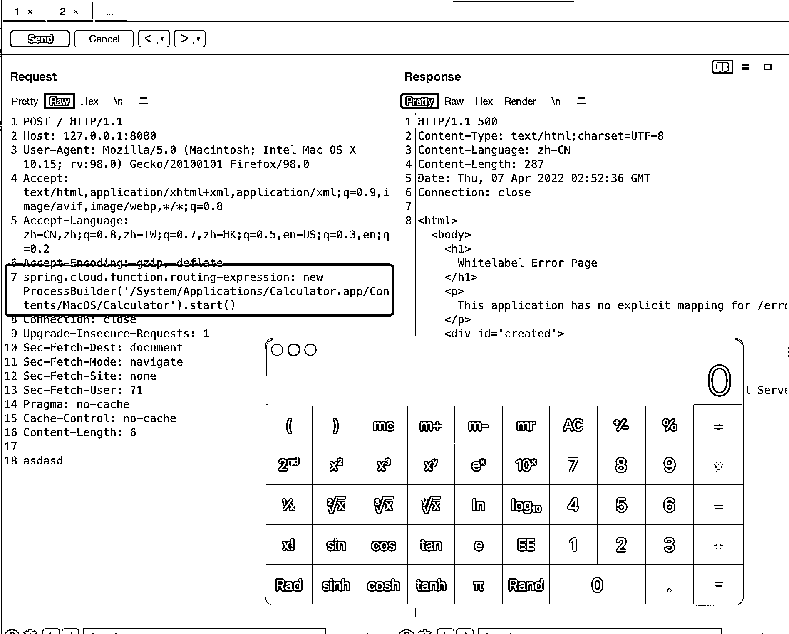

## 原理分析

在命令执行出下断点，看下程序执行流程。

SpringCloud Function 之所以能自动将函数建立 http 端点，是因为在包`mvc.FunctionController`中使用`/**` 监听了 get/post 类型的所有端点。

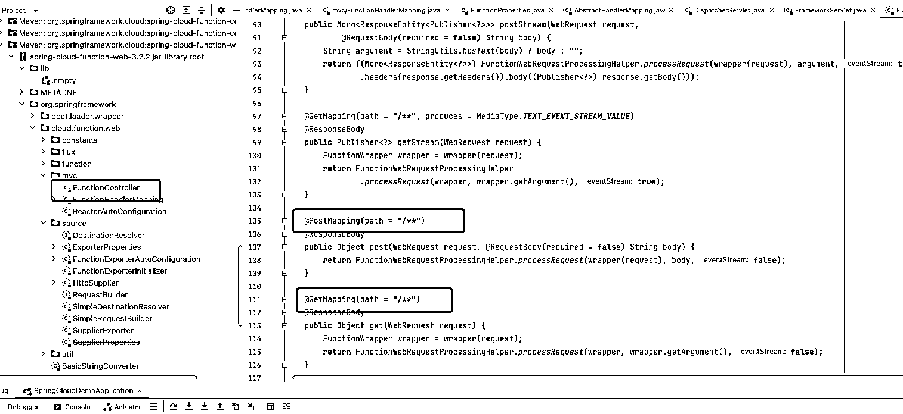

1.  当一个请求进入时，程序首先基于 Springboot 的自动配置，将配置文件注入到 functionProperties，随后将以“WebRequestConstants.handler”为 key，function 为值添加到 request 数组里面。

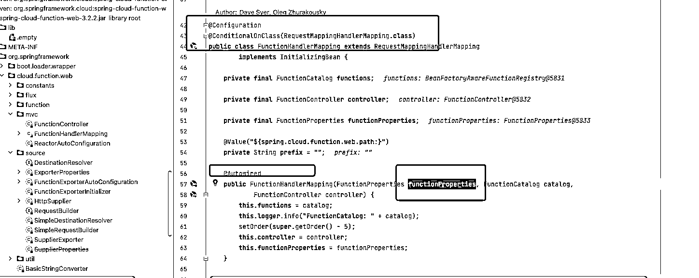


2.  请求正式进入 Controller 节点，Controller 首先会将请求使用 wrapper 进行包装，wrapper 就是将 request 转成 FunctionInvocationWrapper 格式。


3.  随后进入 processRequest 对 request 进行处理，执行 function 的 apply 方法，跳转到 doApply()时会对 function 进行判断，判断是不是 functionRouter 方法，根据咱们的配置文件此时的 function 为`RoutingFunction.FUNCTION_NAME` 既 `functionRouter`所以会,一路跳转到`RoutingFunction.route`


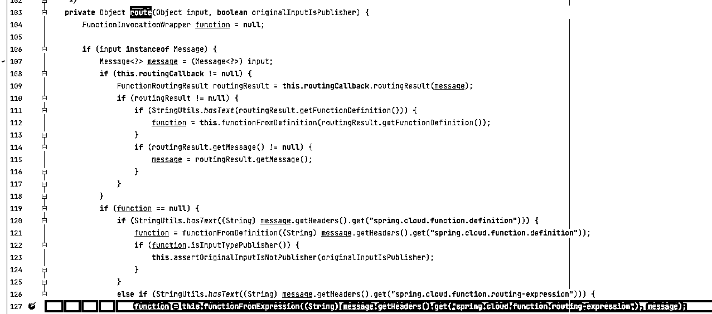

4.  随后进入 else if 分支， http 头`spring.cloud.function.routing-expression` 不为空，则传入其值到`functionFromExpression`方法。
    

5.  使用标准的`StandardEvaluationContext` 对 header 的值进行 SpEL 表达式解析：


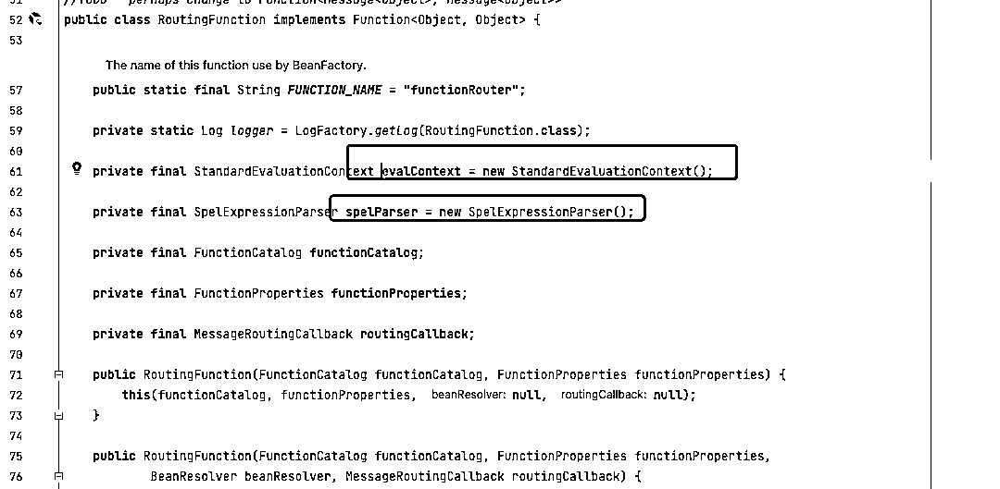

后续就不用再跟下去了，至此可以发现，只要通过环境变量、配置文件或者参数等方式配置为`spring.cloud.function.definition=functionRouter` 即可触发 SpEL 注入。

## 补丁分析

SpringCloud 官方已经修复了此问题（[`github.com/spring-cloud/spring-cloud-function/commit/0e89ee27b2e76138c16bcba6f4bca906c4f3744f）`](https://github.com/spring-cloud/spring-cloud-function/commit/0e89ee27b2e76138c16bcba6f4bca906c4f3744f%EF%BC%89)

和其他 SpEL 注入修复方式一样，使用了`SimpleEvaluationContext`替换`StandardEvaluationContext`，那这个漏洞基本就算修复完成了。但因为**这个 commit 还没有纳入版本**，所以目前 springcloud Function3.0 以上版本仍然暴露在风险之中。

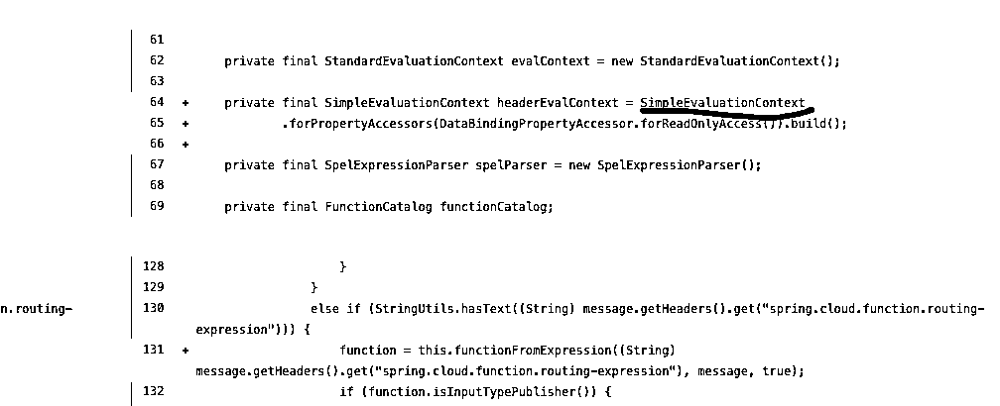

## 引用

> *   [`spring.io/projects/spring-cloud-function#overview`](https://spring.io/projects/spring-cloud-function#overview)
> *   [`cloud.spring.io/spring-cloud-function/reference/html/spring-cloud-function.html#_function_catalog_and_flexible_function_signatures`](https://cloud.spring.io/spring-cloud-function/reference/html/spring-cloud-function.html#_function_catalog_and_flexible_function_signatures)
> *   [`github.com/spring-cloud/spring-cloud-function/commit/0e89ee27b2e76138c16bcba6f4bca906c4f3744f`](https://github.com/spring-cloud/spring-cloud-function/commit/0e89ee27b2e76138c16bcba6f4bca906c4f3744f)
> *   [`itmyhome.com/spring/expressions.html`](http://itmyhome.com/spring/expressions.html)

## 公众号

欢迎大家关注我的公众号，这里有干货满满的硬核安全知识，和我一起学起来吧！

