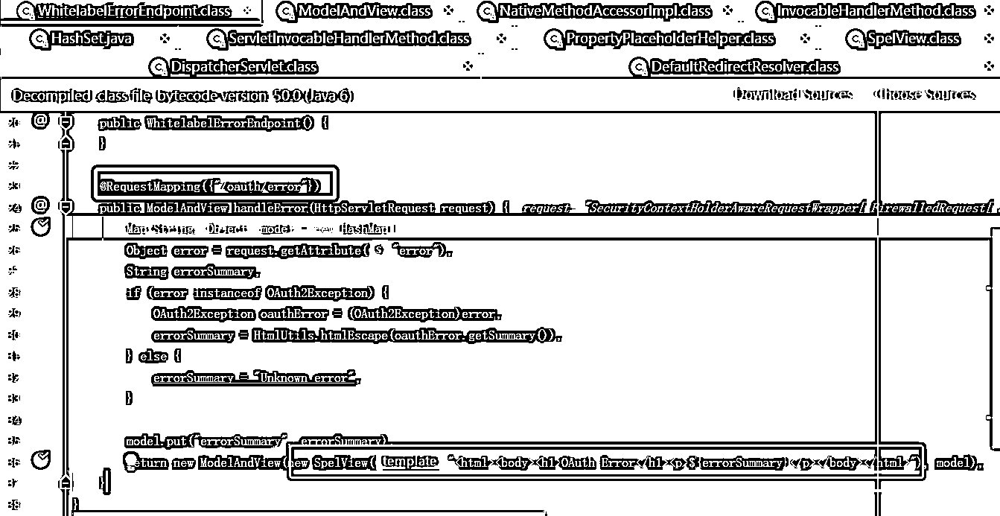
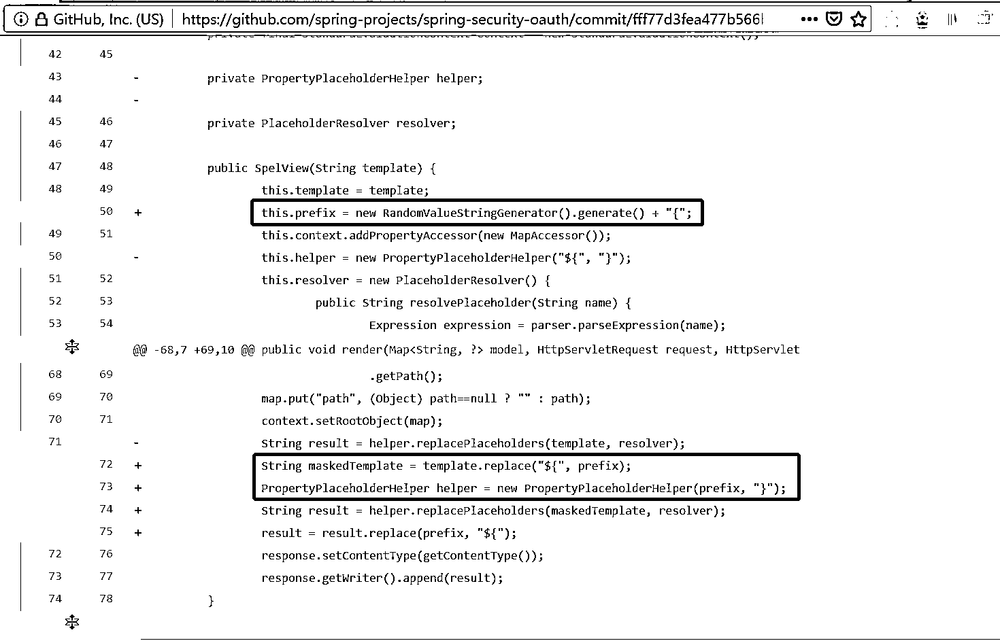

# SpringSecurityOauth RCE (CVE-2016-4977) 分析与复现 - ka1n4t - 博客园

> 原文：[`www.cnblogs.com/litlife/p/10380701.html`](https://www.cnblogs.com/litlife/p/10380701.html)

目录

*   0x00 前言
*   0x01 调试分析
*   0x02 补丁分析
*   0x03 参考

> 影响版本：
> 2.0.0-2.0.9
> 1.0.0-1.0.5

### 0x00 前言

这个漏洞与之前那个 SpringBoot 的 SpEL 表达式注入漏洞点基本一样，而且漏洞爆出来的时间点也差不多，可是没有找到那个漏洞的 CVE 编号，不知道是什么原因。
这个漏洞的触发点也是对用户传的参数的递归解析，从而导致 SpEL 注入，可是两者的补丁方式大不相同。Springboot 的修复方法是创建一个 NonRecursive 类，使解析函数不进行递归。而 SpringSecurityOauth 的修复方法则是在前缀${前生成一个六位的字符串，只有六位字符串与之相同才会对其作为表达式进行解析。然而如果请求足够多，这种补丁也是会失效的。

### 0x01 调试分析

```
payload:
http://localhost:8080/oauth/authorize?response_type=token&client_id=acme&redirect_uri=${new%20java.lang.ProcessBuilder(new%20java.lang.String(new%20byte[]{99,97,108,99})).start()} 
```

首先，这个漏洞是在错误页触发的，所以这里在错误页的控制器打个断点。可以看到，最后渲染视图的时候使用了 SpelView，并传入一个模板字符串，跟 springboot 的洞类似。



然后跟到 render 方法，接收模板字符串之后，接着使用 replacePlaceholders 方法，对模板进行解析。


跟进一下 replacePlaceholders 方法


跟进 parseStringValue 方法，这个方法与 springboot 中的方法基本相同，简单看一下。


72 行进行一次递归，用于解析模板中类似于${${}}的结构。由于这里的模板只是一个单纯的${errorSummary}，故不跟进这里。

73 行是将 errorSummary 作为参数传入 SpEL 模板解析引擎


可以看到，35 行将 errorSummary 转换成了一个字符串，注意看这个值，其中包含我们的 payload：${xxxx}。


return 之后回到 parseStringValue 函数，将返回值赋值给 propVal。

继续跟进，到 87 行，这里对 propVal 又进行了一次递归解析。而 propVal 的值中刚好包含我们的 payload（即包含“${}”）


跟进递归，到 66 行成功将我们的 payload 从${}中提取出来，马上就到触发点了


跟进到 73 行，将 payload 传入 resolvePlaceholder，继续跟进


成功在 35 行将 payload 作为 SpEL 表达式解析，弹出了计算器。

### 0x02 补丁分析



可以看到，这里在${前加了个
RandomValueStringGenerator().generate()，用于生成一个随机字符串。可是正如前面说的，如果可以发出足够多的请求，那么这个补丁依旧是可以被利用的。

### 0x03 参考

[Spring Security OAuth RCE (CVE-2016-4977) 漏洞分析](https://paper.seebug.org/70/)